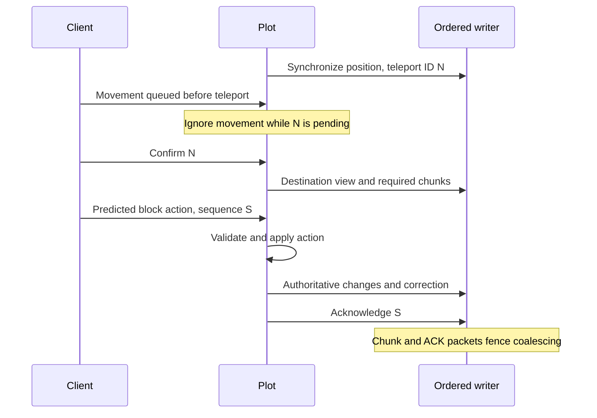

# Client block and chunk synchronization

Investigation date: 2026-10-06. Target: Minecraft Java 1.21.5, protocol 770.

Two concrete server-side defects can explain ghost edits and missing schematic
updates: movement received before teleport confirmation could overwrite the
destination, and screen-only rendering suppressed ordinary player/WorldEdit edits.
The fixes below have decoded packet and world-state regression coverage. This is
not a claim that every reported client desync has been reproduced in a GUI client.

## Findings and fixes

| Path | Evidence before the fix | Resulting behavior |
| --- | --- | --- |
| Teleport | Every position synchronization used ID zero; the Play decoder ignored confirmations. Queued position packets immediately overwrote `Player.pos`. | Each teleport has a distinct nonnegative ID. Pending teleport state fences position, rotation, ground-state and block-edit packets until a matching confirmation. Stale/duplicate confirmations cannot release another teleport. |
| Destination chunks | Player view updates normally ran before draining received packets. A confirmation followed by an edit could therefore use the previous view. | Matching confirmation queues the destination view/chunk updates before processing later actions in that batch. It does not force a full view reload. |
| Screen-only rendering | Only lamps and tracked moving pixels entered the dirty screen set. A successful ordinary placement, destruction or schematic paste could mutate storage and flush without publishing its blocks. | External edit scopes publish all touched positions, including resulting callbacks. Autonomous simulation retains the existing screen filter. Nested paste scopes restore the caller's mode. |
| Repeated paste | Stored state equality did not guarantee client state equality, especially after a filtered update. | Screen-mode paste explicitly publishes touched cells even when their stored state is unchanged. `ignore_air` continues to exclude skipped cells. |
| Client prediction | Several rejected placement paths and digging abort/finish paths acknowledged the sequence without an explicit corrective block packet. | The acting client receives authoritative target/adjacent placement states, or the digging target, before acknowledgement. The same finalization covers no-op and rejected actions. |
| Outgoing failures | Queue overflow warned, but a failed write had only a counter. | Overflow logs include peer and backlog size; failed writes identify peer, packet ID and error. Both close the connection rather than skip a reliable packet. |

Implementation: [teleport state](../crates/core/src/player/client_sync.rs),
[player synchronization](../crates/core/src/player.rs),
[packet handling](../crates/core/src/plot/packet_handlers.rs),
[screen updates](../crates/core/src/plot/screen_updates.rs),
[external paste](../crates/core/src/plot/worldedit/mod.rs), and
[outgoing writer](../crates/network/src/outbound.rs).

### Packet loss versus omitted updates

The incoming-queue change waits for space in the existing bounded queue. It does
not drop incoming actions. Chunk snapshots are clientbound and use a different
queue. That writer preserves FIFO order and coalesces only adjacent section block
updates; a chunk snapshot, unload, block-entity packet or prediction acknowledgement
is an ordering barrier. Coalescing can omit intermediate visual states, but retains
the newest state for each position within that interval.

No selective loss of chunk packets was found in that path. Queue overflow and
write failure terminate the connection. This differs from a successful edit whose
block update was never collected because of a rendering filter.

Chunk encoding already includes pending storage deltas. Existing neighbor-view
tests reject replies from obsolete unload/reload generations. Those mechanisms
were retained and included in the plot suite.



Pending synchronization retries after one second using the same ID and absolute
position/rotation. A newer teleport replaces the pending ID. Existing connection
keep-alive timeout behavior remains the final timeout mechanism.

## Comparison with Java servers

The official 1.21.5 server and mappings were checked against Mojang's
[version metadata](https://piston-meta.mojang.com/v1/packages/5617971be600cbdf93c60fc218b5073987f6507b/1.21.5.json).
Server SHA-1: `e6ec2f64e6080b9b5d9b471b291c33cc7f509733`;
SHA-256: `ae7681dadce21b6b4017d28e7eb567d86b6c100a6969994f540b9e54f812dc29`.
The downloaded mappings also matched their declared SHA-1.

Static bytecode inspection of `ServerGamePacketListenerImpl` (`ate`) establishes
that movement takes a pending-teleport path instead of accepting position changes,
and only a matching teleport confirmation clears the pending position. Its
use-item-on path checks pending teleport state and sends authoritative block states
for the target and adjacent position after processing the interaction. Prediction
acknowledgement is separately tracked. These are architectural comparisons, not
new live Java/client captures.

Paper's corresponding
[packet-listener patch](https://github.com/PaperMC/Paper/blob/159cf454f0fa1e189a3420b6880405ad8d7b6bc1/paper-server/patches/sources/net/minecraft/server/network/ServerGamePacketListenerImpl.java.patch)
corroborates pending teleport IDs, matching confirmation and chunk-source movement
after confirmation. The comparison is pinned to commit
`159cf454f0fa1e189a3420b6880405ad8d7b6bc1`, on its `ver/1.21.5` branch.

Vanilla `PlayerChunkSender` (`asz`) also sends explicit chunk batches, limits
outstanding batches and adjusts sending from client batch feedback. Paper's
[chunk-sender patch](https://github.com/PaperMC/Paper/blob/159cf454f0fa1e189a3420b6880405ad8d7b6bc1/paper-server/patches/sources/net/minecraft/server/network/PlayerChunkSender.java.patch)
retains that batching path. MCHPRS currently sends the required chunks in a burst.
This is a performance difference and a useful next improvement; it is not evidence
that chunks were silently dropped in the present implementation.

Local inspection commands, with the official bundled server's inner jar:

```powershell
javap -p -c -classpath server-1.21.5-inner.jar ate
javap -p -c -classpath server-1.21.5-inner.jar asd
javap -p -c -classpath server-1.21.5-inner.jar asz
```

## Regression evidence

[Player tests](../crates/core/src/player/client_sync_tests.rs) decode real TCP
position packets and exercise queued movement across overlapping teleports.
[Plot handler tests](../crates/core/src/plot/client_sync_tests.rs) exercise actual
placement, digging, movement and confirmation handlers against an in-memory world.
They verify both world state and the client packet stream, including rejected
cursor data, abort/finish corrections, and destination chunk packets preceding the
next edit after confirmation. Placement and removal are decoded for both the actor
and a second viewer.

[Screen tests](../crates/core/src/plot/screen_updates.rs) and
[paste tests](../crates/core/src/plot/worldedit/update_tests.rs) verify placement,
removal, repeated unchanged pastes and nested edit scopes, while ordinary simulation
changes remain filtered. Sign block updates also precede their text/entity data.
Both compressed and uncompressed connections are covered.
[Network tests](../crates/network/src/outbound/tests.rs) cover chunk/ACK barriers
under a coalesced backlog and failure closure instead of skipping packets.

Socket reads have bounded timeouts and episode reads have a packet-count limit.
Cross-crate socket helpers require the network `test-support` feature, enabled only
by the core dev dependency. The transient plot fixture and its persistence bypass
compile only in tests.

Investigation began at revision `7ce722aa786fb6be3d7544472d3b436e9587295f` with local
changes. Another session committed during the work and continued modifying
Redpiler. Validation used an isolated checkout at
`d86ae5ff0c00861707b3d5bcdf2ef53d523c9d79` with the synchronization files overlaid.
The exact before/validated source hashes are recorded in
[provenance](../test_data/client-sync/investigation-provenance.json).
Later unrelated WorldEdit selection aliases in the shared tree were preserved.

| Command/filter | Passed | Failed | Ignored |
| --- | ---: | ---: | ---: |
| Core `client_sync` | 7 | 0 | 0 |
| Core `plot::` | 157 | 0 | 0 |
| Network library | 32 | 0 | 1 |
| Core `redstone::` | 97 | 0 | 4 |

The three plot synchronization tests appear in both core filters: **290 distinct
tests passed**, with five existing explicit capture/benchmark tests ignored.
Production `cargo check -p mchprs_core -p mchprs_network` also passed.

Exact successful commands, run from `F:\rustrepos\MCHPRS`:

```powershell
$env:CARGO_INCREMENTAL = '0'
cargo test -p mchprs_core --lib client_sync --manifest-path E:/mchprs-client-sync-audit/validation/Cargo.toml --target-dir E:/mchprs-client-sync-audit/target --config profile.test.debug=0 -- --test-threads=1
cargo test -p mchprs_core --lib plot:: --manifest-path E:/mchprs-client-sync-audit/validation/Cargo.toml --target-dir E:/mchprs-client-sync-audit/target --config profile.test.debug=0 -- --test-threads=1
cargo test -p mchprs_network --lib --manifest-path E:/mchprs-client-sync-audit/validation/Cargo.toml --target-dir E:/mchprs-client-sync-audit/target --config profile.test.debug=0 -- --test-threads=1
cargo check -p mchprs_core -p mchprs_network --manifest-path E:/mchprs-client-sync-audit/validation/Cargo.toml --target-dir E:/mchprs-client-sync-audit/target --config profile.dev.debug=0
cargo test -p mchprs_core --lib redstone:: --manifest-path E:/mchprs-client-sync-audit/validation/Cargo.toml --target-dir E:/mchprs-client-sync-audit/target --config profile.test.debug=0 -- --test-threads=1
cargo test -p mchprs_core --lib screen_only_paste --manifest-path E:/mchprs-client-sync-audit/validation/Cargo.toml --target-dir E:/mchprs-client-sync-audit/target --config profile.test.debug=0 -- --test-threads=1
```

Earlier focused checks in the shared tree passed four player synchronization tests
and three screen tests. A subsequent shared-tree core compile encountered unrelated
Redpiler signature/exhaustiveness errors (`E0061`, `E0004`), so it ran no tests.
An initial isolated build then exhausted F: space; validation moved to E: with
incremental compilation disabled and debug information omitted. The first outgoing
barrier regression also exposed an incorrect *test decoder* assumption that a chunk
frame was below the compression threshold; its decoder was corrected. The extended
sign assertion similarly needed an anonymous network-NBT reader, rather than the
file-NBT reader. Both were test harness corrections. No runtime
packet dropping or interpreter rules were changed to make tests pass.

## Remaining checks and next improvements

Perform a live 1.21.5 client check: rapid consecutive teleports; placement and
breaking while arriving; rejected edits; and a paste/undo/re-paste in screen-only
mode with two viewers. Automated packet tests establish server delivery order;
they do not observe the GUI client's rendering or a proxy/plugin modifying traffic.

The next networking improvement should be client-paced chunk batches. Keep a
bounded per-player pending chunk set, cancel obsolete view requests, encode the
current snapshot when dispatched, and preserve snapshot-before-delta/entity ordering
for that chunk. Implement the protocol's batch-start/finish/received exchange and
validate it with slow-reader and rapid-teleport tests before changing delivery.
Prioritizing an ACK ahead of its corrections, or a block delta ahead of its chunk,
would break the ordering established here.

For remaining production reports, correlate outgoing failure logs with
`/tps timings` queue bytes/failure counts and record whether screen-only mode, a proxy,
or a teleport was involved. A packet capture plus server position/view coordinates
can distinguish a slow reader, wrong chunk view and an omitted block update.
