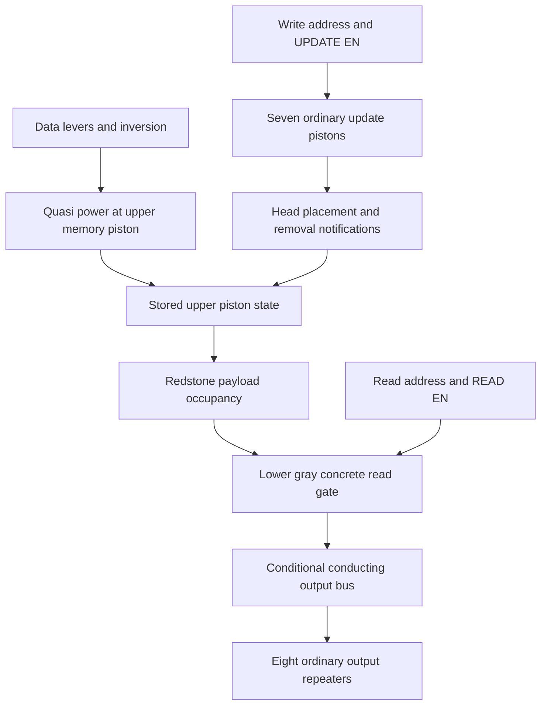

# FPU and RILAX memory compilation research

`FPU_LEGAL.schem` and `RILAX_MEMORY_BANK_BUD.schem` are useful next targets, but neither compiles with the current Redpiler. FPU exposes limitations in reset ownership, supported conducting materials and extraction scale; its downloaded revision also contains author-confirmed broken piston geometry. RILAX provides a small, reproducible bank in which **power, sampling updates and stored state must remain separate**. Its ordinary pistons generate updates rather than computation clocks.

This characterization uses the Rust pipeline at revision `b2dd24a2ee80ae67b03e9501605e69f5735fda6f`, with test-only additions whose exact source hashes are recorded beside the captures. The author confirms that FPU uses IEEE input encoding and custom arithmetic behavior, and requests compilation analysis only. No mathematical FPU output is certified. RILAX observations are MCHPRS interpreter evidence; they are not independent Java conformance claims.

## Download and evidence

Both binaries were downloaded from `ssh urmom`, `/srv/mchprs/data/schems`, and verified against hashes computed on that host. The original binaries remain unchanged. The saved [download manifest](../test_data/piston-research/download-manifest.json) records their provenance.

| Fixture | Dimensions X Y Z | Compressed bytes | SHA256 |
| --- | --- | ---: | --- |
| [FPU](../test_data/piston-research/FPU_LEGAL.schem) | 171 × 43 × 107 | 77,327 | `2f8ceb38c0c2092592bd32e83aa3a3ae80fd090d73865f90c9123b8091fad2b3` |
| [RILAX](../test_data/piston-research/RILAX_MEMORY_BANK_BUD.schem) | 21 × 15 × 26 | 1,696 | `123ea6bc48de1ab159d0909ab91c286ad2aeef0758a9b3dae9ca3dbf2a025559` |

All coordinates in this report are **selection-local from the saved minimum**. Captures place that minimum at `(40,30,40)`. The loader displacements are `(5,38,74)` for FPU and `(18,13,3)` for RILAX. The harness passes `minimum + loader displacement` to the real paste routine, which restores the intended minimum. These displacements are not input or output coordinates.

Import uses the real schematic loader and strict paste with no notifications. There are no implicit settling ticks or repair operations. Each independent captured case reloads the same binary. Explicit lever operations use the existing notified lever helper, including notification of the lever support.

| Artifact | Contents |
| --- | --- |
| [FPU fixture manifest](../test_data/piston-research/fixtures/fpu_legal.json) | Dimensions, offsets, controls, candidate operand groups, labeled output nets and unresolved entry roles |
| [FPU entry capture](../test_data/piston-research/references/fpu-entry.json.gz) and [summary](../test_data/piston-research/references/fpu-entry.summary.json) | Complete inventories and optimized compile attempts at 1× and 8× budgets |
| [FPU extraction probe](../test_data/piston-research/references/fpu-extraction.json) | Isolated response-extraction failures; no executable admission or backend activation |
| [RILAX fixture manifest](../test_data/piston-research/fixtures/rilax_memory_bank_bud.json) | Port mapping, bank mapping, ordered episodes and operating protocol |
| [RILAX capture](../test_data/piston-research/references/rilax-episodes.json.gz) and [summary](../test_data/piston-research/references/rilax-episodes.summary.json) | Twenty episodes, cell states, consumers, pending work, ordered piston samples and accepted movements |
| [Research tests](../crates/core/src/redpiler/analysis/tests/research.rs) | Import, write/read, event propagation, pulse filtering, repeated use, missing-torch diagnosis and stepping comparisons |

Each capture has a neighboring `.source.json` file with the revision, working-tree listing and source hashes. Capture observations use local coordinates; queued work and raw operation entries retain absolute coordinates. Array order preserves the order of recorded samples and accepted events. A capture records piston power checks and accepted movements, not every nested callback instruction. Causal explanations below combine those measurements with the notification code where stated.

## FPU structure and interfaces

The binary contains 119,806 nonair blocks. Its main components are:

| Component | Count | Compilation significance |
| --- | ---: | --- |
| Sticky pistons | 8,091 | 8,089 extended and two retracted; no ordinary pistons |
| Piston heads | 8,073 | Sixteen extended bases have no corresponding head |
| Observers | 6,721 | 5,727 are directly above a piston; horizontal and other observers need separate owners |
| Dust | 25,096 | Includes internal conditional wiring and final labeled outputs |
| Comparators and furnaces | 947 each | Analog references and ordinary strength-dependent logic are part of the graph |
| Repeaters | 45 | Ordinary delays cannot be erased merely because the arithmetic core is instant |
| Levers | 36 | Thirty-two operand controls, three opcode controls and one trigger |
| Buttons | 17 | Additional sources must receive a role or be proven irrelevant |
| Lamps | 35 | These lamps are at the operand and opcode controls, not the final result bank |
| Sign entities | 214 | Include operation descriptions, barriers, synchronization notes, result weights and flags |

The structural inventory groups the pistons into 6,610 possible payload groups: 5,147 have one member, 1,445 have two and 18 have three. A compiler must support joint occupancy and ownership of the three-member groups; assuming every OR has exactly two owners would miss this fixture.

The controls are:

| Role | Position or mapping | Evidence and limitation |
| --- | --- | --- |
| Trigger | Lever `(1,38,80)` | Sign at `(2,39,80)`; saved powered; adjacent torch is unlit |
| Opcode weights 4, 2, 1 | Levers `(8,35,2)`, `(8,35,4)`, `(8,35,6)` | Nearby signs explicitly label the weights |
| Light blue operand group | `(3,35,8+4i)`, `i=0..15` | Interleaved with the red group; blue circuitry has the B exponent label |
| Red operand group | `(3,35,10+4i)`, `i=0..15` | Red circuitry has the A exponent label |
| Result bits 15 down to 0 | Dust `(170,5,32+4i)`, `i=0..15` | Signs at `(170,4,31+4i)` give the integer bit masks from 32768 down to 1 |

The operand controls are interleaved. Treating the first sixteen levers as A and the next sixteen as B would be wrong. Operand bit order and powered-level encoding have not been numerically certified in this compilation-only study.

Signs describe opcodes `001` add, `010` subtract, `011` multiply, `100` divide, `101` signed-integer-to-float, `110` unsigned-integer-to-float and `111` float-to-integer. Integer-to-float descriptions say A must be zero; float-to-integer truncates the fractional part. Additional signs identify division by zero, infinity, NaN, sign and rounding flags. These are author labels, not tested arithmetic specifications.

The final sixteen result nets are dust, with no attached repeater/lamp bank. The 35 saved lamps show controls. Compilation therefore needs either explicit retained observation ports for the result and flags or an author-supplied consumer revision. A successful optimized `--io-only` compilation alone would not establish that these dust results remain visible or readable. Attaching repeaters is a separate fixture revision because a consumer can alter notifications and load the net.

### Analog reference values

All 947 furnaces are stationary, and all 947 comparators read a furnace immediately behind their main input. None of those rear furnace positions is a possible payload position. This is materially different from moving a container or reading it through a moving rear conductor.

Strict Rust import preserves the following furnace override histogram; an active regression checks it against the independent inventory counts:

| Override strength | Furnaces |
| ---: | ---: |
| 1 | 636 |
| 2 | 1 |
| 3 | 1 |
| 4 | 128 |
| 6 | 64 |
| 11 | 1 |
| 12 | 16 |
| 15 | 100 |

These values cannot all become Boolean fifteen. A strength-one source can disappear after one dust step; comparison against side power depends on the actual magnitude. The inventory identifies 975 distinct ordinary power-source positions in the current topology report, although it does not prove that every source survives response extraction or optimization.

## FPU compilation findings

Read-only analysis succeeds at the default budget: 966,656 occupied-section cells inspected and 2,338,194 dependency steps, below its 4,194,304-step budget. It reports 5,553 locally matched reset mechanisms. Local matching is not an executable certificate, and the analysis issues reporting every piston/observer as needing a runtime owner are provisional ownership requirements.

Both measured optimized compile attempts, at 1× and 8×, reject before publishing a backend:

```text
piston at BlockPos { x: 163, y: 38, z: 81 } has an unverified observer return path:
[BlockEntity { pos: BlockPos { x: 163, y: 40, z: 81 } }, NoResetPath]
```

With the capture origin removed, this is piston `(123,8,41)`, observer `(123,9,41)` and furnace cap `(123,10,41)`. [families::support](../crates/core/src/redpiler/analysis/families.rs) rejects any block entity on reset support. The furnace is fixed and conducting, but its inventory entity triggers that blanket guard. This first failure is a compiler limitation, not evidence that a furnace was transported or that the schematic loader lost its inventory. The full report contains 285 distinct entity-support failures of this kind.

Permitting a fixed furnace cap needs a specific preservation argument: its electrical properties, override value, observer route and other writers must remain correct, and its entity must survive reset. Removing all entity checks would also admit unsupported transported containers. The current [program preparation](../crates/core/src/redpiler/instant/program.rs) does not distinguish those cases adequately.

### Additional failures behind the first error

| Finding | Measured scope | Why it matters |
| --- | --- | --- |
| Unsupported payload materials | 54 actors: 32 quartz blocks, 21 smooth quartz, one target | Quartz needs verified conductor/support properties; target also affects dust connection rules and can emit power |
| Broken retracted entry | `(161,9,39)` and `(161,9,51)` | Both have orange wool immediately below them; author confirms these do not belong in a valid FPU snapshot |
| Missing stationary heads | Sixteen extended bases | Fifteen are downward mechanisms, one faces north; author confirms broken geometry even though entry power matches extension |
| Additional reset writers | 256 recognition failures | A nearby wire/source is not automatically unsafe, but the compiler needs a conditional reset proof rather than dropping the guard |
| No observer return path | 172 failures | An observer can have a different role from the hardcoded above-base reset adapter |
| Nonconducting observer cap | Forty-eight redstone-block caps and one air cap | Redstone blocks emit power but are not ordinary conducting supports in these shared rules; the air-cap observer is a separate case |
| Dust reset paths | 622 matched below-head paths and eleven matched lateral paths | Structural recognition exists, but the executable adapter still mainly expects observer reset or a proven follower |
| Exposed reset influence | 575 records | Reset enters neighboring graph interfaces and needs ownership; these records are not 575 independent circuit defects |
| Other observers | 991 horizontal observers watch pistons; three watch air | Reset, notification, blocked/unused and ordinary observation roles must be distinguished |

An example unsupported quartz actor is base `(52,9,30)` with payload `(54,9,30)`. The moving target belongs to base `(12,27,74)`, payload `(12,27,76)`. A smooth-quartz example is base `(20,36,33)`, payload `(20,36,31)`.

The 16 missing-head coordinates are recorded in the raw binary and full inventory. Representative base `(155,28,19)` has air at `(155,27,19)`, redstone block at `(155,26,19)`, an observer above, and another redstone block at the cap position. Base `(58,34,95)` faces north and lacks the head at `(58,34,94)`. The author confirms these and the two retracted orange-wool actors are illegal/broken and that FPU should contain none. Preserve this binary as the observed revision and request a corrected snapshot for positive acceptance. Do not relax entry guards or infer inactive actors merely to compile the broken state.

The counts above come from a local recognizer. `NoResetPath` occurs for 2,321 actors, but some are legitimate payload followers. It must not become an assertion that 2,321 circuits are broken. Likewise, observers above forced-powered actors may be inactive dependencies rather than executable reset owners. Role and constant-state proofs must precede normalization of those actors.

### Extraction scale and latent failures

A separate opt-in test calls [logic::extract](../crates/core/src/redpiler/instant/logic.rs) without executable preparation. It deliberately bypasses entry/reset ownership guards and never activates a backend. Its exact results are:

| Budget | Result |
| --- | --- |
| 1× | `instant actor budget exceeded (1024)` |
| 8× | `payload group 688 needs exactly one supported payload` |

Group 688 is the single quartz actor at `(52,9,30)`. The extractor counts zero supported payloads because quartz is outside the whitelist. This proves that fixing furnace-cap recognition alone cannot make the current default pipeline compile FPU.

At 8× the actor limit is 8,192, enough for 8,091 actors but with little spare capacity. Ordinary source ordering is currently limited to `64 × multiplier`, at most 512, and the decision arena is capped at `1,048,576 × multiplier`. The 975 ordinary-source inventory makes source scaling a concrete concern; it is not a measured source-limit failure because extraction stops earlier. No final dependency DAG, cycle result, decision-node count or compiled runtime benchmark exists for this binary yet.

The successful inventory took roughly a tenth of a second per attempt on this machine. Those timings measure inventory and early rejection in an optimized test build, not complete compilation or FPU throughput. Raising all global limits is insufficient evidence of a performant compiler. Region extraction, shared caches and a representation that does not flatten an entire arithmetic circuit into an enormous truth function need measurement once admission reaches that stage.

## RILAX bank layout and encoding

RILAX contains eight words of eight bits. The original file has:

| Role | Count | Geometry |
| --- | ---: | --- |
| Stored-data pistons | 64 sticky, downward | Bases at y=9, redstone payloads at y=7 when extended or y=8 when retracted |
| Read gates | 64 sticky, downward | Bases at y=5, gray-concrete payloads at y=3 or y=4 |
| Update generators | 56 ordinary, west-facing | Seven per word, bases at y=9 between adjacent bit positions |
| Note blocks | 64 | Between read gate and stored payload, at y=6 |
| Repeaters | 34 | Decode/delay paths and eight output consumers |
| Wall torches | 95 | Decoder, data inversion and read control |
| Observers | 0 | This bank cannot be recognized as an observer-clock variant |

For logical address `a=0..7` and bit `b=0..7`, define `x=14-2a`, `z=24-2b`. The memory base is `(x,9,z)`, the read base is `(x,5,z)`, and the note block is `(x,6,z)`. Update-piston bases are `(x+1,9,11+2j)`, `j=0..6`. Their temporary heads reach the memory column and notify the neighboring bit positions.

| Port | Coordinates | Physical encoding |
| --- | --- | --- |
| UPDATE EN | `(19,12,1)` | On then off produces a complete write/update episode |
| UPDATE DEC bits 0,1,2 | `(19,12,3)`, `(19,12,5)`, `(19,12,7)` | Powered lever contributes the corresponding address bit |
| READ EN | `(18,7,1)` | On selects a read episode; off closes/reset the read gates |
| READ DEC bits 0,1,2 | `(20,7,3)`, `(20,7,5)`, `(20,7,7)` | Separate address decoder |
| Data bit `b` | `(14,14,25-2b)` | Powered lever stores one under the measured write protocol |
| Output bit `b` | Repeater `(15,1,24-2b)` | Powered repeater reads one |

The I1/I2 signs identify data-lever supports, and O1 identifies the first output lane. A universal nearest-sign rule would not resolve all of these ports. Their mapping is confirmed by single-word decoder experiments and the captured `0xA5` pattern.

At a settled boundary, a retracted memory piston represents one and an extended memory piston represents zero. The saved address-order contents are `[0x00,0x03,0x08,0x00,0x00,0x00,0x00,0x00]`. The three saved retracted cells currently have power indicating extension; idle ticks do not sample them. That mismatch is legitimate BUD history, not an immediate request to erase the stored bits.

During retraction a memory base temporarily becomes a moving-piston block. The summaries mark the entire affected word `null` during that interval. Absence of an `extended=false` property on a moving block is not a stored zero.



This diagram describes measured channels and the source-defined head-notification mechanism. It is not a proposed interpreter fallback or a proof that one enable level is one memory write.

## RILAX measured operating sequence

The author's intended sequence is decoder, data, then an enable pulse. A conservative tested sequence uses 24 game ticks at each preparation and enable stage:

1. Keep both enables off. Set the write decoder, then advance 24 ticks.
2. Set all data levers, then advance 24 ticks. The target's power can change while memory retains its stored position.
3. Turn UPDATE EN on and advance 24 ticks. Turn it off and advance 24 ticks, keeping data unchanged across both transitions.
4. Set the separate read decoder and advance 24 ticks.
5. Turn READ EN on and advance at least ten ticks to observe the word. The measured held-read cases retain it.
6. Turn READ EN off and advance 24 ticks before the next read preparation. In the captured `0xA5` cases, outputs clear after twelve ticks.

This is a demonstrated reuse procedure, not a claim that every shorter or overlapping sequence is valid. Repeated writes to addresses 0, 2 and 7 followed by reads in another order preserve the complete bank. Address 1 in the original binary is a known negative case described below.

### Write and read timeline

For the saved orientation, prepared `0xA5`, and a healthy selected address:

| Relative tick | Observed operation or state |
| ---: | --- |
| Before UPDATE EN | Selected upper cells have the prepared electrical powers but old stored geometry |
| UPDATE EN +6 | Seven ordinary pistons extend; their head notifications sample eight memory cells; required memory movements are accepted in the same piston-event phase |
| UPDATE EN +6 to +7 | Retracting bases/payloads are moving; do not decode a settled word |
| UPDATE EN +8 | New stored word has settled |
| UPDATE EN off +6 | Ordinary pistons retract and create another set of memory samples |
| READ EN +8 | Selected lower gray-concrete gates begin their required retractions |
| READ EN +10 | Output repeaters show `0xA5` |
| READ EN off +8 | The read gates extend again |
| READ EN off +12 | Output repeaters clear to zero |

The tested healthy addresses are 0, 2, 3, 4, 5, 6 and 7. Only the selected word changes; read operations preserve the upper bank. Address mapping is reversed along x, so logical address zero is the column at x=14 and address seven is x=0.

### Update events on both movement edges

The ordinary pistons are notification generators. Seven heads cover eight memory cells because a head change is adjacent to the cells on either side. The last bit does not need an eighth independent update piston.

Holding UPDATE EN on does not continuously resample the bank. A diagnostic first enables the bank with zero data, then changes data to `0xFF` while the update pistons remain extended. The word stays zero. Releasing UPDATE EN retracts those pistons and samples the new powers; the word becomes `0xFF` eight ticks after release.

Two same-value write episodes also retain the original bank but generate fourteen ordinary extensions, fourteen ordinary retractions and repeated cell samples. There are no accepted upper storage movements. **An update sample is not a storage write, and unchanged data does not imply that no update occurred.** A future write-trace contract needs both records, matching the existing ANPU distinction.

### Read is sampled rather than continuous

Another diagnostic holds READ EN on while writing `0xFF` to the same word. The upper bank changes, but output remains zero until READ EN is released and enabled again. A compiler that directly connects a stored-bit variable to a read output would change this observed behavior. The lower gates need their own sampled state/read episode even when the memory has already settled.

### Short enable pulses

With prepared `0xFF` and address zero, widths of one and two game ticks produce no accepted update-piston movement and no write. Widths of four, six, eight and twelve ticks all write `0xFF`. The shortest threshold is not established because width three was not tested. Ordinary repeater scheduling and pulse filtering must remain in the graph; simplifying the whole decoder to an immediate enable would admit writes the interpreter suppresses.

### Missing decoder torch

The original binary is missing a south-facing wall torch at `(13,11,2)` on support `(13,11,1)`. Equivalent positions in the other update-decoder columns contain that torch. The author confirms it is probably an omission and will fix it later.

Selecting write address one while UPDATE EN is off extends its seven update pistons at tick six and clears its saved `0x03`. The subsequent normal write pulse fails to store the prepared `0xA5` because the intended enable-controlled movement is absent. This is an original-fixture negative episode, not a Redpiler discrepancy; Redpiler never activates for this build.

A separate Rust test adds only that torch to a fresh in-memory world, preserving the downloaded file. This derived probe restores disabled address preparation, writes `0xA5` to word one and reads it correctly. It isolates the missing torch as a sufficient cause for the tested failure. It does not establish a hash or complete validation for a corrected author revision.

## Why RILAX does not compile

Default and 8× optimized compile attempts both return:

```text
clocked instant execution needs one owned generator
```

[clocked::recognize](../crates/core/src/redpiler/instant/clocked.rs) gathers every ordinary piston and requires exactly one. That works for the admitted Counter's empty downward observer generator. RILAX has 56 west-facing update pistons, no observers and no free-running generator. Their role is separate from a Counter clock.

After that guard, current preparation would also require each sticky mechanism to enter powered and extended, independently couple its update to its power, and have an observer reset or a proven payload-following response. RILAX deliberately contains unsampled storage states and stable read gates. Applying the one synchronous six-phase instant adapter would lose storage and read retention even if the first rejection were removed.

The current topology report has 184 groups, 64 note-block consumer interfaces and no reset exposures. Every local mechanism has `NoResetPath`; this matcher has not established the bank's enable-driven storage/read protocol. That classification does not mean memory must reset itself after writing.

There is also a diagnostic inconsistency: the legacy `analysis::describe` whitelist still labels the 64 gray-concrete read payloads `UnsupportedPayload`, although the shared family/extractor whitelist supports concrete. Its 120 such diagnostics consist of those 64 conductors plus the 56 ordinary empty samplers. Executable/family recognition reports only the 56 unsupported ordinary payloads. Align the diagnostic whitelist before using these counts to guide users. The compiled output-conductor support is already useful infrastructure for the read bus; general stored occupancy and independent notification adapters are still missing.

## Implementation and research milestones

The following sequence extends the actual [implemented pipeline](INSTANT_PISTON_RUNTIME.md). Each stage should admit its own concrete protocol rather than relax whole-plot guards indiscriminately.

| Milestone | Required implementation | Acceptance evidence |
| --- | --- | --- |
| R1 Diagnose by mechanism role | Classify ordinary clock, head notifier, storage cell, read gate, reset owner and inactive actor; align shared material diagnostics; report multiple actionable failures | FPU furnace-cap failure and RILAX sampler failure remain explicit; no false unsupported-concrete report |
| R2 Preserve fixed analog context | Permit certified stationary container supports; preserve their entities and strengths; distinguish support from transported payload and dynamic rear override | All 947 reference values survive compile/reset; comparator side channels remain conditional while fixed rear references remain ordinary |
| R3 General BUD sampling | Introduce an independent typed notification channel and sampled state transition, including unchanged samples and both head-movement edges | Seven generators reach eight cells; prepared data does not write; held update does not continuously write; release can sample |
| R4 Stored read geometry | Give read gates a stored state and lifecycle; reuse conditional electrical ports for near/far concrete occupancy and ordinary output consumers | Write/read latencies, held-read retention and independent address behavior match RILAX, including interpreter continuation after reset |
| R5 Retain decoder timing | Keep ordinary torch/repeater priority, delay and short-pulse behavior; lower only the validated head-notification boundary | One/two-tick pulses do not write; measured longer pulses do; repeated and same-value episodes preserve complete event/write projections |
| R6 Expand instant reset and entry roles | Prove dust resets, shared groups with three owners, blocked/constant actors and horizontal notification ownership; support legitimate stored entry separately | Extracted valid FPU mechanisms compile with their boundary behavior; author-confirmed broken headless/retracted FPU states remain negative fixtures |
| R7 Expand material semantics | Verify quartz/smooth quartz as conductors and supports; model target connection/emission separately using shared interpreter predicates | Rotated microfixtures preserve actor response and ordinary consumer channels without substituting arbitrary solid blocks |
| R8 Scale region extraction | Measure actor/source/decision limits, shared traversal caches and region composition; avoid mandatory expansion of a large arithmetic function into a single global BDD | FPU reaches full graph construction with bounded cancellation/memory and recorded stage timings; no hidden interpreter execution |
| R9 Define FPU observation and activation | Retain declared result/flag nets or obtain consumer revision; distinguish prepared control changes from launch; compose delayed ordinary and instant regions | FPU compiles transactionally and its declared boundary protocol is reproducible; arithmetic correctness remains a separate author-defined project |

RILAX is the better first target for general memory work: it removes the complexity of ANPU while retaining independent data/update paths, payload occupancy, ordinary notification generators and sampled reads. Once supported, use its same-value sample trace and accepted-write projection as the small precursor to the frozen [ANPU oracle](ANPU_REDPILER.md). The memory recognizer must come from connectivity and behavior, not the RILAX filename or these coordinates.

FPU is a scale and composition target. Use valid local specimens from it before attempting full compilation: a furnace-cap observer, quartz follower, target payload, three-owner OR, dust-reset follower and horizontal observer notification. Preserve the broken orange-wool/headless mechanisms as negatives rather than adding a special runtime for them. Each specimen needs its actual power/update sources and consumer context; an arbitrary cube crop can remove the reset or decoder path and manufacture a misleading failure.

The isolated FPU probe has not reached final dependency analysis, so no combinational cycle is established or ruled out. Ordinary comparator delays can form region boundaries even when the intended whole operation is combinational. A future SCC analysis must distinguish a true data cycle from reset feedback, stored BUD history and delay/notification adapters.

## Next fixture revisions and experiments

The corrected RILAX revision should restore the missing decoder torch and preserve labeled inputs and repeaters. Keep its new hash separate from this original negative fixture. It enables complete eight-address acceptance without silently repairing the existing oracle.

For FPU, supply a corrected snapshot without the 16 headless extended actors or two broken retracted wool mechanisms, and provide explicit result/flag consumers or identify the nets that should remain observable under optimization. A numerical expected result is not needed for the current compiler investigation. Small specimens of the unusual reset/material mechanisms above provide more useful immediate acceptance tests than a floating-point truth table.

Additional research should cover horizontal rotations of RILAX, changed address while an enable remains on, pulse width three, same-word read/write ordering with explicit validity rules, and a corrected-bank long random sequence. The current tests establish a conservative preparation protocol and diagnose selected overlaps; they do not grant all overlapping read/write sequences a valid RAM specification. Independent Java traces can later establish physical compatibility without replacing the frozen MCHPRS observations.

## Reproduction and validation

Download verification and structural inspection:

```powershell
py tools/download_piston_research.py
py tools/inspect_instant_pistons.py --pack-dir test_data/piston-research --write
py tools/inspect_instant_pistons.py --pack-dir test_data/piston-research --check
py tools/summarize_piston_research.py --check
```

Inspection outputs are generated and ignored by Git. The committed binaries, manifests, compressed references and capture tools are sufficient to regenerate them. Source-pinned captures always require new output filenames:

```powershell
py tools/capture_piston_research.py --fixture fpu_legal --output E:/new-fpu.json --target-dir E:/mchprs-redpiler-outputs-target
py tools/capture_piston_research.py --fixture fpu_legal --probe-logic --output E:/new-fpu-probe.json --target-dir E:/mchprs-redpiler-outputs-target
py tools/capture_piston_research.py --fixture rilax_memory_bank_bud --output E:/new-rilax.json --target-dir E:/mchprs-redpiler-outputs-target
```

Tests:

```powershell
$env:CARGO_TARGET_DIR='E:/mchprs-redpiler-outputs-target'
cargo test -p mchprs_core --lib redpiler::analysis::tests::research:: --locked -- --test-threads=1
cargo test -p mchprs_core --lib redpiler:: --locked -- --test-threads=1
```

The active research coverage checks ten behaviors: imported FPU analog references; prepared BUD data; seven generators/eight cells and both movement edges; missing-torch failure; a separate derived-torch probe; held-read retention; short-pulse filtering; unchanged samples; repeated writes with independent read selection; and aligned pico/game boundaries. The complete Redpiler run passed **71 tests, with zero failures and four ignored**, in 14.45 seconds. Two ignored tests are the new explicit captures; the others are the existing long Counter run and known-failing XOR reset comparison. Both new capture tests were also run explicitly and passed. Existing adder/Counter/output-port regressions remain green. No production execution path or server binary is changed by this research.

For in-game compiler reproduction, use a clean frozen plot, paste one fixture, then `/rp analyze`, `/rp analyze --graph` and `/rp compile --optimize --io-only`. Positions in error text are absolute and depend on paste location. Compilation should currently reject for the reasons above. Do not interpret frozen piston presentation as compiled memory state or a successful numerical computation.
