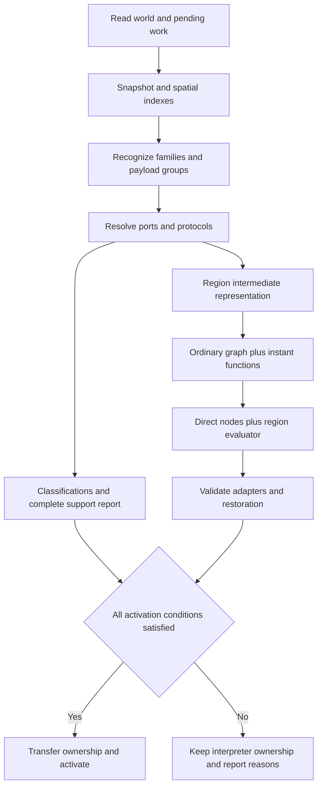

# Instant piston recognition and Redpiler implementation plan

Implement instant circuits as recognized subassemblies with graph ports, a Boolean computation function, and the small amount of protocol or clock state needed at their boundaries. Ordinary Redpiler components supply inputs and receive outputs. Compiled evaluation uses ideal internal synchronization and does not reproduce internal nanoticks, callback traversal, piston event FIFO, or piston animation. A recognized circuit may compute correctly when its physical Java/interpreter construction fails solely through nanotick misalignment.

The read-only classifier, candidate graphs, executable 11-bit adder and shared-clock `COUNTER_BASIC` target are implemented. Normal `/rp compile` accepts their supported lever/repeater revisions without a new feature flag. Admission remains conditional on complete ownership, a ready entry state, a supported output protocol and interpreter handoff. Counter execution includes independently sampled BUD storage; standalone BUD adapters, additional clock families and general stop/restart remain later graph work. The author has now promoted ANPU Pong to the next target. Its interpreter memory/screen oracle is frozen; BUD/update-channel graph lowering remains pending, and unsupported ANPU builds reject compilation. See the [ANPU pipeline, evidence and sequential milestones](ANPU_REDPILER.md).

This roadmap implements the [instant and BUD mathematical model](INSTANT_PISTON_REDPILER_MODEL.md), the [feature scope](INSTANT_REDPILLER.md), and the [author's clarifications](ANSWERS.md). Physical recognition follows [REDSTONE_MODEL.md](REDSTONE_MODEL.md); fixture behavior is recorded in the [schematic catalog](INSTANT_PISTON_SCHEMATICS.md) and [validation report](INSTANT_PISTON_VALIDATION.md). The [implemented pipeline](INSTANT_PISTON_RUNTIME.md) records the actual working-tree modules, limits, waveform, tests and commands as of 2026-10-06. Broader types and protocols below remain design proposals where the milestone explicitly says they are pending.

## Scope and assumptions

The [supplied lever/repeater revision](INSTANT_PISTON_IO_SCHEMATICS.md) now has exact hashes, reviewed ports, bounded protocols and independent Java captures. It is separate from the original pack. Attaching a repeater or changing an input circuit changes dust shape, loading and notifications; admission remains specific to a validated consumer/protocol rather than a matching filename. [Validation](INSTANT_PISTON_IO_VALIDATION.md) records limits and spatial/order-dependent XOR reset behavior.

| Area | First implementation | Later work |
| --- | --- | --- |
| Recognition | Observer reset seeds, supplied torch and dust families, shared payload groups and inhibition diagnostics | Additional proven reset constructions |
| Inputs | Existing lever, torch, repeater and wire nodes; prepared data and falling triggers | Buttons and other adapters after their pulse protocol is tested |
| Outputs | Connections between instant subassemblies and certified repeater interfaces | Lamps, BUD updates, comparators, observers and other consumers |
| Computation | Boolean functions for declared logical waves with strength-aware port decoding and ideal internal synchronization | Larger optimizations and additional certified families |
| State | Previous strengths, accepted wave identity, readiness and externally significant reset deadlines | BUD bits, sampling transactions and counter clock state |
| Movement | Recognition and restoration of supported single-payload mechanisms and shared groups | Ordinary pistons, longer payload lines and complex mechanics |
| Rendering | Ordinary visible inputs and useful outputs with infrequent updates | Optional additional display ports |
| Execution | Whole-plot activation only when every relevant execution owner is supported | Hybrid compiled and interpreted regions |

A logical one at an instant event port is `previous_strength > 0 && current_strength == 0`. Prepared data and stored bits have separate decoders. A held zero is not another external trigger, although the accepted response may contain internally generated cycles. Input polarity comes from the physical adapter; turning a lever on is not automatically logical one.

New external data or a new computation during reset is outside the initial supported protocol. Internal reset pulses remain part of the accepted response. Rearming requires a declared allowed sequence; returning a piston to extended does not by itself prove readiness. If the new fixtures need a deliberate rearm transition while an oscillator is active, specify it as part of their protocol rather than inferring it from old undefined cases.

Negation is an inhibit guard, not a standalone physical NOT primitive. Algebraic inversion may appear in the expression representation. Admission rules establish the logical function, wave grouping and receiving consumer contract; physical synchronization is a separate compatibility property. Internal delayed-inhibit races are normalized rather than rejected for misalignment alone. Runtime retains logical dependencies and required ordinary-component timing without an internal operation-order graph. Both full-net and optimized compiled plans use this semantics.

## Existing evidence and implementation starting point

The current pack has 20 basic or diagnostic dossiers and two deferred CPU inventories. It contains 138 declared episodes, 306 MCHPRS captures and 81 independent Java captures. The review verified 22 schematic hashes and 387 artifact hashes, reproduced generated inspections/projections, passed 14 pack behavioral tests, and explicitly passed the Java projection regression. Detailed traces remain local generated artifacts under the repository's existing policy.

| Fixture evidence | Consequence for implementation |
| --- | --- |
| Observer, downward observer and REDSTONE_2 recur under held zero | An accepted episode can require clock/reset state and repeated boundary effects |
| Torch examples reach a quiet extended endpoint | Readiness and rearming are family-specific |
| INSTANT_RESET_REDSTONE lacks autonomous reset in its exact geometry | Report external rearm; reject an autonomous-reset match |
| INSTANT_BLOCKED has a constant source supplying QC | Report forced power; an observer alone is not a reset certificate |
| OR_1 transfers a shared payload between independent reset mechanisms | Recognize one group with several possible owners |
| OR_Interpreter_illigal can lose the powered payload needed for reset | Preserve the excluded counterexample and reject executable lowering |
| AND_3 responds differently to AB and BA source operations | Preserve independent power/update sampling; do not lower unconditional AND |
| NOT_1 has a raw-wire transient and a separately tested repeater probe | Admit consumer-specific behavior; final wire levels are insufficient |
| XOR_Simple has reset pulses beyond its first-wave XOR projection | A pure XOR formula needs a certified boundary response |
| NANOTICK_EXAMPLE accepts activation before delayed inhibition | Retain its physical diagnostic; once logical ports/protocol are certified, test that compiled inhibition suppresses the activation rather than requiring physical equality |
| Corrected ADDER_11BITS passes current arithmetic and Java projections | Use current hashes/coordinates; general reuse and adapters remain separate |
| COUNTER_BASIC stores counts 1 through 16 after one generator release | Retain memory/clock state; clear, restart, high carry and wrap remain unverified |

The canonical [ADDER_11BITS.schem](../test_data/instant-pistons/ADDER_11BITS.schem) is 21 by 7 by 46, SHA-256 `41476594941f234f8759c2b4b12dab72641fbda9fb5f0412a2b0089ba964464e`. It has six signs, 11 stages and a separate unlabeled trigger. Its decoded result is available at response boundaries 1 through 3; moving outputs and reset are separate observations. The signless replacement and historical ADDER_GWIEZDNY_TEST are not current expectations. The downloaded edge case also has independent hashes and traces.

### Existing code that needs extension

The old-pack table above retains its original binary context. The I/O revision changes `INSTANT_RESET_REDSTONE` to an under-head dust autoreset and adds output stages to gates. New NOT_1 demonstrates effective inhibition before downstream event acceptance even when the ordinary target retracts first. Its supported compiled abstraction needs no internal nanotick schedule. AND_3 still requires separate live power and sampling updates. XOR's first-wave function is validated, but later reset output depends on the recorded spatial/order context; do not admit a complete constant-XOR boundary contract.

Standalone `BUD_NonInstantInputs` and `BUD_PistonUpdate` now verify independent data/update ports, retained state after data restoration and a quiet resampling protocol in four horizontal rotations. `BUD_InstantMemoryCellObserverUpdate` verifies instant-produced data before delayed sampling and a recurring generator; `BUD_InstantPistonUpdate` remains a derived-control diagnostic because its saved lever is absent. Counter storage and its repeater bank publish different waves: count n is stored at 6n, then visible at the consumer in [6n+5,6n+8]. Keep BUD transactions, wave identity and generator/consumer timing explicit while omitting synchronized internal nanoticks. This characterization does not itself certify executable storage. The separately implemented adder runtime has phase-specific continuation tests, while general interpreter handoff remains future work.

| Location | Current implementation | Remaining extension |
| --- | --- | --- |
| [redpiler/mod.rs](../crates/core/src/redpiler/mod.rs) | Live analysis, explicit result, paired instant preparation and staged activation | Additional admitted stateful protocols |
| [compile_graph.rs](../crates/core/src/redpiler/compile_graph.rs) | Ordinary electrical links plus retained instant boundaries | Stored-state and independent sampling identities |
| [passes](../crates/core/src/redpiler/passes/mod.rs) | Ownership preparation precedes ordinary passes | Audit future state/update channels |
| [identify_nodes.rs](../crates/core/src/redpiler/passes/identify_nodes.rs) | Owned internal nodes excluded; source/consumer aliases retained | Additional display and consumer adapters |
| [input_search.rs](../crates/core/src/redpiler/passes/input_search.rs) | Structured failures and mutable mobile aliases | More consumer contexts and stateful boundaries |
| [Direct backend](../crates/core/src/redpiler/backend/direct/mod.rs) | Bound Boolean decisions, InstantSource nodes and phase-aware handoff | Multiple clocks, storage and additional adapters |
| [scheduler](../crates/core/src/redpiler/backend/queue.rs) | Ordinary deadlines plus one synchronous wave coordinator; owned replay filtering | General clock/reset ownership |
| [plot/mod.rs](../crates/core/src/plot/mod.rs) | Interpreter work retained until compilation succeeds | Broader edit/persistence lifecycle proof |
| [backend interface](../crates/core/src/redpiler/backend/mod.rs) | Ordinary compile path and typed prepared-instant path | General region artifact interfaces |
| [graph serialization](../crates/redpiler_graph/src/lib.rs) | Instant binary export rejected explicitly | Versioned executable program export |

The pipeline currently runs IdentifyNodes, InputSearch, ClampWeights, DedupLinks, ConstantFold, UnreachableOutput, ConstantCoalesce, Coalesce, PruneOrphans and ExportGraph, followed by Direct lowering. Most optimizations require `--optimize`; PruneOrphans also requires `--io-only`. Recognition correctness must be independent of those flags.

## Target architecture



### Analysis and region representation

Add proposed modules under `crates/core/src/redpiler/analysis/`: `snapshot`, `topology`, `pistons`, `families`, `groups`, `ports` and `report`. Add `crates/core/src/redpiler/instant/` for region representation, expressions, lowering, runtime adapters and materialization. Analysis remains usable without constructing a backend.

| Proposed type | Required contents |
| --- | --- |
| AnalysisSnapshot | Bounds, live states/entities, entry phase, scheduled requests and piston work |
| PistonDescriptor | Position, facing, sticky/extended state, head/payload and power/update dependencies |
| FamilyDefinition | Matcher, context guards, payload rules, interface recipe, protocol and validation identity |
| PayloadGroup | Members, payload identity, allowed positions, owners and reset closure |
| RegionPort | Stable ID, role, channel, physical aliases, direction, strength range and decoder |
| RegionProgram | Ports, expression DAG, optional state transition, protocol and adapter IDs |
| RegionState | Previous strengths, prepared data, accepted wave, readiness and clock/reset state |
| RestorationDescriptor | Geometry/entities, reconstruction recipe, necessary ownership state and work mapping |
| AnalysisReport | Classifications, groups, ports, unsupported components and reasons |
| CompileArtifact | Ordinary graph, programs, alias resolver, initial state, ownership, report and restoration |

A family certificate means its matcher, allowed context and interface have a validated contract. It is versioned evidence attached to a family definition, not proof from a geometric seed. Validate small families offline against the interpreter and independent Java observations. Production compilation matches rules and context; it does not run unrestricted simulations on the live plot.

Expose analysis limits for visited cells, wire searches, group members, occupancy configurations and expression nodes. Check task cancellation during traversal and lowering. Cache local topology and negative family matches within one analysis; report a limit or cancellation explicitly rather than returning a partial certificate. Choose default budgets from measurements of the small-build pack.

Keep electrical influence, qualifying update influence and mechanical access as separate analysis views. They establish recognition and closure rather than becoming runtime simulators. Operation traces explain admission or rejection; accepted programs retain logical dependencies required by their protocol.

### Port channels and graph integration

Distinguish electrical strength, prepared data, wave event and logical sampling update. Strength links retain attenuation. An event carries an accepted occurrence for a wave. A sampling update may change storage when data strength is unchanged. Do not reuse the diode Side link for these different channels.

A subassembly output is a graph connection, not automatically a world-output flag. It may feed another instant or an ordinary component. Merge compatible adjacent instant groups into one function while preserving aliases. Display and pruning flags remain separate.

Use a shared position resolver mapping queries to ordinary components, region ports, owned internals or unsupported dependencies. Do not identify one moving redstone payload at two positions as two immutable constants. Handle synthetic ports before routines unwrap node block positions.

Recommended initial backend representation: keep expressions and region state in separate arenas, with bridges from ordinary source updates into region ports and from electrical region outputs through normal Direct propagation. Internal event edges do not need attenuation-packed ForwardLinks or one block position per expression.

### Logical execution and external timing

For a supported wave compute `y = F(prepared_data, accepted_events, visible_memory)`. If state is required apply `z_next = H(z, prepared_data, accepted_events, sampling_updates)`. A pure function has no persistent data memory; readiness or reset deadlines can still require bookkeeping.

Source updates refresh strengths and prepared conditions. Changes at prepared-data-only ports update cached data without launching computation. Qualifying falling transitions at trigger/event ports create provisional requests under the family's declared update contract; a QC power change without the required recheck is insufficient. At the logical launch checkpoint, validate readiness/current trigger conditions, finalize wave inputs, evaluate the DAG and publish the certified boundary response. This retains cancellation when power is restored before acceptance. An update to already-low data is a separate effect, not a new falling event.

Propagate internal dependencies through a deterministic worklist in the same wave. Adding instant stages must not add one game tick per stage. Stored state and ordinary timed components remain boundaries; reject data cycles without recognized storage or clock ownership.

Use one compiled coordinator for ordinary scheduled requests, wave launch checkpoints and adapter deadlines. For the first fixtures, test launching after relevant ordinary scheduled input work, matching the physical first computation boundary. Define exact launch/reset checkpoints per protocol. Do not publish all outputs in a lever callback or implement internal piston phases to obtain external timing.

Wave grouping must be concrete. Sample prepared data when the trigger is accepted. For multi-root gates, collect only transitions the protocol permits before launch and finalize once. Independent operations remain ordered; same-game-tick proximity does not merge them automatically. Initialize previous strengths from the entry world. Absence becomes false when the declared input set is finalized, not after an invented timeout.

Each electrical adapter defines initial strength, accepted-input response, consequential transitions, externally significant reset effects and rearm. Suppress a transient only when the actual consumer is validated to behave equivalently. Repeater delay, locking and pending short-pulse behavior stay in the ordinary implementation. Apply attenuation to the receiving face before evaluating its input.

A compact deadline or finite state sequence can reproduce exposed periodic reset effects. It represents the boundary contract, not internal movements. Unknown waveform/context/consumer contracts keep activation disabled.

## Recognition algorithm

### 1 Inventory actual positions and entry work

Scan live blocks with the optimized world iterator. Record bases, heads, moving states, observers, dust, supports, sources, consumers and relevant entities. Read the context required by power, updates and motion. A chunk palette is a conservative hint; unused entries are not actual pistons.

Build position/reverse influence indexes once. Preserve raw state and registry identity where pending requests require them. Initially require a supported BetweenTicks entry without active piston events or motions. Ordinary pending ticks can be transferred. Internal reset requests need a family-specific state mapping.

### 2 Match reset family candidates

Start with a horizontal sticky base, observer immediately above with `facing=Down`, fixed conducting cap above that, and consistent head/payload. Confirm observer output, cap conduction, QC and a qualifying base recheck. Nonconducting or powered caps, other writers and movable caps change eligibility.

Add torch, under-head dust and downward constructions as separate definitions with their own supports, scheduling, payload and reuse rules. Retain geometry transforms. Admit rotations validated for the construction; reflections and unrestricted position independence need additional evidence or guards.

### 3 Resolve groups and payload closure

For extended bases validate the matching head and two-cells-forward payload. For retracted bases inspect the first forward cell. Check allowed future destinations using the interpreter's movement constraints. Initial executable families restrict carried blocks and reject carried entities/additional payload lines.

Form a group before certifying actuators that share payloads or destination cells. Record allowed drops, recapture and ownership transfer. Conservation alone does not prove a reusable group: every supported ownership outcome must retain reset. Preserve the illegal OR as a rejection case.

### 4 Close electrical update and mechanical context

Include writers that can alter movement, supports, dust shape, reset power or emitted strength. Audit incoming/outgoing effects. Shared read-only context is possible; each active component and authoritative queue still has one execution owner.

Follow influence beyond a fixed discovery halo. At bounds resolve a supported explicit interface or return a diagnostic. Selection boundaries do not prove air. Out-of-bounds sources must not cause unchecked indexing.

### 5 Extract ports and strength guards

Find incoming sources and outgoing connections to other instants and actual consumers. Use geometry/dependencies; signs remain characterization hints. Record receiving faces, attenuation and separate power/update channels.

A payload can emit power, conduct a primitive strong source, change dust shape/support or provide updates. Build guarded local occupancy for its allowed positions, using real solidity/support/directional queries. Do not conduct recursively through solid chains or treat redstone blocks as solid caps.

For fixed eligible dust paths retain guarded `max(0, source_strength - attenuation)` contributions until threshold reduction is justified. Strength one is not equivalent to fifteen on a long wire. Unsupported analog consumers or changing external geometry remain unresolved boundaries.

### 6 Assign functions and physical compatibility

Use family interface recipes for prepared-bit, event and output decoders. Derive small expressions/tables and check them against logical expectations and physically compatible fixture episodes. Compose validated functions for larger builds; avoid whole-build exponential tables.

Certification includes a known logical function, state/update ownership and consumer protocol. Physical composition/dependency depth may explain a mismatch but is not a delayed-inhibit admission guard. Classify known nanotick-only divergence separately from unsupported logic, reset or payload ownership; no general nanotick solver is required. Preserve AND_3's independent sampling/history dependency.

### 7 Produce complete classifications

Use CertifiedInstant, CertifiedInstantGroup, ResetCandidate, PotentialBudMemory, OrdinaryPiston and Unsupported, with reasons such as ForcedPowered, ActiveMotion, MissingUpdatePath, UnclosedReset, UnsupportedConsumer, CrossesBounds and AnalysisBudgetExceeded.

A failed instant match does not prove BUD memory. Account for every base and every active observer, moving component or command block. Distinguish recognized geometry, validated local projection and executable eligibility.

## Compiler changes and optimization rules

The pipeline becomes snapshot, recognition, port extraction, region construction, ordinary identification/search, region lowering, audited optimizations, artifact validation and backend preparation. Transfer ownership only after preparation succeeds.

| Integration point | Required rule |
| --- | --- |
| IdentifyNodes | Exclude reset internals/mobile constants; register ordinary nodes and region interfaces |
| InputSearch | Use the shared resolver, attenuation and explicit unsupported lookups |
| ClampWeights | Affect strength edges only |
| DedupLinks | Include channel/guard/port identity; retain distinct sampling transactions |
| ConstantFold | Fold pure functions while retaining episode/state/adapter/restoration ownership |
| UnreachableOutput | Restrict strength reasoning to electrical edges |
| ConstantCoalesce | Preserve aliases and distinguish mobile from fixed sources |
| Coalesce | Require compatible function, protocol, state and adapter |
| PruneOrphans | Protect consumers, state/update effects and selected observation roots |
| ExportGraph | Version region semantics or reject unsupported export |
| Direct lowering | Build region arenas/bridges and validate IDs/mappings |

Start with constants, inputs, AND, OR, XOR and inhibit expressions, plus bounded truth-table fallback. Preserve multiple outputs and common expressions. Keep restoration provenance outside the minimized DAG. Graph slots are not stable region IDs.

A fixture-terminal repeater needs an explicit observation root or a real downstream consumer for retention. Do not mark every repeater/instant port as player-visible merely to bypass pruning. `--io-only` changes display/retention policy, not circuit semantics.

## Milestones and acceptance criteria

| Milestone | Deliverable | Dependencies | Activation |
| --- | --- | --- | --- |
| M0 | Ordinary-input/repeater fixtures and interface contracts | Captured I/O pack | Adder prepared episode established; general rearm pending |
| M1 | Read-only inventory and classification report | Current world/model APIs | Implemented |
| M2 | Reset matchers, guards and payload groups | M1 | Structural families implemented; runtime subset narrower |
| M3 | Port discovery and dependency extraction | M2 | Implemented for admitted acyclic network |
| M4 | Region representation and offline Boolean evaluator | M3 and protocol schema | Implemented bounded Boolean program |
| M5 | Ordinary graph integration and Direct lowering | M4 | Implemented paired-program lowering |
| M6 | Trigger waves, repeater adapters and logical timing | M0 and M5 | Observer/follower adder episode implemented |
| M7 | Materialization and lifecycle support | Family state contracts and M5/M6 integration | Adder reset continuation implemented; broader lifecycle pending |
| M8 | Transactional activation of first supported circuits | M6, M7 and complete support report | Normal compile accepts supported scope |
| M9 | Audited optimization and performance | M8 baseline | Decision simplification and flag comparisons implemented; benchmarks pending |
| M10 | Adders, decoders, longer chains and wires | Required families/adapters and M8 | 11-bit adder accepted; 1-bit carry and other builds pending |
| M11 | BUD storage and a supported counter | M10 interfaces and owned clock integration | COUNTER_BASIC/shared-clock storage implemented; standalone adapters and rearm pending |
| M12 | ANPU ordered memory/screen oracle | Shared interpreter and original CPU/screen references | Frozen 896-cell trace and 50,000-tick interpreted Pong regression implemented |
| M13 | General BUD/update channels and ANPU compiled graph | M12 oracle; conducting movers; ordered sampling and acceptance | Pending; ANPU A2–A4 |
| M14 | CPU graph optimization and active-window performance | M13 equivalence and phase-specific recovery | Pending; ANPU A5 |

M1 through M5 can progress while new schematics are prepared. M0 does not block the classifier. Ordinary-input/repeater fixtures become an execution requirement at M6. Design restoration early so a family that cannot be restored is not promised as runnable.

### M0 Define input and repeater contracts

Extend manifests with adapter type/polarity, prepared-data ports, accepted transitions, wave grouping, ready/rearm conditions, repeater facing/delay/lock state, output encoding and observation points. Extend capture tools to operate levers rather than replacing these stimuli with destruction.

Capture current-binary interpreter and independent Java episodes: single events, allowed combinations, restoration and at least two computations in one world. Observe repeater state through response/reset. Keep bare-wire and loaded-consumer evidence separate.

**Acceptance:** one minimal circuit has a validated executable lever-to-repeater protocol including reuse. Undefined reset-time inputs remain excluded. Other family contracts can remain pending without blocking analysis.

### M1 Add the snapshot and diagnostic report

**Implementation status (2026-10-06):** Rust live inventory, bounded/cancellable analysis, head/payload diagnostics, conservative reset seeds and possible shared-payload groups are implemented in [redpiler/analysis](../crates/core/src/redpiler/analysis/mod.rs). `/rp analyze` has help, completion and a read-only permission. Structured reports distinguish candidates from executable support. Both the original 20 small fixtures and the 22 lever/repeater fixtures are regression inputs; inventories are deterministic and preserve physical state and queued work. Initial reset guards, dependency extraction and candidate graph preparation are described under M2/M3 below. Execution evidence currently covers the narrower adder protocol described under M4–M8.

The typed boundary foundation is implemented in [instant/contract.rs](../crates/core/src/redpiler/instant/contract.rs): validated strengths, attenuation, prepared-data polarity, falling-trigger edges, electrical output aliases and an independent sampling channel. Requests require an explicit recheck; restoring power cancels acceptance, compiling a low input creates no edge, and requests during reset are discarded. These standalone contract types are not the executable adder's runtime representation: that path uses `PreparedInstant`, source-threshold decisions and a phase coordinator. Independent sampling/storage integration remains pending.

The transaction foundation from M8 was necessary for safe compiler admission and is implemented alongside M1: `Compiler::compile` returns a result, stages a fresh backend and checks cancellation before activation. The plot retains interpreter ticks and history until success, joins the worker explicitly and reports actual failure. Live unsupported pistons/observers remain interpreted. Unused palette states no longer prevent ordinary compilation or automatic compilation. These M1 foundations did not alone enable execution; the adder-specific M4–M8 implementation described below now supplies that path.

Validation for this foundation: 20 Redpiler tests, 93 redstone tests and six command/permission tests pass; the two opt-in physical capture tests remain separate. The contract integration test follows a real lever/torch falling edge at completed game boundary 2 and the supplied delay-2 repeater's first falling response at boundary 6. `cargo check -p mchprs_core --lib --locked` and the scoped formatting/diff checks pass. These checks establish parser/contract safety and existing behavior; they do not establish compiled instant equivalence or a performance improvement.

The [lever/repeater catalog](INSTANT_PISTON_IO_SCHEMATICS.md) is complete as a separate characterization pack. Its XOR dossier records a Java/MCHPRS reset-response discrepancy. Preserve that diagnostic and leave a general XOR reset contract uncertified until the discrepancy is resolved; structural compilation or a first-wave Boolean table does not resolve it.

Implement the entry point, live inventory, indexes, report types and bounded traversal. Add an analysis-only command, for example `/rp analyze`, with permission/help/completion handling. It remains available when the compile guard rejects pistons. Produce a player summary and detailed structured report.

Report all bases/observers, head consistency, pending work, seeds, unknowns and bounds crossings. Do not depend on filenames/signs. Test deterministic inventory/reporting and preservation of world state.

**Acceptance:** all 20 basic/diagnostic fixtures have reports accounting for every piston. Analysis preserves blocks, entities, scheduled work and piston state. CPU inventories are optional stress inputs.

### M2 Implement matchers and payload groups

**Rust status (2026-10-06):** [families.rs](../crates/core/src/redpiler/analysis/families.rs) implements structural matches for observer-above feedback, torch control, under-head dust and lateral dust, including the supplied downward constructions. Payload diagnostics accept one redstone block or wool, with a matching stationary head and entity-free context. Guards check conducting fixed supports, source facing, existing or pending reset activity, permanent power, additional reset writers and return paths. Torch control also checks attenuation: removing base power must remove the support power that keeps its reset torch off. Conducting inhibition and shared occupancy are validated by the joint-wave extractor rather than inferred from a local reset match; runtime currently admits verified observer reset and passive followers, not every structurally matched family.

Payload groups retain all near/far positions and possible owners. The reset-supply check considers each permitted owner position; independent observer feedback passes, while dust supplied only at another owner's vacated position cannot establish closure. The legal shared OR and supplied illegal reset-starvation example receive different results. This is a structural reset-supply condition; logical consumer contracts, physical compatibility/reachability and restoration still require their later acceptance checks. Physical synchronization does not become an executable admission guard.

[topology.rs](../crates/core/src/redpiler/analysis/topology.rs) bounds and cancels electrical searches and owner checks. The default dependency budget is 4,194,304 steps, separate from the live-cell budget. Exhaustion returns an error rather than a partial certificate. Power-emission geometry is shared with the interpreter and ordinary graph search in [redstone/power.rs](../crates/core/src/redstone/power.rs).

Implement observer matching first, then supplied torch/dust and vertical definitions. Add cap/support/head checks, movement positions, group ownership and reset closure. Keep geometry separate from logical expressions.

Test close mutations: reversed observers, changed caps, absent supports, blocked destinations, additional payloads and outside writers. Cover forced-powered/missing-reset cases, legal shared OR and illegal group rejection.

**Acceptance:** valid constructions and nearby invalid variants receive explicit classifications/reasons. Recognized geometry with unvalidated ports remains ineligible for executable activation.

### M3 Extract ports and dependency regions

**Rust status (2026-10-06):** Analysis schema 3 includes weighted direct/QC source dependencies, retained wire aliases, independent wire/head notifications, mobile-group connections and ordinary consumer interfaces. [ports.rs](../crates/core/src/redpiler/analysis/ports.rs) queries actual receiving faces and distinguishes comparator side inputs from main inputs. A BUD's remote data wire and nearby sampling update remain separate channels. Exposed reset sources are reported even when they do not carry a mobile payload's electrical output. Conditional conducting-payload effects and inhibition are now extracted into the admitted Boolean wave; independent sampling, general role-specific protocols and storage/clock composition remain pending.

[graph.rs](../crates/core/src/redpiler/analysis/graph.rs) prepares a candidate graph from a fresh live analysis. Redstone-only reset fixtures retain the structural candidate path with `InstantInput` sinks and `MobileSource` aliases. Wool networks use the same [program preparation](../crates/core/src/redpiler/instant/program.rs) as compilation, without activating the artifact. The executable joint-wave path admits internal cross-piston reset dependencies and supported shared groups, but rejects reset directly exposed to ordinary consumers. Every mobile position retains its group identity and initial strength; mobile redstone blocks never become ordinary constants. Reset internals are excluded from ordinary identification, and program sources and consumer interfaces remain retention roots under `--io-only`. Boundary nodes survive optimization without being mistaken for physical blocks.

Graph passes return structured errors. Missing sources, cancellation and unsupported instant export fail preparation. The ordinary Direct compile entry rejects unpaired boundary nodes; the typed prepared-instant path binds the Boolean program and mutable supplies after validating strengths and fan-in. Production `/rp compile` accepts the supported adder scope through that path and preserves interpreter ownership on rejection. A read-only candidate graph alone is not executable certification.

Manual review on an otherwise empty plot, after strict paste of `INSTANT_TORCH.schem` or `INSTANT_OBSERVER.schem`:

```text
/rp analyze
/rp analyze --graph
/rp analyze --graph --optimize --io-only
```

The single-instant graph has one instant input and two mobile source aliases, with one matched reset mechanism, one group with reset-supply closure and one ordinary consumer interface. Optimization can reduce ordinary nodes while retaining those boundaries. The plot remains interpreted throughout. The legal OR prepares a graph; the supplied illegal OR reports missing reset-supply closure. Help, completion and the existing read-only analysis permission cover the graph option. Full structured reports and graph details use DEBUG logging, which is available in debug builds; release builds retain the chat summaries and rejection reasons. Candidate export is disabled.

Pre-runtime validation for this stage passed 35 Redpiler tests, 96 redstone tests and six command/security tests, with two explicit capture/reference tests ignored. Deterministic read-only inventories cover 42 small fixtures. Candidate graphs cover eight supplied constructions across all four optimize/io-only combinations; seven constructions also pass all three additional horizontal rotations. Mutation checks cover support removal, reset writers/activity, forced power, bounds, illegal ownership outcomes and exposed reset signals. Additional cases cover reset feedback between groups, shared reset ownership, independent update context and valid retracted BUD storage without a false head mismatch. These historical checks established graph preparation. The [current runtime evidence](INSTANT_PISTON_RUNTIME.md#regression-evidence) adds compiled arithmetic, waveform and phase-specific handoff tests; it still does not claim a measured speedup.

Implement directional power/QC, qualifying updates, shared resolver, reverse consumer searches and guarded payload effects. Separate data, trigger, inhibit and sampling channels. Compose compatible groups and stop at timed/stored-state boundaries.

Detect unsupported overlap, ordinary pistons, exposed observers, bounds crossings and data cycles. Explain NOT's consumer requirement, AND_3 sampling and any known delayed-inhibit physical incompatibility in reports; that incompatibility alone does not reject logical lowering.

**Acceptance:** reviewed fixture maps match ports, faces, sources, groups and consumers. Interfaces agree with optimization enabled/disabled. Represent wires feeding both another instant and a repeater correctly.

### M4 Build programs and evaluate offline

**Implemented adder scope:** bounded canonical Boolean decisions represent source-strength thresholds and conditional payload occupancy. Simplification removes false dependency cycles; genuine actor cycles reject. Topological substitution and compaction produce source-only runtime functions. All eight 1-bit first-wave cases and 40 11-bit arithmetic cases pass; the 1-bit carry consumer still needs another adapter.

Implement stable RegionId/PortId/ExprId references, expression arena, local tables, protocols/state descriptors and multiple outputs. The pure evaluator accepts finalized waves/prepared inputs without world mutations or physical scheduling.

Verify OR, combinational AND families, contextual inhibition and qualified XOR projections. Preserve AND_3/counter state boundaries. Compose chains and reconvergence; verify full-adder/arithmetic functions where recognition coverage permits.

**Acceptance:** expressions match independent tables/arithmetic within declared validity windows. Unavailable output is explicit. Events carry wave identity and are not re-emitted by rereading held values.

### M5 Integrate the graph and Direct backend

**Implemented adder scope:** `PreparedInstant` pairs the program, ownership and restoration metadata with the graph. Direct lowering retains sources/consumers, binds decisions to node IDs and supplies mutable `InstantSource` nodes. Ordinary backend scheduling continues to drive the repeaters. Supported shared redstone/wool payloads are admitted; unsupported owners reject the complete plot.

Extend CompileArtifact/backend preparation, identification, InputSearch and final reference checks. Implement region input sinks/electrical output sources, aliases and initialization. Keep expressions/state in side arenas.

Expand propagation and typed links for future protocols. Audit packed links, fan-in counters, graph removals and scheduler mapping. Retain ordinary behavior and whole-plot rejection when any required owner is unsupported.

**Acceptance:** ordinary sources reach region inputs and outputs reach repeaters through electrical links. Consecutive instants propagate in one wave. No synthetic block unwrap, missing source panic, overflow or duplicate mobile constant.

### M6 Implement waves and repeater adapters

**Implemented adder scope:** one coordinator evaluates the ready network after ordinary scheduled input work, then supplies the observer response in six phases. Far redstone supply is absent in phases 1–5 and restored in phase 6; held-low inhibition permits internal recurrence. Compilation does not create a launch, and restoring power before the first tick cancels it. Tests compare the actual repeater waveform through 24 ticks. Independent roots, general rearm and additional reset protocols remain pending.

Implement initial previous strengths, prepared caching, provisional requests, finalization, launch revalidation and dirty-region evaluation. Hook ordinary interactions and scheduled source changes without manufacturing initialization events.

Implement repeater response/reset/rearm recipes and one timing coordinator for region deadlines and ordinary scheduling. Immediate logical work uses the worklist, not delay-zero requests into a detached scheduler bucket.

Test restore-before-launch, positive changes, permitted strength-one falling, held zero, allowed roots, depth and repeated ready computations. Compare repeater/downstream response at each boundary through reset. One probe does not certify other consumers.

**Acceptance:** interpreted, independent Java and compiled observations agree for physically synchronized compatible repeated lever/repeater episodes. For established nanotick-only misalignment, compiled observations follow the separately declared logical expectation and may intentionally differ from physical execution. Reference and optimized compiled plans agree in both categories. Chain length adds no computation ticks. Unsupported histories have defined compiler recovery without becoming conformance cases.

### M7 Implement materialization and lifecycle integration

**Implemented adder scope:** reset flushes ordinary nodes and reconstructs owned geometry/work through bounded private interpreter replay. Live backend deadlines remain authoritative for ordinary consumers. Tests hand off at phases 0–12, including a trigger changed before any compiled tick, and compare 18 continuation ticks. General persistence/edit lifecycle proof and identical historical callback/motion logs are not claimed.

Retain original geometry/entities, aliases and necessary reconstruction information. Select a family recipe: validated physical state templates or bounded interpreter replay during handoff. Keep reconstruction off the ordinary computation path and preserve boundary-significant phase/work.

Restore every reachable compiled state at supported user-visible operation checkpoints, including an active response. A guessed extended piston is insufficient. Keep families analysis-only if they lack a reconstruction rule. Map pending synthetic work before returning it to the world scheduler.

Integrate reset, edits, WorldEdit, exports, save/load, unload/shutdown, inspection and fine stepping. Physical stepping materializes before interpreter advance. Respect current history policy; compiled history is separate work. Audit `--update` bulk callbacks.

Render useful outputs infrequently without animating internal pistons or tracking every internal wire. Authoritative state must still be restored under `--io-only`.

**Acceptance:** continuation matches supported future observations after reset, persistence and edits at each supported checkpoint. Payloads/work remain valid and restoration introduces no extra computation or changed bit.

### M8 Enable transactional activation

**Implemented adder scope:** normal `/rp compile` stages a fresh backend with the paired program and activates only after complete success. No `--instant` flag is required. Unsupported payloads, destructive wire support, storage, output context or queued owned work reject without activating a partial program.

Return explicit success, rejection, cancellation or failure from preparation. Build while the interpreter retains authoritative queues; transfer state once after complete success. Stage the replacement backend rather than modifying the active artifact during preparation. Defer destructive scheduler/history changes until success and return the scoreboard to the actual prior/stopped state on failure. Failure preserves prior world/ownership.

Expand admission through the existing prepared-program path using the complete support report. Update compile feedback/scoreboard from the actual result. Unimplemented BUDs, ordinary pistons, external observers, commands or motions keep the plot interpreted.

Test queued work, stale scheduled block types, backend failure, cancellation and recompilation. Do not build hybrid fallback by running compiled and interpreted ticks sequentially.

**Acceptance:** certified small plots run; unsupported plots report exact reasons and remain interpreted. Failures preserve blocks, entities, requests and piston state. Reset passes M7 continuation checks.

### M9 Minimize functions and measure performance

**Partial implementation:** canonical decisions, constant reduction, duplicate sharing and compaction are implemented. All four optimize/I/O flag combinations preserve the adder arithmetic and waveform. Compilation/runtime/memory benchmarks remain pending.

Add expression identities, propagation of constants, duplicate removal and common-subexpression sharing. Audit ordinary passes against channels/ownership and compare optimized/unoptimized consumers and state.

Measure analysis time/memory, coverage, expression size, dirty evaluations and wave cost. Benchmark gates/chains/adders/wires against interpretation. Separate compilation/restoration costs and active responses from idle time.

**Acceptance:** minimization preserves observations/restoration and reduces measured work. Resource exhaustion reports unverified status. CPU performance is not an acceptance requirement.

### M10 Expand simple combinational builds

**Current acceptance:** the lever/repeater 11-bit adder passes 40 prepared cases, overflow/carry checks, three additional rotations and translation. Its saved orientation also passes waveform and handoff comparisons. Next work includes the 1-bit conducting carry interface, broader family adapters, decoders and long wires; repeated computations with a general rearm protocol are not yet certified.

Complete required family coverage for ADDER_1BIT/ADDER_11BITS: conducting payloads, inhibition and downward mechanisms. Add lever/repeater versions, a decoder and long-wire examples. Cover trigger/data separation, carries, high bits, modulo-2048 overflow, fan-out and reconvergence.

Validate repeated arithmetic with the new rearm protocol, attenuation thresholds, chunk boundaries and incomplete plot context. Add lamps through independent adapter contracts if available.

**Acceptance:** chosen builds have complete ownership and pass input, reset, optimization and handoff comparisons. A mostly recognized build with unsupported remaining components cannot activate.

### M11 Add BUD storage and counters

**Implemented shared-clock scope:** [clocked.rs](../crates/core/src/redpiler/instant/clocked.rs) recognizes one empty ordinary observer-reset generator, its side sampling observer and independently updated downward BUD cells. Conditional geometry derives next-state functions from stored far/near occupancy; it does not replace the schematic with a predefined counter instruction. The supplied 16-bit bank's extracted functions pass all 65,536 increment states. Runtime samples the old bank together, updates storage in the owned sampling phase and publishes through existing output stages/repeater scheduling. Four optimize/I/O combinations match the recorded 102-tick physical response. Bounded handoff seeds stored state and replays the last two waves, reconstructing consumer dust omitted by optimization. Missing sampling, extra writers and exposed clock outputs reject transactionally. See the [actual protocol and manual counter test](INSTANT_PISTON_RUNTIME.md#clocked-storage-and-the-counter).

The normal regression covers the captured release; the opt-in full-cycle Rust comparison passed all 65,536 increments, matching each tick's repeater states and checking high carries and wrap against the interpreter. That comparison is separate from the existing Java captures. Standalone BUD data/update adapters, multiple clocks, clear, stop/restart and arbitrary rearm histories remain separate acceptance requirements.

Use a standalone BUD fixture to define initialization, independent power/update ports, polarity, sampling, validity and reuse. Implement `q_next = update ? decoded_data : q`. Data without an update retain storage; ordered samples and old/new memory reads remain explicit dependencies.

Integrate memory with functions/coordinator and preserve it through optimization/materialization. Recognize the counter generator/bank, then define release and update cadence. Add clear/restart/high carry/wrap only when evidence establishes those contracts.

**Acceptance:** independent tests store both bits and retain data without updates. Counter values/timing match the validated range; handoff preserves bank and clock. Bank length does not certify wrap.

### M12–M14 ANPU memory and screen equivalence

The [ANPU extension](ANPU_REDPILER.md) defines the ordered memory/screen contract and retained interpreter oracle. Compiled BUD support must preserve consequential sampling and accepted-write order. ANPU's 896 note-block BUD cells move black concrete; the counter's redstone-block storage and six-phase macro cannot own them without another representation.

M12 freezes an ordered BUD trace alongside the unchanged original CPU/screen references and checks the interpreted episode. M13 separates electrical data from notification/sampling events, supports conducting occupancy, retracted entry and event power rechecks, then lowers the CPU while passing these oracles. M14 may optimize only after preserving memory position, sampled value, accepted transaction order and game-tick screen timing. The ordinary interpreter supplies the differential baseline; Redpiler activation requires a supported compiled graph.

## Activation and recovery policy

Recognition and executable eligibility are separate. Initially every active component is owned by ordinary Redpiler, an accepted instant program, or the later memory/clock implementation. Unowned interpreter work prevents activation even when useful groups can be reported.

Within supported protocols preserve the logical consumer contract, consequential transitions and relevant timing through the episode. Physical compatibility episodes additionally require interpreter/Java equality; known internal misalignment may be normalized. Internal animation/display may disappear. Logical invalid windows remain explicit; ordinary consumers receive their declared waveform rather than an artificial invalid electrical signal.

Outside the supported input protocol, diagnose and materialize/reset before interpretation where reconstruction permits. Undefined circuit behavior does not permit corrupted queues or lost payloads. Families without a safe recovery route remain analysis-only.

Structural edits require materialization and reset/reanalysis. Mapped lever-state changes remain compiled. Destructive fixture stimuli remain laboratory controls; the first release needs no special player-edit trigger route.

## Validation and release gates

| Area | Required evidence |
| --- | --- |
| Inventory/reports | Every base accounted for, determinism and no world/queue mutation |
| Matchers | Positive examples, close mutations, groups and supported rotations |
| Ports | Faces, polarity, strengths, sampling separation and consumers |
| Functions | Exhaustive small tables, arithmetic, composition and validity |
| Runtime | Ordinary inputs, complete response/reset, grouping and reuse |
| Optimization | Same consumer/state contract across optimize/io-only settings |
| Handoff | Future observations after reset, edits, persistence and stepping |
| Failures | Rejection, cancellation and recovery preserve ownership |
| Stateful extension | Independent data/update tests, read rules and clock preservation |

Keep interpreter tests/frozen references. Compiled tests compare an explicit logical boundary projection; removing internal movements does not require equal pico traces. Physically synchronized episodes retain their independent Java comparison. Misaligned episodes use a separately justified logical oracle and preserve the differing physical trace as intentional incompatibility. Fine traces diagnose recognition or boundary failures, rather than defining compiled operation counts. A mismatch with no established cause remains unresolved, including the current XOR reset discrepancy.

Use focused checks appropriate to the code change. Existing commands include:

```powershell
cargo test -p mchprs_core --lib redstone::instant_piston_tests --locked -- --test-threads=1
cargo test -p mchprs_core --lib redstone::instant_piston_tests::frozen_java_port_waveforms_match_current_binaries_and_protocols --locked -- --ignored --exact --test-threads=1
cargo test -p mchprs_core --lib redpiler:: --locked -- --test-threads=1
cargo test -p mchprs_core --lib redstone:: --locked -- --test-threads=1
cargo test -p mchprs_core --lib plot::piston_tests --locked -- --test-threads=1
cargo check -p mchprs_core --lib --locked
py tools/inspect_instant_pistons.py --check
py tools/analyze_instant_pistons.py --check
py tools/validate_instant_pistons.py
```

The Java comparison is opt-in and requires local artifacts. Establish a required verification job or release procedure that supplies/verifies the independent baseline before compiler changes are accepted. Follow [tools/README.md](../tools/README.md); never create Java expectations from compiled or MCHPRS output. Bind fixture hashes, protocols, server identity and projection scope.

Backend propagation/scheduling changes require broader ordinary redstone checks. Handoff also requires scheduler/persistence/lifecycle tests. Serialization changes require compatibility checks in `redpiler_graph`. New parser tests follow actual module names once implemented.

## Risks and planned responses

| Risk | Response |
| --- | --- |
| Every observer-equipped piston treated as instant | Match caps, updates, payloads, support, writers and protocol |
| Internal synchronization normalization mistaken for physical conformance | Establish logical ports/protocol independently; report physical compatibility separately and retain intentional-divergence traces |
| Falling events confused with held zero | Initialize strengths and emit only accepted wave events |
| Unrelated roots combined | Specify trigger sampling and finalization |
| Correct formula but different repeater behavior | Validate loaded fixtures through computation/reset |
| Boolean computation erases reset behavior | Keep boundary-relevant clock/adapter state explicitly |
| Mobile sources enter constant folding | Ownership-aware identification and resolver |
| Conserved payload hides broken reset | Check all supported owner/position outcomes |
| Boolean strengths erase wire limits | Retain ranges, attenuation and thresholds |
| Optimizations erase state/update effects | Separate channels and retention roots |
| Excess fan-in/configuration growth | Bound analysis, partition interfaces and use suitable counters |
| Synthetic pending work lacks physical mapping | Typed deadlines and reconstruction descriptors |
| Compile fails after queue transfer | Prepare first, commit once and preserve ownership |
| Arbitrary extended-state restoration | Validate reconstruction and continuation before activation |
| Sparse rendering saves stale hidden state | Materialize before persistence/export |
| Evidence silently follows changed binaries | Exact hashes and deliberately versioned contracts |

## Additional fixture requirements

Save consumer variants separately and mark actual connections. Basic geometry is already supplied; requests now concern ordinary interfaces and repeatability.

| Needed example | Minimum purpose | Blocks |
| --- | --- | --- |
| Single instant with lever/repeater | Ready state, polarity, response, rearm and second response | M0/M6 |
| OR/AND with controls | Allowed individual/both operations and wave grouping | Multi-input M6 |
| NOT/XOR with repeaters | Both input orders, synchronization, reset and filtering | Their adapters |
| Torch/dust/downward variants | Family-specific readiness, reuse and supports | Family expansion |
| Repeater with downstream observation | Retention under io-only and output timing | Optimization |
| Independent BUD data/update fixture | Initialize, store both bits, data without updates, repeat samples | M11 |
| Decoder and longer wires/chains | Fan-out, reconvergence, thresholds and outputs | M10 |
| Counter controls | Defined stop/restart, clear and carry/wrap when wanted | Stateful expansion |

No fixture needs to match a proposed result for new external inputs during undefined reset intervals. Keep these diagnostic. Materialization cases can initially be generated from supported fixtures/histories rather than requesting a schematic for every phase.

## Foundation batch and next implementation work

The original five foundation steps below have been delivered for the admitted combinational scope:

1. Add analysis types, live inventory, read-only entry point and structured diagnostics. Test preservation of blocks/entities/queues.
2. Add observer matching, cap/support/head guards and forced-powered/missing-reset classifications. Add mutations and rotations.
3. Add payload groups, shared OR recognition and unclosed-reset rejection. Keep ownership separate from expressions.
4. Add port resolution, source/consumer discovery and typed boundaries. Report BUD-like/delayed-inhibit cases without guessing executable semantics.
5. Add region representation and pure evaluation, then graph integration behind tests. Validate tables/arithmetic independently of activation.

The runnable 11-bit lever-to-repeater slice and the shared-clock counter are delivered, including graph bridges, storage functions, output timing, reconstruction and transactional activation. Next work includes additional reset/rearm protocols, the 1-bit moving-wool carry consumer, standalone BUD data/update adapters, independent clock composition and benchmark evidence. Each expansion needs its own boundary and continuation tests; whole-plot admission remains conservative.
