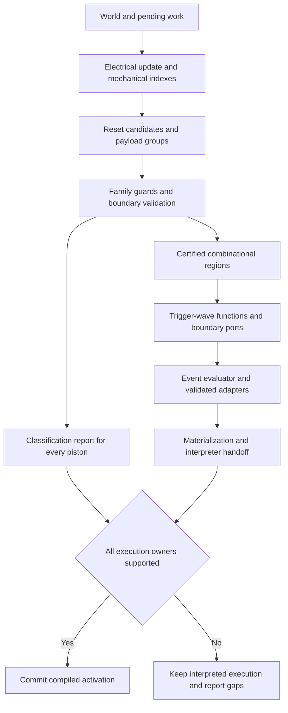

# Instant piston recognition and Redpiler implementation plan

The first useful implementation is a parser that identifies a piston together with its reset circuit, moving output, electrical ports, and update dependencies. A logical one is a transition from nonzero power to zero that triggers a computation wave from a stable extended state. Only a region with a validated reset and a defined event interface should become combinational logic. Moving blocks change electrical geometry, observers consume callbacks, and quasi-connected pistons can retain state until an update arrives.

The recommended progression is **analysis and diagnostics, validated reset families, trigger-wave extraction, combinational lowering, runtime integration, and simple-build coverage**. Initial acceptance targets are gate examples, adders, counters, decoders and long wires. PM1 and ANPU are deferred. BUD memory and ordinary pistons remain explicit classifications and execution boundaries. An unrecognized piston must prevent activation of a backend that cannot execute it.

This plan follows the intended scope in [INSTANT_REDPILLER.md](INSTANT_REDPILLER.md), the interpreter model in [REDSTONE_MODEL.md](REDSTONE_MODEL.md), and the current working-tree sources. The analysis baseline is 2026-10-06, with HEAD `4a2fb767821567ba62c5a63bb9af68fdc19d26e3` and existing local changes. Source behavior takes precedence where the model document differs from it. Proposed types, modules, flags, and fixture names below are implementation choices, not existing functionality.

## Intended scope and first deliverable

The immediate engineering target is an **instant piston parser**, with enough information to explain whether a circuit can safely be compiled. Start with the existing horizontal observer reset family and incorporate the supplied torch and dust reset examples as separately validated families. Recognize unsupported and potentially stateful circuits without executing them incorrectly.

The agreed execution contract is:

- A logical one is a falling transition from any positive strength to zero. A static zero or a change between two positive strengths is not itself a new logical-one event.
- A valid computation starts from a stable extended mechanism and is launched by depowering it, including removal of a powering wire or circuit.
- Outputs are discovered where an instant-driven net or update path reaches non-instant logic, such as a BUD switch, repeater or lamp.
- Simplification is allowed when it preserves the behavior of those external consumers under valid inputs.
- External input changes or another computation during reset have undefined circuit behavior and are outside initial conformance requirements. Internal propagation and reset events caused by the accepted trigger remain part of valid execution.
- Shared-output OR groups may drop a payload and transfer it between pistons. Correctness concerns the group response and reusable mechanism, not permanent ownership by one base.
- Compiled rendering should be infrequent and should not animate internal pistons or track every internal wire state. Original geometry and compile provenance remain available for interpreter restoration.

The exact reset-ready condition and the behavior of each gate or boundary adapter still require the supplied circuits. No fixed reset interval is implied by these decisions.

| Circuit category | Parser responsibility | Initial execution policy |
| --- | --- | --- |
| Single instant piston with a validated reset | Identify reset, ports, payload and computational transfer function | Eligible for lowering after validation |
| Coordinated instant group with a shared output | Recognize and validate the whole mechanical group | Eligible after group-specific validation |
| Piston with a possible reset but unresolved interference | Report a candidate and the unresolved dependency | Continue interpreted execution |
| Potential BUD memory | Identify separate power and update dependencies | Keep stateful; no combinational lowering |
| Ordinary piston | Record movement and affected cells | Continue interpreted execution until a separate implementation exists |
| Unsupported movement, observer or external dependency | Explain why the region cannot be closed or validated | Reject compiled activation for the affected plot |

The first deliverable is a structured report for every piston and every proposed region. It should be usable before any runtime changes. Report trigger paths, reset families, non-instant boundary consumers and recognition coverage for the small builds. Existing CPU inventories remain useful background evidence, not first-release acceptance requirements.



Initial exclusions are arbitrary payload lines, slime or honey adhesion, mobile block entities, arbitrary observer networks, unbounded mechanical interactions, and automatic inference of every possible reset construction. The existing interpreter supports straight payload lines longer than one block; the one-block restriction is a compiler scope restriction and must be checked, rather than assumed.

Support for PM1 and ANPU is deferred until simpler builds work. Counters may already require a small stateful boundary; the parser must retain that state while simplifying the combinational instant portion. Successful parsing of a combinational portion does not make an entire stateful build compilable.

## Current compiler and interpreter findings

### Compilation pipeline

[Compiler](../crates/core/src/redpiler/mod.rs) builds a graph using the following ordered passes:

```text
IdentifyNodes
InputSearch
ClampWeights
DedupLinks
ConstantFold
UnreachableOutput
ConstantCoalesce
Coalesce
PruneOrphans
ExportGraph
Direct backend compilation
```

The first three passes are mandatory. Most optimizations require `--optimize`; orphan pruning additionally requires `--io-only`. Optimized identification omits ordinary wire nodes, although input search still traverses wires in the world.

The compile graph has repeater, torch, comparator, lamp, source, wire, constant, trapdoor and note-block types. It has no piston, observer, Boolean gate or region type. Its `Default` and `Side` links carry signal attenuation; `Side` currently represents diode side inputs, not an update input or a piston reset.

[InputSearch](../crates/core/src/redpiler/passes/input_search.rs) searches a single world snapshot. It follows dust and solid conduction to sources, preserving path distances. It cannot express a path that exists only when a payload occupies a particular cell. Some source lookups index `pos_map[&pos]` directly, assuming a source found by the search was identified in the compile bounds.

[CompileNode](../crates/core/src/redpiler/compile_graph.rs) stores at most one block position. A circuit region needs multiple positions, aliases and restoration state. `CompileNode::is_removable` protects only inputs, outputs and pending ticks; physical output positions and callbacks need additional preservation rules.

The serialized graph crate contains `NodeType::Piston // TODO: Implement`. Neither the actual compile graph nor the Direct backend implements that variant. It is not an existing piston execution path.

### Direct backend limitations

The [Direct backend](../crates/core/src/redpiler/backend/direct/mod.rs) stores static links and counts of incoming strengths. Its `set_node` changes source strength, updates each destination's counts, and invokes the destination's update handler. The handler can schedule a future tick or change a leaf consumer.

This matters for new combinational gates: changing a gate's output inside `update_node` will not automatically propagate through the gate's successors. Existing wire nodes are effectively observation leaves. New immediate gates need an explicit propagation worklist or a separate region evaluator.

The backend also has these constraints:

- Outgoing updates are grouped by destination type during lowering. That order is not the interpreter's spatial callback order.
- Input strengths are counted using `u8`, and compilation limits each default and side fan-in to 255. Large region interfaces need partitioning or wider counters.
- Packed `ForwardLink` stores only destination, side bit and attenuation below 15. Conditional paths and update callbacks need separate representation.
- `tick()` takes the next scheduler bucket and drains it. It does not run the interpreter's scheduled, piston-event and movement phases.
- `flush()` writes individual block properties. It has no mechanism for a head, a moving output block, a reset observer, or a group of positions.
- `reset()` returns pending node ticks to world positions. There is no piston-event or motion-state handoff.
- Synthetic nodes with no block position cannot be restored through the existing scheduler mapping.

### Plot activation and fallback

[Plot::start_redpiler](../crates/core/src/plot/mod.rs) rejects a plot when a chunk requires the interpreter or when piston events or motions are present. [Chunk::requires_interpreter](../crates/core/src/world/storage.rs) includes piston bases, heads, moving pistons, observers and command blocks. It uses palettes as a fast conservative check, so the new analysis must inspect live positions before interpreting a palette entry as an unowned physical component.

While compilation is active, the plot runs the compiled tick path instead of `world.tick_interpreted()`. Leaving an unsupported piston in the world would freeze its interpreter behavior. A partial parser therefore cannot simply remove the current activation guard.

The plot currently copies scheduled ticks and clears the world scheduler before invoking compilation. New semantic failures or cancellation must be handled transactionally: validate and build first, then transfer ownership. Failure must retain the original scheduler, piston state and world.

### Interpreter behavior that recognition must preserve

The authoritative sources are [redstone/mod.rs](../crates/core/src/redstone/mod.rs), [piston.rs](../crates/core/src/redstone/piston.rs), [wire](../crates/core/src/redstone/wire/mod.rs), [Wire Turbo](../crates/core/src/redstone/wire/turbo.rs), and the [plot phase machine](../crates/core/src/plot/mod.rs).

| Rule | Consequence for the parser or compiled region |
| --- | --- |
| Piston power excludes the facing neighbor and includes quasi-connectivity around the cell above | Ordinary six-neighbor power search is insufficient |
| Power is sampled when the piston receives a callback | A power path and a recheck path must be recorded separately |
| Movement is requested through FIFO piston events, not ordinary scheduled movement ticks | Do not encode an instant piston as a repeater with delay zero |
| Events recheck live power, extension state and payload | A request can cancel before it executes |
| Retraction action depends on motion progress, logical tick and current phase | Short pulses and shared-output ownership need phase-aware validation |
| Moving payloads emit none of the carried block's original power | Payload movement cannot be replaced with continuous source power |
| Retraction places a moving source at the base | A reset observer sees physical base changes, not a single abstract extended bit |
| Observer `facing` points toward the watched block; its output is opposite | An observer above the piston with its red dot up has `facing=Down` |
| Observers react to qualifying direction-bearing callbacks, without storing a previous watched state | Electrical equality does not imply callback equivalence |
| Observer pulses use two game ticks to rise and two to fall | Reset timing is distinct from the computation wave |
| Motions reach exact progress 1/2, then 1, then restore on the third movement operation | Reaching progress 1 is not completion |
| Normal completion can self-update a restored component and notify neighbors | Reset or later computation can be generated at completion |
| Dust power, shape and support depend on geometry | Removing a payload can change more than one direct power edge |
| Dust propagation retains attenuation and can be directed at vertical steps | A connected dust component is not automatically one Boolean net |
| A redstone block is non-solid, emits weak power 15, and has primitive strong power zero | It is a source, not a generic conducting reset cap |
| The interpreter has no twelve-block payload limit | Compiler rejection must be explicit for multi-block payloads |

The piston extension predicate must be derived from `should_piston_extend`, including its literal query directions. Electrical paths must use `Solid`, `Transparent` and support predicates from the block implementation, not visual descriptions such as “full block.”

### Current notification rules

The updated model and current sources retain three distinctions that are material to reset recognition:

| Model passage | Notification rule |
| --- | --- |
| Section 4.2 | `skipping_update_surrounding_blocks` skips observers at both vertical-diagonal positions |
| Section 4.3 | `update_wire_neighbors` skips observers in the second-neighbor loop |
| Sections 4.6 and 15.2 | `piston::shape_changed` passes the changed-cell-to-neighbor `face` to `interaction::change`; its observer callback separately uses `face.opposite()` |

The existing observer feedback and oscillator tests cover premature pulses caused by overly broad notifications. Recognition must preserve the callers' exclusions and distinct callback directions. Sections 19.7 and 19.8 of the model now give worked examples of direct dust observation and the two-stage reset cycle. Future changes to these rules require revalidation of the reset-family certificates.

## Evidence from the existing schematics

The following inventory comes from decoding the actual Sponge schematic block data, counting live block positions, and looking for a horizontal piston with an observer immediately above it whose `facing=down`. The last column is only a geometric seed count. It does not check cap solidity, output ownership, reset viability, updates or gate behavior.

| Schematic | Dimensions X Y Z | Piston bases | Observers | Basic geometric seeds |
| --- | --- | ---: | ---: | ---: |
| [EDGECASE_PISTION.schem](../test_data/EDGECASE_PISTION.schem) | 1 4 9 | 2 | 2 | 2 |
| [MCHPRS_REDSTONE_UPDATE_EDGECASE.schem](../test_data/MCHPRS_REDSTONE_UPDATE_EDGECASE.schem) | 7 8 7 | 5 | 4 | 2 |
| [ADDER_GWIEZDNY_TEST.schem](../test_data/ADDER_GWIEZDNY_TEST.schem) | 21 7 45 | 142 | 98 | 98 |
| [MemCellUnalignedNanoTicks.schem](../test_data/MemCellUnalignedNanoTicks.schem) | 4 5 9 | 5 | 2 | 2 |
| [UpdateTesterInst.schem](../test_data/UpdateTesterInst.schem) | 7 3 9 | 2 | 3 | 0 |
| [UpdateTesterNonInst.schem](../test_data/UpdateTesterNonInst.schem) | 7 3 9 | 2 | 3 | 0 |
| [UpdateTesterExtendInst.schem](../test_data/UpdateTesterExtendInst.schem) | 7 3 7 | 2 | 3 | 0 |
| [UpdateTesterExtendNonInst.schem](../test_data/UpdateTesterExtendNonInst.schem) | 7 3 7 | 2 | 3 | 0 |
| [PM1_SORT.schem](../test_data/PM1_SORT.schem) | 235 202 182 | 66,021 | 36,999 | 17,105 |
| [Q2CK@Q2CK_Anpu1_Pong_KBTV.schem](../test_data/Q2CK@Q2CK_Anpu1_Pong_KBTV.schem) | 184 95 122 | 2,898 | 64 | 0 |

Several consequences follow directly:

1. The basic horizontal family is a useful seed, but cannot provide full CPU coverage. PM1 has 30,475 downward-facing bases. ANPU has 2,023 downward-facing bases and none of the basic seeds.
2. Names containing `Inst` do not guarantee the observer-above geometry. The UpdateTester fixtures are required for alternate update and reset constructions.
3. The adder contains 15 geometric seeds with a redstone block as the cap. That cap is not solid in this interpreter and also supplies constant quasi-connectivity power. Those positions require contextual classification, not automatic acceptance as the wool-cap reset family.
4. The adder's 98 seeds have 87 redstone-block outputs and 11 white-wool outputs at the extended output position. Both source movement and conducting-block movement matter.
5. PM1 also contains 181 ordinary pistons, two moving-piston block states, and 60 command blocks. Their presence requires classification and execution support beyond instant gates. Moving block states need entity and motion inspection; their presence alone does not establish a valid active motion.
6. A schematic selection boundary is not a plot boundary. For example, one memory-cell seed has its two-block-ahead cell outside the saved selection. Resolve it in the pasted world and report the actual context rather than inventing a payload or assuming an unavailable world cell.

### The oscillator provides timing evidence

`EDGECASE_PISTION.schem` has two initially extended South-facing sticky pistons, each with a matching head, a redstone output block two cells ahead, a downward-facing observer above the base and a wool cap. The first output powers the second stage through dust.

The [Java oscillator reference](../test_data/piston-repair/java-piston-oscillator-trace.json) removes the external redstone source after eight settling game ticks. Its recorded boundaries include:

| Tick after removal | Piston bases | Reset observers | Second input wire |
| --- | --- | --- | --- |
| 0 | Both extended | Both off | 15 |
| 1 and 2 | Both moving | Both off | 0 |
| 3 | Both retracted | Both on | 0 |
| 4 | Both extended | Both on | 0 |
| 5 | Both extended | Both off | 0 |
| 6 | Both extended | Both off | 15 |
| 7 and 8 | Both moving | Both off | 0 |

The subsequent trace repeats the cycle. This supports same-game-tick propagation of the first falling computation wave through two stages. It also establishes a multi-tick physical reset envelope and continued oscillation. It does not justify replacing every exposed wire with one constant Boolean value.

### The adder has an existing behavioral contract

[adder_tests.rs](../crates/core/src/redstone/adder_tests.rs) identifies ports from sign labels `A1`, `A2`, `B1`, `B2`, `O1`, `O2` and `TICK`. It interpolates **11 stages**, not 16. Its decoder treats a redstone block at an input as zero, a replacement conducting block as one, air at an output as one, a redstone block as zero, and a moving output as temporarily invalid.

The stored `63 + 1` input produces `64` after one interpreted game tick following removal of `TICK`. Existing low-bit arithmetic vectors cover a few additional cases. For the changed `0x555 + 0x2aa` setup, the existing Java fixture reports `1087`, although mathematical addition would produce `2047`. The tests deliberately retain this circuit limitation.

The compiler should match the existing circuit trace under the declared decoding. It should not regenerate the reference or substitute ideal arithmetic for the observed circuit. An ideal-adder acceptance test needs a separately verified fixture.

### Update and memory fixtures already have trace coverage

The in-module tests in [redstone/mod.rs](../crates/core/src/redstone/mod.rs) compare the four UpdateTester schematics and `MemCellUnalignedNanoTicks` with the existing [Java traces](../test_data/piston-repair/java-traces.json). Each reference contains 12 game-tick observations for its stated stimulus.

The UpdateTester comparisons observe three powered-wire predicates following a floor-button press. The memory comparison observes one piston extended predicate after removing the initial button. These are useful existing execution controls, but do not establish a complete reset invariant, input truth table or classification for every piston. Extend them with explicit physical port labels, payload observations, independent data and update transitions, and repeated computations; retain their original traces.

## Computational meaning of instant

### Falling transitions and computation waves

The logical-one event at an electrical port is:

```text
falling_event = previous_strength > 0 && current_strength == 0
```

The low state permits downstream instants to retract and schedule their update cycles. The event still needs the actual update path: quasi-connectivity power can change without the base being rechecked. A held low input is not a fresh external trigger merely because the evaluator runs again. Internal reset-generated cycles remain part of the accepted episode and must preserve any effects visible outside the region.

Represent an accepted external trigger with a computation-wave identity and capture the relevant prepared circuit conditions. Internal Boolean variables mean that a validated activation or falling transition occurs during that wave. They do not mean that a physical wire is continuously high or low. A zero Boolean result denotes absence of that event within the defined wave; it requires a defined wave boundary before it can be used by gates such as NOT.

The adder's block-occupancy decoder remains an observation interface for that fixture. It does not replace the event definition at an instant input.

For each port record:

- The physical input: strength, payload occupancy, update callback, or a computation trigger.
- Its event decoder, previous strength, qualifying callback and prepared inhibit or data conditions.
- Whether it is an internal activation event or an externally observed strength, callback or block-occupancy result.
- Its role: data, inhibit or lock, reset, update, or trigger.
- Its signal range, direction and permitted timing relative to computation and reset.

Use Boolean expressions within a computation wave after event decoding. Keep electrical rearming, reset scheduling and boundary output encoding separate. Do not repeatedly invert a static zero input to manufacture new triggers.

### Computation and reset are separate obligations

An instant region must satisfy two properties under its stated input protocol:

1. **Computation:** an accepted falling-edge trigger launches a wave whose boundary effects are determined by the triggering events and prepared circuit conditions according to a transfer function `F`. Propagation does not add one game tick per instant stage.
2. **Reset:** the reset subsystem returns the mechanism to a validated reusable extended state or explains its ongoing internal update cycle. Establish the condition for accepting another external computation; do not infer readiness from the extended bit alone.

Returning the base to extended is not enough. Dust might have lost support, reset might have merged an unrelated net, or a payload might be stranded outside its allowed group positions. The reusable invariant includes group-level payload availability, head consistency, relevant pending work and the permitted next falling transition. A shared payload may be dropped and recaptured by a different group member.

A circuit may be physically periodic while its computational response has no memory. In that case the reset phase is still physical state, and any boundary consumer that can see the periodic waveform must be handled explicitly.

Track a family-specific ready condition and an active episode through propagation and reset. Exclude new external input changes during reset from the promised circuit behavior. These changes must not be used as false-negative evidence against an otherwise valid family. Validation still covers internal reset events, boundary effects and repeated computations that begin from a valid ready condition.

### Observable behavior at non-instant boundaries

Discover outputs where instant-controlled nets or update paths reach non-instant consumers. Compare the behavior those consumers observe under valid trigger episodes. A correct final truth-table bit alone is insufficient if a BUD stores a different state, a repeater produces a different pulse, or a lamp changes at a different relevant time.

For supported entry state `S`, trigger and prepared conditions `u`, valid protocol `P`, and discovered boundary `Gamma`, the intended claims are:

```text
decoded_wave_result(interpreter_response(S, u, P)) = F(u)
observe_Gamma(compiled_response(S, u, P)) = observe_Gamma(interpreter_response(S, u, P))
```

For supported ready states with equivalent prepared conditions and accepted triggers, the decoded wave result must agree. External BUD or counter state remains an explicit input or execution owner. Dependence on undeclared history in an otherwise valid episode prevents combinational lowering. Intermediate physical states and rendered frames can differ when they have no effect on boundary behavior.

Two runtime paths follow from this contract:

| Boundary situation | Required treatment |
| --- | --- |
| Entire dependency region is certified computational logic | Evaluate its event transfer function in the same computation wave |
| A normal timed consumer receives an output whose physical waveform is validated | Use a validated adapter that preserves that consumer's relevant transition timing |
| An external observer, BUD, comparator or pulse-sensitive consumer sees unvalidated internal changes | Expand the region or retain interpreted execution |
| A user requests exact physical stepping | Materialize validated physical state or reset to the interpreter before stepping |

A diagnostic or experimental `--instant` option may help stage rollout. Behavior-preserving wave minimization can ultimately belong under `--optimize`; a flag does not excuse changing non-instant consumer behavior. Exact internal animation is outside the rendering target, while required boundary timing remains part of adapter validation.

## Detection algorithm

### Build three dependency views

Recognition needs more than the existing weighted graph:

1. **Electrical view:** which sources can power each receiver, with weak or strong direction, solid conduction, dust attenuation, geometry guards and quasi-connectivity.
2. **Update view:** which storage changes and component operations deliver a callback, its direction and ordering, and whether it is a shape callback, power recheck or scheduled callback.
3. **Mechanical view:** which cells each actuator can occupy, which payload and head it owns, and which other actuators can alter those cells.

The electrical view answers whether a piston wants to extend. The update view answers whether it notices that power. The mechanical view answers whether it can move and reset. Keeping these questions separate avoids classifying a BUD as a combinational gate.

### Step 1 Index the compile region

Use the optimized world iterator to record piston bases, heads, moving states, observers, dust, sources, solid conduction cells, support cells, consumers and relevant entities. Record scheduled entries and the complete piston phase, events and motions from the entry snapshot.

Build position maps and reverse dependency maps once. Store metadata from actual block predicates. Retain both raw state IDs and registry type IDs because scheduled callbacks validate type, while geometry and facing depend on state.

Read a sufficient surrounding context for each dependency. A fixed small halo is useful for initial discovery, but electrical and update dependencies can continue through wires and further actuators. Follow those dependencies to closure. If they cross compile bounds, create a supported explicit boundary port or reject the region.

A source found outside `pos_map` must produce a boundary diagnostic, not an indexed-lookup panic. The new analysis should also make source discovery robust when internal reset components are removed from ordinary graph identification.

### Step 2 Find basic reset candidates

For a horizontal sticky piston at `p` with front direction `f`, inspect this candidate:

```text
p + Up           observer, facing Down, watches the piston base
p + 2 Up         fixed conducting cap
p + f            retracted payload or matching extended head
p + 2 f          extended payload position
```

The cap must be solid under the interpreter's conduction rules. The observer's upward output can strongly power that cap, and the cap can quasi-power the piston through the `p + 2 Up` power query. Verify the actual power predicate with a symbolic observer output; do not accept a cap because it is a cube.

This is a candidate reset path:

```text
base shape change
  -> observer receives its watched-face callback
  -> observer pulse
  -> cap receives strong power
  -> quasi-connectivity makes the piston want extension
  -> an actual callback rechecks the base
  -> extension is requested and validated
```

The final recheck is mandatory. Power geometry by itself does not establish reset.

Initial candidates should have a fixed base and observer, a fixed inert solid cap, consistent facing and sticky flags, and one allowed payload. Exclude normal pistons from this first pulling family unless a separate reset and payload-return rule is validated. A piston with no payload can be a reset candidate, but is not automatically a useful data gate.

Check the cap and observer for outside power, alternate watched-cell writers, motion by other actuators, support changes and fan-out into external consumers. A static redstone-block cap can keep the piston powered independent of the observer; classify that behavior explicitly rather than treating it as the conducting-cap template.

Canonicalize horizontal geometry for matching, preserving the transformation back to world coordinates. Validate rotations independently because spatial callback and Wire Turbo order are not universally rotation-invariant. Add reflections only after their behavior is covered.

### Step 3 Resolve payload positions and ownership

If the base is retracted, inspect the first forward cell as the possible payload. If it is extended, validate the head at the first cell and inspect the second as the output. Preserve payload identity across those positions instead of treating each occupied redstone-block cell as an unrelated constant source.

The first executable family should allow stationary redstone blocks and validated inert conducting blocks with no carried entity. Record behavior at each permitted occupancy and motion state. Reject additional payloads, moving components, containers and unvalidated support changes.

For an extended mechanism, inspect the cell beyond its output too. It must permit future extension when the payload returns to the first cell; a static scan of the current head is not the future movement scan. Evaluate all allowed configurations with the same movement constraints as the interpreter.

When two pistons can touch the same payload, resolve a **group** before certifying either piston. Give the logical payload a set of permitted positions and possible owners. For shared-output OR, any group member may drop the block or recapture it, and ownership may transfer. Track group-level payload conservation and the correct boundary response; do not require the original base to own the block after reset.

Unsupported competition includes an outside piston entering an owned cell, two unvalidated payloads occupying the same destination, a forward scan that encounters another head, and a supposed stationary cap that is itself transported.

### Step 4 Find alternate reset families

After the basic family, prioritize reset paths involving torches and dust activated by retraction. Discover paths from piston or payload changes through observers, torches, wires and other actuators back to an extension recheck. These searches generate reset candidates. They do not prove that every feedback path is a reset.

Expand each candidate into a bounded mechanical group and match it against a validated family. Add torch resets, dust resets, side-mounted observer resets, resets triggered by payload movement, and coordinated piston resets as separate definitions with their own ports, ready conditions and invariants. Preserve reset scheduling separately from the immediate retraction wave.

The four UpdateTester fixtures should guide this expansion. Their names are labels for investigation, not classification rules. Likewise, a sign annotation can select a claimed family or mark a port, but cannot bypass structural and semantic guards.

### Step 5 Close the candidate region

Include every cell that can alter reset, payload feasibility, emitted strength, wire shape, support or qualifying callbacks. Reset observers and caps are owned internal components; data and update wires are boundary ports only when their external behavior has a contract.

If two candidates share an observer, payload, moved support, reset power path or update dependency, either form one validated group or reject the overlap. Assign each physical cell one execution owner. A dependency may be shared read-only, but its writers and observers still need ownership accounting.

At the closure boundary, enumerate every effect in both directions:

- Electrical input and output queries, including strength and direction.
- Incoming updates or shape changes that can change response without changing input power.
- Outgoing callbacks visible to external observers or BUDs.
- Mechanical access to owned cells and support changes.
- Scheduled work, clock or trigger transitions, and persistence requirements.

This boundary audit determines whether minimization is legal. Matching a local reset is only one part of acceptance.

### Discover outputs at non-instant consumers

Trace the directional, strength-aware influence of each accepted group's moved blocks and wires. When it reaches another certified instant, continue through that group as an internal computational dependency. When it reaches a BUD, repeater, lamp, comparator, torch, ordinary piston, note block or another non-instant component, record a boundary output at the actual receiving position and face.

Follow update effects as well as electrical paths. A wire can be an output because its changes recheck a BUD even when it contributes no new power. Record the electrical strength channel and the directed update channel separately. Several consumers on one wire remain several boundary effects, and a wire feeding both another instant and a repeater is internal for one path and an output for the other.

Use reverse search from non-instant consumers to confirm the discovered producers, attenuation and geometry guards. Keep all effects visible to the consumer even when the internal Boolean function is minimized. An externally observed output block can additionally be an explicit fixture or display port, but moving a block inside an instant network does not automatically make it a terminal output.

### Step 6 Validate reset and computation

Validate small circuit families offline in a cloned isolated world using the existing interpreter. Keep production compilation read-only; it should match family rules and validate context, rather than run large experimental simulations on the live plot.

For each family:

1. Enumerate prepared conditions and trigger combinations from declared ready extended states.
2. Apply accepted nonzero-to-zero transitions with the real notifications; include different positive starting strengths, valid short pulses and repeated ready-state computations.
3. Exercise permitted input ordering and timing relative to scheduler and piston phases. Separate undefined external changes during reset from defined internal work.
4. Record wave activations, boundary strength and callback traces, physical payload positions, observer requests, events and motions.
5. Establish a reset-ready or recurring-cycle invariant and confirm group-level payload conservation with allowed ownership transfers.
6. Check that wave results and non-instant consumer behavior are independent of unrepresented history within the valid protocol.
7. Save the transfer function, timing contract, structural guards and counterexamples.

Use a canonical state key that includes blocks, entities, relative scheduled queues, phase, relevant event order and motion progress. Normalize motion identities only while preserving equality and stale-work relationships. A repeated key under held inputs identifies a recurring cycle; an empty queue is not required for periodic resets.

Finite simulation traces are witnesses, not a proof over arbitrary circuits or unbounded timings. For a genuinely finite small template and finite declared input alphabet, exhaustive reachable-state analysis can establish the needed properties if it completes. Otherwise retain a narrower supported protocol and explicit evidence status. Reaching a resource budget means “unverified,” not “instant.”

Certificates should be versioned by family, interpreter semantics and context guards. A certificate for a basic redstone-block output does not apply automatically to a wool output, a shared payload or an externally observed reset.

### Step 7 Classify every piston

Proposed outcomes are:

```text
CertifiedInstant        validated standalone family
CertifiedInstantGroup   validated coordinated family and group membership
ResetCandidate          possible reset with an unresolved obligation
PotentialBudMemory      distinct power and update dependencies or history dependence
OrdinaryPiston          supported physical interpretation, no recognized instant contract
Unsupported             geometry or behavior outside compiler scope
```

Add explanatory facts such as `ForcedPowered`, `NoPayload`, `ExternalObserver`, `MultiplePayloads`, `SharedOwnership`, `MissingUpdatePath`, `UnverifiedReset`, `CrossesBounds`, `ActiveMotion`, `StatefulFeedback` and `AnalysisBudgetExceeded`.

`PotentialBudMemory` is intentionally conservative. Absence of a recognized reset does not prove that a piston is a BUD, and an ordinary piston should not be inferred solely from a failed instant match.

For BUD candidates, record the quasi-connectivity data path and a separate update path. Test whether the update wire directly or indirectly powers the base. A wire that merely appears to face away can still strongly power a conducting neighbor or contribute quasi-connectivity. The intended BUD contract needs power and update separation under all allowed configurations.

### Step 8 Build the computational dependency graph

Collapse validated internal reset feedback before analyzing combinational data cycles. Keep reset dependencies in region metadata. Analyze data strongly connected components separately from reset cycles.

Acyclic data regions can be evaluated topologically. Cycles involving BUD state or ordinary timed elements become explicit boundaries. Other data cycles remain unsupported unless a separate convergence and uniqueness argument is available. Starting a cyclic solver at zero is not a valid substitute for such an argument.

Emit a report with counts, positions, family names, region bounds, ports, transfer functions, preservation requirements and rejection reasons. Include candidate coverage as well as certified coverage so that increasing the seed count cannot masquerade as increasing correctness.

## Conditional connectivity and gate extraction

### Represent the moved block's effect

A piston does not inherently emit a redstone signal. Its moved block can:

- Emit weak power when it is a stationary redstone block.
- Conduct strong power from another source when it is a solid block.
- Permit or block a dust path through geometry.
- Change dust sides or support.
- Deliver callbacks that cause another piston to notice existing power.

Build a symbolic occupancy view for each group's permitted configurations. A physical cell can contain air, payload, head, base or moving state under guards. Recompute relevant weak or strong queries, dust side regulation, vertical edges and support using that view.

Do not union two nets just because a conducting payload touches both. Solid conduction samples adjacent primitive strong emitters and does not relay recursively through a line of solid blocks. A redstone block emits no primitive strong power through a cube. These distinctions must survive extraction.

### Preserve strengths until Boolean reduction is valid

For a guarded static path from source `s` to receiver `r`, retain its attenuation `d` and guard `g`:

```text
contribution(s, r) = g ? max(0, strength(s) - d) : 0
input(r) = max(all contributions)
```

This describes a static electrical contribution, not a complete movement or callback trace. A consumer's positive-input predicate can become a Boolean expression only after accounting for its strength range, permitted geometry and callback protocol.

Two nonzero strengths cannot always be merged into one Boolean variable. A strength of one dies after one dust edge; a comparator can distinguish strengths. Regeneration by a moved redstone source restarts at 15 where that source is stationary. Record threshold tests at physical ports before performing Boolean simplification.

A static shortest-path calculation is appropriate for fixed eligible dust geometry and settled strengths. It does not reproduce Wire Turbo's transient callback order. Region acceptance must establish that those transients are internal or represented by a boundary adapter.

### Extract gate functions from validated groups

For small groups enumerate prepared conditions and allowed trigger combinations, evaluate symbolic connectivity and compare with interpreter responses. Construct the wave-event truth table using each port's decoder, then identify familiar Boolean forms. Input one means an activation event in that computation wave, not positive wire power.

Use the following normalized truth tables as labels only after decoding is fixed:

| A | B | A OR B | A AND B |
| ---: | ---: | ---: | ---: |
| 0 | 0 | 0 | 0 |
| 0 | 1 | 1 | 0 |
| 1 | 0 | 1 | 0 |
| 1 | 1 | 1 | 1 |

NOT maps `0 -> 1` and `1 -> 0` within the fixture's triggered evaluation context. An absent falling event is not detectable at an arbitrary instant without a reference wave or prepared-condition protocol. The NOT example must identify the trigger and source that produce its asserted output when its data input does not activate.

The scope's OR description involves coordinated pistons and a shared output block. Validate all ownership and input-order cases at group level. The AND description involves separate output blocks coupled to one output net; a simple maximum of two source contributions implements electrical OR, so the claimed AND must be established through its physical decoding and connectivity. For NOT, identify the source of the asserted signal and the exact path opened by retraction; an air cell alone is not an emitter.

Initially use constants, threshold inputs, AND, OR and inversion, with a small explicit truth-table fallback. Preserve multi-output functions and common subexpressions. Add XOR when the extracted truth table warrants it; do not invent a special piston XOR geometry.

### Minimize within validated boundaries

Build a shared Boolean expression DAG with stable port references. Apply constant propagation, identity removal, duplicate-term elimination, complement rules and common-subexpression sharing. Keep port encoding, update ownership and physical restoration metadata outside the minimized DAG.

A single CPU-wide truth table would have exponential size. Validate and simplify local families, then compose regions. Set limits on group size, conditional configurations, expression nodes and analysis work. Use decision diagrams or more advanced Boolean optimization only if measured cases justify them.

Revalidate each simplified function against the original local truth table. Do not merge regions with different triggers, reset protocols, valid input intervals, external callbacks or observation requirements just because their Boolean formulas are equal.

## Proposed compiler architecture

### Analysis structures

Introduce a shared analysis context before `IdentifyNodes`. Suggested modules under `crates/core/src/redpiler/analysis/` are `topology`, `pistons`, `reset`, `regions`, `ports`, `validation` and `report`. Suggested data structures are:

| Structure | Essential fields |
| --- | --- |
| `PistonDescriptor` | Base position, six-direction facing, sticky and extended state, power and update dependencies |
| `PayloadDescriptor` | Group identity, carried block, permitted dropped positions and possible owners, entity policy |
| `ResetDescriptor` | Family, internal cells, qualifying callback path, ready predicate, reusable invariant and timing protocol |
| `InstantPort` | Physical position and face, previous strength, event decoder, electrical and update channels, range and role |
| `TriggerEpisode` | Wave identity, prepared conditions, accepted root events, active reset status and boundary effects |
| `InstantRegion` | Owned cells, members, ports, wave functions, reset metadata, dependencies and non-instant observations |
| `PistonClassification` | Outcome, family or group ID, acceptance obligations and diagnostics |
| `CompileArtifact` | Ordinary graph, region functions, source aliases, state and materialization metadata, analysis report |

`CompilerInput` currently carries only the world, bounds and scheduled ticks. Extend compilation context to include the piston entry state and analysis result. Passes need access to region ownership and port maps; do not hide essential metadata in temporary local maps.

### Pass ordering

The proposed pipeline is:

```text
Read entry snapshot and classify actual unsupported blocks
Build spatial, electrical, update and mechanical indexes
Find reset candidates and close groups
Validate family guards and entry state
Build guarded connectivity and computational ports
Discover non-instant consumers and directed update outputs
Construct and validate combinational regions
Identify ordinary nodes and explicit region boundary nodes
Search ordinary links using the region-aware position map
Lower region expression DAGs
Apply audited ordinary and Boolean optimizations
Validate all ownership, port and restoration references
Export and lower the complete compile artifact
Commit compiled activation
```

Recognition and correctness checks run with optimization disabled too. `--optimize` controls minimization and performance passes, not whether pistons are classified correctly.

### Ordinary input search integration

Internal reset observers, caps and mobile source positions must not enter ordinary identification as independent immutable constants. Redirect boundary electrical queries to region output ports. Search through outside dust normally, preserving attenuation and direction.

Resolve each physical position to one of an ordinary source, region port, owned internal cell or unsupported external dependency. Synthetic gates have `block=None`; they are not passed to the current routines that unconditionally unwrap a node block.

Keep mapping from all physical aliases to the logical region and relevant port. Inspection of a base, output cell or reset observer should explain the same region and its physical role.

### Existing optimization passes

Audit each pass explicitly:

| Pass | Required change |
| --- | --- |
| `IdentifyNodes` | Respect owned cells and add boundary ports; avoid mobile constants |
| `InputSearch` | Resolve region ports and out-of-bounds sources without unchecked assumptions |
| `ClampWeights` | Clamp electrical attenuation only; event and Boolean dependencies are separate |
| `DedupLinks` | Include geometry guards and port identity; paths with different guards cannot be collapsed by distance alone |
| `ConstantFold` | Fold pure logical functions only when initial state and pending physical work permit it |
| `UnreachableOutput` | Apply only to strength-valued electrical edges |
| `ConstantCoalesce` | Preserve ownership of movable sources, observation aliases and restoration metadata |
| `Coalesce` | Include protocol and interface semantics, not merely node type and current state |
| `PruneOrphans` | Preserve declared output payloads, update effects, diagnostics or restoration roots as required by the selected contract |
| `ExportGraph` | Export new expression and region semantics with a versioned format |

Run final link deduplication after transformations that can introduce duplicates. Validate every stable-graph index after removal or coalescing; source aliases and region IDs should not depend on a graph slot remaining allocated.

## Runtime execution and interpreter handoff

### Immediate computation

Use a separate compact region evaluator for the first implementation. It avoids expanding the fixed-size ordinary node with large payload or reset state. Track previous strength at trigger ports. A qualifying nonzero-to-zero transition with a delivered update creates a region activation request when the family is ready. Changes between positive strengths or a repeated read of zero update electrical bookkeeping without becoming fresh trigger events.

Dispatch the computation at the phase corresponding to the original validated piston activation. A source change outside a tick can request retraction that executes in the next piston-event phase; publishing an instant output during the source callback would move it too early. Recheck the required power and entry conditions before accepting the request so legitimate event cancellation is retained.

Evaluate the wave's Boolean DAG in topological order, then publish boundary effects through validated adapters. Maintain distinct wave, reset and rearming state. Duplicate wakeups may be coalesced only when the family certificate establishes equivalence; externally visible reset-generated pulses must not be discarded as duplicates of the first wave.

The propagation worklist should run to completion before leaving the logical computation operation. Its order must be deterministic. No artificial scheduler delay should accumulate with instant-chain depth.

Batch activation values within a certified region only when this preserves the discovered consumers' observations. Preserve sequential external input operations unless the validated fixture explicitly groups them into one wave. AND and NOT evaluation must use the fixture's declared prepared conditions and completion rule; do not invent a timeout for an event that has not arrived. A boundary consumer that observes intermediate transitions requires a finer adapter or interpreted execution.

A falling trigger can result from removing a powering wire or circuit, a lever or ordinary scheduled output depowering, or a validated source operation. A pure update to already-low quasi-connected power is a separate callback effect, not automatically a new electrical falling event. The adder's `TICK` removal is a physical block-destruction input. Fixtures need a trigger adapter or test interface with the same semantics. The current player edit path resets Redpiler; nominated trigger removals need an explicit route that preserves their notifications and checks whether the edit changes topology used by the certificate. Other structural edits still require reset or reanalysis.

### Reset timing and ordinary consumers

Keep computation semantics and physical reset semantics distinct. A pure Boolean region need not simulate every reset callback internally if none are externally observable and a valid handoff is available. A physical macro or exposed pulse interface must retain its reset state and waveform.

Validate output adapters separately for lamps, repeaters, comparators and note blocks. Lamps turn on immediately but request delayed turn-off; repeaters retain pending short-pulse activations; comparators consume strengths; note blocks emit on rising transitions. A constant logical output does not by itself reproduce these consumers' responses to a periodic physical wire.

Do not introduce one generic observer node whose input is Boolean signal change. An observer input is a directed callback. Internal observers can be absorbed into certified resets; an exposed observer needs a callback-capable implementation or blocks activation.

### Scheduler and phase handling

Synthetic immediate gates should use the propagation worklist rather than delay-zero ordinary scheduled ticks. The Direct backend takes the current bucket out of the scheduler and later overwrites it; scheduling into that bucket while it is detached is not an adequate immediate-execution mechanism.

If physical macro execution is added, integrate scheduled callbacks, FIFO piston events and identity-checked movement using one authoritative phase order. Include operations generated during movement in the next appropriate phase, rather than jumping backward. Preserve expected block type on scheduled requests and motion identity on movement work.

A future hybrid mode must use a single scheduler and phase owner for compiled and interpreted regions. Running `redpiler.tick()` and then `tick_interpreted()` sequentially would advance different models and cannot preserve interleaving. Hybrid execution is a separate milestone, not an assumed fallback feature.

### Activation policy

For initial activation require a supported entry point, normally `BetweenTicks`, with no unaccounted events or motions. Reject unsupported mid-motion entry. Absorbed observer requests or other reset work need explicit mapping to a supported macro state; they must not disappear merely because the reset observer has no graph node.

Plots with a certified instant portion and an unimplemented BUD, ordinary piston, observer or command block remain interpreted. Report which components prevent activation. This is still useful parser output and a measurable precursor to hybrid execution.

Replace the blanket plot guard only after the complete compile report establishes ownership and support. Treat command blocks separately; certifying pistons does not authorize ignoring PM1's command outputs.

Compilation should return a result containing the artifact or diagnostics. On success, transfer queues and state, then set the compiler active. On cancellation, unsupported input or backend failure, keep interpreted ownership and restore scoreboard state without losing requests.

### Materialization and reset

Before enabling compiled regions, implement their route back to the interpreter. Preserve base, head and payload cells, observers and entities, supported reset phase, pending work and source aliases. Multi-position restoration cannot be done by extending `block_powered_mut` alone.

For exact physical macros, export their actual state and queue ordering. For purely computational regions, a canonical physical state is acceptable only if its resumed behavior is equivalent for the supported interface. Reconstructing an arbitrary extended piston can create a new pulse, lose a payload or alter BUD memory. If no valid materialization exists, limit that region to offline analysis until one is established.

Prefer infrequent rendering of useful external results. Do not animate internal pistons or flush internal dust power on every transition. Keep the original geometry, group templates and a mapping from physical boundaries to compiled ports as compile provenance. Boolean minimization may remove the correspondence between an internal wire and a runtime node; exact per-wire display or state tracking is not required. Use retained geometry and a validated reconstruction rule when returning to the interpreter. The choice between a ready-state handoff and phase-preserving handoff remains unresolved until its effect on non-instant consumers is established.

`--io-only` changes rendering and flush policy, but all necessary interpreter state must still be restored on reset. Register non-instant receiving ports independently of their display type. Explicit fixture output cells, such as the adder's block-occupancy outputs, can additionally remain observable for testing and infrequent display without making every internal output block a rendering obligation.

Use storage writes and explicit state transfer in a controlled order. Do not issue generic placement notifications during materialization unless they are part of the validated handoff. Clear derived caches afterward without cancelling authoritative work. Audit the existing `--update` reset option because its whole-region callbacks may intentionally trigger a new computation.

World edits, paste, destruction, schematic export, saves, history operations and fine stepping must either operate on a materialized world or invoke a supported compiled-state adapter. Structural edits invalidate dependencies and require reset or reanalysis. Save and load must preserve the selected contract, rather than save stale hidden payload cells.

## Risks and required responses

| Issue | Failure mode | Required response |
| --- | --- | --- |
| Wrong observer facing | A downward watch is mistaken for an upward watch | Use `facing=Down` for red-dot-up reset and test all horizontal piston rotations |
| Reset power without a callback | Piston remains unrechecked despite power | Record and validate the update path independently |
| False reset cap | Permanent source or nonconductor is accepted as a cap | Check actual solidity, emission and outside dependencies |
| Shared-output OR | Payload is assigned to two independent nodes | Model ownership and allowed drops as one group |
| Fast retraction | Payload is dropped when the formula assumes a pull | Cover early-retraction action and every permitted phase |
| Mobile redstone source | Original and moved cells both behave as constants | Identify one payload with guarded emitted power |
| Conducting output | Nets are merged through impossible cube-to-cube conduction | Derive primitive strong and general power queries separately |
| Dust support or side changes | A valid-looking gate deletes dust or changes a remote path | Include affected support and shape cells in region closure |
| Strength collapse | Weak signals are treated as full-strength logic | Preserve attenuation and thresholds through port decoding |
| Observer or BUD outside the region | Minimized logic suppresses a qualifying update | Expand region, add a validated callback adapter or reject |
| Temporal boundary consumer | Correct final Boolean output gives wrong repeater or note pulse | Validate the physical transition contract at that consumer |
| Reset cycle mistaken for data feedback | All useful instants are rejected, or memory is erased | Keep reset and computational dependency graphs separate |
| Trigger protocol omitted | Stored input changes are incorrectly treated as continuous computation | Record trigger and legal input intervals in the interface |
| Falling edge treated as a level | Held zero repeatedly manufactures new external computations | Track previous strength and distinguish root triggers from internal reset cycles |
| Output published before piston events | Correct result arrives earlier than the original circuit | Launch the wave at the corresponding validated phase |
| Reset interruption treated as a required case | A valid family is rejected for behavior outside the agreed protocol | Exclude new external inputs during reset from conformance |
| Same-tick competing inputs | Output depends on event or input order | Test both orders and reject uncontracted dependence |
| Unsupported ordinary components | Interpreter behavior freezes under compiled activation | Keep activation blocked until every execution owner is supported |
| Compile cancellation | Scheduler was cleared but no backend owns the work | Commit state transfer only after successful artifact construction |
| Graph export changes | Old readers misinterpret new enum or metadata | Version the new format and preserve or reject legacy export explicitly |
| Large group state space | Compile time grows exponentially | Bound analysis, cache verified family rules, report uncovered groups |
| Large fan-in | Strength counters overflow or panic | Partition boundaries or use a suitable wider representation |
| Restoration to a guessed state | Editing or saving changes the circuit's future | Require validated materialization before runtime activation |
| Rotation changes callback order | Geometrically identical fixtures differ transiently | Validate rotations; preserve actual world orientation |
| CPU baseline misunderstood | Ideal arithmetic replaces the circuit's actual behavior | Retain behavioral traces and separately test arithmetic intent |

## Examples and schematics needed next

### How to package a useful example

Each new fixture should contain the smallest complete circuit with its supports and reset, plus enough surrounding air to expose all movement positions. Include a companion manifest with:

- Selection-local input, output, update, reset and trigger coordinates and faces.
- The expected classification of each piston and any shared payload group.
- The physical zero and one encoding and when an output is valid.
- Which non-instant consumers receive the output, including a BUD update path if present.
- Initial states and whether import is strict, placement-notified or settled.
- Ordered input operations with game tick, phase and stepping position where relevant.
- The condition showing that reset is complete and another falling trigger is permitted; include allowed drops and ownership transfers.
- Expected truth table and physical trace, with schematic hash and reference provenance.

Signs are useful for visual port labels, but cannot encode all timing and initial-state information. Use manifests as test inputs. Keep computation and reset observations separate.

### Priority examples

The names below are proposed new fixture names.

| Priority | Example | What it must establish |
| --- | --- | --- |
| P0 | `instant_single_redstone_output` | One sticky horizontal piston, wool or stone cap, redstone-block output; falling trigger from a ready extended state, reset-ready condition and repeated valid use |
| P0 | `instant_single_solid_output` | Same reset with a wool or stone payload; the exact source and conducting path opened or removed |
| P0 | `instant_or_shared_payload` | Two pistons and one output block; all four wave-event combinations, declared input order, allowed drops and recapture by either member |
| P0 | `instant_and_shared_net` | Two separate outputs coupled to one net; all four wave-event combinations, prepared conditions and the physical reason the result is AND |
| P0 | `instant_not_merge` | A retraction-opened path with the source and both nets labeled; reference trigger, output event and reset isolation |
| P0 | `instant_reset_counterexamples` | Wrong observer facing, absent or glass cap, constant redstone cap, blocked payload, outside reset input and unsupported shared ownership |
| P0 | `bud_update_without_power` | Data held at quasi-connectivity input while an independent update toggles stored state; update wire must not power the base directly or indirectly |
| P0 | `ordinary_piston_control` | Same payload and power geometry without reset, plus short-pulse drop behavior; negative control for instant recognition |
| P1 | `instant_chain_depth` | One, two, four and longer stages; falling computation wave must not gain a game tick per stage |
| P1 | `instant_reconvergent` | Fan-out followed by AND or OR; establish permitted boundary glitches and evaluation epoch |
| P0 | `instant_torch_reset` | Minimal torch-powered reset activated by piston retraction, including the ready condition and any boundary pulses |
| P0 | `instant_dust_reset` | Minimal dust-powered reset activated by piston retraction, with support, update path and ready condition |
| P1 | `instant_alternate_resets` | Supplied minimal families and labeled UpdateTester examples; cover side observers and coordinated piston resets |
| P1 | `instant_shared_reset` | Multiple actuators sharing one observer or update path; distinguish one group from invalid overlap |
| P1 | `instant_strength_limits` | Exact wire distances around loss of a positive signal, weak analog sources and mixed source strengths |
| P1 | `instant_external_consumers` | Gate output feeding lamp, repeater, comparator, observer, note block and BUD; determine which boundary adapters are legal |
| P1 | `instant_repeat_after_reset` | Several falling-edge computations that each start ready; held-low interval, internal cycles and confirmed rearming |
| Optional | `instant_reset_interruption` | Diagnose new external input during reset as outside the supported protocol; matching a circuit result is not an acceptance requirement |
| P1 | `instant_downward_support` | Small downward piston example with dust above it, moving-base support exception and complete reset arrangement |
| P2 | `instant_vertical_variants` | Upward and downward families with fully specified reset; horizontal geometry must not simply be rotated vertically |
| P2 | `instant_materialization` | Reset or save at supported entry, computation and reset states; resume and compare future outputs |
| P2 | `instant_cross_bounds` | Selection, chunk and plot edge cases; supported explicit boundary versus rejected incomplete region |

Generate rotations and relevant single-block mutations from validated minimal examples. For a claimed gate, include both a valid fixture and the nearest invalid construction; false positives are more harmful than limited initial coverage.

### Use the current fixtures in this order

1. **EDGECASE_PISTION:** begin with the existing two-stage mechanism and Java waveform. Extract a one-stage crop with explicitly labeled ports. The full fixture should retain its current periodic behavior.
2. **New OR, AND and NOT examples:** label the prepared data conditions, falling trigger and non-instant output consumer. Validate event truth tables and shared payload behavior before generalizing gates from the adder.
3. **New torch and dust reset examples:** prioritize the common reset families, including a small downward-facing variant if convenient.
4. **MCHPRS_REDSTONE_UPDATE_EDGECASE:** use as a phase and group-payload stress test. Existing tests show a redstone block dropped at tick 5, a pull in progress at tick 9, and restoration at tick 11 in the selected case. Allowed drops must not be mistaken for permanent payload loss.
5. **The four UpdateTester schematics and a labeled BUD example:** identify each piston's role and independent update path. Use the existing traces as execution controls and the supplied labels as classification expectations.
6. **MemCellUnalignedNanoTicks:** isolate the actual memory mechanism from its two reset candidates. Hold data constant while changing only updates, then vary data without updates. Preserve stored state and update alignment at the instant boundary.
7. **ADDER_GWIEZDNY_TEST:** retain its sign-defined interface, current occupancy decoder, stored `63 + 1` example and existing traces. Add repeated ready-state computations; the changed-input discrepancy remains under investigation and does not block parser analysis.
8. **Small decoders, long wires and counters:** use prepared input cases and falling-trigger episodes. Validate attenuation, fan-out, non-instant boundaries and retained counter state. Add the minimum stateful execution support required by the counter example.

PM1 and ANPU examples are later work. Small crops may illustrate a family, but full CPU parsing, execution, command outputs and acceptance are deferred.

For new arithmetic evidence, add an independently verified adder with width, bit order, carry and overflow specified. Include carry chains and repeated computation. The present adder is valuable behavioral evidence but cannot serve as a complete ideal-arithmetic oracle.

## Validation plan

### Parser acceptance tests

Use fixture manifests to assert classification, family, group ownership, ports, guards and rejection reasons. Test minimal mutations: reverse the observer, replace the cap, insert a second payload, remove a support, add an outside observer, move an update wire into a power path, or put a constant source on the reset cap.

Test classification with optimization on and off. Reset candidates must not become certified merely because wires disappear from the optimized graph. Check physical aliases and diagnostics after graph transformations.

### Behavior and differential tests

For each certified family run interpreted and compiled responses from the same supported ready snapshot and ordered falling-trigger inputs. Compare non-instant consumers' states, relevant transition timing and update effects throughout the episode. Include repeated computations after reset, permitted input orders and all supported rotations. Newly applied external inputs during reset are undefined and are not required to match a reference circuit result.

Explicitly test that positive-to-positive changes and a repeated observation of zero do not become fresh root events. Preserve actual internal reset-generated cycles and their boundary effects. Include strength-one-to-zero and strength-fifteen-to-zero triggers where permitted by the physical paths.

For exact macros and boundary adapters, additionally compare relevant strength waveforms, directed callbacks, scheduled entry order, piston actions, payload identity and motion progress. The ordinary game, nano and pico stepping paths already provide useful interpreter controls, but a computational backend that removes physical operations cannot claim the same pico trace without a defined materialization route.

Use exhaustive Boolean combinations for small gates. For larger regions use structural composition plus seeded random input sequences and minimized counterexamples. A random test pass does not expand the supported protocol beyond its family guards.

Existing regression groups to retain are:

- Piston lifecycle, observer feedback, short pulses, support and payload tests in [redstone/piston/tests.rs](../crates/core/src/redstone/piston/tests.rs).
- UpdateTester, memory-cell and output-pulse Java trace comparisons in [redstone/mod.rs](../crates/core/src/redstone/mod.rs).
- Pending short-pulse compiler handoff and ordinary redstone behavior in [master_tests.rs](../crates/core/src/redstone/master_tests.rs).
- Adder behavioral tests in [adder_tests.rs](../crates/core/src/redstone/adder_tests.rs).
- Persistence and partial-step tests in [plot/piston_tests.rs](../crates/core/src/plot/piston_tests.rs).
- Frozen CPU fixtures described in [cpu-references/README.md](../test_data/cpu-references/README.md).

The frozen CPU checkpoints include physical states, scheduled work and complete piston state. A computational replacement intentionally removes some internal operations, so retain those checkpoints unchanged for interpreter regression and add an explicit compiled observation projection. Preserve original ordered chat and screen traces for integration where the selected contract promises them. Define any normalization narrowly; never replace expectations by capturing the changed backend.

The CPU fixtures are interpreter regression references, not an independent CPU instruction-set specification. PM1's command blocks and ANPU's stateful circuitry must be accounted for before those traces can be used as full compiled acceptance evidence.

### Handoff and failure tests

Exercise compilation success, semantic rejection, cancellation and reset with queued ordinary work. Assert that a failed compile leaves the world, scheduler and piston state equivalent to the precompile snapshot.

Test reset, structural edit, save and reload, schematic export, inspection and `--io-only` materialization from every supported macro state. Compare resumed future computation, payload conservation and stateful neighbors. Ensure reset does not create an extra observer pulse or turn a BUD into a globally rechecked piston.

### Performance measurements

Measure analysis time and memory separately from runtime. Track total pistons, geometric candidates, certified families, rejected reasons, owned cells, region count, Boolean nodes before and after simplification, boundary fan-in, propagation depth and dirty-region evaluations.

Cache topology and validated local family results within one compile. Bound repeated wire searches and negative matches. Use compact IDs and side tables for region state. Preserve a clear invalidation rule when a structural edit changes a dependency.

Benchmark gates, chains, adders, decoders, long wires and supported counters. Measure active trigger waves and reset windows separately from long idle tails. Report correctness results alongside timings and include compilation overhead. CPU benchmarks are deferred until small-build acceptance is complete.

## Implementation milestones

| Stage | Work | Acceptance condition |
| --- | --- | --- |
| 1 | Freeze relevant model semantics, define port decoding and protocols, package minimal examples | Baseline semantics and fixture expectations are explicit |
| 2 | Implement read-only analysis context, live-position inventory and report | Every piston has a classification or unresolved reason; unsupported activation remains blocked |
| 3 | Implement observer reset seed and supplied torch or dust families with group payload tracking | Positive and mutated negative fixtures distinguish candidates reliably |
| 4 | Validate falling-edge waves, reset-ready conditions and non-instant boundary discovery | Event semantics, valid episodes and boundary effects are established for each certified family |
| 5 | Add shared-output groups, conducting output and guarded connectivity | OR, AND and NOT claims match decoded truth tables and repeated physical behavior |
| 6 | Build region DAGs, aliases and audited optimization integration | Optimized and unoptimized artifacts preserve the same declared function and observations |
| 7 | Add region evaluator, triggers, validated adapters and materialization | Repeated computations, failure recovery and interpreter reset preserve the supported contract |
| 8 | Replace activation guard using complete support report | No unsupported component is left without execution ownership; compilation is transactional |
| 9 | Expand supplied reset families and validate adders, decoders and long wires | Small-build trigger responses, attenuation and boundary behavior match |
| 10 | Add the BUD or ordinary stateful boundary required by a minimal counter, using a unified phase owner where needed | Stored state, independent update effects and valid computation sequencing are retained |
| 11 | Integrate simple counters and repeated small-build workloads with infrequent rendering | Correctness and handoff pass across repeated ready-state computations; performance is measured |

Stages 2 through 6 can proceed while runtime activation remains disabled for piston plots. Stage 7 must be complete before a replacement is exposed to normal editing or saving. PM1 and ANPU integration is a later project and is outside these initial milestones.

## Remaining evidence and decisions

The falling-edge definition, ready extended entry, trigger-driven protocol, undefined external reset interruption, shared OR ownership transfers, small-build targets and sparse rendering preference are established. The next circuit examples should resolve:

1. Minimal OR, AND and NOT geometry, prepared conditions, trigger combinations and non-instant output consumers. For NOT, identify its reference trigger and asserted-output source.
2. Complete torch and dust reset paths and the observable condition that permits another falling trigger. Include a minimal downward-facing family if available.
3. Explicit roles and independent update wires for a BUD example and the ambiguous UpdateTester or memory-cell circuits.
4. The boundary waveforms and callback sequences needed to preserve lamp, repeater and BUD behavior after simplification.
5. A minimal decoder, long-wire example and counter after basic gates work, including any stateful components the counter needs.

Interpreter handoff still needs a decision based on demonstrated behavior: whether restoring a validated ready configuration is sufficient or whether externally significant reset phase must be retained. Sparse rendering does not decide this simulation question. The adder changed-input discrepancy remains under investigation; retain its current reference until the cause is established.

The first implementation task remains the read-only classifier and boundary report using the existing oscillator and adder, followed by the supplied gate, torch/dust reset and BUD examples. Production execution can wait for those certificates while indexing and candidate diagnostics proceed independently.
