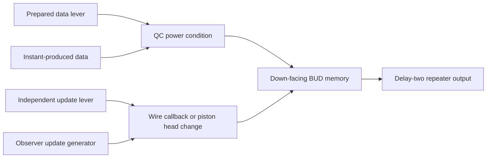

# Instant-piston schematic I/O revision

This catalog characterizes the **separate lever-input and repeater-output revision** in `test_data/instant-pistons-io`. It includes four standalone BUD constructions. Historical binaries, port coordinates and traces remain in the [older catalog](INSTANT_PISTON_SCHEMATICS.md). Compiler abstractions belong in the [compact mathematical model](INSTANT_PISTON_REDPILER_MODEL.md); this document records the physical evidence.

Coverage: 22 exact binaries, 140 declared fresh/ordered cases, 203 MCHPRS case/rotation captures and 106 primary independent Java captures, plus two [origin-aligned XOR diagnostic versions](../test_data/instant-pistons-io/diagnostics/xor-origin-comparisons.json). [Validation and commands](INSTANT_PISTON_IO_VALIDATION.md) distinguish agreement, mismatches and incomplete controls. [Download hashes](../test_data/instant-pistons-io/download-manifest.json), [trace index](../test_data/instant-pistons-io/trace-index.json) and every per-fixture manifest preserve provenance.

## Coordinate and setup contract

Coordinates are selection-local `(x,y,z)` from the saved minimum corner. MCHPRS capture minimum is `(40,30,40)`. The actual loader offset is recorded separately; paste anchor = minimum + loader offset, so `paste_clipboard` places a local cell at anchor − offset + local. The [loader](../crates/core/src/plot/worldedit/schematic.rs) and [actual paste implementation](../crates/core/src/plot/worldedit/mod.rs) are the coordinate authority; there is no separate clipboard.rs here. Rotation transforms geometry, state facings, lever attachments and observed ports together.

All originals use strict saved-state paste with saved entities and empty tick/event/motion queues. A 24-tick idle test preserves every watched cell and empty work queues. This proves representability and idle stability, not normal-placement reachability. Exact palette states, decoded volume, block entities, offsets and original/normalized front/back/legacy sign fields are in each inspection artifact. Input supports and consumer connections were reviewed separately from sign positions; the label mapping includes rejected support candidates.

Lever changes use the real interaction notification semantics: write the changed lever, notify around the lever, then notify around its attachment block. An unchanged requested lever value performs no interaction. For prepared arithmetic/BUD data, MCHPRS `wait_ready` has a 32-tick bound and requires empty scheduled/event/motion work plus two equal completed boundaries. Java uses eight observed preparation ticks; command-only capture cannot certify its internal queue emptiness. Java lever changes are actual vanilla player UseItemOn interactions, not replacement by `setblock`.

Ticks below are completed game-tick boundaries relative to the final action, after any preparation. Traces also contain the imported state, every after-action state, operations within ScheduledTicks/PistonEvents/MovingEntities, action index, nested callbacks, ordered requests and active motions. Pico observations alone do not establish nested callback order; event/callback instrumentation is test-scoped and disabled in server execution. Game/nano/pico agree at aligned completed boundaries for all declared MCHPRS episodes.

Logical one at a triggering connection is a newly positive-to-zero event. Prepared lever polarity and stored BUD bits are separately decoded. Held-zero internal resets remain part of the original episode. No external input changes during instant reset, unsynchronized extra-delay construction or unrestricted next calculation is certified. A bounded recurring response ends because of its capture limit, not because it settled.

## Overview

| Schematic | Purpose | MCHPRS / Java episodes | Status |
| --- | --- | --- | --- |
| [ADDER_11BITS.schem](#adder-11bits) | Corrected eleven-bit adder with lever banks and repeater bank | 41 / 7 | declared projections agree |
| [ADDER_1BIT.schem](#adder-1bit) | Prepared one-bit full adder with sum and carry consumers | 9 / 9 | declared projections agree |
| [AND_1.schem](#and-1) | Conjunction by two independent electrical contributors | 6 / 6 | declared projections agree |
| [AND_2.schem](#and-2) | Conjunction by combined piston power | 6 / 6 | declared projections agree |
| [AND_3.schem](#and-3) | BUD-like conjunction with sampled history | 6 / 6 | declared projections agree |
| [BUD_InstantMemoryCellObserverUpdate.schem](#bud-instantmemorycellobserverupdate) | Instant-produced data sampled by a delayed observer update | 4 / 4 | declared projections agree |
| [BUD_InstantPistonUpdate.schem](#bud-instantpistonupdate) | BUD storage with a recurring piston/observer update generator; missing saved control | 4 / 4 | derived control only; original missing lever |
| [BUD_NonInstantInputs.schem](#bud-noninstantinputs) | BUD storage with separate ordinary data and update wires | 24 / 6 | declared projections agree |
| [BUD_PistonUpdate.schem](#bud-pistonupdate) | BUD storage updated by an ordinary piston head | 24 / 6 | declared projections agree |
| [COUNTER_BASIC.schem](#counter-basic) | Released free-running counter with BUD memory and output bank | 2 / 2 | declared projections agree |
| [INSTANT_BLOCKED.schem](#instant-blocked) | Constant-power inhibition diagnostic | 3 / 3 | declared projections agree |
| [INSTANT_CHAIN.schem](#instant-chain) | Two-stage instant propagation | 3 / 3 | declared projections agree |
| [INSTANT_DOWN.schem](#instant-down) | Observer-reset downward instant | 3 / 3 | declared projections agree |
| [INSTANT_DOWN_TORCH_RESET.schem](#instant-down-torch-reset) | Torch-reset downward instant | 4 / 4 | declared projections agree |
| [INSTANT_OBSERVER.schem](#instant-observer) | Observer-reset horizontal instant | 12 / 3 | declared projections agree |
| [INSTANT_RESET_REDSTONE.schem](#instant-reset-redstone) | Dust-reset horizontal instant, revised reset geometry | 3 / 3 | declared projections agree |
| [INSTANT_RESET_REDSTONE_2.schem](#instant-reset-redstone-2) | Lateral dust-reset horizontal instant | 3 / 3 | declared projections agree |
| [INSTANT_TORCH.schem](#instant-torch) | Torch-reset horizontal instant | 4 / 4 | declared projections agree |
| [NOT_1.schem](#not-1) | Synchronized inhibition with an explicit output stage | 24 / 6 | declared projections agree |
| [OR_1.schem](#or-1) | Legal shared-payload OR with an output stage | 6 / 6 | declared projections agree |
| [OR_Interpreter_illigal.schem](#or-interpreter-illigal) | Author-excluded payload-dependent reset counterexample | 6 / 6 | author-excluded; imported-state diagnostics |
| [XOR_Simple.schem](#xor-simple) | First-wave XOR with an unresolved reset-order discrepancy | 6 / 6 | captured discrepancy |

## Shared observation windows

| Family | First physical response | First ordinary-consumer result | Scope |
| --- | --- | --- | --- |
| Single instants and chain | Input torch off/retraction at tick2, moving2/3, stationary retracted4 | Delay-two repeater off6; first restoration11 | Raw wire low2..6; internal cycles retained |
| Gates with active output stage | Consumer-input wire falls2 | Delay-one repeater off4..8; lamp dark8 then lit9 | First-wave table, including zero-event snapshots; later reset separately |
| Adders | Raw sum valid1..3, moving reset4/5 | Sum bank3..7; one-bit carry5..9 | Common sum/carry window5..7 |
| Ordinary-wire / piston-update BUDs | Memory moving2/3, stationary4 | Sample-one repeater off6 | Stored bit holds until qualifying update; zero-resample consumer on8 |
| Observer-update BUD | QC data falls1; update samples3; memory stationary5 | Repeater off7 | Data-before-update dependency; repeating generator |
| Counter | Stored count n at6n | Count n during [6n+5,6n+8] | Associate each output with its wave; reset/partial values outside window |

## adder-11bits

**ADDER_11BITS.schem: Corrected eleven-bit adder with lever banks and repeater bank.** instant with ordinary-node input and consumer boundary.

Binary SHA-256 `335ab94a3ba7f89cd0a497a2ac606372ff2743cfcd549f4863ead310af4138b9`; dimensions `(23,7,46)`; NBT/Sponge version `2`, data version `4325`, decoded `7406` cells. Loader offset `(0,7,45)`, paste anchor `(40,37,85)`, absolute position = `(40,30,40)` + local for saved orientation.

[Manifest](../test_data/instant-pistons-io/fixtures/adder_11bits.json) · [Exact inspection/sign entities](../test_data/instant-pistons-io/inspection/adder_11bits.json) · [Measured prepared-1023-1-0 operations](../test_data/instant-pistons-io/traces/mchprs-adder_11bits-prepared-1023-1-0-r0.json.gz).

### Port and initial-state map

| Role | Local position(s) | Saved state |
| --- | --- | --- |
| A | `(4,5,43), (4,5,39), (4,5,35), (4,5,31), (4,5,27), (4,5,23), (4,5,19), (4,5,15), (4,5,11), (4,5,7), (4,5,3)` | `lever[face=floor,facing=east,powered=false]`; `lever[face=floor,facing=east,powered=true]` |
| B | `(4,5,41), (4,5,37), (4,5,33), (4,5,29), (4,5,25), (4,5,21), (4,5,17), (4,5,13), (4,5,9), (4,5,5), (4,5,1)` | `lever[face=floor,facing=east,powered=false]`; `lever[face=floor,facing=east,powered=true]` |
| trigger | `(2,5,45)` | `lever[face=floor,facing=north,powered=true]` |
| sum_payload | `(20,2,41), (20,2,37), (20,2,33), (20,2,29), (20,2,25), (20,2,21), (20,2,17), (20,2,13), (20,2,9), (20,2,5), (20,2,1)` | `redstone_block` |
| sum_repeater | `(21,2,41), (21,2,37), (21,2,33), (21,2,29), (21,2,25), (21,2,21), (21,2,17), (21,2,13), (21,2,9), (21,2,5), (21,2,1)` | `repeater[delay=1,facing=west,locked=false,powered=true]` |

| Sign position and readable text | Referenced port/mechanism | Mapping evidence |
| --- | --- | --- |
| `(3,6,37)` B2 | B `(4,5,37)` | resolved for declared episode; support candidate separately retained in manifest |
| `(3,6,39)` A2 | A `(4,5,39)` | resolved for declared episode; support candidate separately retained in manifest |
| `(3,6,41)` B1 | B `(4,5,41)` | resolved for declared episode; support candidate separately retained in manifest |
| `(3,6,43)` A1 | A `(4,5,43)` | resolved for declared episode; support candidate separately retained in manifest |
| `(22,2,1)` O1 | sum_repeater `(21,2,1)` | resolved for declared episode; support candidate separately retained in manifest |
| `(22,2,5)` O1 | sum_repeater `(21,2,5)` | resolved for declared episode; support candidate separately retained in manifest |
| `(22,2,9)` O1 | sum_repeater `(21,2,9)` | resolved for declared episode; support candidate separately retained in manifest |
| `(22,2,13)` O1 | sum_repeater `(21,2,13)` | resolved for declared episode; support candidate separately retained in manifest |
| `(22,2,17)` O1 | sum_repeater `(21,2,17)` | resolved for declared episode; support candidate separately retained in manifest |
| `(22,2,21)` O1 | sum_repeater `(21,2,21)` | resolved for declared episode; support candidate separately retained in manifest |
| `(22,2,25)` O1 | sum_repeater `(21,2,25)` | resolved for declared episode; support candidate separately retained in manifest |
| `(22,2,29)` O1 | sum_repeater `(21,2,29)` | resolved for declared episode; support candidate separately retained in manifest |
| `(22,2,33)` O1 | sum_repeater `(21,2,33)` | resolved for declared episode; support candidate separately retained in manifest |
| `(22,2,37)` O1 | sum_repeater `(21,2,37)` | resolved for declared episode; support candidate separately retained in manifest |
| `(22,2,41)` O1 | sum_repeater `(21,2,41)` | resolved for declared episode; support candidate separately retained in manifest |

### Stimulus and decoder

Cases use equivalent fresh imports, except explicitly ordered reuse/storage histories. Exact changed blocks and action order are in the manifest; every requested unchanged lever is recorded as held, with no new notification. Inputs, observation roles and polarity are:

```json
{
  "data": "lever powered means zero; unpowered means one",
  "trigger": "saved powered; falling lever power launches wave",
  "bit_order": "LSB largest Z, spacing -4"
}
```

Decoder: `{"carry_repeater": "unpowered=1; one-bit carry window ticks 5..9", "raw_valid_window": [1, 3], "sum_payload": "stationary air=1, redstone_block=0, moving=invalid", "sum_repeater": "unpowered=1; sum window ticks 3..7"}`.

| Case | Inputs | Ordered actions | Bounded response ticks |
| --- | --- | --- | --- |
| `saved-idle` | `None` | no external action | 24 |
| `prepared-0-0-0` | `[0, 0, 0]` | lever(4,5,43)=on → lever(4,5,39)=on → lever(4,5,35)=on → lever(4,5,31)=on → lever(4,5,27)=on → lever(4,5,23)=on → lever(4,5,19)=on → lever(4,5,15)=on → lever(4,5,11)=on → lever(4,5,7)=on → lever(4,5,3)=on → lever(4,5,41)=on → lever(4,5,37)=on → lever(4,5,33)=on → lever(4,5,29)=on → lever(4,5,25)=on → lever(4,5,21)=on → lever(4,5,17)=on → lever(4,5,13)=on → lever(4,5,9)=on → lever(4,5,5)=on → lever(4,5,1)=on → wait_ready≤32 → lever(2,5,45)=off | 24 |
| `prepared-1-0-0` | `[1, 0, 0]` | lever(4,5,43)=off → lever(4,5,39)=on → lever(4,5,35)=on → lever(4,5,31)=on → lever(4,5,27)=on → lever(4,5,23)=on → lever(4,5,19)=on → lever(4,5,15)=on → lever(4,5,11)=on → lever(4,5,7)=on → lever(4,5,3)=on → lever(4,5,41)=on → lever(4,5,37)=on → lever(4,5,33)=on → lever(4,5,29)=on → lever(4,5,25)=on → lever(4,5,21)=on → lever(4,5,17)=on → lever(4,5,13)=on → lever(4,5,9)=on → lever(4,5,5)=on → lever(4,5,1)=on → wait_ready≤32 → lever(2,5,45)=off | 24 |
| `prepared-0-1-0` | `[0, 1, 0]` | lever(4,5,43)=on → lever(4,5,39)=on → lever(4,5,35)=on → lever(4,5,31)=on → lever(4,5,27)=on → lever(4,5,23)=on → lever(4,5,19)=on → lever(4,5,15)=on → lever(4,5,11)=on → lever(4,5,7)=on → lever(4,5,3)=on → lever(4,5,41)=off → lever(4,5,37)=on → lever(4,5,33)=on → lever(4,5,29)=on → lever(4,5,25)=on → lever(4,5,21)=on → lever(4,5,17)=on → lever(4,5,13)=on → lever(4,5,9)=on → lever(4,5,5)=on → lever(4,5,1)=on → wait_ready≤32 → lever(2,5,45)=off | 24 |
| `prepared-31-1-0` | `[31, 1, 0]` | lever(4,5,43)=off → lever(4,5,39)=off → lever(4,5,35)=off → lever(4,5,31)=off → lever(4,5,27)=off → lever(4,5,23)=on → lever(4,5,19)=on → lever(4,5,15)=on → lever(4,5,11)=on → lever(4,5,7)=on → lever(4,5,3)=on → lever(4,5,41)=off → lever(4,5,37)=on → lever(4,5,33)=on → lever(4,5,29)=on → lever(4,5,25)=on → lever(4,5,21)=on → lever(4,5,17)=on → lever(4,5,13)=on → lever(4,5,9)=on → lever(4,5,5)=on → lever(4,5,1)=on → wait_ready≤32 → lever(2,5,45)=off | 24 |
| `prepared-1023-1-0` | `[1023, 1, 0]` | lever(4,5,43)=off → lever(4,5,39)=off → lever(4,5,35)=off → lever(4,5,31)=off → lever(4,5,27)=off → lever(4,5,23)=off → lever(4,5,19)=off → lever(4,5,15)=off → lever(4,5,11)=off → lever(4,5,7)=off → lever(4,5,3)=on → lever(4,5,41)=off → lever(4,5,37)=on → lever(4,5,33)=on → lever(4,5,29)=on → lever(4,5,25)=on → lever(4,5,21)=on → lever(4,5,17)=on → lever(4,5,13)=on → lever(4,5,9)=on → lever(4,5,5)=on → lever(4,5,1)=on → wait_ready≤32 → lever(2,5,45)=off | 24 |
| `prepared-1024-1024-0` | `[1024, 1024, 0]` | lever(4,5,43)=on → lever(4,5,39)=on → lever(4,5,35)=on → lever(4,5,31)=on → lever(4,5,27)=on → lever(4,5,23)=on → lever(4,5,19)=on → lever(4,5,15)=on → lever(4,5,11)=on → lever(4,5,7)=on → lever(4,5,3)=off → lever(4,5,41)=on → lever(4,5,37)=on → lever(4,5,33)=on → lever(4,5,29)=on → lever(4,5,25)=on → lever(4,5,21)=on → lever(4,5,17)=on → lever(4,5,13)=on → lever(4,5,9)=on → lever(4,5,5)=on → lever(4,5,1)=off → wait_ready≤32 → lever(2,5,45)=off | 24 |
| `prepared-2047-0-0` | `[2047, 0, 0]` | lever(4,5,43)=off → lever(4,5,39)=off → lever(4,5,35)=off → lever(4,5,31)=off → lever(4,5,27)=off → lever(4,5,23)=off → lever(4,5,19)=off → lever(4,5,15)=off → lever(4,5,11)=off → lever(4,5,7)=off → lever(4,5,3)=off → lever(4,5,41)=on → lever(4,5,37)=on → lever(4,5,33)=on → lever(4,5,29)=on → lever(4,5,25)=on → lever(4,5,21)=on → lever(4,5,17)=on → lever(4,5,13)=on → lever(4,5,9)=on → lever(4,5,5)=on → lever(4,5,1)=on → wait_ready≤32 → lever(2,5,45)=off | 24 |
| `prepared-0-2047-0` | `[0, 2047, 0]` | lever(4,5,43)=on → lever(4,5,39)=on → lever(4,5,35)=on → lever(4,5,31)=on → lever(4,5,27)=on → lever(4,5,23)=on → lever(4,5,19)=on → lever(4,5,15)=on → lever(4,5,11)=on → lever(4,5,7)=on → lever(4,5,3)=on → lever(4,5,41)=off → lever(4,5,37)=off → lever(4,5,33)=off → lever(4,5,29)=off → lever(4,5,25)=off → lever(4,5,21)=off → lever(4,5,17)=off → lever(4,5,13)=off → lever(4,5,9)=off → lever(4,5,5)=off → lever(4,5,1)=off → wait_ready≤32 → lever(2,5,45)=off | 24 |
| `prepared-2047-1-0` | `[2047, 1, 0]` | lever(4,5,43)=off → lever(4,5,39)=off → lever(4,5,35)=off → lever(4,5,31)=off → lever(4,5,27)=off → lever(4,5,23)=off → lever(4,5,19)=off → lever(4,5,15)=off → lever(4,5,11)=off → lever(4,5,7)=off → lever(4,5,3)=off → lever(4,5,41)=off → lever(4,5,37)=on → lever(4,5,33)=on → lever(4,5,29)=on → lever(4,5,25)=on → lever(4,5,21)=on → lever(4,5,17)=on → lever(4,5,13)=on → lever(4,5,9)=on → lever(4,5,5)=on → lever(4,5,1)=on → wait_ready≤32 → lever(2,5,45)=off | 24 |
| `prepared-2047-2047-0` | `[2047, 2047, 0]` | lever(4,5,43)=off → lever(4,5,39)=off → lever(4,5,35)=off → lever(4,5,31)=off → lever(4,5,27)=off → lever(4,5,23)=off → lever(4,5,19)=off → lever(4,5,15)=off → lever(4,5,11)=off → lever(4,5,7)=off → lever(4,5,3)=off → lever(4,5,41)=off → lever(4,5,37)=off → lever(4,5,33)=off → lever(4,5,29)=off → lever(4,5,25)=off → lever(4,5,21)=off → lever(4,5,17)=off → lever(4,5,13)=off → lever(4,5,9)=off → lever(4,5,5)=off → lever(4,5,1)=off → wait_ready≤32 → lever(2,5,45)=off | 24 |
| `prepared-1365-682-0` | `[1365, 682, 0]` | lever(4,5,43)=off → lever(4,5,39)=on → lever(4,5,35)=off → lever(4,5,31)=on → lever(4,5,27)=off → lever(4,5,23)=on → lever(4,5,19)=off → lever(4,5,15)=on → lever(4,5,11)=off → lever(4,5,7)=on → lever(4,5,3)=off → lever(4,5,41)=on → lever(4,5,37)=off → lever(4,5,33)=on → lever(4,5,29)=off → lever(4,5,25)=on → lever(4,5,21)=off → lever(4,5,17)=on → lever(4,5,13)=off → lever(4,5,9)=on → lever(4,5,5)=off → lever(4,5,1)=on → wait_ready≤32 → lever(2,5,45)=off | 24 |
| `prepared-682-1365-0` | `[682, 1365, 0]` | lever(4,5,43)=on → lever(4,5,39)=off → lever(4,5,35)=on → lever(4,5,31)=off → lever(4,5,27)=on → lever(4,5,23)=off → lever(4,5,19)=on → lever(4,5,15)=off → lever(4,5,11)=on → lever(4,5,7)=off → lever(4,5,3)=on → lever(4,5,41)=off → lever(4,5,37)=on → lever(4,5,33)=off → lever(4,5,29)=on → lever(4,5,25)=off → lever(4,5,21)=on → lever(4,5,17)=off → lever(4,5,13)=on → lever(4,5,9)=off → lever(4,5,5)=on → lever(4,5,1)=off → wait_ready≤32 → lever(2,5,45)=off | 24 |
| `prepared-2-0-0` | `[2, 0, 0]` | lever(4,5,43)=on → lever(4,5,39)=off → lever(4,5,35)=on → lever(4,5,31)=on → lever(4,5,27)=on → lever(4,5,23)=on → lever(4,5,19)=on → lever(4,5,15)=on → lever(4,5,11)=on → lever(4,5,7)=on → lever(4,5,3)=on → lever(4,5,41)=on → lever(4,5,37)=on → lever(4,5,33)=on → lever(4,5,29)=on → lever(4,5,25)=on → lever(4,5,21)=on → lever(4,5,17)=on → lever(4,5,13)=on → lever(4,5,9)=on → lever(4,5,5)=on → lever(4,5,1)=on → wait_ready≤32 → lever(2,5,45)=off | 24 |
| `prepared-4-0-0` | `[4, 0, 0]` | lever(4,5,43)=on → lever(4,5,39)=on → lever(4,5,35)=off → lever(4,5,31)=on → lever(4,5,27)=on → lever(4,5,23)=on → lever(4,5,19)=on → lever(4,5,15)=on → lever(4,5,11)=on → lever(4,5,7)=on → lever(4,5,3)=on → lever(4,5,41)=on → lever(4,5,37)=on → lever(4,5,33)=on → lever(4,5,29)=on → lever(4,5,25)=on → lever(4,5,21)=on → lever(4,5,17)=on → lever(4,5,13)=on → lever(4,5,9)=on → lever(4,5,5)=on → lever(4,5,1)=on → wait_ready≤32 → lever(2,5,45)=off | 24 |
| `prepared-8-0-0` | `[8, 0, 0]` | lever(4,5,43)=on → lever(4,5,39)=on → lever(4,5,35)=on → lever(4,5,31)=off → lever(4,5,27)=on → lever(4,5,23)=on → lever(4,5,19)=on → lever(4,5,15)=on → lever(4,5,11)=on → lever(4,5,7)=on → lever(4,5,3)=on → lever(4,5,41)=on → lever(4,5,37)=on → lever(4,5,33)=on → lever(4,5,29)=on → lever(4,5,25)=on → lever(4,5,21)=on → lever(4,5,17)=on → lever(4,5,13)=on → lever(4,5,9)=on → lever(4,5,5)=on → lever(4,5,1)=on → wait_ready≤32 → lever(2,5,45)=off | 24 |
| `prepared-16-0-0` | `[16, 0, 0]` | lever(4,5,43)=on → lever(4,5,39)=on → lever(4,5,35)=on → lever(4,5,31)=on → lever(4,5,27)=off → lever(4,5,23)=on → lever(4,5,19)=on → lever(4,5,15)=on → lever(4,5,11)=on → lever(4,5,7)=on → lever(4,5,3)=on → lever(4,5,41)=on → lever(4,5,37)=on → lever(4,5,33)=on → lever(4,5,29)=on → lever(4,5,25)=on → lever(4,5,21)=on → lever(4,5,17)=on → lever(4,5,13)=on → lever(4,5,9)=on → lever(4,5,5)=on → lever(4,5,1)=on → wait_ready≤32 → lever(2,5,45)=off | 24 |
| `prepared-32-0-0` | `[32, 0, 0]` | lever(4,5,43)=on → lever(4,5,39)=on → lever(4,5,35)=on → lever(4,5,31)=on → lever(4,5,27)=on → lever(4,5,23)=off → lever(4,5,19)=on → lever(4,5,15)=on → lever(4,5,11)=on → lever(4,5,7)=on → lever(4,5,3)=on → lever(4,5,41)=on → lever(4,5,37)=on → lever(4,5,33)=on → lever(4,5,29)=on → lever(4,5,25)=on → lever(4,5,21)=on → lever(4,5,17)=on → lever(4,5,13)=on → lever(4,5,9)=on → lever(4,5,5)=on → lever(4,5,1)=on → wait_ready≤32 → lever(2,5,45)=off | 24 |
| `prepared-64-0-0` | `[64, 0, 0]` | lever(4,5,43)=on → lever(4,5,39)=on → lever(4,5,35)=on → lever(4,5,31)=on → lever(4,5,27)=on → lever(4,5,23)=on → lever(4,5,19)=off → lever(4,5,15)=on → lever(4,5,11)=on → lever(4,5,7)=on → lever(4,5,3)=on → lever(4,5,41)=on → lever(4,5,37)=on → lever(4,5,33)=on → lever(4,5,29)=on → lever(4,5,25)=on → lever(4,5,21)=on → lever(4,5,17)=on → lever(4,5,13)=on → lever(4,5,9)=on → lever(4,5,5)=on → lever(4,5,1)=on → wait_ready≤32 → lever(2,5,45)=off | 24 |
| `prepared-128-0-0` | `[128, 0, 0]` | lever(4,5,43)=on → lever(4,5,39)=on → lever(4,5,35)=on → lever(4,5,31)=on → lever(4,5,27)=on → lever(4,5,23)=on → lever(4,5,19)=on → lever(4,5,15)=off → lever(4,5,11)=on → lever(4,5,7)=on → lever(4,5,3)=on → lever(4,5,41)=on → lever(4,5,37)=on → lever(4,5,33)=on → lever(4,5,29)=on → lever(4,5,25)=on → lever(4,5,21)=on → lever(4,5,17)=on → lever(4,5,13)=on → lever(4,5,9)=on → lever(4,5,5)=on → lever(4,5,1)=on → wait_ready≤32 → lever(2,5,45)=off | 24 |
| `prepared-256-0-0` | `[256, 0, 0]` | lever(4,5,43)=on → lever(4,5,39)=on → lever(4,5,35)=on → lever(4,5,31)=on → lever(4,5,27)=on → lever(4,5,23)=on → lever(4,5,19)=on → lever(4,5,15)=on → lever(4,5,11)=off → lever(4,5,7)=on → lever(4,5,3)=on → lever(4,5,41)=on → lever(4,5,37)=on → lever(4,5,33)=on → lever(4,5,29)=on → lever(4,5,25)=on → lever(4,5,21)=on → lever(4,5,17)=on → lever(4,5,13)=on → lever(4,5,9)=on → lever(4,5,5)=on → lever(4,5,1)=on → wait_ready≤32 → lever(2,5,45)=off | 24 |
| `prepared-512-0-0` | `[512, 0, 0]` | lever(4,5,43)=on → lever(4,5,39)=on → lever(4,5,35)=on → lever(4,5,31)=on → lever(4,5,27)=on → lever(4,5,23)=on → lever(4,5,19)=on → lever(4,5,15)=on → lever(4,5,11)=on → lever(4,5,7)=off → lever(4,5,3)=on → lever(4,5,41)=on → lever(4,5,37)=on → lever(4,5,33)=on → lever(4,5,29)=on → lever(4,5,25)=on → lever(4,5,21)=on → lever(4,5,17)=on → lever(4,5,13)=on → lever(4,5,9)=on → lever(4,5,5)=on → lever(4,5,1)=on → wait_ready≤32 → lever(2,5,45)=off | 24 |
| `prepared-1024-0-0` | `[1024, 0, 0]` | lever(4,5,43)=on → lever(4,5,39)=on → lever(4,5,35)=on → lever(4,5,31)=on → lever(4,5,27)=on → lever(4,5,23)=on → lever(4,5,19)=on → lever(4,5,15)=on → lever(4,5,11)=on → lever(4,5,7)=on → lever(4,5,3)=off → lever(4,5,41)=on → lever(4,5,37)=on → lever(4,5,33)=on → lever(4,5,29)=on → lever(4,5,25)=on → lever(4,5,21)=on → lever(4,5,17)=on → lever(4,5,13)=on → lever(4,5,9)=on → lever(4,5,5)=on → lever(4,5,1)=on → wait_ready≤32 → lever(2,5,45)=off | 24 |
| `prepared-0-2-0` | `[0, 2, 0]` | lever(4,5,43)=on → lever(4,5,39)=on → lever(4,5,35)=on → lever(4,5,31)=on → lever(4,5,27)=on → lever(4,5,23)=on → lever(4,5,19)=on → lever(4,5,15)=on → lever(4,5,11)=on → lever(4,5,7)=on → lever(4,5,3)=on → lever(4,5,41)=on → lever(4,5,37)=off → lever(4,5,33)=on → lever(4,5,29)=on → lever(4,5,25)=on → lever(4,5,21)=on → lever(4,5,17)=on → lever(4,5,13)=on → lever(4,5,9)=on → lever(4,5,5)=on → lever(4,5,1)=on → wait_ready≤32 → lever(2,5,45)=off | 24 |
| `prepared-0-4-0` | `[0, 4, 0]` | lever(4,5,43)=on → lever(4,5,39)=on → lever(4,5,35)=on → lever(4,5,31)=on → lever(4,5,27)=on → lever(4,5,23)=on → lever(4,5,19)=on → lever(4,5,15)=on → lever(4,5,11)=on → lever(4,5,7)=on → lever(4,5,3)=on → lever(4,5,41)=on → lever(4,5,37)=on → lever(4,5,33)=off → lever(4,5,29)=on → lever(4,5,25)=on → lever(4,5,21)=on → lever(4,5,17)=on → lever(4,5,13)=on → lever(4,5,9)=on → lever(4,5,5)=on → lever(4,5,1)=on → wait_ready≤32 → lever(2,5,45)=off | 24 |
| `prepared-0-8-0` | `[0, 8, 0]` | lever(4,5,43)=on → lever(4,5,39)=on → lever(4,5,35)=on → lever(4,5,31)=on → lever(4,5,27)=on → lever(4,5,23)=on → lever(4,5,19)=on → lever(4,5,15)=on → lever(4,5,11)=on → lever(4,5,7)=on → lever(4,5,3)=on → lever(4,5,41)=on → lever(4,5,37)=on → lever(4,5,33)=on → lever(4,5,29)=off → lever(4,5,25)=on → lever(4,5,21)=on → lever(4,5,17)=on → lever(4,5,13)=on → lever(4,5,9)=on → lever(4,5,5)=on → lever(4,5,1)=on → wait_ready≤32 → lever(2,5,45)=off | 24 |
| `prepared-0-16-0` | `[0, 16, 0]` | lever(4,5,43)=on → lever(4,5,39)=on → lever(4,5,35)=on → lever(4,5,31)=on → lever(4,5,27)=on → lever(4,5,23)=on → lever(4,5,19)=on → lever(4,5,15)=on → lever(4,5,11)=on → lever(4,5,7)=on → lever(4,5,3)=on → lever(4,5,41)=on → lever(4,5,37)=on → lever(4,5,33)=on → lever(4,5,29)=on → lever(4,5,25)=off → lever(4,5,21)=on → lever(4,5,17)=on → lever(4,5,13)=on → lever(4,5,9)=on → lever(4,5,5)=on → lever(4,5,1)=on → wait_ready≤32 → lever(2,5,45)=off | 24 |
| `prepared-0-32-0` | `[0, 32, 0]` | lever(4,5,43)=on → lever(4,5,39)=on → lever(4,5,35)=on → lever(4,5,31)=on → lever(4,5,27)=on → lever(4,5,23)=on → lever(4,5,19)=on → lever(4,5,15)=on → lever(4,5,11)=on → lever(4,5,7)=on → lever(4,5,3)=on → lever(4,5,41)=on → lever(4,5,37)=on → lever(4,5,33)=on → lever(4,5,29)=on → lever(4,5,25)=on → lever(4,5,21)=off → lever(4,5,17)=on → lever(4,5,13)=on → lever(4,5,9)=on → lever(4,5,5)=on → lever(4,5,1)=on → wait_ready≤32 → lever(2,5,45)=off | 24 |
| `prepared-0-64-0` | `[0, 64, 0]` | lever(4,5,43)=on → lever(4,5,39)=on → lever(4,5,35)=on → lever(4,5,31)=on → lever(4,5,27)=on → lever(4,5,23)=on → lever(4,5,19)=on → lever(4,5,15)=on → lever(4,5,11)=on → lever(4,5,7)=on → lever(4,5,3)=on → lever(4,5,41)=on → lever(4,5,37)=on → lever(4,5,33)=on → lever(4,5,29)=on → lever(4,5,25)=on → lever(4,5,21)=on → lever(4,5,17)=off → lever(4,5,13)=on → lever(4,5,9)=on → lever(4,5,5)=on → lever(4,5,1)=on → wait_ready≤32 → lever(2,5,45)=off | 24 |
| `prepared-0-128-0` | `[0, 128, 0]` | lever(4,5,43)=on → lever(4,5,39)=on → lever(4,5,35)=on → lever(4,5,31)=on → lever(4,5,27)=on → lever(4,5,23)=on → lever(4,5,19)=on → lever(4,5,15)=on → lever(4,5,11)=on → lever(4,5,7)=on → lever(4,5,3)=on → lever(4,5,41)=on → lever(4,5,37)=on → lever(4,5,33)=on → lever(4,5,29)=on → lever(4,5,25)=on → lever(4,5,21)=on → lever(4,5,17)=on → lever(4,5,13)=off → lever(4,5,9)=on → lever(4,5,5)=on → lever(4,5,1)=on → wait_ready≤32 → lever(2,5,45)=off | 24 |
| `prepared-0-256-0` | `[0, 256, 0]` | lever(4,5,43)=on → lever(4,5,39)=on → lever(4,5,35)=on → lever(4,5,31)=on → lever(4,5,27)=on → lever(4,5,23)=on → lever(4,5,19)=on → lever(4,5,15)=on → lever(4,5,11)=on → lever(4,5,7)=on → lever(4,5,3)=on → lever(4,5,41)=on → lever(4,5,37)=on → lever(4,5,33)=on → lever(4,5,29)=on → lever(4,5,25)=on → lever(4,5,21)=on → lever(4,5,17)=on → lever(4,5,13)=on → lever(4,5,9)=off → lever(4,5,5)=on → lever(4,5,1)=on → wait_ready≤32 → lever(2,5,45)=off | 24 |
| `prepared-0-512-0` | `[0, 512, 0]` | lever(4,5,43)=on → lever(4,5,39)=on → lever(4,5,35)=on → lever(4,5,31)=on → lever(4,5,27)=on → lever(4,5,23)=on → lever(4,5,19)=on → lever(4,5,15)=on → lever(4,5,11)=on → lever(4,5,7)=on → lever(4,5,3)=on → lever(4,5,41)=on → lever(4,5,37)=on → lever(4,5,33)=on → lever(4,5,29)=on → lever(4,5,25)=on → lever(4,5,21)=on → lever(4,5,17)=on → lever(4,5,13)=on → lever(4,5,9)=on → lever(4,5,5)=off → lever(4,5,1)=on → wait_ready≤32 → lever(2,5,45)=off | 24 |
| `prepared-0-1024-0` | `[0, 1024, 0]` | lever(4,5,43)=on → lever(4,5,39)=on → lever(4,5,35)=on → lever(4,5,31)=on → lever(4,5,27)=on → lever(4,5,23)=on → lever(4,5,19)=on → lever(4,5,15)=on → lever(4,5,11)=on → lever(4,5,7)=on → lever(4,5,3)=on → lever(4,5,41)=on → lever(4,5,37)=on → lever(4,5,33)=on → lever(4,5,29)=on → lever(4,5,25)=on → lever(4,5,21)=on → lever(4,5,17)=on → lever(4,5,13)=on → lever(4,5,9)=on → lever(4,5,5)=on → lever(4,5,1)=off → wait_ready≤32 → lever(2,5,45)=off | 24 |
| `prepared-970-161-0` | `[970, 161, 0]` | lever(4,5,43)=on → lever(4,5,39)=off → lever(4,5,35)=on → lever(4,5,31)=off → lever(4,5,27)=on → lever(4,5,23)=on → lever(4,5,19)=off → lever(4,5,15)=off → lever(4,5,11)=off → lever(4,5,7)=off → lever(4,5,3)=on → lever(4,5,41)=off → lever(4,5,37)=on → lever(4,5,33)=on → lever(4,5,29)=on → lever(4,5,25)=on → lever(4,5,21)=off → lever(4,5,17)=on → lever(4,5,13)=off → lever(4,5,9)=on → lever(4,5,5)=on → lever(4,5,1)=on → wait_ready≤32 → lever(2,5,45)=off | 24 |
| `prepared-396-1915-0` | `[396, 1915, 0]` | lever(4,5,43)=on → lever(4,5,39)=on → lever(4,5,35)=off → lever(4,5,31)=off → lever(4,5,27)=on → lever(4,5,23)=on → lever(4,5,19)=on → lever(4,5,15)=off → lever(4,5,11)=off → lever(4,5,7)=on → lever(4,5,3)=on → lever(4,5,41)=off → lever(4,5,37)=off → lever(4,5,33)=on → lever(4,5,29)=off → lever(4,5,25)=off → lever(4,5,21)=off → lever(4,5,17)=off → lever(4,5,13)=on → lever(4,5,9)=off → lever(4,5,5)=off → lever(4,5,1)=off → wait_ready≤32 → lever(2,5,45)=off | 24 |
| `prepared-1694-1381-0` | `[1694, 1381, 0]` | lever(4,5,43)=on → lever(4,5,39)=off → lever(4,5,35)=off → lever(4,5,31)=off → lever(4,5,27)=off → lever(4,5,23)=on → lever(4,5,19)=on → lever(4,5,15)=off → lever(4,5,11)=on → lever(4,5,7)=off → lever(4,5,3)=off → lever(4,5,41)=off → lever(4,5,37)=on → lever(4,5,33)=off → lever(4,5,29)=on → lever(4,5,25)=on → lever(4,5,21)=off → lever(4,5,17)=off → lever(4,5,13)=on → lever(4,5,9)=off → lever(4,5,5)=on → lever(4,5,1)=off → wait_ready≤32 → lever(2,5,45)=off | 24 |
| `prepared-1920-1247-0` | `[1920, 1247, 0]` | lever(4,5,43)=on → lever(4,5,39)=on → lever(4,5,35)=on → lever(4,5,31)=on → lever(4,5,27)=on → lever(4,5,23)=on → lever(4,5,19)=on → lever(4,5,15)=off → lever(4,5,11)=off → lever(4,5,7)=off → lever(4,5,3)=off → lever(4,5,41)=off → lever(4,5,37)=off → lever(4,5,33)=off → lever(4,5,29)=off → lever(4,5,25)=off → lever(4,5,21)=on → lever(4,5,17)=off → lever(4,5,13)=off → lever(4,5,9)=on → lever(4,5,5)=on → lever(4,5,1)=off → wait_ready≤32 → lever(2,5,45)=off | 24 |
| `prepared-1202-1129-0` | `[1202, 1129, 0]` | lever(4,5,43)=on → lever(4,5,39)=off → lever(4,5,35)=on → lever(4,5,31)=on → lever(4,5,27)=off → lever(4,5,23)=off → lever(4,5,19)=on → lever(4,5,15)=off → lever(4,5,11)=on → lever(4,5,7)=on → lever(4,5,3)=off → lever(4,5,41)=off → lever(4,5,37)=on → lever(4,5,33)=on → lever(4,5,29)=off → lever(4,5,25)=on → lever(4,5,21)=off → lever(4,5,17)=off → lever(4,5,13)=on → lever(4,5,9)=on → lever(4,5,5)=on → lever(4,5,1)=off → wait_ready≤32 → lever(2,5,45)=off | 24 |
| `prepared-692-1667-0` | `[692, 1667, 0]` | lever(4,5,43)=on → lever(4,5,39)=on → lever(4,5,35)=off → lever(4,5,31)=on → lever(4,5,27)=off → lever(4,5,23)=off → lever(4,5,19)=on → lever(4,5,15)=off → lever(4,5,11)=on → lever(4,5,7)=off → lever(4,5,3)=on → lever(4,5,41)=off → lever(4,5,37)=off → lever(4,5,33)=on → lever(4,5,29)=on → lever(4,5,25)=on → lever(4,5,21)=on → lever(4,5,17)=on → lever(4,5,13)=off → lever(4,5,9)=on → lever(4,5,5)=off → lever(4,5,1)=off → wait_ready≤32 → lever(2,5,45)=off | 24 |
| `prepared-518-429-0` | `[518, 429, 0]` | lever(4,5,43)=on → lever(4,5,39)=off → lever(4,5,35)=off → lever(4,5,31)=on → lever(4,5,27)=on → lever(4,5,23)=on → lever(4,5,19)=on → lever(4,5,15)=on → lever(4,5,11)=on → lever(4,5,7)=off → lever(4,5,3)=on → lever(4,5,41)=off → lever(4,5,37)=on → lever(4,5,33)=off → lever(4,5,29)=off → lever(4,5,25)=on → lever(4,5,21)=off → lever(4,5,17)=on → lever(4,5,13)=off → lever(4,5,9)=off → lever(4,5,5)=on → lever(4,5,1)=on → wait_ready≤32 → lever(2,5,45)=off | 24 |
| `prepared-1832-103-0` | `[1832, 103, 0]` | lever(4,5,43)=on → lever(4,5,39)=on → lever(4,5,35)=on → lever(4,5,31)=off → lever(4,5,27)=on → lever(4,5,23)=off → lever(4,5,19)=on → lever(4,5,15)=on → lever(4,5,11)=off → lever(4,5,7)=off → lever(4,5,3)=off → lever(4,5,41)=off → lever(4,5,37)=off → lever(4,5,33)=off → lever(4,5,29)=on → lever(4,5,25)=on → lever(4,5,21)=off → lever(4,5,17)=off → lever(4,5,13)=on → lever(4,5,9)=on → lever(4,5,5)=on → lever(4,5,1)=on → wait_ready≤32 → lever(2,5,45)=off | 24 |

### Physical response, reset and next use

This I/O binary is 23×7×46, distinct from the corrected older 21×7×46 and the initial unsigned 21×7×45 revisions. A_i=(4,5,43-4i), B_i=(4,5,41-4i), i=0..10; bit zero has largest Z. Trigger=(2,5,45), separate from A/B signs, starts powered=true. Sum payload_i=(20,2,41-4i), consumer_i=(21,2,41-4i). All eleven output signs say O1: cloned text does not define bit order. Cin is fixed zero; output is modulo 2048, with no declared overflow port.

Forty fresh prepared calculations cover zero, every A/B single bit, carry chains, maxima, overflow, 0x555+0x2aa in both orders and eight reproducible LCG cases (seed 0x1a57). All match the established decoder. Raw sum is valid 1..3; repeater bank 3..7. Java independently captures six calculations plus idle, not all forty. External reuse is unproven; old GWIEZDNY discrepancy traces retain old provenance.

### Ordering and recognition

Recognize bank direction, width and explicit trigger; do not reuse old dimensions/offsets/coordinates. Preserve output reset/validity through the repeater adapter.

The following event operations are measured in the representative episode. Tick, phase, operation and ordered external-action indices identify them; full nested power callbacks are in the linked trace. Enqueue is a request; execution without event_applied is not accepted movement.

| Response tick | Phase / operation | External action | Measured event | Actor |
| --- | --- | --- | --- | --- |
| 0 | BetweenTicks / 2 | 24 | event_enqueue Retract | `(3,3,41)` |
| 0 | BetweenTicks / 2 | 24 | event_enqueue Retract | `(0,4,41)` |
| 0 | BetweenTicks / 2 | 24 | event_enqueue Retract | `(3,3,43)` |
| 1 | PistonEvents / 3 | 24 | event_execute Retract | `(3,3,41)` |
| 1 | PistonEvents / 3 | 24 | event_enqueue Retract | `(7,2,41)` |
| 1 | PistonEvents / 3 | 24 | event_applied Retract | `(3,3,41)` |
| 1 | PistonEvents / 4 | 24 | event_execute Retract | `(0,4,41)` |
| 1 | PistonEvents / 4 | 24 | event_enqueue Retract | `(0,4,37)` |
| 1 | PistonEvents / 4 | 24 | event_enqueue Retract | `(3,3,39)` |
| 1 | PistonEvents / 4 | 24 | event_applied Retract | `(0,4,41)` |
| 1 | PistonEvents / 5 | 24 | event_execute Retract | `(3,3,43)` |
| 1 | PistonEvents / 5 | 24 | event_enqueue Retract | `(8,3,41)` |
| 1 | PistonEvents / 5 | 24 | event_enqueue Retract | `(7,3,42)` |
| 1 | PistonEvents / 5 | 24 | event_enqueue Retract | `(9,2,43)` |
| 1 | PistonEvents / 5 | 24 | event_applied Retract | `(3,3,43)` |
| 1 | PistonEvents / 6 | 24 | event_execute Retract | `(7,2,41)` |
| 1 | PistonEvents / 6 | 24 | event_enqueue Retract | `(13,2,41)` |
| 1 | PistonEvents / 6 | 24 | event_applied Retract | `(7,2,41)` |
| 1 | PistonEvents / 7 | 24 | event_execute Retract | `(0,4,37)` |
| 1 | PistonEvents / 7 | 24 | event_enqueue Retract | `(0,4,33)` |
| 1 | PistonEvents / 7 | 24 | event_enqueue Retract | `(3,3,35)` |
| 1 | PistonEvents / 7 | 24 | event_applied Retract | `(0,4,37)` |
| 1 | PistonEvents / 8 | 24 | event_execute Retract | `(3,3,39)` |
| 1 | PistonEvents / 8 | 24 | event_enqueue Retract | `(9,2,39)` |
| 1 | PistonEvents / 8 | 24 | event_applied Retract | `(3,3,39)` |
| 1 | PistonEvents / 9 | 24 | event_execute Retract | `(8,3,41)` |
| 1 | PistonEvents / 9 | 24 | event_applied Retract | `(8,3,41)` |
| 1 | PistonEvents / 10 | 24 | event_execute Retract | `(7,3,42)` |
| 1 | PistonEvents / 10 | 24 | event_enqueue Retract | `(11,1,42)` |
| 1 | PistonEvents / 10 | 24 | event_applied Retract | `(7,3,42)` |

### Evidence status and limits

MCHPRS: 41 complete episodes, declared rotations `[0]`. Java: 7 independently captured episodes; 7 matching projections and 0 discrepancies. Comparison covers the declared named ports at aligned response boundaries, not Java internal callback order.

Period witnesses: `prepared-0-0-0` r0: period 6 ticks from logical tick 3, three complete cycles; `prepared-0-1-0` r0: period 6 ticks from logical tick 6, three complete cycles; `prepared-0-1024-0` r0: period 6 ticks from logical tick 6, three complete cycles; `prepared-0-128-0` r0: period 6 ticks from logical tick 6, three complete cycles; `prepared-0-16-0` r0: period 6 ticks from logical tick 6, three complete cycles; `prepared-0-2-0` r0: period 6 ticks from logical tick 6, three complete cycles; `prepared-0-2047-0` r0: period 6 ticks from logical tick 6, three complete cycles; `prepared-0-256-0` r0: period 6 ticks from logical tick 6, three complete cycles; `prepared-0-32-0` r0: period 6 ticks from logical tick 6, three complete cycles; `prepared-0-4-0` r0: period 6 ticks from logical tick 6, three complete cycles; `prepared-0-512-0` r0: period 6 ticks from logical tick 6, three complete cycles; `prepared-0-64-0` r0: period 6 ticks from logical tick 6, three complete cycles; `prepared-0-8-0` r0: period 6 ticks from logical tick 6, three complete cycles; `prepared-1-0-0` r0: period 6 ticks from logical tick 6, three complete cycles; `prepared-1023-1-0` r0: period 6 ticks from logical tick 6, three complete cycles; `prepared-1024-0-0` r0: period 6 ticks from logical tick 6, three complete cycles; `prepared-1024-1024-0` r0: period 6 ticks from logical tick 3, three complete cycles; `prepared-1202-1129-0` r0: period 6 ticks from logical tick 6, three complete cycles; `prepared-128-0-0` r0: period 6 ticks from logical tick 6, three complete cycles; `prepared-1365-682-0` r0: period 6 ticks from logical tick 6, three complete cycles; `prepared-16-0-0` r0: period 6 ticks from logical tick 6, three complete cycles; `prepared-1694-1381-0` r0: period 6 ticks from logical tick 6, three complete cycles; `prepared-1832-103-0` r0: period 6 ticks from logical tick 6, three complete cycles; `prepared-1920-1247-0` r0: period 6 ticks from logical tick 6, three complete cycles; `prepared-2-0-0` r0: period 6 ticks from logical tick 6, three complete cycles; `prepared-2047-0-0` r0: period 6 ticks from logical tick 6, three complete cycles; `prepared-2047-1-0` r0: period 6 ticks from logical tick 3, three complete cycles; `prepared-2047-2047-0` r0: period 6 ticks from logical tick 6, three complete cycles; `prepared-256-0-0` r0: period 6 ticks from logical tick 6, three complete cycles; `prepared-31-1-0` r0: period 6 ticks from logical tick 6, three complete cycles; `prepared-32-0-0` r0: period 6 ticks from logical tick 6, three complete cycles; `prepared-396-1915-0` r0: period 6 ticks from logical tick 6, three complete cycles; `prepared-4-0-0` r0: period 6 ticks from logical tick 6, three complete cycles; `prepared-512-0-0` r0: period 6 ticks from logical tick 6, three complete cycles; `prepared-518-429-0` r0: period 6 ticks from logical tick 6, three complete cycles; `prepared-64-0-0` r0: period 6 ticks from logical tick 6, three complete cycles; `prepared-682-1365-0` r0: period 6 ticks from logical tick 6, three complete cycles; `prepared-692-1667-0` r0: period 6 ticks from logical tick 6, three complete cycles; `prepared-8-0-0` r0: period 6 ticks from logical tick 6, three complete cycles; `prepared-970-161-0` r0: period 6 ticks from logical tick 6, three complete cycles; `saved-idle` r0: period 1 ticks from logical tick 1, three complete cycles.

Explicit unknowns: External repeated-calculation protocol not established by fresh cases. Normal-notified reconstruction, arbitrary consumer changes, strength-one adapters and positive-to-positive analog changes are not certified by these binary-lever episodes. Existing old-pack diagnostics retain their own provenance.

## adder-1bit

**ADDER_1BIT.schem: Prepared one-bit full adder with sum and carry consumers.** instant with ordinary-node input and consumer boundary.

Binary SHA-256 `e80092c97fc4637c313a735d38d0241b69b876f41dd2db7de571a6458369e526`; dimensions `(21,7,7)`; NBT/Sponge version `2`, data version `4325`, decoded `1029` cells. Loader offset `(0,5,5)`, paste anchor `(40,35,45)`, absolute position = `(40,30,40)` + local for saved orientation.

[Manifest](../test_data/instant-pistons-io/fixtures/adder_1bit.json) · [Exact inspection/sign entities](../test_data/instant-pistons-io/inspection/adder_1bit.json) · [Measured prepared-1-1-1 operations](../test_data/instant-pistons-io/traces/mchprs-adder_1bit-prepared-1-1-1-r0.json.gz).

### Port and initial-state map

| Role | Local position(s) | Saved state |
| --- | --- | --- |
| A | `(1,6,3)` | `lever[face=floor,facing=east,powered=false]` |
| B | `(1,6,1)` | `lever[face=floor,facing=east,powered=false]` |
| Cin | `(8,3,6)` | `lever[face=wall,facing=west,powered=true]` |
| trigger | `(0,5,5)` | `lever[face=floor,facing=north,powered=true]` |
| sum_payload | `(18,2,1)` | `redstone_block` |
| sum_repeater | `(19,2,1)` | `repeater[delay=1,facing=west,locked=false,powered=true]` |
| carry_repeater | `(11,1,0)` | `repeater[delay=2,facing=south,locked=false,powered=true]` |

| Sign position and readable text | Referenced port/mechanism | Mapping evidence |
| --- | --- | --- |
| `(0,5,1)` B1 | B `(1,6,1)` | resolved for declared episode; support candidate separately retained in manifest |
| `(0,5,3)` A1 | A `(1,6,3)` | resolved for declared episode; support candidate separately retained in manifest |
| `(9,4,6)` Cin | Cin `(8,3,6)` | resolved for declared episode; support candidate separately retained in manifest |
| `(12,0,0)` Cout | carry_repeater `(11,1,0)` | resolved for declared episode; support candidate separately retained in manifest |
| `(20,1,1)` Output | sum_repeater `(19,2,1)` | resolved for declared episode; support candidate separately retained in manifest |

### Stimulus and decoder

Cases use equivalent fresh imports, except explicitly ordered reuse/storage histories. Exact changed blocks and action order are in the manifest; every requested unchanged lever is recorded as held, with no new notification. Inputs, observation roles and polarity are:

```json
{
  "data": "lever powered means zero; unpowered means one",
  "trigger": "saved powered; falling lever power launches wave",
  "bit_order": "LSB largest Z, spacing -4"
}
```

Decoder: `{"carry_repeater": "unpowered=1; one-bit carry window ticks 5..9", "raw_valid_window": [1, 3], "sum_payload": "stationary air=1, redstone_block=0, moving=invalid", "sum_repeater": "unpowered=1; sum window ticks 3..7"}`.

| Case | Inputs | Ordered actions | Bounded response ticks |
| --- | --- | --- | --- |
| `saved-idle` | `None` | no external action | 24 |
| `prepared-0-0-0` | `[0, 0, 0]` | lever(1,6,3)=on → lever(1,6,1)=on → lever(8,3,6)=on → wait_ready≤32 → lever(0,5,5)=off | 24 |
| `prepared-0-0-1` | `[0, 0, 1]` | lever(1,6,3)=on → lever(1,6,1)=on → lever(8,3,6)=off → wait_ready≤32 → lever(0,5,5)=off | 24 |
| `prepared-0-1-0` | `[0, 1, 0]` | lever(1,6,3)=on → lever(1,6,1)=off → lever(8,3,6)=on → wait_ready≤32 → lever(0,5,5)=off | 24 |
| `prepared-0-1-1` | `[0, 1, 1]` | lever(1,6,3)=on → lever(1,6,1)=off → lever(8,3,6)=off → wait_ready≤32 → lever(0,5,5)=off | 24 |
| `prepared-1-0-0` | `[1, 0, 0]` | lever(1,6,3)=off → lever(1,6,1)=on → lever(8,3,6)=on → wait_ready≤32 → lever(0,5,5)=off | 24 |
| `prepared-1-0-1` | `[1, 0, 1]` | lever(1,6,3)=off → lever(1,6,1)=on → lever(8,3,6)=off → wait_ready≤32 → lever(0,5,5)=off | 24 |
| `prepared-1-1-0` | `[1, 1, 0]` | lever(1,6,3)=off → lever(1,6,1)=off → lever(8,3,6)=on → wait_ready≤32 → lever(0,5,5)=off | 24 |
| `prepared-1-1-1` | `[1, 1, 1]` | lever(1,6,3)=off → lever(1,6,1)=off → lever(8,3,6)=off → wait_ready≤32 → lever(0,5,5)=off | 24 |

### Physical response, reset and next use

A=(1,6,3), B=(1,6,1), Cin=(8,3,6), trigger=(0,5,5). Data lever powered=false encodes one; the saved trigger is powered=true and is switched false after preparation. Sum payload (18,2,1) uses air=one, stationary redstone block=zero, moving=invalid. Sum repeater (19,2,1) has delay one; carry repeater (11,1,0) delay two. The Cout sign (12,0,0) describes that lateral connection, not its own below block.

All eight prepared vectors pass S=(A+B+Cin) mod 2 and Cout=floor((A+B+Cin)/2). Raw sum is valid at response boundaries 1..3, sum repeater 3..7, carry repeater 5..9; their common consumer window is 5..7. Preparation proves quiescence with the trigger held, independent cases use fresh snapshots, and external repeated calculation is unproven.

### Ordering and recognition

Separate prepared data from the root event and separate sum/carry publication windows. The moving/reset states are not arithmetic zeros. BUD/inhibition interactions inside the adder remain part of the synchronized-family guard.

The following event operations are measured in the representative episode. Tick, phase, operation and ordered external-action indices identify them; full nested power callbacks are in the linked trace. Enqueue is a request; execution without event_applied is not accepted movement.

| Response tick | Phase / operation | External action | Measured event | Actor |
| --- | --- | --- | --- | --- |
| 0 | BetweenTicks / 2 | 5 | event_enqueue Retract | `(1,3,1)` |
| 0 | BetweenTicks / 2 | 5 | event_enqueue Retract | `(1,3,3)` |
| 0 | BetweenTicks / 2 | 5 | event_enqueue Retract | `(9,3,5)` |
| 1 | PistonEvents / 3 | 5 | event_execute Retract | `(1,3,1)` |
| 1 | PistonEvents / 3 | 5 | event_enqueue Retract | `(5,2,1)` |
| 1 | PistonEvents / 3 | 5 | event_applied Retract | `(1,3,1)` |
| 1 | PistonEvents / 4 | 5 | event_execute Retract | `(1,3,3)` |
| 1 | PistonEvents / 4 | 5 | event_enqueue Retract | `(6,3,1)` |
| 1 | PistonEvents / 4 | 5 | event_enqueue Retract | `(5,3,2)` |
| 1 | PistonEvents / 4 | 5 | event_enqueue Retract | `(7,2,3)` |
| 1 | PistonEvents / 4 | 5 | event_applied Retract | `(1,3,3)` |
| 1 | PistonEvents / 5 | 5 | event_execute Retract | `(9,3,5)` |
| 1 | PistonEvents / 5 | 5 | event_enqueue Retract | `(13,2,3)` |
| 1 | PistonEvents / 5 | 5 | event_applied Retract | `(9,3,5)` |
| 1 | PistonEvents / 6 | 5 | event_execute Retract | `(5,2,1)` |
| 1 | PistonEvents / 6 | 5 | event_enqueue Retract | `(12,3,1)` |
| 1 | PistonEvents / 6 | 5 | event_enqueue Retract | `(11,3,2)` |
| 1 | PistonEvents / 6 | 5 | event_enqueue Retract | `(11,2,1)` |
| 1 | PistonEvents / 6 | 5 | event_applied Retract | `(5,2,1)` |
| 1 | PistonEvents / 7 | 5 | event_execute Retract | `(6,3,1)` |
| 1 | PistonEvents / 7 | 5 | event_applied Retract | `(6,3,1)` |
| 1 | PistonEvents / 8 | 5 | event_execute Retract | `(5,3,2)` |
| 1 | PistonEvents / 8 | 5 | event_enqueue Retract | `(9,1,2)` |
| 1 | PistonEvents / 8 | 5 | event_applied Retract | `(5,3,2)` |
| 1 | PistonEvents / 9 | 5 | event_execute Retract | `(7,2,3)` |
| 1 | PistonEvents / 9 | 5 | event_applied Retract | `(7,2,3)` |
| 1 | PistonEvents / 10 | 5 | event_execute Retract | `(13,2,3)` |
| 1 | PistonEvents / 10 | 5 | event_enqueue Retract | `(16,2,1)` |
| 1 | PistonEvents / 10 | 5 | event_applied Retract | `(13,2,3)` |
| 1 | PistonEvents / 11 | 5 | event_execute Retract | `(12,3,1)` |

### Evidence status and limits

MCHPRS: 9 complete episodes, declared rotations `[0]`. Java: 9 independently captured episodes; 9 matching projections and 0 discrepancies. Comparison covers the declared named ports at aligned response boundaries, not Java internal callback order.

Period witnesses: `prepared-0-0-0` r0: period 1 ticks from logical tick 3, three complete cycles; `prepared-0-0-1` r0: period 6 ticks from logical tick 6, three complete cycles; `prepared-0-1-0` r0: period 6 ticks from logical tick 6, three complete cycles; `prepared-1-0-0` r0: period 6 ticks from logical tick 6, three complete cycles; `saved-idle` r0: period 1 ticks from logical tick 1, three complete cycles.

Explicit unknowns: External repeated-calculation protocol not established by fresh cases. Normal-notified reconstruction, arbitrary consumer changes, strength-one adapters and positive-to-positive analog changes are not certified by these binary-lever episodes. Existing old-pack diagnostics retain their own provenance.

## and-1

**AND_1.schem: Conjunction by two independent electrical contributors.** instant with ordinary-node input and consumer boundary.

Binary SHA-256 `242a10d53cd90abd293f6bf4218bbe5d4cb333e5eb619e478f74fffe4ee52df1`; dimensions `(3,4,15)`; NBT/Sponge version `2`, data version `4325`, decoded `180` cells. Loader offset `(0,2,13)`, paste anchor `(40,32,53)`, absolute position = `(40,30,40)` + local for saved orientation.

[Manifest](../test_data/instant-pistons-io/fixtures/and_1.json) · [Exact inspection/sign entities](../test_data/instant-pistons-io/inspection/and_1.json) · [Measured events-11-21 operations](../test_data/instant-pistons-io/traces/mchprs-and_1-events-11-21-r0.json.gz).

### Port and initial-state map

| Role | Local position(s) | Saved state |
| --- | --- | --- |
| IN1 | `(0,1,14)` | `lever[face=wall,facing=south,powered=false]` |
| IN2 | `(2,1,14)` | `lever[face=wall,facing=south,powered=false]` |
| IN1 | `(0,1,14)` | `lever[face=wall,facing=south,powered=false]` |
| IN2 | `(2,1,14)` | `lever[face=wall,facing=south,powered=false]` |
| lamp | `(1,1,0)` | `redstone_lamp[lit=true]` |
| repeater | `(1,1,1)` | `repeater[delay=1,facing=south,locked=false,powered=true]` |
| consumer_input | `(1,1,2)` | `redstone_wire[east=none,north=side,power=15,south=side,west=none]` |
| output_stage | `(1,1,5)` | `sticky_piston[extended=true,facing=north]` |

Actuator states: `(1,1,5) sticky_piston[extended=true,facing=north]`; `(0,1,10) sticky_piston[extended=true,facing=north]`; `(2,1,10) sticky_piston[extended=true,facing=north]`. Heads and payload destinations are included in the full watched cell trace, including initially empty cells.

| Sign position and readable text | Referenced port/mechanism | Mapping evidence |
| --- | --- | --- |
| `(0,2,13)` IN1 | IN1 `(0,1,14)` | resolved for declared episode; support candidate separately retained in manifest |
| `(1,2,0)` OUTPUT LAMP | lamp `(1,1,0)` | resolved for declared episode; support candidate separately retained in manifest |
| `(2,2,13)` IN2 | IN2 `(2,1,14)` | resolved for declared episode; support candidate separately retained in manifest |

### Stimulus and decoder

Cases use equivalent fresh imports, except explicitly ordered reuse/storage histories. Exact changed blocks and action order are in the manifest; every requested unchanged lever is recorded as held, with no new notification. Inputs, observation roles and polarity are:

```json
{}
```

Decoder: `{"consumer_input": "falling-event wire, not a static permanent Boolean result", "lamp": "dark=activation; first-wave boundary8", "repeater": "unpowered=1 at first-wave boundary4"}`.

| Case | Inputs | Ordered actions | Bounded response ticks |
| --- | --- | --- | --- |
| `saved-idle` | `None` | no external action | 24 |
| `events-00-12` | `[0, 0]` | no external action | 24 |
| `events-10-12` | `[1, 0]` | lever(0,1,14)=on | 24 |
| `events-01-12` | `[0, 1]` | lever(2,1,14)=on | 24 |
| `events-11-12` | `[1, 1]` | lever(0,1,14)=on → lever(2,1,14)=on | 24 |
| `events-11-21` | `[1, 1]` | lever(2,1,14)=on → lever(0,1,14)=on | 24 |

### Physical response, reset and next use

Input bases (0,1,10) and (2,1,10) feed a shared connection leading to output base (1,1,5). Either remaining payload keeps that connection positive; it falls only after both contributors withdraw. The output repeater is (1,1,1), lamp (1,1,0). This electrical join is a maximum of strengths, whose falling-event decoder yields conjunction.

Both tested input orders produce the first conjunction pulse. Reset restores the contributors and creates later work; no unrestricted external reuse is certified.

### Ordering and recognition

Recognize both contributors, the output stage and reset paths. A Boolean formula describes the certified first wave, not its whole held-input waveform.

The following event operations are measured in the representative episode. Tick, phase, operation and ordered external-action indices identify them; full nested power callbacks are in the linked trace. Enqueue is a request; execution without event_applied is not accepted movement.

| Response tick | Phase / operation | External action | Measured event | Actor |
| --- | --- | --- | --- | --- |
| 2 | ScheduledTicks / 2 | 2 | event_enqueue Retract | `(2,1,10)` |
| 2 | ScheduledTicks / 3 | 2 | event_enqueue Retract | `(0,1,10)` |
| 2 | PistonEvents / 4 | 2 | event_execute Retract | `(2,1,10)` |
| 2 | PistonEvents / 4 | 2 | event_applied Retract | `(2,1,10)` |
| 2 | PistonEvents / 5 | 2 | event_execute Retract | `(0,1,10)` |
| 2 | PistonEvents / 5 | 2 | event_enqueue Retract | `(1,1,5)` |
| 2 | PistonEvents / 5 | 2 | event_applied Retract | `(0,1,10)` |
| 2 | PistonEvents / 6 | 2 | event_execute Retract | `(1,1,5)` |
| 2 | PistonEvents / 6 | 2 | event_applied Retract | `(1,1,5)` |

### Evidence status and limits

MCHPRS: 6 complete episodes, declared rotations `[0]`. Java: 6 independently captured episodes; 6 matching projections and 0 discrepancies. Comparison covers the declared named ports at aligned response boundaries, not Java internal callback order.

Period witnesses: `events-00-12` r0: period 1 ticks from logical tick 1, three complete cycles; `events-01-12` r0: period 6 ticks from logical tick 2, three complete cycles; `events-10-12` r0: period 6 ticks from logical tick 2, three complete cycles; `saved-idle` r0: period 1 ticks from logical tick 1, three complete cycles.

Explicit unknowns: First-wave logical projection and complete consumer waveform must be measured separately. Normal-notified reconstruction, arbitrary consumer changes, strength-one adapters and positive-to-positive analog changes are not certified by these binary-lever episodes. Existing old-pack diagnostics retain their own provenance.

## and-2

**AND_2.schem: Conjunction by combined piston power.** instant with ordinary-node input and consumer boundary.

Binary SHA-256 `7aa7e7356f0e35e552d701b9269f866f404ed83e833d97e9e8beb18ac51381e2`; dimensions `(3,4,15)`; NBT/Sponge version `2`, data version `4325`, decoded `180` cells. Loader offset `(0,2,13)`, paste anchor `(40,32,53)`, absolute position = `(40,30,40)` + local for saved orientation.

[Manifest](../test_data/instant-pistons-io/fixtures/and_2.json) · [Exact inspection/sign entities](../test_data/instant-pistons-io/inspection/and_2.json) · [Measured events-11-21 operations](../test_data/instant-pistons-io/traces/mchprs-and_2-events-11-21-r0.json.gz).

### Port and initial-state map

| Role | Local position(s) | Saved state |
| --- | --- | --- |
| IN1 | `(0,1,14)` | `lever[face=wall,facing=south,powered=false]` |
| IN2 | `(2,1,14)` | `lever[face=wall,facing=south,powered=false]` |
| IN1 | `(0,1,14)` | `lever[face=wall,facing=south,powered=false]` |
| IN2 | `(2,1,14)` | `lever[face=wall,facing=south,powered=false]` |
| lamp | `(0,1,0)` | `redstone_lamp[lit=true]` |
| repeater | `(0,1,1)` | `repeater[delay=1,facing=south,locked=false,powered=true]` |
| consumer_input | `(0,1,2)` | `redstone_wire[east=none,north=side,power=15,south=side,west=none]` |
| output_stage | `(0,1,5)` | `sticky_piston[extended=true,facing=north]` |

Actuator states: `(0,1,5) sticky_piston[extended=true,facing=north]`; `(0,1,10) sticky_piston[extended=true,facing=north]`. Heads and payload destinations are included in the full watched cell trace, including initially empty cells.

| Sign position and readable text | Referenced port/mechanism | Mapping evidence |
| --- | --- | --- |
| `(0,2,0)` OUTPUT LAMP | lamp `(0,1,0)` | resolved for declared episode; support candidate separately retained in manifest |
| `(0,2,13)` IN1 | IN1 `(0,1,14)` | resolved for declared episode; support candidate separately retained in manifest |
| `(2,2,13)` IN2 | IN2 `(2,1,14)` | resolved for declared episode; support candidate separately retained in manifest |

### Stimulus and decoder

Cases use equivalent fresh imports, except explicitly ordered reuse/storage histories. Exact changed blocks and action order are in the manifest; every requested unchanged lever is recorded as held, with no new notification. Inputs, observation roles and polarity are:

```json
{}
```

Decoder: `{"consumer_input": "falling-event wire, not a static permanent Boolean result", "lamp": "dark=activation; first-wave boundary8", "repeater": "unpowered=1 at first-wave boundary4"}`.

| Case | Inputs | Ordered actions | Bounded response ticks |
| --- | --- | --- | --- |
| `saved-idle` | `None` | no external action | 24 |
| `events-00-12` | `[0, 0]` | no external action | 24 |
| `events-10-12` | `[1, 0]` | lever(0,1,14)=on | 24 |
| `events-01-12` | `[0, 1]` | lever(2,1,14)=on | 24 |
| `events-11-12` | `[1, 1]` | lever(0,1,14)=on → lever(2,1,14)=on | 24 |
| `events-11-21` | `[1, 1]` | lever(2,1,14)=on → lever(0,1,14)=on | 24 |

### Physical response, reset and next use

Two input routes supply the upstream base (0,1,10). Removing only one leaves it powered; removing both allows retraction. Output base (0,1,5) supplies repeater (0,1,1) and lamp (0,1,0). This differs physically from AND_1's two moving contributors even though their tested first-wave tables match.

Both tested input orders produce the first conjunction pulse; fresh snapshots isolate cases. Reset/next external computation beyond those snapshots remains unresolved.

### Ordering and recognition

Recognition must retain both power routes, including QC, rather than match the AND_1 payload pattern.

The following event operations are measured in the representative episode. Tick, phase, operation and ordered external-action indices identify them; full nested power callbacks are in the linked trace. Enqueue is a request; execution without event_applied is not accepted movement.

| Response tick | Phase / operation | External action | Measured event | Actor |
| --- | --- | --- | --- | --- |
| 2 | ScheduledTicks / 3 | 2 | event_enqueue Retract | `(0,1,10)` |
| 2 | PistonEvents / 4 | 2 | event_execute Retract | `(0,1,10)` |
| 2 | PistonEvents / 4 | 2 | event_enqueue Retract | `(0,1,5)` |
| 2 | PistonEvents / 4 | 2 | event_applied Retract | `(0,1,10)` |
| 2 | PistonEvents / 5 | 2 | event_execute Retract | `(0,1,5)` |
| 2 | PistonEvents / 5 | 2 | event_applied Retract | `(0,1,5)` |

### Evidence status and limits

MCHPRS: 6 complete episodes, declared rotations `[0]`. Java: 6 independently captured episodes; 6 matching projections and 0 discrepancies. Comparison covers the declared named ports at aligned response boundaries, not Java internal callback order.

Period witnesses: `events-00-12` r0: period 1 ticks from logical tick 1, three complete cycles; `events-01-12` r0: period 1 ticks from logical tick 2, three complete cycles; `events-10-12` r0: period 1 ticks from logical tick 2, three complete cycles; `saved-idle` r0: period 1 ticks from logical tick 1, three complete cycles.

Explicit unknowns: First-wave logical projection and complete consumer waveform must be measured separately. Normal-notified reconstruction, arbitrary consumer changes, strength-one adapters and positive-to-positive analog changes are not certified by these binary-lever episodes. Existing old-pack diagnostics retain their own provenance.

## and-3

**AND_3.schem: BUD-like conjunction with sampled history.** instant with ordinary-node input and consumer boundary.

Binary SHA-256 `18c720cb9a050e125062a07d1669a5d32d6b93ee6efbafd4936af1e804bc3bcb`; dimensions `(1,7,15)`; NBT/Sponge version `2`, data version `4325`, decoded `105` cells. Loader offset `(0,3,13)`, paste anchor `(40,33,53)`, absolute position = `(40,30,40)` + local for saved orientation.

[Manifest](../test_data/instant-pistons-io/fixtures/and_3.json) · [Exact inspection/sign entities](../test_data/instant-pistons-io/inspection/and_3.json) · [Measured events-11-21 operations](../test_data/instant-pistons-io/traces/mchprs-and_3-events-11-21-r0.json.gz).

### Port and initial-state map

| Role | Local position(s) | Saved state |
| --- | --- | --- |
| IN1 | `(0,2,14)` | `lever[face=wall,facing=south,powered=false]` |
| IN2 | `(0,5,14)` | `lever[face=wall,facing=south,powered=false]` |
| IN1 | `(0,2,14)` | `lever[face=wall,facing=south,powered=false]` |
| IN2 | `(0,5,14)` | `lever[face=wall,facing=south,powered=false]` |
| lamp | `(0,2,0)` | `redstone_lamp[lit=true]` |
| repeater | `(0,2,1)` | `repeater[delay=1,facing=south,locked=false,powered=true]` |
| consumer_input | `(0,2,2)` | `redstone_wire[east=none,north=side,power=15,south=side,west=none]` |
| output_stage | `(0,2,5)` | `sticky_piston[extended=true,facing=north]` |

Actuator states: `(0,2,5) sticky_piston[extended=true,facing=north]`; `(0,2,10) sticky_piston[extended=true,facing=north]`. Heads and payload destinations are included in the full watched cell trace, including initially empty cells.

| Sign position and readable text | Referenced port/mechanism | Mapping evidence |
| --- | --- | --- |
| `(0,3,0)` OUTPUT LAMP | lamp `(0,2,0)` | resolved for declared episode; support candidate separately retained in manifest |
| `(0,3,10)` Note that / this is also / a BUD-switch / but it is reseted | upstream BUD-like base `(0,2,10)` | resolved for declared episode; support candidate separately retained in manifest |
| `(0,3,13)` IN1 | IN1 `(0,2,14)` | resolved for declared episode; support candidate separately retained in manifest |
| `(0,6,13)` IN2 | IN2 `(0,5,14)` | resolved for declared episode; support candidate separately retained in manifest |

### Stimulus and decoder

Cases use equivalent fresh imports, except explicitly ordered reuse/storage histories. Exact changed blocks and action order are in the manifest; every requested unchanged lever is recorded as held, with no new notification. Inputs, observation roles and polarity are:

```json
{
  "IN1": "local power plus base update",
  "IN2": "remote QC power"
}
```

Decoder: `{"consumer_input": "falling-event wire, not a static permanent Boolean result", "lamp": "dark=activation; first-wave boundary8", "repeater": "unpowered=1 at first-wave boundary4"}`.

| Case | Inputs | Ordered actions | Bounded response ticks |
| --- | --- | --- | --- |
| `saved-idle` | `None` | no external action | 24 |
| `events-00-12` | `[0, 0]` | no external action | 24 |
| `events-10-12` | `[1, 0]` | lever(0,2,14)=on | 24 |
| `events-01-12` | `[0, 1]` | lever(0,5,14)=on | 24 |
| `events-11-12` | `[1, 1]` | lever(0,2,14)=on → lever(0,5,14)=on | 24 |
| `events-11-21` | `[1, 1]` | lever(0,5,14)=on → lever(0,2,14)=on | 24 |

### Physical response, reset and next use

IN1 at (0,2,14) removes local power and delivers the relevant base update; IN2 at (0,5,14) removes remote QC power. The sign above (0,2,10) explicitly calls it a BUD switch that is reset. IN2-before-IN1 permits retraction, while IN1-before-IN2 leaves the base extended even though final electrical inputs match.

The successful case is events-11-21. events-11-12 is a history diagnostic, not an order-independent AND failure. The reset sign expresses intent; these fresh cases do not prove removal of all stored history for arbitrary next computations.

### Ordering and recognition

Model the independent live data and qualifying update, or reject an unsupported order-independent simplification. A data-only DAG omits this dependency.

The following event operations are measured in the representative episode. Tick, phase, operation and ordered external-action indices identify them; full nested power callbacks are in the linked trace. Enqueue is a request; execution without event_applied is not accepted movement.

| Response tick | Phase / operation | External action | Measured event | Actor |
| --- | --- | --- | --- | --- |
| 2 | ScheduledTicks / 3 | 2 | event_enqueue Retract | `(0,2,10)` |
| 2 | PistonEvents / 4 | 2 | event_execute Retract | `(0,2,10)` |
| 2 | PistonEvents / 4 | 2 | event_enqueue Retract | `(0,2,5)` |
| 2 | PistonEvents / 4 | 2 | event_applied Retract | `(0,2,10)` |
| 2 | PistonEvents / 5 | 2 | event_execute Retract | `(0,2,5)` |
| 2 | PistonEvents / 5 | 2 | event_applied Retract | `(0,2,5)` |

### Evidence status and limits

MCHPRS: 6 complete episodes, declared rotations `[0]`. Java: 6 independently captured episodes; 6 matching projections and 0 discrepancies. Comparison covers the declared named ports at aligned response boundaries, not Java internal callback order.

Period witnesses: `events-00-12` r0: period 1 ticks from logical tick 1, three complete cycles; `events-01-12` r0: period 1 ticks from logical tick 2, three complete cycles; `events-10-12` r0: period 1 ticks from logical tick 2, three complete cycles; `events-11-12` r0: period 1 ticks from logical tick 2, three complete cycles; `saved-idle` r0: period 1 ticks from logical tick 1, three complete cycles.

Explicit unknowns: First-wave logical projection and complete consumer waveform must be measured separately. Normal-notified reconstruction, arbitrary consumer changes, strength-one adapters and positive-to-positive analog changes are not certified by these binary-lever episodes. Existing old-pack diagnostics retain their own provenance.

## bud-instantmemorycellobserverupdate

**BUD_InstantMemoryCellObserverUpdate.schem: Instant-produced data sampled by a delayed observer update.** BUD memory with independent data/update paths.

Binary SHA-256 `20a66dc320b129b9290cf363171b02cfaf6f465604e36b1b952e665e9da3f99e`; dimensions `(2,9,10)`; NBT/Sponge version `2`, data version `4325`, decoded `180` cells. Loader offset `(0,5,1)`, paste anchor `(40,35,41)`, absolute position = `(40,30,40)` + local for saved orientation.

[Manifest](../test_data/instant-pistons-io/fixtures/bud_instantmemorycellobserverupdate.json) · [Exact inspection/sign entities](../test_data/instant-pistons-io/inspection/bud_instantmemorycellobserverupdate.json) · [Measured sample-1 operations](../test_data/instant-pistons-io/traces/mchprs-bud_instantmemorycellobserverupdate-sample-1-r0.json.gz).

### Port and initial-state map

| Role | Local position(s) | Saved state |
| --- | --- | --- |
| data | `(1,6,3)` | `lever[face=wall,facing=north,powered=true]` |
| update | `(1,4,0)` | `lever[face=wall,facing=north,powered=true]` |
| memory | `(0,3,8)` | `sticky_piston[extended=true,facing=down]` |
| repeater | `(0,1,9)` | `repeater[delay=2,facing=north,locked=false,powered=true]` |
| QC_data_wire | `(0,6,8)` | `redstone_wire[east=none,north=side,power=14,south=side,west=none]` |
| update_wire | `(0,3,7)` | `redstone_wire[east=side,north=none,power=0,south=none,west=side]` |
| data_instant | `(0,6,4)` | `sticky_piston[extended=true,facing=south]` |
| update_piston | `(1,3,5)` | `piston[extended=true,facing=down]` |
| update_observer | `(1,3,6)` | `observer[facing=north,powered=false]` |

Actuator states: `(1,3,5) piston[extended=true,facing=down]`; `(0,3,8) sticky_piston[extended=true,facing=down]`; `(0,6,4) sticky_piston[extended=true,facing=south]`. Heads and payload destinations are included in the full watched cell trace, including initially empty cells.

| Sign position and readable text | Referenced port/mechanism | Mapping evidence |
| --- | --- | --- |
| `(0,4,0)` Update | update `(1,4,0)` | resolved for declared episode; support candidate separately retained in manifest |
| `(1,7,4)` Data | data `(1,6,3)` | resolved for declared episode; support candidate separately retained in manifest |

### Stimulus and decoder

Cases use equivalent fresh imports, except explicitly ordered reuse/storage histories. Exact changed blocks and action order are in the manifest; every requested unchanged lever is recorded as held, with no new notification. Inputs, observation roles and polarity are:

```json
{
  "data": "logical stored one uses lever false",
  "update": "sampling activation uses lever false",
  "memory": "stationary retracted=one, extended=zero; moving invalid"
}
```

Decoder: `{"memory": "stationary retracted=1, extended=0, moving invalid", "repeater": "unpowered=1; ordinary/piston update sample-1 valid from tick6, observer-update from tick7; separate zero-resample timing"}`.

| Case | Inputs | Ordered actions | Bounded response ticks |
| --- | --- | --- | --- |
| `saved-idle` | `None` | no external action | 24 |
| `data-only` | `[1, 0]` | lever(1,6,3)=off | 24 |
| `sample-0` | `[0, 1]` | lever(1,6,3)=on → wait_ready≤32 → lever(1,4,0)=off | 36 |
| `sample-1` | `[1, 1]` | lever(1,6,3)=off → wait_ready≤32 → lever(1,4,0)=off | 36 |

### Physical response, reset and next use

Corrected controls are Data=(1,6,3), Update=(1,4,0), both saved powered=true. Data instant=(0,6,4), with its own observer/cap, supplies QC dust (0,6,8). Memory M=(0,3,8), head (0,2,8), payload (0,1,8), repeater (0,1,9). Down generator=(1,3,5), reset observer=(1,4,5), cap=(1,5,5); north-facing observer (1,3,6) watches the generator and drives EW update wire (0,3,7). The memory is not directly powered by that wire.

Prepare Data=false for one while holding Update=true and prove quiescence. Releasing Update=false launches the data wave: QC dust is zero at response tick 1, M still extended at 2; observer update wire turns positive at 3 and M starts moving. M is stationary retracted at 5, repeater off at 7, stored one retained through 36. The full watched state has a demonstrated six-tick period over three cycles. Data-only does not sample; prepared zero samples zero. Four Java episodes agree. Unrestricted new external data during the recurring response is not certified.

### Ordering and recognition

The required logical dependency is data-wave availability before qualifying observer sample. Collapse synchronized internal order into a transaction, while preserving BUD state, generator deadlines and consumer validity.

The following event operations are measured in the representative episode. Tick, phase, operation and ordered external-action indices identify them; full nested power callbacks are in the linked trace. Enqueue is a request; execution without event_applied is not accepted movement.

| Response tick | Phase / operation | External action | Measured event | Actor |
| --- | --- | --- | --- | --- |
| 0 | BetweenTicks / 2 | 3 | event_enqueue Retract | `(0,6,4)` |
| 0 | BetweenTicks / 2 | 3 | event_enqueue Retract | `(1,3,5)` |
| 1 | PistonEvents / 3 | 3 | event_execute Retract | `(0,6,4)` |
| 1 | PistonEvents / 3 | 3 | event_applied Retract | `(0,6,4)` |
| 1 | PistonEvents / 4 | 3 | event_execute Retract | `(1,3,5)` |
| 1 | PistonEvents / 4 | 3 | event_applied Retract | `(1,3,5)` |
| 3 | ScheduledTicks / 14 | 3 | event_enqueue Retract | `(0,3,8)` |
| 3 | PistonEvents / 16 | 3 | event_execute Retract | `(0,3,8)` |
| 3 | PistonEvents / 16 | 3 | event_applied Retract | `(0,3,8)` |
| 3 | MovingEntities / 18 | 3 | event_enqueue Extend | `(0,6,4)` |
| 3 | MovingEntities / 19 | 3 | event_enqueue Extend | `(1,3,5)` |

### Evidence status and limits

MCHPRS: 4 complete episodes, declared rotations `[0]`. Java: 4 independently captured episodes; 4 matching projections and 0 discrepancies. Comparison covers the declared named ports at aligned response boundaries, not Java internal callback order.

Period witnesses: `data-only` r0: period 1 ticks from logical tick 1, three complete cycles; `sample-0` r0: period 6 ticks from logical tick 3, three complete cycles; `sample-1` r0: period 6 ticks from logical tick 9, three complete cycles; `saved-idle` r0: period 1 ticks from logical tick 1, three complete cycles.

Explicit unknowns: Instant-update generators require their own recurring-response protocol; unrestricted data changes during reset are not assumed. Normal-notified reconstruction, arbitrary consumer changes, strength-one adapters and positive-to-positive analog changes are not certified by these binary-lever episodes. Existing old-pack diagnostics retain their own provenance.

## bud-instantpistonupdate

**BUD_InstantPistonUpdate.schem: BUD storage with a recurring piston/observer update generator; missing saved control.** BUD memory with independent data/update paths.

Binary SHA-256 `8dd37209093cd6ca4da9323e369ee4aaaa7cc406a81e8a06c00b51cef8f66d44`; dimensions `(2,9,5)`; NBT/Sponge version `2`, data version `4325`, decoded `90` cells. Loader offset `(1,4,0)`, paste anchor `(41,34,40)`, absolute position = `(40,30,40)` + local for saved orientation.

[Manifest](../test_data/instant-pistons-io/fixtures/bud_instantpistonupdate.json) · [Exact inspection/sign entities](../test_data/instant-pistons-io/inspection/bud_instantpistonupdate.json) · [Measured sample-1 operations](../test_data/instant-pistons-io/traces/mchprs-bud_instantpistonupdate-sample-1-r0.json.gz).

### Port and initial-state map

| Role | Local position(s) | Saved state |
| --- | --- | --- |
| data | `(0,7,0)` | `lever[face=wall,facing=north,powered=false]` |
| update | `(1,3,-1)` | `air / absent in saved selection` |
| memory | `(0,3,3)` | `sticky_piston[extended=true,facing=down]` |
| repeater | `(0,1,4)` | `repeater[delay=2,facing=north,locked=false,powered=true]` |
| QC_data_wire | `(0,6,3)` | `redstone_wire[east=none,north=side,power=14,south=side,west=none]` |
| update_piston | `(1,3,2)` | `piston[extended=true,facing=west]` |
| derived_update_control | `(1,3,-1)` | `air / absent in saved selection` |

Actuator states: `(1,3,2) piston[extended=true,facing=west]`; `(0,3,3) sticky_piston[extended=true,facing=down]`. Heads and payload destinations are included in the full watched cell trace, including initially empty cells.

| Sign position and readable text | Referenced port/mechanism | Mapping evidence |
| --- | --- | --- |
| `(0,8,1)` Data | data `(0,7,0)` | resolved for declared episode; support candidate separately retained in manifest |
| `(1,4,0)` Update | update `(1,3,-1)` | derived control absent from saved selection; support candidate separately retained in manifest |

### Stimulus and decoder

Cases use equivalent fresh imports, except explicitly ordered reuse/storage histories. Exact changed blocks and action order are in the manifest; every requested unchanged lever is recorded as held, with no new notification. Inputs, observation roles and polarity are:

```json
{
  "data": "logical stored one uses lever true",
  "update": "sampling activation uses lever true",
  "memory": "stationary retracted=one, extended=zero; moving invalid"
}
```

Decoder: `{"memory": "stationary retracted=1, extended=0, moving invalid", "repeater": "unpowered=1; ordinary/piston update sample-1 valid from tick6, observer-update from tick7; separate zero-resample timing"}`.

| Case | Inputs | Ordered actions | Bounded response ticks |
| --- | --- | --- | --- |
| `saved-idle` | `None` | no external action | 24 |
| `data-only` | `[1, 0]` | set_notified(1,3,-1): lever → wait_ready≤32 → lever(0,7,0)=on | 24 |
| `sample-0` | `[0, 1]` | set_notified(1,3,-1): lever → wait_ready≤32 → lever(0,7,0)=off → wait_ready≤32 → lever(1,3,-1)=on | 36 |
| `sample-1` | `[1, 1]` | set_notified(1,3,-1): lever → wait_ready≤32 → lever(0,7,0)=on → wait_ready≤32 → lever(1,3,-1)=on | 36 |

### Physical response, reset and next use

Saved M=(0,3,3), output=(0,1,4), data lever=(0,7,0). West-facing update piston U=(1,3,2), head=(0,3,2), down observer=(1,4,2) and cap=(1,5,2) form feedback. The Update sign is on (1,4,0), but the wall torch at (1,3,1) has no saved lever on its support. The downloaded file remains hash 8dd372…d44 after the author's correction notification.

Original idle is strictly preserved. Active cases explicitly add a notified wall/north lever at (1,3,-1), prove quiet setup, then prepare data and activate it. This is a derived source adapter outside the selection, not acceptance of the original missing input. Sample-1 memory is stationary retracted at 4, consumer off at 6 and retained through 36. The update piston recurs; a six-tick complete watched-state period is witnessed over three cycles. Derived Java episodes agree.

### Ordering and recognition

Do not enable original-fixture acceptance until the actual saved control arrives. For the derived construction, model generator state and memory, and retain normal piston callbacks at the boundary.

The following event operations are measured in the representative episode. Tick, phase, operation and ordered external-action indices identify them; full nested power callbacks are in the linked trace. Enqueue is a request; execution without event_applied is not accepted movement.

| Response tick | Phase / operation | External action | Measured event | Actor |
| --- | --- | --- | --- | --- |
| 2 | ScheduledTicks / 9 | 5 | event_enqueue Retract | `(1,3,2)` |
| 2 | PistonEvents / 10 | 5 | event_execute Retract | `(1,3,2)` |
| 2 | PistonEvents / 10 | 5 | event_enqueue Retract | `(0,3,3)` |
| 2 | PistonEvents / 10 | 5 | event_applied Retract | `(1,3,2)` |
| 2 | PistonEvents / 11 | 5 | event_execute Retract | `(0,3,3)` |
| 2 | PistonEvents / 11 | 5 | event_applied Retract | `(0,3,3)` |

### Evidence status and limits

MCHPRS: 4 complete episodes, declared rotations `[0]`. Java: 4 independently captured episodes; 4 matching projections and 0 discrepancies. Comparison covers the declared named ports at aligned response boundaries, not Java internal callback order.

Period witnesses: `data-only` r0: period 1 ticks from logical tick 4, three complete cycles; `sample-0` r0: period 6 ticks from logical tick 6, three complete cycles; `sample-1` r0: period 6 ticks from logical tick 12, three complete cycles; `saved-idle` r0: period 1 ticks from logical tick 1, three complete cycles.

Explicit unknowns: Update lever is absent in this downloaded selection; source adapter is a derived diagnostic, not original acceptance. Instant-update generators require their own recurring-response protocol; unrestricted data changes during reset are not assumed. Normal-notified reconstruction, arbitrary consumer changes, strength-one adapters and positive-to-positive analog changes are not certified by these binary-lever episodes. Existing old-pack diagnostics retain their own provenance.

## bud-noninstantinputs

**BUD_NonInstantInputs.schem: BUD storage with separate ordinary data and update wires.** BUD memory with independent data/update paths.

Binary SHA-256 `5c587c07b74f4be7616d7d6fcbfa78098ac1de9174855944d4292d987339423c`; dimensions `(2,9,5)`; NBT/Sponge version `2`, data version `4325`, decoded `90` cells. Loader offset `(0,8,1)`, paste anchor `(40,38,41)`, absolute position = `(40,30,40)` + local for saved orientation.

[Manifest](../test_data/instant-pistons-io/fixtures/bud_noninstantinputs.json) · [Exact inspection/sign entities](../test_data/instant-pistons-io/inspection/bud_noninstantinputs.json) · [Measured sample-1 operations](../test_data/instant-pistons-io/traces/mchprs-bud_noninstantinputs-sample-1-r0.json.gz).

### Port and initial-state map

| Role | Local position(s) | Saved state |
| --- | --- | --- |
| data | `(0,7,0)` | `lever[face=wall,facing=north,powered=false]` |
| update | `(1,4,0)` | `lever[face=wall,facing=north,powered=false]` |
| memory | `(0,3,3)` | `sticky_piston[extended=true,facing=down]` |
| repeater | `(0,1,4)` | `repeater[delay=2,facing=north,locked=false,powered=true]` |
| QC_data_wire | `(0,6,3)` | `redstone_wire[east=none,north=side,power=14,south=side,west=none]` |
| update_wire | `(0,3,2)` | `redstone_wire[east=side,north=none,power=14,south=none,west=side]` |

Actuator states: `(0,3,3) sticky_piston[extended=true,facing=down]`. Heads and payload destinations are included in the full watched cell trace, including initially empty cells.

| Sign position and readable text | Referenced port/mechanism | Mapping evidence |
| --- | --- | --- |
| `(0,8,1)` Data | data `(0,7,0)` | resolved for declared episode; support candidate separately retained in manifest |
| `(1,5,1)` Update | update `(1,4,0)` | resolved for declared episode; support candidate separately retained in manifest |

### Stimulus and decoder

Cases use equivalent fresh imports, except explicitly ordered reuse/storage histories. Exact changed blocks and action order are in the manifest; every requested unchanged lever is recorded as held, with no new notification. Inputs, observation roles and polarity are:

```json
{
  "data": "logical stored one uses lever true",
  "update": "sampling activation uses lever true",
  "memory": "stationary retracted=one, extended=zero; moving invalid"
}
```

Decoder: `{"memory": "stationary retracted=1, extended=0, moving invalid", "repeater": "unpowered=1; ordinary/piston update sample-1 valid from tick6, observer-update from tick7; separate zero-resample timing"}`.

| Case | Inputs | Ordered actions | Bounded response ticks |
| --- | --- | --- | --- |
| `saved-idle` | `None` | no external action | 24 |
| `data-only` | `[1, 0]` | lever(0,7,0)=on | 24 |
| `sample-0` | `[0, 1]` | lever(0,7,0)=off → wait_ready≤32 → lever(1,4,0)=on | 36 |
| `sample-1` | `[1, 1]` | lever(0,7,0)=on → wait_ready≤32 → lever(1,4,0)=on | 36 |
| `store-hold-resample` | `[1, 0]` | lever(0,7,0)=on → wait_ready≤32 → lever(1,4,0)=on → wait_ready≤32 → lever(0,7,0)=off → wait_ready≤32 → lever(1,4,0)=off | 24 |
| `update-before-data` | `[1, 0]` | lever(1,4,0)=on → wait_ready≤32 → lever(0,7,0)=on | 24 |

### Physical response, reset and next use

Down-facing memory M=(0,3,3), head (0,2,3), redstone payload (0,1,3), delay-two repeater (0,1,4). Data lever (0,7,0) negates through a torch into QC dust (0,6,3). Update lever (1,4,0) negates into EW wire (0,3,2). Its side connection delivers a callback without powering the south-adjacent memory directly. Data=true means power removed and logical one.

Data-only leaves M extended despite piston_power=false. Update-before-data also holds old zero. Preparing data, proving quiescence, then updating samples zero or one: sample-1 moves at ticks 2/3, becomes stationary retracted at 4 and turns the repeater off at 6. Store-hold-resample restores data power while retaining one, then the opposite update-lever edge samples zero and restores the repeater by tick 8. All four rotations and all six Java episodes agree.

### Ordering and recognition

A BUD port must represent both data and update. Data changes alone are not samples; either qualifying update edge can recheck power. Reuse is proved for the tested quiet store/hold/resample sequence.

The following event operations are measured in the representative episode. Tick, phase, operation and ordered external-action indices identify them; full nested power callbacks are in the linked trace. Enqueue is a request; execution without event_applied is not accepted movement.

| Response tick | Phase / operation | External action | Measured event | Actor |
| --- | --- | --- | --- | --- |
| 2 | ScheduledTicks / 7 | 3 | event_enqueue Retract | `(0,3,3)` |
| 2 | PistonEvents / 8 | 3 | event_execute Retract | `(0,3,3)` |
| 2 | PistonEvents / 8 | 3 | event_applied Retract | `(0,3,3)` |

### Evidence status and limits

MCHPRS: 24 complete episodes, declared rotations `[0, 90, 180, 270]`. Java: 6 independently captured episodes; 6 matching projections and 0 discrepancies. Comparison covers the declared named ports at aligned response boundaries, not Java internal callback order.

Period witnesses: `data-only` r0: period 1 ticks from logical tick 2, three complete cycles; `sample-0` r0: period 1 ticks from logical tick 4, three complete cycles; `sample-1` r0: period 1 ticks from logical tick 10, three complete cycles; `saved-idle` r0: period 1 ticks from logical tick 1, three complete cycles; `store-hold-resample` r0: period 1 ticks from logical tick 24, three complete cycles; `update-before-data` r0: period 1 ticks from logical tick 6, three complete cycles.

Explicit unknowns: Instant-update generators require their own recurring-response protocol; unrestricted data changes during reset are not assumed. Normal-notified reconstruction, arbitrary consumer changes, strength-one adapters and positive-to-positive analog changes are not certified by these binary-lever episodes. Existing old-pack diagnostics retain their own provenance.

## bud-pistonupdate

**BUD_PistonUpdate.schem: BUD storage updated by an ordinary piston head.** BUD memory with independent data/update paths.

Binary SHA-256 `856b0d57fa349aaf151e3d03f67d7bd0cd75ae2f8b645a896d2c3c48c2451023`; dimensions `(2,9,7)`; NBT/Sponge version `2`, data version `4325`, decoded `126` cells. Loader offset `(1,4,1)`, paste anchor `(41,34,41)`, absolute position = `(40,30,40)` + local for saved orientation.

[Manifest](../test_data/instant-pistons-io/fixtures/bud_pistonupdate.json) · [Exact inspection/sign entities](../test_data/instant-pistons-io/inspection/bud_pistonupdate.json) · [Measured sample-1 operations](../test_data/instant-pistons-io/traces/mchprs-bud_pistonupdate-sample-1-r0.json.gz).

### Port and initial-state map

| Role | Local position(s) | Saved state |
| --- | --- | --- |
| data | `(0,7,1)` | `lever[face=wall,facing=north,powered=false]` |
| update | `(1,3,0)` | `lever[face=wall,facing=north,powered=false]` |
| memory | `(0,3,4)` | `sticky_piston[extended=true,facing=down]` |
| repeater | `(0,1,5)` | `repeater[delay=2,facing=north,locked=false,powered=true]` |
| QC_data_wire | `(0,6,4)` | `redstone_wire[east=none,north=side,power=14,south=side,west=none]` |
| update_piston | `(1,3,3)` | `piston[extended=true,facing=west]` |

Actuator states: `(1,3,3) piston[extended=true,facing=west]`; `(0,3,4) sticky_piston[extended=true,facing=down]`. Heads and payload destinations are included in the full watched cell trace, including initially empty cells.

| Sign position and readable text | Referenced port/mechanism | Mapping evidence |
| --- | --- | --- |
| `(0,8,2)` Data | data `(0,7,1)` | resolved for declared episode; support candidate separately retained in manifest |
| `(1,4,1)` Update | update `(1,3,0)` | resolved for declared episode; support candidate separately retained in manifest |

### Stimulus and decoder

Cases use equivalent fresh imports, except explicitly ordered reuse/storage histories. Exact changed blocks and action order are in the manifest; every requested unchanged lever is recorded as held, with no new notification. Inputs, observation roles and polarity are:

```json
{
  "data": "logical stored one uses lever true",
  "update": "sampling activation uses lever true",
  "memory": "stationary retracted=one, extended=zero; moving invalid"
}
```

Decoder: `{"memory": "stationary retracted=1, extended=0, moving invalid", "repeater": "unpowered=1; ordinary/piston update sample-1 valid from tick6, observer-update from tick7; separate zero-resample timing"}`.

| Case | Inputs | Ordered actions | Bounded response ticks |
| --- | --- | --- | --- |
| `saved-idle` | `None` | no external action | 24 |
| `data-only` | `[1, 0]` | lever(0,7,1)=on | 24 |
| `sample-0` | `[0, 1]` | lever(0,7,1)=off → wait_ready≤32 → lever(1,3,0)=on | 36 |
| `sample-1` | `[1, 1]` | lever(0,7,1)=on → wait_ready≤32 → lever(1,3,0)=on | 36 |
| `store-hold-resample` | `[1, 0]` | lever(0,7,1)=on → wait_ready≤32 → lever(1,3,0)=on → wait_ready≤32 → lever(0,7,1)=off → wait_ready≤32 → lever(1,3,0)=off | 24 |
| `update-before-data` | `[1, 0]` | lever(1,3,0)=on → wait_ready≤32 → lever(0,7,1)=on | 24 |

### Physical response, reset and next use

Down memory M=(0,3,4), head (0,2,4), payload (0,1,4), repeater (0,1,5). Data lever=(0,7,1), update=(1,3,0). Ordinary west-facing piston U=(1,3,3) moves its head at (0,3,3), adjacent to M. Head removal/restoration delivers the independent update that samples the QC condition.

The same six storage episodes and validity points as BUD_NonInstantInputs are observed: data-only holds, sample-1 is stationary at 4/consumer off at 6, restored QC retains one until an update samples zero, consumer on by 8. Four rotations and all six Java captures agree. This establishes a quiet repeated sampling protocol with a physically different update adapter.

### Ordering and recognition

An ordinary piston is an update owner, not an instant data formula. Recognize the changed head cell and callback route separately from data power.

The following event operations are measured in the representative episode. Tick, phase, operation and ordered external-action indices identify them; full nested power callbacks are in the linked trace. Enqueue is a request; execution without event_applied is not accepted movement.

| Response tick | Phase / operation | External action | Measured event | Actor |
| --- | --- | --- | --- | --- |
| 2 | ScheduledTicks / 7 | 3 | event_enqueue Retract | `(1,3,3)` |
| 2 | PistonEvents / 8 | 3 | event_execute Retract | `(1,3,3)` |
| 2 | PistonEvents / 8 | 3 | event_enqueue Retract | `(0,3,4)` |
| 2 | PistonEvents / 8 | 3 | event_applied Retract | `(1,3,3)` |
| 2 | PistonEvents / 9 | 3 | event_execute Retract | `(0,3,4)` |
| 2 | PistonEvents / 9 | 3 | event_applied Retract | `(0,3,4)` |

### Evidence status and limits

MCHPRS: 24 complete episodes, declared rotations `[0, 90, 180, 270]`. Java: 6 independently captured episodes; 6 matching projections and 0 discrepancies. Comparison covers the declared named ports at aligned response boundaries, not Java internal callback order.

Period witnesses: `data-only` r0: period 1 ticks from logical tick 2, three complete cycles; `sample-0` r0: period 1 ticks from logical tick 6, three complete cycles; `sample-1` r0: period 1 ticks from logical tick 10, three complete cycles; `saved-idle` r0: period 1 ticks from logical tick 1, three complete cycles; `store-hold-resample` r0: period 1 ticks from logical tick 24, three complete cycles; `update-before-data` r0: period 1 ticks from logical tick 8, three complete cycles.

Explicit unknowns: Instant-update generators require their own recurring-response protocol; unrestricted data changes during reset are not assumed. Normal-notified reconstruction, arbitrary consumer changes, strength-one adapters and positive-to-positive analog changes are not certified by these binary-lever episodes. Existing old-pack diagnostics retain their own provenance.

## counter-basic

**COUNTER_BASIC.schem: Released free-running counter with BUD memory and output bank.** stateful free-running counter with explicit consumer bank.

Binary SHA-256 `ae325e9238942ad0ebbe49671b39cda1a563ab45e7bd55c32ee5800298cf3ff4`; dimensions `(24,17,35)`; NBT/Sponge version `2`, data version `4325`, decoded `14280` cells. Loader offset `(0,1,0)`, paste anchor `(40,31,40)`, absolute position = `(40,30,40)` + local for saved orientation.

[Manifest](../test_data/instant-pistons-io/fixtures/counter_basic.json) · [Exact inspection/sign entities](../test_data/instant-pistons-io/inspection/counter_basic.json) · [Measured release operations](../test_data/instant-pistons-io/traces/mchprs-counter_basic-release-r0.json.gz).

### Port and initial-state map

| Role | Local position(s) | Saved state |
| --- | --- | --- |
| trigger | `(7,8,0)` | `lever[face=wall,facing=north,powered=false]` |
| control | `(7,8,0)` | `lever[face=wall,facing=north,powered=false]` |
| memory | `(5,11,4), (5,11,6), (5,11,8), (5,11,10), (5,11,12), (5,11,14), (5,11,16), (5,11,18), (5,11,20), (5,11,22), (5,11,24), (5,11,26), (5,11,28), (5,11,30), (5,11,32), (5,11,34)` | `sticky_piston[extended=true,facing=down]` |
| output_input | `(17,1,4), (17,1,6), (17,1,8), (17,1,10), (17,1,12), (17,1,14), (17,1,16), (17,1,18), (17,1,20), (17,1,22), (17,1,24), (17,1,26), (17,1,28), (17,1,30), (17,1,32), (17,1,34)` | `redstone_wire[east=side,north=none,power=10,south=none,west=side]` |
| repeater | `(18,1,4), (18,1,6), (18,1,8), (18,1,10), (18,1,12), (18,1,14), (18,1,16), (18,1,18), (18,1,20), (18,1,22), (18,1,24), (18,1,26), (18,1,28), (18,1,30), (18,1,32), (18,1,34)` | `repeater[delay=1,facing=west,locked=false,powered=true]` |
| generator | `(2,11,19)` | `piston[extended=true,facing=down]` |

| Sign position and readable text | Referenced port/mechanism | Mapping evidence |
| --- | --- | --- |
| `(3,12,19)` Update generator | generator `(2,11,19)` | resolved for declared episode; support candidate separately retained in manifest |
| `(5,13,4)` BUD-Switch Below | memory `(5,11,4)` | resolved for declared episode; support candidate separately retained in manifest |
| `(5,13,6)` BUD-Switch Below | memory `(5,11,6)` | resolved for declared episode; support candidate separately retained in manifest |
| `(7,9,1)` Trigger | trigger `(7,8,0)` | resolved for declared episode; support candidate separately retained in manifest |
| `(19,1,4)` O1 | repeater `(18,1,4)` | resolved for declared episode; support candidate separately retained in manifest |
| `(19,1,6)` O2 | repeater `(18,1,6)` | resolved for declared episode; support candidate separately retained in manifest |

### Stimulus and decoder

Cases use equivalent fresh imports, except explicitly ordered reuse/storage histories. Exact changed blocks and action order are in the manifest; every requested unchanged lever is recorded as held, with no new notification. Inputs, observation roles and polarity are:

```json
{
  "trigger": "off-to-on lever, torch negation",
  "memory": "retracted=one, extended=zero; LSB increasing Z"
}
```

Decoder: `{"memory": "LSB increasing Z; stationary retracted=1/extended=0, moving invalid; count n at tick6n", "repeater": "LSB increasing Z; unpowered=1; nth count window [6n+5,6n+8], bound102"}`.

| Case | Inputs | Ordered actions | Bounded response ticks |
| --- | --- | --- | --- |
| `saved-idle` | `None` | no external action | 24 |
| `release` | `[1]` | lever(7,8,0)=on | 102 |

### Physical response, reset and next use

The corrected trigger lever is (7,8,0), on support (7,8,1), with torch (7,8,2). One on-transition releases the update generator at (2,11,19). Upper memory bases (5,11,4+2i) are LSB-first, stationary retracted=one/extended=zero. Real output dust is (17,1,4+2i), repeaters (18,1,4+2i); an earlier candidate at y=3 is cyan wool, not a second memory bank.

Stored counts n=1..16 appear at completed boundaries 6n. The delay-one repeater bank publishes count n in conservative windows [6n+5,6n+8], bounded at capture tick 102. Outside those windows the exposed bank has resets and partial values: tick 22 decodes 1, tick 23 decodes 3. Those are not new root computations. Memory may already contain a newer wave than the consumer bank. Persistence is storage within the running sequence, not a stationary free-clock count. Clear/restart/high carry/full 16-bit wrap are unverified.

### Ordering and recognition

Requires explicit BUD state and an owned update generator. Preserve wave identity and exposed propagation timing; a combinational node or one external event→one increment is incorrect.

The following event operations are measured in the representative episode. Tick, phase, operation and ordered external-action indices identify them; full nested power callbacks are in the linked trace. Enqueue is a request; execution without event_applied is not accepted movement.

| Response tick | Phase / operation | External action | Measured event | Actor |
| --- | --- | --- | --- | --- |
| 2 | ScheduledTicks / 2 | 1 | event_enqueue Retract | `(9,8,1)` |
| 2 | ScheduledTicks / 2 | 1 | event_enqueue Retract | `(0,8,2)` |
| 2 | ScheduledTicks / 2 | 1 | event_enqueue Retract | `(2,12,8)` |
| 2 | PistonEvents / 3 | 1 | event_execute Retract | `(9,8,1)` |
| 2 | PistonEvents / 3 | 1 | event_enqueue Retract | `(12,8,1)` |
| 2 | PistonEvents / 3 | 1 | event_applied Retract | `(9,8,1)` |
| 2 | PistonEvents / 4 | 1 | event_execute Retract | `(0,8,2)` |
| 2 | PistonEvents / 4 | 1 | event_enqueue Retract | `(0,7,4)` |
| 2 | PistonEvents / 4 | 1 | event_applied Retract | `(0,8,2)` |
| 2 | PistonEvents / 5 | 1 | event_execute Retract | `(2,12,8)` |
| 2 | PistonEvents / 5 | 1 | event_enqueue Retract | `(2,11,19)` |
| 2 | PistonEvents / 5 | 1 | event_applied Retract | `(2,12,8)` |
| 2 | PistonEvents / 6 | 1 | event_execute Retract | `(12,8,1)` |
| 2 | PistonEvents / 6 | 1 | event_enqueue Retract | `(16,6,4)` |
| 2 | PistonEvents / 6 | 1 | event_applied Retract | `(12,8,1)` |
| 2 | PistonEvents / 7 | 1 | event_execute Retract | `(0,7,4)` |
| 2 | PistonEvents / 7 | 1 | event_enqueue Retract | `(0,8,6)` |
| 2 | PistonEvents / 7 | 1 | event_applied Retract | `(0,7,4)` |
| 2 | PistonEvents / 8 | 1 | event_execute Retract | `(2,11,19)` |
| 2 | PistonEvents / 8 | 1 | event_applied Retract | `(2,11,19)` |
| 2 | PistonEvents / 9 | 1 | event_execute Retract | `(16,6,4)` |
| 2 | PistonEvents / 9 | 1 | event_enqueue Retract | `(15,13,4)` |
| 2 | PistonEvents / 9 | 1 | event_applied Retract | `(16,6,4)` |
| 2 | PistonEvents / 10 | 1 | event_execute Retract | `(0,8,6)` |
| 2 | PistonEvents / 10 | 1 | event_enqueue Retract | `(0,7,8)` |
| 2 | PistonEvents / 10 | 1 | event_applied Retract | `(0,8,6)` |
| 2 | PistonEvents / 11 | 1 | event_execute Retract | `(15,13,4)` |
| 2 | PistonEvents / 11 | 1 | event_enqueue Retract | `(8,12,4)` |
| 2 | PistonEvents / 11 | 1 | event_applied Retract | `(15,13,4)` |
| 2 | PistonEvents / 12 | 1 | event_execute Retract | `(0,7,8)` |

### Evidence status and limits

MCHPRS: 2 complete episodes, declared rotations `[0]`. Java: 2 independently captured episodes; 2 matching projections and 0 discrepancies. Comparison covers the declared named ports at aligned response boundaries, not Java internal callback order.

Period witnesses: `saved-idle` r0: period 1 ticks from logical tick 1, three complete cycles.

Explicit unknowns: Clear, restart, high carry and full wrap are outside this bounded protocol. Normal-notified reconstruction, arbitrary consumer changes, strength-one adapters and positive-to-positive analog changes are not certified by these binary-lever episodes. Existing old-pack diagnostics retain their own provenance.

## instant-blocked

**INSTANT_BLOCKED.schem: Constant-power inhibition diagnostic.** instant with ordinary-node input and consumer boundary.

Binary SHA-256 `dc13beec290a8a6cfc9dda1fbb7619373d9acf3954a427fd6fff56fb324096c2`; dimensions `(1,4,11)`; NBT/Sponge version `2`, data version `4325`, decoded `44` cells. Loader offset `(0,2,1)`, paste anchor `(40,32,41)`, absolute position = `(40,30,40)` + local for saved orientation.

[Manifest](../test_data/instant-pistons-io/fixtures/instant_blocked.json) · [Exact inspection/sign entities](../test_data/instant-pistons-io/inspection/instant_blocked.json) · [Measured activate operations](../test_data/instant-pistons-io/traces/mchprs-instant_blocked-activate-r0.json.gz).

### Port and initial-state map

| Role | Local position(s) | Saved state |
| --- | --- | --- |
| trigger | `(0,1,0)` | `lever[face=wall,facing=north,powered=false]` |
| control | `(0,1,0)` | `lever[face=wall,facing=north,powered=false]` |
| input_torch | `(0,1,2)` | `redstone_wall_torch[facing=south,lit=true]` |
| base | `(0,1,5)` | `sticky_piston[extended=true,facing=south]` |
| repeater | `(0,1,9)` | `repeater[delay=2,facing=north,locked=false,powered=true]` |
| raw_output | `(0,1,8)` | `redstone_wire[east=none,north=side,power=15,south=side,west=none]` |
| output_wire | `(0,1,10)` | `redstone_wire[east=none,north=side,power=15,south=side,west=none]` |

Actuator states: `(0,1,5) sticky_piston[extended=true,facing=south]`. Heads and payload destinations are included in the full watched cell trace, including initially empty cells.

| Sign position and readable text | Referenced port/mechanism | Mapping evidence |
| --- | --- | --- |
| `(0,2,1)` IN | trigger `(0,1,0)` | resolved for declared episode; support candidate separately retained in manifest |

### Stimulus and decoder

Cases use equivalent fresh imports, except explicitly ordered reuse/storage histories. Exact changed blocks and action order are in the manifest; every requested unchanged lever is recorded as held, with no new notification. Inputs, observation roles and polarity are:

```json
{}
```

Decoder: `{"raw_output": "positive-to-zero fall is event1; held zero is not a new root", "repeater": "first unpowered boundary6 for activation, delay2; blocked fixture stays powered"}`.

| Case | Inputs | Ordered actions | Bounded response ticks |
| --- | --- | --- | --- |
| `saved-idle` | `None` | no external action | 24 |
| `activate` | `[1]` | lever(0,1,0)=on | 24 |
| `held-active` | `[1]` | lever(0,1,0)=on → wait12 → lever(0,1,0)=on | 24 |

### Physical response, reset and next use

The source lever can extinguish the input torch, but the redstone block (0,3,5) continues quasi-connected power to the base (0,1,5). The base stays extended and no retraction event is applied. The blocked object is the piston activation, not the lever or repeater.

The imported fixture remains blocked through all 24 response boundaries. It supplies no saved control to remove the cap. The older pack contains a separately named conducting-cap diagnostic; it is not silently substituted for this revision.

### Ordering and recognition

This negative construction guards against recognizing a base from only its apparent input wire. Include every effective power/inhibit path.

The following event operations are measured in the representative episode. Tick, phase, operation and ordered external-action indices identify them; full nested power callbacks are in the linked trace. Enqueue is a request; execution without event_applied is not accepted movement.

| Response tick | Phase / operation | External action | Measured event | Actor |
| --- | --- | --- | --- | --- |
| — | — | — | no applied/requested piston operation in this first response | — |

### Evidence status and limits

MCHPRS: 3 complete episodes, declared rotations `[0]`. Java: 3 independently captured episodes; 3 matching projections and 0 discrepancies. Comparison covers the declared named ports at aligned response boundaries, not Java internal callback order.

Period witnesses: `activate` r0: period 1 ticks from logical tick 2, three complete cycles; `held-active` r0: period 1 ticks from logical tick 13, three complete cycles; `saved-idle` r0: period 1 ticks from logical tick 1, three complete cycles.

Explicit unknowns: Quiet/periodic readiness is assessed from physical work; no universal reuse interval. Normal-notified reconstruction, arbitrary consumer changes, strength-one adapters and positive-to-positive analog changes are not certified by these binary-lever episodes. Existing old-pack diagnostics retain their own provenance.

## instant-chain

**INSTANT_CHAIN.schem: Two-stage instant propagation.** instant with ordinary-node input and consumer boundary.

Binary SHA-256 `b8d126e46602a629b811818cbf1d70732dfa650b881992496f68c7b3da64b3df`; dimensions `(1,4,14)`; NBT/Sponge version `2`, data version `4325`, decoded `56` cells. Loader offset `(0,2,1)`, paste anchor `(40,32,41)`, absolute position = `(40,30,40)` + local for saved orientation.

[Manifest](../test_data/instant-pistons-io/fixtures/instant_chain.json) · [Exact inspection/sign entities](../test_data/instant-pistons-io/inspection/instant_chain.json) · [Measured activate operations](../test_data/instant-pistons-io/traces/mchprs-instant_chain-activate-r0.json.gz).

### Port and initial-state map

| Role | Local position(s) | Saved state |
| --- | --- | --- |
| trigger | `(0,1,0)` | `lever[face=wall,facing=north,powered=false]` |
| control | `(0,1,0)` | `lever[face=wall,facing=north,powered=false]` |
| input_torch | `(0,1,2)` | `redstone_wall_torch[facing=south,lit=true]` |
| base | `(0,1,5)` | `sticky_piston[extended=true,facing=south]` |
| repeater | `(0,1,12)` | `repeater[delay=2,facing=north,locked=false,powered=true]` |
| raw_output | `(0,1,11)` | `redstone_wire[east=none,north=side,power=15,south=side,west=none]` |
| output_wire | `(0,1,13)` | `redstone_wire[east=none,north=side,power=15,south=side,west=none]` |
| downstream_base | `(0,1,8)` | `sticky_piston[extended=true,facing=south]` |

Actuator states: `(0,1,5) sticky_piston[extended=true,facing=south]`; `(0,1,8) sticky_piston[extended=true,facing=south]`. Heads and payload destinations are included in the full watched cell trace, including initially empty cells.

| Sign position and readable text | Referenced port/mechanism | Mapping evidence |
| --- | --- | --- |
| `(0,2,1)` IN | trigger `(0,1,0)` | resolved for declared episode; support candidate separately retained in manifest |

### Stimulus and decoder

Cases use equivalent fresh imports, except explicitly ordered reuse/storage histories. Exact changed blocks and action order are in the manifest; every requested unchanged lever is recorded as held, with no new notification. Inputs, observation roles and polarity are:

```json
{}
```

Decoder: `{"raw_output": "positive-to-zero fall is event1; held zero is not a new root", "repeater": "first unpowered boundary6 for activation, delay2; blocked fixture stays powered"}`.

| Case | Inputs | Ordered actions | Bounded response ticks |
| --- | --- | --- | --- |
| `saved-idle` | `None` | no external action | 24 |
| `activate` | `[1]` | lever(0,1,0)=on | 24 |
| `held-active` | `[1]` | lever(0,1,0)=on → wait12 → lever(0,1,0)=on | 24 |

### Physical response, reset and next use

Bases (0,1,5) and (0,1,8) face south, with down-facing reset observers (0,2,5)/(0,2,8) and caps (0,3,5)/(0,3,8). Payloads initially occupy (0,1,7)/(0,1,10). The first payload vacates its supplying position, and its nested neighbor callback reaches the second base. In response tick 2, operation 3 executes the first retraction and enqueues the second; operation 4 executes the second. Propagation depth is two bases in one completed game tick, with ordered operations rather than simultaneous movement.

Both stages reset through the supplied geometry and continue internal work under held activation. Independent cases use fresh snapshots. The first repeater fall is delayed to tick 6.

### Ordering and recognition

The physical relation execute_event(0,1,5) → callback(0,1,8) → enqueue(0,1,8) → execute_event(0,1,8) is measured, not inferred from a pico snapshot. A compiled synchronized wave may compose these stages while preserving the consumer response.

The following event operations are measured in the representative episode. Tick, phase, operation and ordered external-action indices identify them; full nested power callbacks are in the linked trace. Enqueue is a request; execution without event_applied is not accepted movement.

| Response tick | Phase / operation | External action | Measured event | Actor |
| --- | --- | --- | --- | --- |
| 2 | ScheduledTicks / 2 | 1 | event_enqueue Retract | `(0,1,5)` |
| 2 | PistonEvents / 3 | 1 | event_execute Retract | `(0,1,5)` |
| 2 | PistonEvents / 3 | 1 | event_enqueue Retract | `(0,1,8)` |
| 2 | PistonEvents / 3 | 1 | event_applied Retract | `(0,1,5)` |
| 2 | PistonEvents / 4 | 1 | event_execute Retract | `(0,1,8)` |
| 2 | PistonEvents / 4 | 1 | event_applied Retract | `(0,1,8)` |

### Evidence status and limits

MCHPRS: 3 complete episodes, declared rotations `[0]`. Java: 3 independently captured episodes; 3 matching projections and 0 discrepancies. Comparison covers the declared named ports at aligned response boundaries, not Java internal callback order.

Period witnesses: `saved-idle` r0: period 1 ticks from logical tick 1, three complete cycles.

Explicit unknowns: Quiet/periodic readiness is assessed from physical work; no universal reuse interval. Normal-notified reconstruction, arbitrary consumer changes, strength-one adapters and positive-to-positive analog changes are not certified by these binary-lever episodes. Existing old-pack diagnostics retain their own provenance.

## instant-down

**INSTANT_DOWN.schem: Observer-reset downward instant.** instant with ordinary-node input and consumer boundary.

Binary SHA-256 `2b1d4ac7d15e5438798c2d7a294c9099ab9152d47aafb9904849b6fa5e3a773c`; dimensions `(1,6,10)`; NBT/Sponge version `2`, data version `4325`, decoded `60` cells. Loader offset `(0,4,1)`, paste anchor `(40,34,41)`, absolute position = `(40,30,40)` + local for saved orientation.

[Manifest](../test_data/instant-pistons-io/fixtures/instant_down.json) · [Exact inspection/sign entities](../test_data/instant-pistons-io/inspection/instant_down.json) · [Measured activate operations](../test_data/instant-pistons-io/traces/mchprs-instant_down-activate-r0.json.gz).

### Port and initial-state map

| Role | Local position(s) | Saved state |
| --- | --- | --- |
| trigger | `(0,3,0)` | `lever[face=wall,facing=north,powered=false]` |
| control | `(0,3,0)` | `lever[face=wall,facing=north,powered=false]` |
| input_torch | `(0,3,2)` | `redstone_wall_torch[facing=south,lit=true]` |
| base | `(0,3,5)` | `sticky_piston[extended=true,facing=down]` |
| repeater | `(0,1,8)` | `repeater[delay=2,facing=north,locked=false,powered=true]` |
| raw_output | `(0,1,7)` | `redstone_wire[east=none,north=side,power=15,south=side,west=none]` |
| output_wire | `(0,1,9)` | `redstone_wire[east=none,north=side,power=15,south=side,west=none]` |

Actuator states: `(0,3,5) sticky_piston[extended=true,facing=down]`. Heads and payload destinations are included in the full watched cell trace, including initially empty cells.

| Sign position and readable text | Referenced port/mechanism | Mapping evidence |
| --- | --- | --- |
| `(0,4,1)` IN | trigger `(0,3,0)` | resolved for declared episode; support candidate separately retained in manifest |

### Stimulus and decoder

Cases use equivalent fresh imports, except explicitly ordered reuse/storage histories. Exact changed blocks and action order are in the manifest; every requested unchanged lever is recorded as held, with no new notification. Inputs, observation roles and polarity are:

```json
{}
```

Decoder: `{"raw_output": "positive-to-zero fall is event1; held zero is not a new root", "repeater": "first unpowered boundary6 for activation, delay2; blocked fixture stays powered"}`.

| Case | Inputs | Ordered actions | Bounded response ticks |
| --- | --- | --- | --- |
| `saved-idle` | `None` | no external action | 24 |
| `activate` | `[1]` | lever(0,3,0)=on | 24 |
| `held-active` | `[1]` | lever(0,3,0)=on → wait12 → lever(0,3,0)=on | 24 |

### Physical response, reset and next use

The down-facing base (0,3,5), head (0,2,5) and redstone payload (0,1,5) move vertically. The raw output at (0,1,7) feeds a delay-two repeater (0,1,8). Down-facing observer (0,4,5), initially unpowered, and cap (0,5,5) reset the base; the source lever is (0,3,0).

A held falling input releases recurring reset work. Fresh snapshots are the validated next-use rule. This vertical construction is measured separately from horizontal rotation.

### Ordering and recognition

Recognize vertical payload/support effects and the explicit output path; a horizontal-family rotation is insufficient.

The following event operations are measured in the representative episode. Tick, phase, operation and ordered external-action indices identify them; full nested power callbacks are in the linked trace. Enqueue is a request; execution without event_applied is not accepted movement.

| Response tick | Phase / operation | External action | Measured event | Actor |
| --- | --- | --- | --- | --- |
| 2 | ScheduledTicks / 2 | 1 | event_enqueue Retract | `(0,3,5)` |
| 2 | PistonEvents / 3 | 1 | event_execute Retract | `(0,3,5)` |
| 2 | PistonEvents / 3 | 1 | event_applied Retract | `(0,3,5)` |

### Evidence status and limits

MCHPRS: 3 complete episodes, declared rotations `[0]`. Java: 3 independently captured episodes; 3 matching projections and 0 discrepancies. Comparison covers the declared named ports at aligned response boundaries, not Java internal callback order.

Period witnesses: `saved-idle` r0: period 1 ticks from logical tick 1, three complete cycles.

Explicit unknowns: Quiet/periodic readiness is assessed from physical work; no universal reuse interval. Normal-notified reconstruction, arbitrary consumer changes, strength-one adapters and positive-to-positive analog changes are not certified by these binary-lever episodes. Existing old-pack diagnostics retain their own provenance.

## instant-down-torch-reset

**INSTANT_DOWN_TORCH_RESET.schem: Torch-reset downward instant.** instant with ordinary-node input and consumer boundary.

Binary SHA-256 `1c44384289b346a329eae018ba003f7b929cf3cd67e6a093f5aafe4c496c32b5`; dimensions `(1,5,10)`; NBT/Sponge version `2`, data version `4325`, decoded `50` cells. Loader offset `(0,4,1)`, paste anchor `(40,34,41)`, absolute position = `(40,30,40)` + local for saved orientation.

[Manifest](../test_data/instant-pistons-io/fixtures/instant_down_torch_reset.json) · [Exact inspection/sign entities](../test_data/instant-pistons-io/inspection/instant_down_torch_reset.json) · [Measured activate operations](../test_data/instant-pistons-io/traces/mchprs-instant_down_torch_reset-activate-r0.json.gz).

### Port and initial-state map

| Role | Local position(s) | Saved state |
| --- | --- | --- |
| trigger | `(0,3,0)` | `lever[face=wall,facing=north,powered=false]` |
| control | `(0,3,0)` | `lever[face=wall,facing=north,powered=false]` |
| input_torch | `(0,3,2)` | `redstone_wall_torch[facing=south,lit=true]` |
| base | `(0,3,5)` | `sticky_piston[extended=true,facing=down]` |
| repeater | `(0,1,8)` | `repeater[delay=2,facing=north,locked=false,powered=true]` |
| raw_output | `(0,1,7)` | `redstone_wire[east=none,north=side,power=15,south=side,west=none]` |
| output_wire | `(0,1,9)` | `redstone_wire[east=none,north=side,power=15,south=side,west=none]` |

Actuator states: `(0,3,5) sticky_piston[extended=true,facing=down]`. Heads and payload destinations are included in the full watched cell trace, including initially empty cells.

| Sign position and readable text | Referenced port/mechanism | Mapping evidence |
| --- | --- | --- |
| `(0,4,1)` IN | trigger `(0,3,0)` | resolved for declared episode; support candidate separately retained in manifest |

### Stimulus and decoder

Cases use equivalent fresh imports, except explicitly ordered reuse/storage histories. Exact changed blocks and action order are in the manifest; every requested unchanged lever is recorded as held, with no new notification. Inputs, observation roles and polarity are:

```json
{}
```

Decoder: `{"raw_output": "positive-to-zero fall is event1; held zero is not a new root", "repeater": "first unpowered boundary6 for activation, delay2; blocked fixture stays powered"}`.

| Case | Inputs | Ordered actions | Bounded response ticks |
| --- | --- | --- | --- |
| `saved-idle` | `None` | no external action | 24 |
| `activate` | `[1]` | lever(0,3,0)=on | 24 |
| `held-active` | `[1]` | lever(0,3,0)=on → wait12 → lever(0,3,0)=on | 24 |
| `reuse-after-quiescence` | `[1, 1]` | lever(0,3,0)=on → wait_ready≤32 → lever(0,3,0)=off → wait_ready≤32 → lever(0,3,0)=on | 24 |

### Physical response, reset and next use

The vertical base/head/payload are (0,3,5), (0,2,5), (0,1,5). South-facing wall reset torch (0,4,6), initially unlit, restores the payload after the first withdrawal. The output dust and repeater remain horizontal at y=1, distinct from the actuator direction.

The measured reuse episode proves quiescence after activation and after trigger rearm, then produces another retraction. The payload is retained and returned; no free-running clock is assumed.

### Ordering and recognition

Preserve the separate vertical motion and horizontal consumer adapter, with the tested torch/rearm protocol.

The following event operations are measured in the representative episode. Tick, phase, operation and ordered external-action indices identify them; full nested power callbacks are in the linked trace. Enqueue is a request; execution without event_applied is not accepted movement.

| Response tick | Phase / operation | External action | Measured event | Actor |
| --- | --- | --- | --- | --- |
| 2 | ScheduledTicks / 2 | 1 | event_enqueue Retract | `(0,3,5)` |
| 2 | PistonEvents / 3 | 1 | event_execute Retract | `(0,3,5)` |
| 2 | PistonEvents / 3 | 1 | event_applied Retract | `(0,3,5)` |

### Evidence status and limits

MCHPRS: 4 complete episodes, declared rotations `[0]`. Java: 4 independently captured episodes; 4 matching projections and 0 discrepancies. Comparison covers the declared named ports at aligned response boundaries, not Java internal callback order.

Period witnesses: `activate` r0: period 1 ticks from logical tick 11, three complete cycles; `held-active` r0: period 1 ticks from logical tick 13, three complete cycles; `reuse-after-quiescence` r0: period 1 ticks from logical tick 30, three complete cycles; `saved-idle` r0: period 1 ticks from logical tick 1, three complete cycles.

Explicit unknowns: Quiet/periodic readiness is assessed from physical work; no universal reuse interval. Normal-notified reconstruction, arbitrary consumer changes, strength-one adapters and positive-to-positive analog changes are not certified by these binary-lever episodes. Existing old-pack diagnostics retain their own provenance.

## instant-observer

**INSTANT_OBSERVER.schem: Observer-reset horizontal instant.** instant with ordinary-node input and consumer boundary.

Binary SHA-256 `d82b9c14029d337c71f2dcee6ef3d6ebdea4304b4ab0b9976dd5e8360dcef163`; dimensions `(1,4,11)`; NBT/Sponge version `2`, data version `4325`, decoded `44` cells. Loader offset `(0,2,1)`, paste anchor `(40,32,41)`, absolute position = `(40,30,40)` + local for saved orientation.

[Manifest](../test_data/instant-pistons-io/fixtures/instant_observer.json) · [Exact inspection/sign entities](../test_data/instant-pistons-io/inspection/instant_observer.json) · [Measured activate operations](../test_data/instant-pistons-io/traces/mchprs-instant_observer-activate-r0.json.gz).

### Port and initial-state map

| Role | Local position(s) | Saved state |
| --- | --- | --- |
| trigger | `(0,1,0)` | `lever[face=wall,facing=north,powered=false]` |
| control | `(0,1,0)` | `lever[face=wall,facing=north,powered=false]` |
| input_torch | `(0,1,2)` | `redstone_wall_torch[facing=south,lit=true]` |
| base | `(0,1,5)` | `sticky_piston[extended=true,facing=south]` |
| repeater | `(0,1,9)` | `repeater[delay=2,facing=north,locked=false,powered=true]` |
| raw_output | `(0,1,8)` | `redstone_wire[east=none,north=side,power=15,south=side,west=none]` |
| output_wire | `(0,1,10)` | `redstone_wire[east=none,north=side,power=15,south=side,west=none]` |

Actuator states: `(0,1,5) sticky_piston[extended=true,facing=south]`. Heads and payload destinations are included in the full watched cell trace, including initially empty cells.

| Sign position and readable text | Referenced port/mechanism | Mapping evidence |
| --- | --- | --- |
| `(0,2,1)` IN | trigger `(0,1,0)` | resolved for declared episode; support candidate separately retained in manifest |

### Stimulus and decoder

Cases use equivalent fresh imports, except explicitly ordered reuse/storage histories. Exact changed blocks and action order are in the manifest; every requested unchanged lever is recorded as held, with no new notification. Inputs, observation roles and polarity are:

```json
{}
```

Decoder: `{"raw_output": "positive-to-zero fall is event1; held zero is not a new root", "repeater": "first unpowered boundary6 for activation, delay2; blocked fixture stays powered"}`.

| Case | Inputs | Ordered actions | Bounded response ticks |
| --- | --- | --- | --- |
| `saved-idle` | `None` | no external action | 24 |
| `activate` | `[1]` | lever(0,1,0)=on | 24 |
| `held-active` | `[1]` | lever(0,1,0)=on → wait12 → lever(0,1,0)=on | 24 |

### Physical response, reset and next use

The south-facing sticky base (0,1,5), head (0,1,6) and redstone payload (0,1,7) start extended. Down-facing observer (0,2,5), initially unpowered, watches the base; its pulse supplies reset through cap (0,3,5). A falling input withdraws the payload and removes the raw output's power. Observer reset re-extends it, then loss of reset power permits another internal cycle while the root input remains low.

Recurring response, not a quiescent ready state under held activation. Base cycles recur six ticks apart; no complete-state period is certified unless the trace index gives a three-cycle witness. Fresh snapshots define independent cases. The four horizontal rotations preserve the measured named-port response.

### Ordering and recognition

Recognize the observer/cap feedback and retain exposed repeater timing. Do not collapse its complete response into one permanent Boolean output.

The following event operations are measured in the representative episode. Tick, phase, operation and ordered external-action indices identify them; full nested power callbacks are in the linked trace. Enqueue is a request; execution without event_applied is not accepted movement.

| Response tick | Phase / operation | External action | Measured event | Actor |
| --- | --- | --- | --- | --- |
| 2 | ScheduledTicks / 2 | 1 | event_enqueue Retract | `(0,1,5)` |
| 2 | PistonEvents / 3 | 1 | event_execute Retract | `(0,1,5)` |
| 2 | PistonEvents / 3 | 1 | event_applied Retract | `(0,1,5)` |

### Evidence status and limits

MCHPRS: 12 complete episodes, declared rotations `[0, 90, 180, 270]`. Java: 3 independently captured episodes; 3 matching projections and 0 discrepancies. Comparison covers the declared named ports at aligned response boundaries, not Java internal callback order.

Period witnesses: `saved-idle` r0: period 1 ticks from logical tick 1, three complete cycles.

Explicit unknowns: Quiet/periodic readiness is assessed from physical work; no universal reuse interval. Normal-notified reconstruction, arbitrary consumer changes, strength-one adapters and positive-to-positive analog changes are not certified by these binary-lever episodes. Existing old-pack diagnostics retain their own provenance.

## instant-reset-redstone

**INSTANT_RESET_REDSTONE.schem: Dust-reset horizontal instant, revised reset geometry.** instant with ordinary-node input and consumer boundary.

Binary SHA-256 `7a37d25c102a314e279545021bf63884eb2971ba860baffeac7e619d41879a13`; dimensions `(1,4,11)`; NBT/Sponge version `2`, data version `4325`, decoded `44` cells. Loader offset `(0,3,1)`, paste anchor `(40,33,41)`, absolute position = `(40,30,40)` + local for saved orientation.

[Manifest](../test_data/instant-pistons-io/fixtures/instant_reset_redstone.json) · [Exact inspection/sign entities](../test_data/instant-pistons-io/inspection/instant_reset_redstone.json) · [Measured activate operations](../test_data/instant-pistons-io/traces/mchprs-instant_reset_redstone-activate-r0.json.gz).

### Port and initial-state map

| Role | Local position(s) | Saved state |
| --- | --- | --- |
| trigger | `(0,2,0)` | `lever[face=wall,facing=north,powered=false]` |
| control | `(0,2,0)` | `lever[face=wall,facing=north,powered=false]` |
| input_torch | `(0,2,2)` | `redstone_wall_torch[facing=south,lit=true]` |
| base | `(0,2,5)` | `sticky_piston[extended=true,facing=south]` |
| repeater | `(0,2,9)` | `repeater[delay=2,facing=north,locked=false,powered=true]` |
| raw_output | `(0,2,8)` | `redstone_wire[east=none,north=side,power=15,south=side,west=none]` |
| output_wire | `(0,2,10)` | `redstone_wire[east=none,north=side,power=15,south=side,west=none]` |

Actuator states: `(0,2,5) sticky_piston[extended=true,facing=south]`. Heads and payload destinations are included in the full watched cell trace, including initially empty cells.

| Sign position and readable text | Referenced port/mechanism | Mapping evidence |
| --- | --- | --- |
| `(0,3,1)` IN | trigger `(0,2,0)` | resolved for declared episode; support candidate separately retained in manifest |

### Stimulus and decoder

Cases use equivalent fresh imports, except explicitly ordered reuse/storage histories. Exact changed blocks and action order are in the manifest; every requested unchanged lever is recorded as held, with no new notification. Inputs, observation roles and polarity are:

```json
{}
```

Decoder: `{"raw_output": "positive-to-zero fall is event1; held zero is not a new root", "repeater": "first unpowered boundary6 for activation, delay2; blocked fixture stays powered"}`.

| Case | Inputs | Ordered actions | Bounded response ticks |
| --- | --- | --- | --- |
| `saved-idle` | `None` | no external action | 24 |
| `activate` | `[1]` | lever(0,2,0)=on | 24 |
| `held-active` | `[1]` | lever(0,2,0)=on → wait12 → lever(0,2,0)=on | 24 |

### Physical response, reset and next use

This revision raises the base/head/payload to y=2 and places reset dust (0,1,6) below the head. A retracted payload powers that dust, whose notified changes reset the piston. The lever is at (0,2,0). This is a changed construction: the earlier no-under-head-dust, one-shot classification does not apply to this binary.

Held activation retains recurring internal reset/retraction work. No repeated external-computation protocol is certified; use fresh snapshots. Preserve the lower dust's consumer-dependent callbacks.

### Ordering and recognition

Recognition must inspect the actual reset dust and payload supply; the filename is not a reset-type identifier.

The following event operations are measured in the representative episode. Tick, phase, operation and ordered external-action indices identify them; full nested power callbacks are in the linked trace. Enqueue is a request; execution without event_applied is not accepted movement.

| Response tick | Phase / operation | External action | Measured event | Actor |
| --- | --- | --- | --- | --- |
| 2 | ScheduledTicks / 2 | 1 | event_enqueue Retract | `(0,2,5)` |
| 2 | PistonEvents / 3 | 1 | event_execute Retract | `(0,2,5)` |
| 2 | PistonEvents / 3 | 1 | event_applied Retract | `(0,2,5)` |

### Evidence status and limits

MCHPRS: 3 complete episodes, declared rotations `[0]`. Java: 3 independently captured episodes; 3 matching projections and 0 discrepancies. Comparison covers the declared named ports at aligned response boundaries, not Java internal callback order.

Period witnesses: `saved-idle` r0: period 1 ticks from logical tick 1, three complete cycles.

Explicit unknowns: Quiet/periodic readiness is assessed from physical work; no universal reuse interval. Normal-notified reconstruction, arbitrary consumer changes, strength-one adapters and positive-to-positive analog changes are not certified by these binary-lever episodes. Existing old-pack diagnostics retain their own provenance.

## instant-reset-redstone-2

**INSTANT_RESET_REDSTONE_2.schem: Lateral dust-reset horizontal instant.** instant with ordinary-node input and consumer boundary.

Binary SHA-256 `29675731fac64502f60ab79d7875f23d8ace528eff281dcab01219dc8e0d0cad`; dimensions `(2,3,11)`; NBT/Sponge version `2`, data version `4325`, decoded `66` cells. Loader offset `(0,2,1)`, paste anchor `(40,32,41)`, absolute position = `(40,30,40)` + local for saved orientation.

[Manifest](../test_data/instant-pistons-io/fixtures/instant_reset_redstone_2.json) · [Exact inspection/sign entities](../test_data/instant-pistons-io/inspection/instant_reset_redstone_2.json) · [Measured activate operations](../test_data/instant-pistons-io/traces/mchprs-instant_reset_redstone_2-activate-r0.json.gz).

### Port and initial-state map

| Role | Local position(s) | Saved state |
| --- | --- | --- |
| trigger | `(0,1,0)` | `lever[face=wall,facing=north,powered=false]` |
| control | `(0,1,0)` | `lever[face=wall,facing=north,powered=false]` |
| input_torch | `(0,1,2)` | `redstone_wall_torch[facing=south,lit=true]` |
| base | `(0,1,5)` | `sticky_piston[extended=true,facing=south]` |
| repeater | `(0,1,9)` | `repeater[delay=2,facing=north,locked=false,powered=true]` |
| raw_output | `(0,1,8)` | `redstone_wire[east=none,north=side,power=15,south=side,west=none]` |
| output_wire | `(0,1,10)` | `redstone_wire[east=none,north=side,power=15,south=side,west=none]` |

Actuator states: `(0,1,5) sticky_piston[extended=true,facing=south]`. Heads and payload destinations are included in the full watched cell trace, including initially empty cells.

| Sign position and readable text | Referenced port/mechanism | Mapping evidence |
| --- | --- | --- |
| `(0,2,1)` IN | trigger `(0,1,0)` | resolved for declared episode; support candidate separately retained in manifest |
| `(1,0,9)` Output | repeater `(0,1,9)` | resolved for declared episode; support candidate separately retained in manifest |

### Stimulus and decoder

Cases use equivalent fresh imports, except explicitly ordered reuse/storage histories. Exact changed blocks and action order are in the manifest; every requested unchanged lever is recorded as held, with no new notification. Inputs, observation roles and polarity are:

```json
{}
```

Decoder: `{"raw_output": "positive-to-zero fall is event1; held zero is not a new root", "repeater": "first unpowered boundary6 for activation, delay2; blocked fixture stays powered"}`.

| Case | Inputs | Ordered actions | Bounded response ticks |
| --- | --- | --- | --- |
| `saved-idle` | `None` | no external action | 24 |
| `activate` | `[1]` | lever(0,1,0)=on | 24 |
| `held-active` | `[1]` | lever(0,1,0)=on → wait12 → lever(0,1,0)=on | 24 |

### Physical response, reset and next use

The base is (0,1,5). Dust (1,1,6), climb (1,2,5) and support (1,1,5) form a lateral reset route from the retracted redstone payload. The Output sign at (1,0,9) describes the nearby repeater connection, not a block directly below that sign.

The held input continues reset work; bounded capture termination is not settlement. Independent cases use fresh snapshots; reuse is unresolved.

### Ordering and recognition

The climb connection and conducting support are reset guards. Removing them would create a distinct diagnostic construction.

The following event operations are measured in the representative episode. Tick, phase, operation and ordered external-action indices identify them; full nested power callbacks are in the linked trace. Enqueue is a request; execution without event_applied is not accepted movement.

| Response tick | Phase / operation | External action | Measured event | Actor |
| --- | --- | --- | --- | --- |
| 2 | ScheduledTicks / 2 | 1 | event_enqueue Retract | `(0,1,5)` |
| 2 | PistonEvents / 3 | 1 | event_execute Retract | `(0,1,5)` |
| 2 | PistonEvents / 3 | 1 | event_applied Retract | `(0,1,5)` |

### Evidence status and limits

MCHPRS: 3 complete episodes, declared rotations `[0]`. Java: 3 independently captured episodes; 3 matching projections and 0 discrepancies. Comparison covers the declared named ports at aligned response boundaries, not Java internal callback order.

Period witnesses: `saved-idle` r0: period 1 ticks from logical tick 1, three complete cycles.

Explicit unknowns: Quiet/periodic readiness is assessed from physical work; no universal reuse interval. Normal-notified reconstruction, arbitrary consumer changes, strength-one adapters and positive-to-positive analog changes are not certified by these binary-lever episodes. Existing old-pack diagnostics retain their own provenance.

## instant-torch

**INSTANT_TORCH.schem: Torch-reset horizontal instant.** instant with ordinary-node input and consumer boundary.

Binary SHA-256 `8bd165200f0353cd0e79c62e3ad047c1326f1eb6c9428fbeac961b812f5b2968`; dimensions `(1,3,11)`; NBT/Sponge version `2`, data version `4325`, decoded `33` cells. Loader offset `(0,2,1)`, paste anchor `(40,32,41)`, absolute position = `(40,30,40)` + local for saved orientation.

[Manifest](../test_data/instant-pistons-io/fixtures/instant_torch.json) · [Exact inspection/sign entities](../test_data/instant-pistons-io/inspection/instant_torch.json) · [Measured activate operations](../test_data/instant-pistons-io/traces/mchprs-instant_torch-activate-r0.json.gz).

### Port and initial-state map

| Role | Local position(s) | Saved state |
| --- | --- | --- |
| trigger | `(0,1,0)` | `lever[face=wall,facing=north,powered=false]` |
| control | `(0,1,0)` | `lever[face=wall,facing=north,powered=false]` |
| input_torch | `(0,1,2)` | `redstone_wall_torch[facing=south,lit=true]` |
| base | `(0,1,5)` | `sticky_piston[extended=true,facing=south]` |
| repeater | `(0,1,9)` | `repeater[delay=2,facing=north,locked=false,powered=true]` |
| raw_output | `(0,1,8)` | `redstone_wire[east=none,north=side,power=15,south=side,west=none]` |
| output_wire | `(0,1,10)` | `redstone_wire[east=none,north=side,power=15,south=side,west=none]` |

Actuator states: `(0,1,5) sticky_piston[extended=true,facing=south]`. Heads and payload destinations are included in the full watched cell trace, including initially empty cells.

| Sign position and readable text | Referenced port/mechanism | Mapping evidence |
| --- | --- | --- |
| `(0,2,1)` IN | trigger `(0,1,0)` | resolved for declared episode; support candidate separately retained in manifest |

### Stimulus and decoder

Cases use equivalent fresh imports, except explicitly ordered reuse/storage histories. Exact changed blocks and action order are in the manifest; every requested unchanged lever is recorded as held, with no new notification. Inputs, observation roles and polarity are:

```json
{}
```

Decoder: `{"raw_output": "positive-to-zero fall is event1; held zero is not a new root", "repeater": "first unpowered boundary6 for activation, delay2; blocked fixture stays powered"}`.

| Case | Inputs | Ordered actions | Bounded response ticks |
| --- | --- | --- | --- |
| `saved-idle` | `None` | no external action | 24 |
| `activate` | `[1]` | lever(0,1,0)=on | 24 |
| `held-active` | `[1]` | lever(0,1,0)=on → wait12 → lever(0,1,0)=on | 24 |
| `reuse-after-quiescence` | `[1, 1]` | lever(0,1,0)=on → wait_ready≤32 → lever(0,1,0)=off → wait_ready≤32 → lever(0,1,0)=on | 24 |

### Physical response, reset and next use

The base/head/payload are at (0,1,5/6/7). Ground reset torch (0,2,4), initially unlit, supplies a finite re-extension response, unlike the repeated observer clock. The input lever powers its support, and the input torch at (0,1,2) turns off after its normal delay. The payload is pulled toward the base, then restored to the output location.

The reuse episode waits for an empty scheduled/event/motion queue and two equal completed boundaries, switches the trigger off, proves the same readiness condition, then switches it on again. Two actual retractions establish reuse; an arbitrary fixed wait is not its proof.

### Ordering and recognition

Retain torch reset, input delay and the repeater pulse adapter. This is a reusable synchronized episode under the tested rearm rule.

The following event operations are measured in the representative episode. Tick, phase, operation and ordered external-action indices identify them; full nested power callbacks are in the linked trace. Enqueue is a request; execution without event_applied is not accepted movement.

| Response tick | Phase / operation | External action | Measured event | Actor |
| --- | --- | --- | --- | --- |
| 2 | ScheduledTicks / 2 | 1 | event_enqueue Retract | `(0,1,5)` |
| 2 | PistonEvents / 3 | 1 | event_execute Retract | `(0,1,5)` |
| 2 | PistonEvents / 3 | 1 | event_applied Retract | `(0,1,5)` |

### Evidence status and limits

MCHPRS: 4 complete episodes, declared rotations `[0]`. Java: 4 independently captured episodes; 4 matching projections and 0 discrepancies. Comparison covers the declared named ports at aligned response boundaries, not Java internal callback order.

Period witnesses: `activate` r0: period 1 ticks from logical tick 11, three complete cycles; `held-active` r0: period 1 ticks from logical tick 13, three complete cycles; `reuse-after-quiescence` r0: period 1 ticks from logical tick 30, three complete cycles; `saved-idle` r0: period 1 ticks from logical tick 1, three complete cycles.

Explicit unknowns: Quiet/periodic readiness is assessed from physical work; no universal reuse interval. Normal-notified reconstruction, arbitrary consumer changes, strength-one adapters and positive-to-positive analog changes are not certified by these binary-lever episodes. Existing old-pack diagnostics retain their own provenance.

## not-1

**NOT_1.schem: Synchronized inhibition with an explicit output stage.** instant with ordinary-node input and consumer boundary.

Binary SHA-256 `373b8064efd05ae03f0d9af1bb7fb884399ee94c2ac8e8f2a22985445f766139`; dimensions `(3,5,15)`; NBT/Sponge version `2`, data version `4325`, decoded `225` cells. Loader offset `(0,3,13)`, paste anchor `(40,33,53)`, absolute position = `(40,30,40)` + local for saved orientation.

[Manifest](../test_data/instant-pistons-io/fixtures/not_1.json) · [Exact inspection/sign entities](../test_data/instant-pistons-io/inspection/not_1.json) · [Measured events-11-21 operations](../test_data/instant-pistons-io/traces/mchprs-not_1-events-11-21-r0.json.gz).

### Port and initial-state map

| Role | Local position(s) | Saved state |
| --- | --- | --- |
| IN1 | `(2,2,14)` | `lever[face=wall,facing=south,powered=false]` |
| IN2 | `(0,2,14)` | `lever[face=wall,facing=south,powered=false]` |
| IN1 | `(2,2,14)` | `lever[face=wall,facing=south,powered=false]` |
| IN2 | `(0,2,14)` | `lever[face=wall,facing=south,powered=false]` |
| lamp | `(1,2,0)` | `redstone_lamp[lit=true]` |
| repeater | `(1,2,1)` | `repeater[delay=1,facing=south,locked=false,powered=true]` |
| consumer_input | `(1,2,2)` | `redstone_wire[east=none,north=side,power=15,south=side,west=none]` |
| output_stage | `(1,2,5)` | `sticky_piston[extended=true,facing=north]` |

Actuator states: `(1,2,5) sticky_piston[extended=true,facing=north]`; `(0,2,10) sticky_piston[extended=true,facing=north]`; `(2,2,10) sticky_piston[extended=true,facing=north]`. Heads and payload destinations are included in the full watched cell trace, including initially empty cells.

| Sign position and readable text | Referenced port/mechanism | Mapping evidence |
| --- | --- | --- |
| `(0,3,13)` IN2 | IN2 `(0,2,14)` | resolved for declared episode; support candidate separately retained in manifest |
| `(1,3,0)` OUTPUT LAMP | lamp `(1,2,0)` | resolved for declared episode; support candidate separately retained in manifest |
| `(2,3,13)` IN1 | IN1 `(2,2,14)` | resolved for declared episode; support candidate separately retained in manifest |

### Stimulus and decoder

Cases use equivalent fresh imports, except explicitly ordered reuse/storage histories. Exact changed blocks and action order are in the manifest; every requested unchanged lever is recorded as held, with no new notification. Inputs, observation roles and polarity are:

```json
{
  "IN1": "inhibit/right base",
  "IN2": "ordinary trigger/left base"
}
```

Decoder: `{"consumer_input": "falling-event wire, not a static permanent Boolean result", "lamp": "dark=activation; first-wave boundary8", "repeater": "unpowered=1 at first-wave boundary4"}`.

| Case | Inputs | Ordered actions | Bounded response ticks |
| --- | --- | --- | --- |
| `saved-idle` | `None` | no external action | 24 |
| `events-00-12` | `[0, 0]` | no external action | 24 |
| `events-10-12` | `[1, 0]` | lever(2,2,14)=on | 24 |
| `events-01-12` | `[0, 1]` | lever(0,2,14)=on | 24 |
| `events-11-12` | `[1, 1]` | lever(2,2,14)=on → lever(0,2,14)=on | 24 |
| `events-11-21` | `[1, 1]` | lever(0,2,14)=on → lever(2,2,14)=on | 24 |

### Physical response, reset and next use

Historical NOT naming denotes trigger IN2 (0,2,14), upstream base T=(0,2,10), inhibited by IN1 (2,2,14), base I=(2,2,10). I's sandstone payload uncovers a lower powered connection when it retracts. Output base O=(1,2,5), repeater (1,2,1) and lamp (1,2,0) are new explicit boundary components. First-wave result is IN2 AND NOT IN1.

Both same-boundary source orders are measured. In events-11-21, T executes at tick 2/op 4 and enqueues O, I executes at op 5, and O executes at op 6 with restored power: it is not applied. Thus inhibitor movement need not precede target movement. Four rotations preserve the named consumer result. Delayed-input nanotick constructions were explicitly skipped for this revision.

### Ordering and recognition

The supported condition is effective_inhibit before acceptance of O's retraction. The author allows equal-time firing and warns about extra delay pistons on the negating side. Redpiler may omit internal nanoticks for certified synchronized regions; it still needs the actual consumer adapter and reset contract.

The following event operations are measured in the representative episode. Tick, phase, operation and ordered external-action indices identify them; full nested power callbacks are in the linked trace. Enqueue is a request; execution without event_applied is not accepted movement.

| Response tick | Phase / operation | External action | Measured event | Actor |
| --- | --- | --- | --- | --- |
| 2 | ScheduledTicks / 2 | 2 | event_enqueue Retract | `(0,2,10)` |
| 2 | ScheduledTicks / 3 | 2 | event_enqueue Retract | `(2,2,10)` |
| 2 | PistonEvents / 4 | 2 | event_execute Retract | `(0,2,10)` |
| 2 | PistonEvents / 4 | 2 | event_enqueue Retract | `(1,2,5)` |
| 2 | PistonEvents / 4 | 2 | event_applied Retract | `(0,2,10)` |
| 2 | PistonEvents / 5 | 2 | event_execute Retract | `(2,2,10)` |
| 2 | PistonEvents / 5 | 2 | event_applied Retract | `(2,2,10)` |
| 2 | PistonEvents / 6 | 2 | event_execute Retract | `(1,2,5)` |

### Evidence status and limits

MCHPRS: 24 complete episodes, declared rotations `[0, 90, 180, 270]`. Java: 6 independently captured episodes; 6 matching projections and 0 discrepancies. Comparison covers the declared named ports at aligned response boundaries, not Java internal callback order.

Period witnesses: `events-00-12` r0: period 1 ticks from logical tick 1, three complete cycles; `events-10-12` r0: period 6 ticks from logical tick 2, three complete cycles; `events-11-12` r0: period 6 ticks from logical tick 2, three complete cycles; `events-11-21` r0: period 6 ticks from logical tick 2, three complete cycles; `saved-idle` r0: period 1 ticks from logical tick 1, three complete cycles.

Explicit unknowns: First-wave logical projection and complete consumer waveform must be measured separately. Normal-notified reconstruction, arbitrary consumer changes, strength-one adapters and positive-to-positive analog changes are not certified by these binary-lever episodes. Existing old-pack diagnostics retain their own provenance.

## or-1

**OR_1.schem: Legal shared-payload OR with an output stage.** instant with ordinary-node input and consumer boundary.

Binary SHA-256 `499674375bc611b8d6b94daa37efc39c19f493bcd12c6314d65452083115dbc1`; dimensions `(3,4,15)`; NBT/Sponge version `2`, data version `4325`, decoded `180` cells. Loader offset `(0,2,13)`, paste anchor `(40,32,53)`, absolute position = `(40,30,40)` + local for saved orientation.

[Manifest](../test_data/instant-pistons-io/fixtures/or_1.json) · [Exact inspection/sign entities](../test_data/instant-pistons-io/inspection/or_1.json) · [Measured events-11-21 operations](../test_data/instant-pistons-io/traces/mchprs-or_1-events-11-21-r0.json.gz).

### Port and initial-state map

| Role | Local position(s) | Saved state |
| --- | --- | --- |
| IN1 | `(0,1,14)` | `lever[face=wall,facing=south,powered=false]` |
| IN2 | `(2,1,14)` | `lever[face=wall,facing=south,powered=false]` |
| IN1 | `(0,1,14)` | `lever[face=wall,facing=south,powered=false]` |
| IN2 | `(2,1,14)` | `lever[face=wall,facing=south,powered=false]` |
| lamp | `(0,1,0)` | `redstone_lamp[lit=true]` |
| repeater | `(0,1,1)` | `repeater[delay=1,facing=south,locked=false,powered=true]` |
| consumer_input | `(0,1,2)` | `redstone_wire[east=none,north=side,power=15,south=side,west=none]` |
| output_stage | `(0,1,5)` | `sticky_piston[extended=true,facing=north]` |

Actuator states: `(0,1,5) sticky_piston[extended=true,facing=north]`; `(2,1,7) sticky_piston[extended=true,facing=west]`; `(0,1,9) sticky_piston[extended=true,facing=north]`. Heads and payload destinations are included in the full watched cell trace, including initially empty cells.

| Sign position and readable text | Referenced port/mechanism | Mapping evidence |
| --- | --- | --- |
| `(0,2,0)` OUTPUT LAMP | lamp `(0,1,0)` | resolved for declared episode; support candidate separately retained in manifest |
| `(0,2,13)` IN1 | IN1 `(0,1,14)` | resolved for declared episode; support candidate separately retained in manifest |
| `(2,2,13)` IN2 | IN2 `(2,1,14)` | resolved for declared episode; support candidate separately retained in manifest |

### Stimulus and decoder

Cases use equivalent fresh imports, except explicitly ordered reuse/storage histories. Exact changed blocks and action order are in the manifest; every requested unchanged lever is recorded as held, with no new notification. Inputs, observation roles and polarity are:

```json
{}
```

Decoder: `{"consumer_input": "falling-event wire, not a static permanent Boolean result", "lamp": "dark=activation; first-wave boundary8", "repeater": "unpowered=1 at first-wave boundary4"}`.

| Case | Inputs | Ordered actions | Bounded response ticks |
| --- | --- | --- | --- |
| `saved-idle` | `None` | no external action | 24 |
| `events-00-12` | `[0, 0]` | no external action | 24 |
| `events-10-12` | `[1, 0]` | lever(0,1,14)=on | 24 |
| `events-01-12` | `[0, 1]` | lever(2,1,14)=on | 24 |
| `events-11-12` | `[1, 1]` | lever(0,1,14)=on → lever(2,1,14)=on | 24 |
| `events-11-21` | `[1, 1]` | lever(2,1,14)=on → lever(0,1,14)=on | 24 |

### Physical response, reset and next use

West-facing base (2,1,7) and north-facing base (0,1,9) meet at shared redstone payload (0,1,7). Either input event withdraws the same supply. The subsequent north-facing output base (0,1,5) converts this into consumer dust/repeater/lamp transitions. There is one payload with permitted drop/recapture and ownership transfer, not two independent redstone outputs.

Both input orders and single-input events are captured from fresh ready states. Continuing observer/reset work is part of the same root episode. General external rearm/reuse is not established for this revision.

### Ordering and recognition

Group the shared payload and reset closure into one region; independent per-piston ownership would reject legitimate transfers.

The following event operations are measured in the representative episode. Tick, phase, operation and ordered external-action indices identify them; full nested power callbacks are in the linked trace. Enqueue is a request; execution without event_applied is not accepted movement.

| Response tick | Phase / operation | External action | Measured event | Actor |
| --- | --- | --- | --- | --- |
| 2 | ScheduledTicks / 2 | 2 | event_enqueue Retract | `(2,1,7)` |
| 2 | ScheduledTicks / 3 | 2 | event_enqueue Retract | `(0,1,9)` |
| 2 | PistonEvents / 4 | 2 | event_execute Retract | `(2,1,7)` |
| 2 | PistonEvents / 4 | 2 | event_enqueue Retract | `(0,1,5)` |
| 2 | PistonEvents / 4 | 2 | event_applied Retract | `(2,1,7)` |
| 2 | PistonEvents / 5 | 2 | event_execute Retract | `(0,1,9)` |
| 2 | PistonEvents / 5 | 2 | event_applied Retract | `(0,1,9)` |
| 2 | PistonEvents / 6 | 2 | event_execute Retract | `(0,1,5)` |
| 2 | PistonEvents / 6 | 2 | event_applied Retract | `(0,1,5)` |

### Evidence status and limits

MCHPRS: 6 complete episodes, declared rotations `[0]`. Java: 6 independently captured episodes; 6 matching projections and 0 discrepancies. Comparison covers the declared named ports at aligned response boundaries, not Java internal callback order.

Period witnesses: `events-00-12` r0: period 1 ticks from logical tick 1, three complete cycles; `saved-idle` r0: period 1 ticks from logical tick 1, three complete cycles.

Explicit unknowns: First-wave logical projection and complete consumer waveform must be measured separately. Normal-notified reconstruction, arbitrary consumer changes, strength-one adapters and positive-to-positive analog changes are not certified by these binary-lever episodes. Existing old-pack diagnostics retain their own provenance.

## or-interpreter-illigal

**OR_Interpreter_illigal.schem: Author-excluded payload-dependent reset counterexample.** author-excluded reset counterexample; diagnostics only.

Binary SHA-256 `c25c1d2c7e6f6dd97e457142273067b7d6ae55438e5af59883d52c36a0541f20`; dimensions `(3,5,15)`; NBT/Sponge version `2`, data version `4325`, decoded `225` cells. Loader offset `(0,3,13)`, paste anchor `(40,33,53)`, absolute position = `(40,30,40)` + local for saved orientation.

[Manifest](../test_data/instant-pistons-io/fixtures/or_interpreter_illigal.json) · [Exact inspection/sign entities](../test_data/instant-pistons-io/inspection/or_interpreter_illigal.json) · [Measured events-11-21 operations](../test_data/instant-pistons-io/traces/mchprs-or_interpreter_illigal-events-11-21-r0.json.gz).

### Port and initial-state map

| Role | Local position(s) | Saved state |
| --- | --- | --- |
| IN1 | `(0,2,14)` | `lever[face=wall,facing=south,powered=false]` |
| IN2 | `(2,2,14)` | `lever[face=wall,facing=south,powered=false]` |
| IN1 | `(0,2,14)` | `lever[face=wall,facing=south,powered=false]` |
| IN2 | `(2,2,14)` | `lever[face=wall,facing=south,powered=false]` |
| lamp | `(0,2,0)` | `redstone_lamp[lit=true]` |
| repeater | `(0,2,1)` | `repeater[delay=1,facing=south,locked=false,powered=true]` |
| consumer_input | `(0,2,2)` | `redstone_wire[east=none,north=side,power=15,south=side,west=none]` |
| output_stage | `(0,2,5)` | `sticky_piston[extended=true,facing=north]` |

Actuator states: `(0,2,5) sticky_piston[extended=true,facing=north]`; `(2,2,7) sticky_piston[extended=true,facing=west]`; `(0,2,9) sticky_piston[extended=true,facing=north]`. Heads and payload destinations are included in the full watched cell trace, including initially empty cells.

| Sign position and readable text | Referenced port/mechanism | Mapping evidence |
| --- | --- | --- |
| `(0,3,0)` OUTPUT LAMP | lamp `(0,2,0)` | resolved for declared episode; support candidate separately retained in manifest |
| `(0,3,13)` IN1 | IN1 `(0,2,14)` | resolved for declared episode; support candidate separately retained in manifest |
| `(2,3,13)` IN2 | IN2 `(2,2,14)` | resolved for declared episode; support candidate separately retained in manifest |

### Stimulus and decoder

Cases use equivalent fresh imports, except explicitly ordered reuse/storage histories. Exact changed blocks and action order are in the manifest; every requested unchanged lever is recorded as held, with no new notification. Inputs, observation roles and polarity are:

```json
{}
```

Decoder: `{"consumer_input": "falling-event wire, not a static permanent Boolean result", "lamp": "dark=activation; first-wave boundary8", "repeater": "unpowered=1 at first-wave boundary4"}`.

| Case | Inputs | Ordered actions | Bounded response ticks |
| --- | --- | --- | --- |
| `saved-idle` | `None` | no external action | 24 |
| `events-00-12` | `[0, 0]` | no external action | 24 |
| `events-10-12` | `[1, 0]` | lever(0,2,14)=on | 24 |
| `events-01-12` | `[0, 1]` | lever(2,2,14)=on | 24 |
| `events-11-12` | `[1, 1]` | lever(0,2,14)=on → lever(2,2,14)=on | 24 |
| `events-11-21` | `[1, 1]` | lever(2,2,14)=on → lever(0,2,14)=on | 24 |

### Physical response, reset and next use

The saved west base (2,2,7), north base (0,2,9), matching heads and single redstone payload (0,2,7) are strictly representable. Reset dust below the heads assumes that its attached output supplies power. The other shared-output piston can take that payload away, leaving the dust-reset piston without its reset supply. The author calls that participant non-instant under this outcome and excludes this construction from scope.

The six imported-state episodes are diagnostics, including an OR-like first consumer fall. Strict idle representability and observed pulses do not prove normal notified construction reachability or a valid reset. No normalized fixture or passing compiler oracle is substituted. Position/direction/random dependence is author-reported undefined behavior, not a general property inferred from the filename.

### Ordering and recognition

Reject payload-dependent reset without closure for every permitted owner. This is a reset-supply condition, not a blanket ban on matching shared heads or legal OR payload transfer.

The following event operations are measured in the representative episode. Tick, phase, operation and ordered external-action indices identify them; full nested power callbacks are in the linked trace. Enqueue is a request; execution without event_applied is not accepted movement.

| Response tick | Phase / operation | External action | Measured event | Actor |
| --- | --- | --- | --- | --- |
| 2 | ScheduledTicks / 2 | 2 | event_enqueue Retract | `(2,2,7)` |
| 2 | ScheduledTicks / 3 | 2 | event_enqueue Retract | `(0,2,9)` |
| 2 | PistonEvents / 4 | 2 | event_execute Retract | `(2,2,7)` |
| 2 | PistonEvents / 4 | 2 | event_enqueue Retract | `(0,2,5)` |
| 2 | PistonEvents / 4 | 2 | event_applied Retract | `(2,2,7)` |
| 2 | PistonEvents / 5 | 2 | event_execute Retract | `(0,2,9)` |
| 2 | PistonEvents / 5 | 2 | event_applied Retract | `(0,2,9)` |
| 2 | PistonEvents / 6 | 2 | event_execute Retract | `(0,2,5)` |
| 2 | PistonEvents / 6 | 2 | event_applied Retract | `(0,2,5)` |

### Evidence status and limits

MCHPRS: 6 complete episodes, declared rotations `[0]`. Java: 6 independently captured episodes; 6 matching projections and 0 discrepancies. Comparison covers the declared named ports at aligned response boundaries, not Java internal callback order.

Period witnesses: `events-00-12` r0: period 1 ticks from logical tick 1, three complete cycles; `saved-idle` r0: period 1 ticks from logical tick 1, three complete cycles.

Explicit unknowns: First-wave logical projection and complete consumer waveform must be measured separately. Normal-notified reconstruction, arbitrary consumer changes, strength-one adapters and positive-to-positive analog changes are not certified by these binary-lever episodes. Existing old-pack diagnostics retain their own provenance.

## xor-simple

**XOR_Simple.schem: First-wave XOR with an unresolved reset-order discrepancy.** instant with ordinary-node input and consumer boundary.

Binary SHA-256 `e98f986b32d38c511690b2f781089c870cf44bb7b9c5d10f9bfd04478ba104a5`; dimensions `(3,7,16)`; NBT/Sponge version `2`, data version `4325`, decoded `336` cells. Loader offset `(0,3,14)`, paste anchor `(40,33,54)`, absolute position = `(40,30,40)` + local for saved orientation.

[Manifest](../test_data/instant-pistons-io/fixtures/xor_simple.json) · [Exact inspection/sign entities](../test_data/instant-pistons-io/inspection/xor_simple.json) · [Measured events-11-21 operations](../test_data/instant-pistons-io/traces/mchprs-xor_simple-events-11-21-r0.json.gz).

### Port and initial-state map

| Role | Local position(s) | Saved state |
| --- | --- | --- |
| IN1 | `(2,2,15)` | `lever[face=wall,facing=south,powered=false]` |
| IN2 | `(0,2,15)` | `lever[face=wall,facing=south,powered=false]` |
| IN1 | `(2,2,15)` | `lever[face=wall,facing=south,powered=false]` |
| IN2 | `(0,2,15)` | `lever[face=wall,facing=south,powered=false]` |
| lamp | `(0,2,0)` | `redstone_lamp[lit=true]` |
| repeater | `(0,2,1)` | `repeater[delay=1,facing=south,locked=false,powered=true]` |
| consumer_input | `(0,2,2)` | `redstone_wire[east=none,north=side,power=15,south=side,west=none]` |
| output_stage | `(0,2,5)` | `sticky_piston[extended=true,facing=north]` |

Actuator states: `(0,2,5) sticky_piston[extended=true,facing=north]`; `(2,2,8) sticky_piston[extended=true,facing=west]`; `(0,2,10) sticky_piston[extended=true,facing=north]`; `(1,4,7) sticky_piston[extended=true,facing=down]`. Heads and payload destinations are included in the full watched cell trace, including initially empty cells.

| Sign position and readable text | Referenced port/mechanism | Mapping evidence |
| --- | --- | --- |
| `(0,3,0)` OUTPUT LAMP | lamp `(0,2,0)` | resolved for declared episode; support candidate separately retained in manifest |
| `(0,3,14)` IN2 | IN2 `(0,2,15)` | resolved for declared episode; support candidate separately retained in manifest |
| `(2,3,14)` IN1 | IN1 `(2,2,15)` | resolved for declared episode; support candidate separately retained in manifest |

### Stimulus and decoder

Cases use equivalent fresh imports, except explicitly ordered reuse/storage histories. Exact changed blocks and action order are in the manifest; every requested unchanged lever is recorded as held, with no new notification. Inputs, observation roles and polarity are:

```json
{}
```

Decoder: `{"consumer_input": "falling-event wire, not a static permanent Boolean result", "lamp": "dark=activation; first-wave boundary8", "repeater": "unpowered=1 at first-wave boundary4"}`.

| Case | Inputs | Ordered actions | Bounded response ticks |
| --- | --- | --- | --- |
| `saved-idle` | `None` | no external action | 24 |
| `events-00-12` | `[0, 0]` | no external action | 24 |
| `events-10-12` | `[1, 0]` | lever(2,2,15)=on | 24 |
| `events-01-12` | `[0, 1]` | lever(0,2,15)=on | 24 |
| `events-11-12` | `[1, 1]` | lever(2,2,15)=on → lever(0,2,15)=on | 24 |
| `events-11-21` | `[1, 1]` | lever(0,2,15)=on → lever(2,2,15)=on | 24 |

### Physical response, reset and next use

IN1 is right lever (2,2,15), IN2 left (0,2,15). West base (2,2,8), north base (0,2,10) and down-facing inhibitor (1,4,7) interact through shared payloads/dust; output base is (0,2,5). The four first-wave results match XOR at repeater tick 4 and lamp tick 8.

Whole-response behavior has unresolved spatial/order and conformance differences: at MCHPRS origin (40,30,40), events-11-12 produces a later consumer fall at tick 8 and lamp dark at 12; events-11-21 stays powered. Initial Java captures at origins (6784,40,128)/(6848,40,128) show these later behaviors for the opposite orders. Additional Java captures at exactly (40,30,40) agree for order12 but still produce the later pulse for order21, differing from MCHPRS. The high-origin Java order12 is independently replayed with the same no-pulse response. Thus location matters in Java, but it does not explain all differences. Preserve every version; no location-independent constant-XOR reset contract or diagnosed interpreter-only root cause is claimed. Fresh snapshots isolate cases; no reuse claim.

### Ordering and recognition

Do not enable a complete XOR boundary abstraction from the first truth table. The inhibitory payload must become effective before the output event is accepted, including reset-generated waves. Preserve the spatial/order differences; interpreter fixes are outside this assignment.

The following event operations are measured in the representative episode. Tick, phase, operation and ordered external-action indices identify them; full nested power callbacks are in the linked trace. Enqueue is a request; execution without event_applied is not accepted movement.

| Response tick | Phase / operation | External action | Measured event | Actor |
| --- | --- | --- | --- | --- |
| 2 | ScheduledTicks / 2 | 2 | event_enqueue Retract | `(0,2,10)` |
| 2 | ScheduledTicks / 3 | 2 | event_enqueue Retract | `(2,2,8)` |
| 2 | ScheduledTicks / 3 | 2 | event_enqueue Retract | `(1,4,7)` |
| 2 | PistonEvents / 4 | 2 | event_execute Retract | `(0,2,10)` |
| 2 | PistonEvents / 4 | 2 | event_enqueue Retract | `(0,2,5)` |
| 2 | PistonEvents / 4 | 2 | event_applied Retract | `(0,2,10)` |
| 2 | PistonEvents / 5 | 2 | event_execute Retract | `(2,2,8)` |
| 2 | PistonEvents / 5 | 2 | event_applied Retract | `(2,2,8)` |
| 2 | PistonEvents / 6 | 2 | event_execute Retract | `(1,4,7)` |
| 2 | PistonEvents / 6 | 2 | event_applied Retract | `(1,4,7)` |
| 2 | PistonEvents / 7 | 2 | event_execute Retract | `(0,2,5)` |

### Evidence status and limits

MCHPRS: 6 complete episodes, declared rotations `[0]`. Java: 6 independently captured episodes; 4 matching projections and 2 discrepancies. Comparison covers the declared named ports at aligned response boundaries, not Java internal callback order.

Period witnesses: `events-00-12` r0: period 1 ticks from logical tick 1, three complete cycles; `events-11-21` r0: period 6 ticks from logical tick 2, three complete cycles; `saved-idle` r0: period 1 ticks from logical tick 1, three complete cycles.

Explicit unknowns: First-wave logical projection and complete consumer waveform must be measured separately. Normal-notified reconstruction, arbitrary consumer changes, strength-one adapters and positive-to-positive analog changes are not certified by these binary-lever episodes. Existing old-pack diagnostics retain their own provenance.

## BUD geometry and synchronization



For the ordinary BUD families the measured partial order is prepare_data → quiet_endpoint → qualifying_update → memory_retraction → stationary_memory → delayed_consumer. The store/hold diagnostic has data restoration → quiet retained old memory → independent update → new sample. In the observer-update construction, data wave reaches QC at tick1 before the sampling update at tick3; the repeater publishes after memory becomes stationary. These logical dependencies remain in Redpiler even when internal nanoticks are omitted.

For new NOT_1, both event orders satisfy effective_inhibit(I) before accepted_retraction(O). An enqueue from T may occur before the inhibit; FIFO validation cancels the later output event when power has returned. No relation requiring I's movement completion before T's first retraction is claimed. XOR's reset order is unverified across engines, so its whole boundary contract remains unresolved.

## Versions, author corrections and deferrals

The corrected bad BUD/observer/counter saves were fetched before freezing protocols. Their earlier exact binaries are retained in [rejected imports](../test_data/instant-pistons-io/rejected-imports) with hashes in download-manifest previous_revisions. BUD_InstantPistonUpdate was rechecked after the correction notice and remained unchanged; its external lever must not be mistaken for an author-saved control. A future correction needs a new hash/version and fresh captures.

The old `ADDER_GWIEZDNY_TEST.schem` remains an obsolete historical alias, with its old discrepancy reference. This new lever-bank adder is neither that binary nor a renamed old trace. The [historical corrected adder](INSTANT_PISTON_SCHEMATICS.md#adder-11bits) and both edge-case versions remain separate.

At this I/O capture stage, NANOTICK_EXAMPLE, PM1_SORT, Q2CK_LyCore5_for_sorting and MCHPRS_REDSTONE_UPDATE_EDGECASE were skipped. They are inventoried in the old catalog; detailed behavior of those dossiers remains outside this pack. Later [ANPU checks](ANPU_REDPILER.md) and [FPU/RILAX research](FPU_RILAX_REDPILER_RESEARCH.md) provide separate CPU/memory evidence without extending these captures. Standalone BUD examples are supplied and partly validated, but their general compiled owners remain pending. No additional nanotick family is invented. Remaining questions include the missing instant-update control, XOR reset-order/spatial behavior, repeated adder/gate computation, counter clear/restart and broader consumer adapters. Counter wrap and selected consumer/handoff cases now have separate Rust evidence in the [runtime documentation](INSTANT_PISTON_RUNTIME.md).
