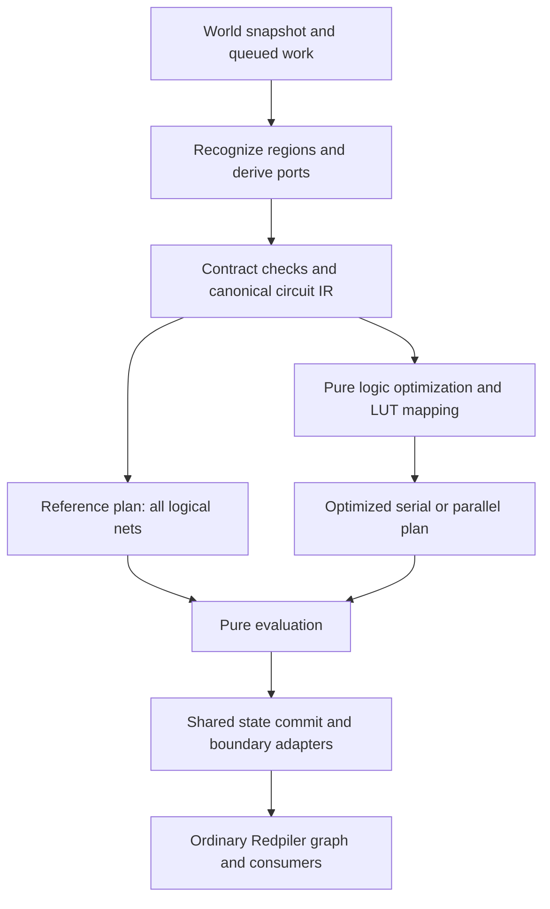

# Preparing and optimizing instant circuits for Redpiler

Research and recommendations, 2026-10-06. **Recommended design: one extracted circuit representation, a reference execution plan that retains every logical net, and an optimized plan that simplifies pure logic and maps selected small cones to lookup tables. Both plans share the same state, protocol and boundary adapters.** Start with serial execution; add parallel work where profiling demonstrates enough independent computation.

This document extends the [instant/BUD mathematical contract](INSTANT_PISTON_REDPILER_MODEL.md), rather than redefining piston physics or the equations in [REDSTONE_MODEL.md](REDSTONE_MODEL.md). It recommends implementation work; it does not implement an evaluator, certify additional schematic families, or report measured speedups. External sources establish applicable techniques. The design choices below are recommendations for MCHPRS.

The [isolated optimizer scope and implementation plan](INSTANT_REDSTONE_OPTIMIZER_SCOPE.md) defines the crate boundary, initial passes, validation milestones and future integration with `--optimize`.

**Current implementation distinction:** the [Direct/Boolean runtime](INSTANT_PISTON_RUNTIME.md) now executes admitted adders, Counter storage and conditional electrical ports, including quartz conductors and fixed furnace overrides. The table in section 1 records the earlier inspection, not the current admission verdict. The two execution plans, full logical-net inspection, LUT mapping and parallel executor proposed here remain future work; disabling `--optimize` does not currently select the proposed full-net plan, and canonical Boolean preparation runs in both flag settings. General BUD and retained-read owners still need implementation. [ANPU's post-legalization checks](ANPU_REDPILER.md#admission-after-the-fpurilax-legalization) reject compilation while preserving its frozen physical memory/screen episode.

## 1. Repository at the original research inspection

Source inspection used HEAD `26025f17d2c732d6f75e4a0041e42a6f20f0187c` and the shared checkout's local modifications. Relevant binary source hashes are recorded below; HEAD alone does not identify this work in progress.

| Existing component | Consequence for this design |
| --- | --- |
| [CompileGraph](../crates/core/src/redpiler/compile_graph.rs) is a mutable `StableGraph`; ordinary links carry attenuation and default/side electrical roles. Local work adds `InstantInput` and `MobileSource` placeholders. | Reuse discovery and electrical connectivity, but introduce explicit logical data, event and sampling channels. A diode side input is not a BUD sampling update. |
| [Instant contracts](../crates/core/src/redpiler/instant/contract.rs) distinguish strength, prepared data, falling triggers and sampling ports. Trigger acceptance requires a qualifying recheck and readiness; restored power can cancel a request. | Reuse these semantics at the boundary. Do not launch computations from every cached zero or directly from every observed edge. |
| [Candidate graph preparation](../crates/core/src/redpiler/analysis/graph.rs) reanalyzes the live world, checks family/reset closure, rejects exposed reset internals and returns an analysis artifact. | This is useful preparation, not an executable logical netlist or a completed instant runtime. |
| [Pass manager](../crates/core/src/redpiler/passes/mod.rs) runs weight clamping, link deduplication, constant folding/coalescing and pruning. | Retain electrical passes where applicable. These do not constitute general Boolean minimization or LUT mapping. |
| [Direct backend](../crates/core/src/redpiler/backend/direct/mod.rs) mutates downstream input counters and invokes updates through one mutable owner. [Lowering](../crates/core/src/redpiler/backend/direct/compile.rs) rejects instant boundary nodes before converting ordinary nodes. | Add a pure-logic executor alongside the ordinary backend. Concurrent calls into its existing mutation path are not the proposed parallelization. |
| [Scheduler](../crates/core/src/redpiler/backend/queue.rs) has priority queues and FIFO order within them. [Plot execution](../crates/core/src/plot/mod.rs) already has a thread per running plot. | Preserve ordinary boundary scheduling. Budget any extra workers across plots; do not create a full CPU-sized pool per circuit. |

The [I/O validation report](INSTANT_PISTON_IO_VALIDATION.md) supplies functional and temporal acceptance evidence. It is not a performance benchmark. Fresh adder calculations do not prove unrestricted repeated use, and XOR has unresolved reset discrepancies. The original Counter/Java captures cover a bounded sequence; later Rust compiled/interpreter checks cover all 65,536 increments and wrap, without proving clear or stop/restart. Optimization must not convert those limitations into stronger contracts.

## 2. Two execution plans, one semantic circuit

Keep the physical interpreter available as the execution path for unsupported constructions and as the physical comparison engine. For recognized regions, provide these two compiled modes:

| Property | Reference plan | Optimized plan |
| --- | --- | --- |
| Logical structure | Every extracted primitive and net; preserve net identities, fanout and physical aliases | Equivalent pure logic, possibly shared, pruned, rewritten or LUT-mapped |
| State and protocol | Explicit BUD bits, retained read state, ordered samples/validated transactions, trigger history, readiness and generator/reset state | The same state identities, acceptance rules and transition ownership |
| Outputs | The same port adapters and consumer schedule | The same port adapters and consumer schedule |
| Inspection | Every logical net available at each accepted logical transaction | Boundary/state trace by default; retained provenance and optional reference recomputation for removed nets |
| Purpose | Run the extracted circuit as-is, diagnose extraction, compare transformations | Reduce execution work and memory traffic |

Here “as-is” means **the extracted logical circuit with all its nets**, not a replay of every physical callback or piston animation. The physical interpreter remains necessary when that is the requested observation. A logical net value is an accepted-wave value; it is not a claim about every intermediate dust state.

**Author clarification: internal nanotick synchronization is idealized in compiled execution.** A circuit whose logical structure is valid can compute correctly in Redpiler even when extra internal piston stages make it fail in Java/interpreter execution. Physical misalignment alone is not a compiler rejection condition. Both compiled plans evaluate the same finalized-wave logic; LUT mapping or minimization improves its execution cost rather than introducing this normalization. Ordinary component delays, declared BUD sampling transactions and reset/generator state retain their explicit semantics.

For example, delayed inhibition can make the physical target activate despite both trigger and inhibit belonging to the intended wave. The compiled expression `trigger && !inhibit` suppresses that activation. Preserve the physical trace as evidence of intentional divergence, and test the compiled result against the independently established logical function. This rule does not infer a function for an ambiguous circuit or admit an invalid reset/payload construction.

Turning optimization off must still perform correctness preparation: validate types and ownership, decode state, identify cycles, assign IDs and construct an execution order. It must not silently enable constant folding, common-subexpression merging or dead-net elimination. Layout changes are permitted if original nets remain individually inspectable.



The intermediate representation (IR) should separate three objects:

| Object | Contents |
| --- | --- |
| `CircuitIR`, immutable | Typed ports/nets, recognized pure operations, fanin/fanout, state read/write boundaries, protocol/adapters, physical aliases and recognition provenance |
| `ExecutionPlan`, immutable | Dense operations, execution order, scratch-slot assignment, LUT storage, task dependencies and a map back to original nets |
| `CircuitState`, mutable | Current BUD/read state, cached input strengths, previous strengths/trigger requests, ordered sample/acceptance records, readiness, generator/read phase and pending boundary actions |

The reference and optimized plans must read equivalent initialized state. A compiled region is a subassembly inside the surrounding graph; its intermediate ports are not automatically world-output nodes. Fuse adjacent pure logic only when their wave and state visibility contracts agree. Region boundaries that carry sampling, validity or timing remain explicit.

## 3. Prepare a recognized circuit for execution

1. **Capture and validate entry state.** Snapshot blocks, payload ownership, stationary BUD state and relevant pending work. Admit only the entry phases supported by the family. An unpowered extended BUD can be a legitimate stored bit: initialize from its decoder, not from power alone. Moving payloads require a separately supported entry protocol.
2. **Establish execution owners.** Every reset, generator, memory update and exposed consumer effect needs an owner. Shared-output OR needs one payload group and closure across all its ownership outcomes before it can become logical OR. Unrecognized feedback remains interpreted.
3. **Build typed channels.** Keep electrical strengths, prepared bits, accepted event bits, delivered sample notifications and accepted storage transactions distinct. Decode strength after the actual attenuation. A requested movement can be cancelled or blocked; a same-value sample can remain observable without a movement. Preserve aliases even when an internal wire is removed from the optimized plan.
4. **Split at semantic boundaries.** State reads can be pure inputs and proposed next-state bits pure outputs. State commits, qualifying updates, delays, validity changes and consequential callbacks remain explicit operations outside Boolean cones.
5. **Check the pure dependency graph.** Find strongly connected components. Reject unsupported pure cycles instead of inventing an iterative fixed-point rule. Feedback through recognized memory/generator state is valid; the complete stateful circuit need not be a DAG.
6. **Lower into dense arrays.** Use integer IDs, contiguous fanin/fanout storage and topological operation arrays. Keep the mutable build graph out of the hot evaluation loop. Allocate scratch buffers once, and retain origin maps separately from operation payloads.
7. **Construct a plan and verify it.** Generate the full reference plan first. Apply bounded optimizations to a separate plan, compare functions/state intents, and retain the reference plan if optional optimization fails or exceeds its budget.
8. **Activate atomically through the plot owner.** Revalidate the snapshot identity before transfer. A failed compilation must leave the live interpreter unchanged. Cache keys include IR/schema, recognition contract, topology, decoders, adapter configuration and optimizer version. Initialize mutable state from the live world every time; do not reuse another instance's cached state.

Editing a region invalidates its prepared artifact and in-flight work. Switching plans is straightforward only when state layouts and pending actions are equivalent. Switching back to the interpreter requires a tested materialization of payloads, BUD state, reset phase and queued work. Until that exists, permit handoff only at a demonstrated ready point; no optimizer should assume a final output bit is sufficient restoration state.

## 4. Run the full netlist first

Use a serial topological sweep over each accepted pure evaluation domain. This provides predictable work proportional to nodes and edges and makes every net observable. One topological level does not consume a Minecraft tick; the shared adapters determine exposed timing.

An episode should follow this ownership pattern:

```text
plot owner accepts ordered electrical changes and qualifying updates
    -> adapter validates the protocol and finalizes a transaction
    -> executor reads that transaction's input/state snapshot
    -> executor computes pure values and proposed state writes
    -> plot owner commits writes and schedules boundary actions
```

The transaction grouping comes from the recognized protocol, not “all changes in this game tick.” Two dependent BUD samples in one tick remain ordered transactions; the second may read the first's committed state. A certified atomic bank transaction instead reads one old-bank snapshot before committing every next-state bit; this is the current Counter protocol. A data-only change is not a sampling request. Sampling the same data can still be a meaningful update even when no output bit changes. RILAX's read gates retain a separate sampled result across a later write; liveness and caching must preserve those state identities rather than reconnect the output continuously to the bank.

After this baseline is correct, compare a full sweep with dirty-cone evaluation. A dirty plan follows fanout from changed inputs or state, processes affected operations in dependency order, and caches unaffected pure values. Dirty propagation applies within a finalized transaction; it must not erase boundary events, sampling requests or changes between transactions. A full sweep can win when most of the circuit is active, so select using measured activity and plan size.

For debugging optimized execution, recompute original pure nets against a retained transaction snapshot on demand. This must not re-run adapters, emit events, update memory or advance the clock. Complete historical net inspection needs retained snapshots or reference tracing; an optimized plan cannot reconstruct discarded history from its current output alone.

## 5. Minimize pure logic before mapping LUTs

ABC demonstrates a useful synthesis approach: structural hashing, DAG-aware rewriting/balancing and equivalence checking over Boolean networks. An AND-inverter graph (AIG) represents two-input ANDs with optional inverted edges; it is useful for interchange and proof. This does not imply that every runtime operation should be decomposed into ANDs. [ABC documentation](https://people.eecs.berkeley.edu/~alanmi/abc/abc.htm)

Recommended first passes:

| Transformation | Admission rule |
| --- | --- |
| Constant folding and identities | Pure Boolean operators, or separately correct strength-domain rules |
| Buffer/alias elimination | Preserve port identities; no lost attenuation, updates, observation or timing |
| Canonical operand ordering and structural hashing | Pure commutative operations in the same transaction/state visibility domain |
| Common-subexpression elimination | Share computations, never state cells merely because their current bits match |
| Dead-cone pruning | Root liveness at outputs, next-state expressions, sampling enables, protocol guards, generator/deadline effects and restoration requirements |
| Small-cone rewriting and support reduction | Prove identical functions over all admitted inputs; retain native XOR and mux operations when economical |
| Balancing or limited duplication | Respect the pure-domain boundary; select using measured CPU work, fanout and critical path |

Boolean minimization has two objectives here: removing work and shortening dependency chains. These can conflict. Sharing a small term reduces operation count but can add cross-task communication; duplicating it can reduce parallel latency. A circuit with fewer nodes is not automatically faster.

Keep electrical maximum/attenuation operations distinct from event logic. The characterized AND fixture's falling-event conjunction does not mean an electrical join has become Boolean AND. A wire chain can be collapsed into an appropriate strength dependency only if its update-sensitive consumers and port aliases are retained.

Optimize pure next-state expressions as well as result expressions, but keep BUD identities and ordered commits. Do not retime across memory samples, repeaters, protocol deadlines or reset boundaries. **The compiled executor does not model internal nanoticks and does not require the physical circuit to be synchronized.** It evaluates recognized logical waves with ideal internal synchronization. Logical storage dependencies and declared consumer timing still survive every transformation; misalignment-induced physical transients need not survive.

## 6. Replace selected cones with small LUTs

A lookup table (LUT) evaluates a Boolean function by indexing its precomputed truth table. A cone can contain many operations while depending on few independent input bits. A cut is a set of leaf signals separating its root from upstream inputs. Priority-cut enumeration bounds candidate size/count and filters dominated cuts; this is a practical alternative to enumerating every subcircuit. [mockturtle cut enumeration](https://mockturtle.readthedocs.io/en/latest/algorithms/cut_enumeration.html)

Recommended initial search parameters are **4–6 Boolean leaves** and a tunable bound such as **8–16 candidate cuts per root**. These are starting points for experiments, not established MCHPRS optima. Build cuts in dependency order, stop at state/protocol boundaries, compute candidate functions, remove unused leaves, then choose a covering that retains every live output and externally used interior net. Sharing/fanout must be included in the covering cost; independently choosing the best cut at each node can duplicate work.

For each replacement, exhaustively compare the original cone and LUT over all `2^k` leaf assignments. Initially use complete truth tables. Untested fixture inputs are not don't-cares. Later, a restricted care set requires a proved protocol/reachability invariant and a runtime admission guard; benchmark convenience is insufficient.

For a single output and `k <= 6`, store its table in a `u64`:

```text
index = input[0] | (input[1] << 1) | ... | (input[k-1] << (k-1))
output = (truth_table >> index) & 1
```

Input order and output polarity belong to the artifact. This layout uses 8 bytes at six inputs, excluding input IDs and operation metadata. Index packing and input loads still cost work: replacing a two-input AND with a generic LUT can lose performance. Keep primitive AND/OR/XOR/mux operations available.

Multi-output cones can share index construction. A full adder is a useful exact example, after its physical input decoders have been established:

```text
index = A | (B << 1) | (Cin << 2)
rows  = [0, 1, 1, 2, 1, 2, 2, 3]   // bit 0: sum; bit 1: carry
value = rows[index]
```

The eight byte-sized rows compute both bits. Two separate packed truth tables need only two bytes of table data, but require a different lookup sequence. Benchmark both layouts, including input gathering and dispatch, rather than selecting purely by table size. Computing sum and carry together does not publish them together: their existing adapters can expose different availability windows.

Do not make a LUT for an entire 11-bit two-input adder. With 22 independent bits and 11 output bits, densely packed data alone needs `2^22 * 11 / 8 = 5.5 MiB`; `u16` rows use 8 MiB. Small full-adder cuts or a subsequently proved native addition operation are better candidates. A native operation requires established bit order, polarity, width, overflow policy and the original result/reset schedule.

Hardware LUT mapping commonly optimizes area and logic depth; mockturtle supports custom cut costs. For Redpiler, use measured software costs: dispatch, input gathering, table accesses, fanout/dirty propagation and task communication. Hardware depth is not Minecraft simulation time. [mockturtle LUT mapping](https://mockturtle.readthedocs.io/en/latest/algorithms/lut_mapping.html)

Use a bounded heuristic, not a promise of a globally minimal circuit. Compare candidate plans on estimated execution work, critical-path work, table/scratch footprint and compilation cost. Keep small tables together and share identical immutable table data. Calibrate the estimates with the target CPU and executor; update the model when profiles disagree.

## 7. Parallel evaluation without changing the circuit

Parallelize independent **pure computation**, retaining state and world effects under the plot owner. Verilator provides a relevant precedent: threaded models distinguish evaluation ownership from workers and require avoiding CPU oversubscription. Its thread profiling uses measured macro-task costs to improve balancing. The applicable lesson is coarse tasks and profiling, not transplanting its Verilog scheduler. [Verilator threading](https://verilator.org/guide/latest/verilating.html#multithreading), [thread profile-guided optimization](https://verilator.org/guide/latest/simulating.html#thread-profile-guided-optimization)

Prioritize work in this order:

1. **Parallel compilation of independent regions.** Cut enumeration, local proofs and plan construction can benefit without altering runtime state transitions. Respect cancellation and memory budgets; finalize IDs/artifacts deterministically.
2. **Independent regions at runtime.** Prefer existing plot-level parallelism and coarse independent cones in a plot. Dependencies through ports still require producers to finish before consumers evaluate.
3. **Large pure domains.** Partition into tasks using measured work and fanout locality. Each task contains enough operations to amortize dispatch; a gate or small LUT is not a worker task.

Start with serial scheduling and a persistent bounded shared CPU pool for sufficiently large jobs. Rayon is a possible Rust implementation: its work-stealing scheduler can distribute forked work, but job completion order is not a semantic commit order. No Rayon dependency is currently present in `mchprs_core`; choosing it would be implementation work. [Rayon scheduling FAQ](https://github.com/rayon-rs/rayon/blob/main/FAQ.md)

Each worker reads immutable inputs and writes an owned result buffer or disjoint output slice. Consumers become eligible after their task dependencies finish. The plot owner merges results and performs commits/publications in the contract's required order. Stable IDs can resolve ties only where the effects are independent or proved commuting; they must not replace existing priority/FIFO or causal order. Do not share a mutable `DirectBackend` or world between workers.

Do not insert a global barrier after every topological level. A chain of tiny levels gives little parallel work and excessive synchronization. Begin with coarse independent regions; use a task DAG within a larger domain only after that proves worthwhile. Partitioning can justify duplicating a cheap pure expression to avoid communication, with equivalence verified afterward.

Two BUD updates to the same cell are serialized. Parallel next-state computation is permitted only for independent transactions with compatible snapshots; “same game tick” does not establish independence. A counter cannot compute all future increments in parallel while ignoring its sampling, publication and generator dependencies.

For total pure work `W`, critical-path work `L` and `P` workers, even an ideal schedule needs at least `max(W/P, L)`, before dispatch and communication overhead. This is a useful plan-selection lower bound. The supplied 11-bit carry chain may offer little single-circuit speedup; many independent instances offer more throughput. Both conclusions need measurements on the extracted plans.

Since plots already run on threads, additional worker capacity must be managed server-wide. Limit simultaneous compiler/evaluator jobs, avoid creating pools per plot, and measure latency under several active plots. Pool waits must not hold world locks or depend on jobs that need the waiting plot to commit. Protocol violations remain violations; available workers do not authorize accepting another trigger during reset.

## 8. Other techniques and tool choices

| Technique/tool | Recommendation |
| --- | --- |
| Native Rust netlist executor | First implementation: dense serial operations, optional dirty propagation, then cheap rewrites and bounded LUT mapping. No external synthesis binary is needed to run the baseline. |
| ABC / Yosys | Use initially as offline synthesis/equivalence comparators for exported pure cones. Yosys exposes ABC LUT mapping and LUT cost settings, but their hardware defaults are not the runtime cost model. Pin tool version, binary hash, scripts and port ordering in every experiment. [Yosys ABC documentation, version 0.47](https://yosyshq.readthedocs.io/projects/yosys/en/0.47/cmd/abc.html) |
| mockturtle | Reference for cut/mapping algorithms and experimental quality comparisons. Introducing its C++ library or an FFI is optional; its availability is not a reason to add it to the first Rust runtime. |
| Bit-parallel evaluation | Pack independent input cases or compatible circuit instances into machine-word lanes for truth-table generation, regression and throughput experiments. Within each lane preserve its own data/state/protocol. This is not automatically SIMD acceleration of arbitrary adjacent gates in one circuit. |
| Specialized arithmetic | Later candidate: prove equivalence of an extracted cone to word addition/comparison, then use a native operation with unchanged adapters. Do not recognize arithmetic from a filename or sign. |
| JIT compilation | Later, for frequently executed large pure plans. Cranelift provides Rust code-generation/module/JIT components; it is an option to evaluate, not a demonstrated speedup here. Cache only verified code with compatible IR/CPU settings. [Cranelift components](https://github.com/bytecodealliance/wasmtime/blob/main/cranelift/docs/index.md) |
| Global exact minimization, sequential retiming, GPU execution | Defer. They increase search, integration or transfer costs before there is a measured need. Moving state/timing boundaries would require a substantially stronger preservation proof. |

Export only pure expressions to synthesis tools: prepared/event bits and current state as inputs; results, proposed next state and pure enables as outputs. Keep state owners, reset/generator transitions and consumer schedules outside that export. Do not pass BUD cells to a synchronous optimizer as ordinary clocked flip-flops and accept retiming by default.

For bit-parallel Boolean gates, AND/OR/XOR operate naturally on lanes. A scalar LUT indexed by one row does not automatically evaluate all lanes; it needs per-lane lookup or an equivalent word-wise decomposition. Compare those approaches before combining LUT mapping with a batched executor.

An expensive optimization or JIT is justified only when its extra compile cost is recovered. If it saves `delta_time` per evaluation and costs `delta_compile`, the break-even condition is `evaluations * delta_time > delta_compile`. If measured `delta_time <= 0`, retain the faster simpler plan.

## 9. Prove preservation and measure performance separately

There are four distinct validation questions:

| Comparison | What it establishes |
| --- | --- |
| Physically synchronized interpreter/Java episode versus reference plan | Extraction and the admitted boundary/state/timing contract |
| Physically misaligned episode versus reference plan | Classify intentional synchronization normalization; check the reference plan against the independently established logical contract, not the erroneous physical waveform |
| Reference plan versus optimized plan | Preservation by rewrites, LUTs and specialization |
| Optimized serial versus optimized parallel | Preservation by scheduling, buffering and commit ownership |

For local LUTs, test every leaf assignment. For larger pure plans, build a miter: feed both plans the same inputs/current state and ask whether any result, proposed state bit or enable differs. A SAT solver proving the miter unsatisfiable establishes combinational equivalence under its explicit assumptions. Yosys provides SAT-based equivalence procedures; proof failure/timeout must leave the known plan available, not be reported as success. [Yosys `equiv_simple`, version 0.41](https://yosyshq.readthedocs.io/projects/yosys/en/0.41/cmd/equiv_simple.html)

If initial state, pure functions/transition intents, and the unchanged adapters agree for each admitted transaction, that supports stepwise preservation of the logical reference semantics. It does not prove that the physical family implements those adapters. Fixture episodes and independent Java evidence establish physical compatibility separately. Equality with physical execution is required for synchronized compatible episodes; known nanotick misalignment may intentionally yield a different compiled result.

Reuse the [existing fixture tests and captures](INSTANT_PISTON_IO_VALIDATION.md). For physically compatible episodes, compare **entire exposed episodes**, including validity, consumer transitions, memory writes, pending deadlines, reset/readiness and callback-dependent effects. For synchronization-normalized episodes, define the intended logical function and adapter projection explicitly and retain the differing physical episode. Specific acceptance cases include:

- Held zero and positive-to-positive changes do not become fresh root computations; legitimate internal periodic responses remain active.
- BUD data-only changes preserve the bit; qualifying notifications sample live data, including unchanged data. Validate state-changing writes separately from cancelled requests and no-op samples. Two ordered updates read the correct intermediate state; a certified atomic bank evaluates every bit from one old snapshot.
- RILAX keeps held-read state across a later write, samples upper data on both updater movement edges and filters the tested short enable pulses. These are future family-acceptance cases, not implemented RAM semantics.
- Shared OR preserves one group's logical ownership/reset contract. The author-excluded illegal reset remains rejected, even if a first result resembles legal OR.
- Adder sum consumers remain valid at ticks 3–7 and one-bit carry at 5–9; the common window is 5–7. Jointly computing two bits cannot expose either early.
- Counter memory and consumer banks retain their distinct measured schedules: stored `n` at `6n`, consumer `n` during `[6n+5, 6n+8]`. Intermediate reset/partial consumer values cannot be replaced with an always-valid count.
- XOR's complete reset contract remains uncertified. Current compilation can admit `XOR_Simple`, with a known tick-8 repeater mismatch when both inputs are released; a Boolean XOR proof does not resolve that adapter failure or the separately recorded Java/MCHPRS reset discrepancy.
- NANOTICK_EXAMPLE is a candidate intentional-divergence regression: once its logical ports/protocol are established, both compiled plans must suppress the activation caused by delayed physical inhibition. No compiled implementation or passing result is claimed yet. An unexplained XOR reset discrepancy is not automatically the same diagnosis.
- Full-net and optimized net maps remain traceable; mutations invalidate plans; accepted handoff points restore equivalent interpreter state/work.

Repeat deterministic replay with different worker counts and forced task-completion orders. Compare canonical traces of committed state, boundary actions and pending work, not incidental task timestamps. Independent writes may be physically completed in different wall-clock order; observable simulation order remains invariant.

Use a separate benchmark matrix:

| Axis | Cases |
| --- | --- |
| Plan | Full-net sweep; dirty full-net; simplified primitives; LUT limits 4/5/6; later specialization/JIT |
| Workload | Small supplied fixtures; wide independent cones; long dependent cones; sparse/dense changes; repeated compatible instances; several active plots |
| Scheduling | Serial; coarse tasks with 2/4/more workers; parallel compilation; batched independent cases |
| Measurements | Compile time/peak memory; operation/edge count; table/scratch bytes; allocations; warm evaluation latency p50/p95/p99; throughput; time in commit/adapters; worker utilization and wait time |

Synthetic scale tests are optimizer workloads, not new author-supplied physical acceptance fixtures. Measure native-logic versus LUT index construction and input gathering end to end. Include tracing on/off, cold/warm cache, and real active-input distributions. Separate computation wall time from scheduled Minecraft delays; removing a physical animation does not shorten the preserved consumer deadline.

Record hardware, OS, Rust/toolchain, release profile, revision/local-source hashes, worker budget, input seed and protocol for every result. Criterion is already a development dependency in `mchprs_core`. Add focused benchmarks when the executor exists, and measure under load before choosing default thresholds. There are no benchmark results or speedup estimates in this research note.

## 10. Recommended delivery order

| Stage | Deliverable and acceptance condition |
| --- | --- |
| 1. Reference execution | Typed logical IR, state/protocol owners, serial full-net plan and trace export. Both synchronized comparisons and explicitly declared synchronization-normalized logical expectations pass. Unsupported entries remain interpreted. |
| 2. Cheap simplification | Pure constant folding, structural sharing, dead-cone pruning and origin maps. Function/state-intent comparisons and full episode comparisons pass. |
| 3. CPU-costed LUTs | Bounded cuts with exhaustive local equivalence, primitive/LUT choice and multi-output experiments. Demonstrate reduced execution cost within a compile/memory budget. |
| 4. Coarse parallelism | Independent compilation first, then runtime tasks that meet a measured work threshold. Replay is deterministic and server-wide load benchmarks improve. |
| 5. Optional specialization | Proven arithmetic operations or JIT only for hot plans where measured savings repay compilation. |

Expose reference/optimized plan selection separately from worker count. Initial defaults should be serial, bounded optimization and a complete reference/debug path. Proposed options such as `instant-plan=reference|optimized`, `lut-max-inputs` and a shared worker budget are design suggestions, not existing command-line flags.

A circuit that can be run and inspected before optimization supplies the comparison baseline needed to decide whether LUTs, sharing, dirty evaluation or multithreading help this project. Start with a small verified optimization surface and expand it using those results.

## Inspection provenance

Local source hashes sampled at `2026-10-06T16:00:39+02:00`. The shared tree contained unrelated modified and untracked parser/backend/plot work. No applicable `AGENTS.md` was found in repository files or the checked ancestors. The initial research added only this document. The subsequent author clarification updates the model, plan, scope and answers as well; the hashes below identify the original inspection, before those documentation edits. Unrelated source work and frozen physical fixture expectations remain unchanged.

| Repository path | SHA-256 |
| --- | --- |
| `crates/core/src/redpiler/compile_graph.rs` | `1457c16b30f92154bfb3958ffe274a8a5b0253a091a788619074015f682134be` |
| `crates/core/src/redpiler/instant/contract.rs` | `578282d2171712faa89604d189ac870e06b90b67fd061dab843b6d310a03b22b` |
| `crates/core/src/redpiler/instant/boundary.rs` | `ae2db5b5c793ac944c409f9b3aae3e7c8fb920f354ae0cd101785ae26e01399b` |
| `crates/core/src/redpiler/analysis/graph.rs` | `0e07ac53db8ffd70ec45541b6af8ffd8ac26c408d20e04470c69b9fc01927ea0` |
| `crates/core/src/redpiler/passes/mod.rs` | `52132b37972ca4cbf13556e2b034a48660d07e22d172af79dbf7dc7bb5d4d83c` |
| `crates/core/src/redpiler/backend/direct/mod.rs` | `14b93f09ad3409a675741bcd3dff8ea0640e4733218c56f92c65bb3841c5d6be` |
| `crates/core/src/redpiler/backend/direct/compile.rs` | `d483b55f1effcb8ae10e7bc0f86f655e3267a5d80d08006e67fbc848ff361504` |
| `crates/core/src/redpiler/backend/direct/node.rs` | `09e99bb1e78525dafa625936cef8200f3f9be8e80810fcf8e0d2efdf9bbc2639` |
| `crates/core/src/redpiler/backend/queue.rs` | `39d919bc0e70fd00569a05f619966fefd8f0a14a32a482bdd7cd6641027de7c5` |
| `crates/core/src/plot/mod.rs` | `95b44861eb19ad15fc9556c99b2716445478a26dc576e6f127b9b05d48542230` |
| `crates/core/Cargo.toml` | `63389f863ecdb050b7c8a280f63b941bc40829a9d3521015d7b08d2a8ad7c9f2` |
| `docs/INSTANT_PISTON_REDPILER_MODEL.md` | `67f403a369181e06db5c06ee7aab374239b96a38e70fc9f96357ef0403c5153a` |
| `docs/INSTANT_PISTON_IO_VALIDATION.md` | `2f52f6256b70e6579fae9268a57e8d96f862594424f464e9d46ce85c34cdcdb7` |

External references were consulted on 2026-10-06. The older ABC/Yosys documentation is cited for the described algorithms/commands, not as a statement of the latest release or a pinned runtime dependency. Primary-source links are placed with the claims they support. All thresholds, sequencing and software architecture recommendations are proposed choices awaiting implementation and measurement.

During final verification, concurrent work changed four of the sampled source files. They were reread at `2026-10-06T16:06:05+02:00`; formatting and diagnostic wording changed, while the candidate-only preparation and unavailable instant-runtime conclusions remained applicable. Their later identities are recorded separately rather than rewriting the first inspection record:

| Reinspected repository path | Later SHA-256 |
| --- | --- |
| `crates/core/src/redpiler/compile_graph.rs` | `07e914b010b8074e34fd92d1d6425396ea12d19647679800d5d3550a169e5620` |
| `crates/core/src/redpiler/instant/boundary.rs` | `56dc8c287e24d16de9885930e9def07b73a72d9561b516b1ede18a4f19119553` |
| `crates/core/src/redpiler/analysis/graph.rs` | `2e0c06c3860c667ee0a5940fefacedea9bcc7b9556d9c95adf3a02ca29abb960` |
| `crates/core/src/redpiler/backend/direct/compile.rs` | `a79f9fc2fbc76b7ab3276a88b047978883d7f89088fcb16ef77aa2c82f0ee343` |

Document checks passed: repository Markdown links/anchors, paired code fences, all eight full-adder LUT entries, the stated table-size calculations, and whitespace checking including the untracked file. These are documentation/example checks; Rust regression tests and performance benchmarks were not rerun for this research-only addition.

The link and whitespace checks can be repeated from the repository root:

```powershell
py -c "from pathlib import Path; import sys; sys.path.insert(0, 'tools'); from validate_instant_pistons import check_links; check_links(Path('docs/INSTANT_PISTON_OPTIMIZATION_RESEARCH.md')); print('Links OK')"
git diff --no-index --check -- NUL docs/INSTANT_PISTON_OPTIMIZATION_RESEARCH.md
```
