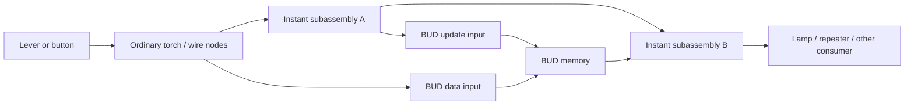

# Instant pistons and BUD switches: a Redpiler model

This is a compact mathematical contract for recognizing and simplifying instant circuits. Physical power, callbacks and piston execution follow [REDSTONE_MODEL.md](REDSTONE_MODEL.md). Geometry and measured episodes belong in the [schematic catalog](INSTANT_PISTON_SCHEMATICS.md). This document defines the abstraction between them and Redpiler.

The intended interface uses ordinary Redpiler nodes: levers, buttons, torches and wires supply stable signals. An instant circuit becomes a subassembly or node in the larger graph, with its own input and output ports. Source destruction in the characterization fixtures is an experimental stimulus. A compiled circuit should accept signal changes through its existing input nodes.

**Status (2026-10-06):** this contract is partially implemented. Redpiler executes the lever/repeater 11-bit adder and a shared-clock BUD network supporting `COUNTER_BASIC`, through Boolean programs paired with ordinary graph nodes. Counter next-state expressions use stored bits; an owned observer protocol supplies sampling and output timing. Standalone BUD adapters, multiple clocks and general reset/consumer protocols remain proposed. The [implemented pipeline](INSTANT_PISTON_RUNTIME.md) defines current admission, output timing, handoff and validation; the wider mathematical model below does not imply that every described family can compile.

ANPU is the next [compiled acceptance target](ANPU_REDPILER.md). Its interpreter sampling/write projection and screen trace are retained as reference data; the general BUD graph abstraction remains pending. Its 896 identified note-block BUD cells carry conducting black concrete and require independent ordered update channels. Unsupported ANPU programs reject compilation; there is no physical compatibility backend.

## 1. Circuit boundaries

The parser identifies a region of interacting pistons, their payloads, reset circuits and internal connections. Its interface is derived from connections to the surrounding graph:

An input port is a connection into the region, with a declared role: prepared data, trigger, inhibit, or update. It may come from an ordinary node or another instant subassembly. One connection can have several roles. An output port is a connection from the region to another graph node; it can feed another instant, a BUD, or an ordinary consumer. Follow the actual paths; sign labels help characterize fixtures but are not the parser interface.

**An instant output port is not Redpiler's world-output flag.** Intermediate event/value connections remain internal graph edges. Discovering a lamp or other non-instant consumer establishes a boundary where the logical result must be converted into that consumer's input semantics. Adjacent instant subassemblies can instead be connected or merged and simplified together.

Region ports refer to node identities and retained connection semantics. A torch or wire can be a region input without being a player-operated input. Wire elimination must preserve required port identities or aliases. A non-instant piston needs an execution owner before compiled execution can be enabled.

## 2. Levels, events and stored bits

Keep four quantities distinct:

| Symbol | Meaning |
| --- | --- |
| $s_i(\tau)\in\{0,\ldots,15\}$ | Electrical strength at an input connection |
| $d_i\in\{0,1\}$ | Prepared data, decoded from a stable input condition |
| $e_i\in\{0,1\}$ | A falling event in the declared computation wave |
| $q_j\in\{0,1\}$ | A stored BUD bit, read at a valid observation point |

Here $\tau$ identifies a boundary transition or observation point, not an internal nanotick. Define a falling event by

$$
e_i(\tau)=[s_i(\tau^-) > 0\ \land\ s_i(\tau)=0].
$$

Logical one at an instant event port means this transition. Held zero produces no new external event; positive-to-positive changes also produce no falling event. Those changes can still affect electrical strength or callbacks and therefore cannot be discarded without checking their consumers. A zero in an event truth table means no event in that wave, whose observation point must be specified.

Prepared data has a separate decoder $d_i=D_i(s_i,\text{connection state})$. Its polarity comes from the recognized circuit. Do not automatically identify a prepared bit with a falling event.

For example, let $x$ be a stable lever/button state and $\ell=[s>0]$ the output of its negating torch. At settled levels $\ell=\neg x$, so activating the control produces

$$
e=\ell^-\land\neg\ell^+=\neg x^-\land x^+.
$$

The event occurs at the actual torch output transition, with normal torch timing. A button's release and pulse duration also belong to the input protocol. Replacing a removed source with this input adapter requires checking power and notification paths; matching a final level alone does not establish equivalence.

## 3. Instant computation

For a supported computation wave $k$, a certified instant region has the logical projection

$$
\mathbf y_k=F(\mathbf d_k,\mathbf e_k,\mathbf q_k).
$$

$\mathbf d_k$ is the prepared data, $\mathbf e_k$ identifies the accepted triggering events, and $\mathbf q_k$ is the memory visible to this computation. An instant-only region has no persistent data memory. Its reset or clock activity can still require execution state.

The formula applies under the region's protocol, ideal internal synchronization and output decoder. Physical synchronization is a compatibility property, not a prerequisite for evaluating the logical function. Wave grouping belongs to the protocol; arbitrary changes are not combined just because they occur near each other. Examples from the characterized first wave are:

| Mechanism | Logical projection | Evidence |
| --- | --- | --- |
| Shared-payload OR | $y=e_A\lor e_B$ | [OR_1](INSTANT_PISTON_SCHEMATICS.md#or-1) |
| Independent sources on one output net | $y=e_A\land e_B$ | [AND_1](INSTANT_PISTON_SCHEMATICS.md#and-1) |
| Activation with effective inhibition | $y=e_A\land\neg e_B$ | [NOT_1](INSTANT_PISTON_SCHEMATICS.md#not-1), under its synchronized consumer contract |
| Prepared one-bit addition | $S=A\oplus B\oplus C$, $C_{out}=AB\lor AC\lor BC$ | [ADDER_1BIT](INSTANT_PISTON_SCHEMATICS.md#adder-1bit), after its separate trigger |

The AND interpretation follows the event encoding: if both initially positive contributors feed an electrical maximum, the output becomes zero only when both contributors are removed. An electrical join itself remains a maximum of strengths. An internal event edge carries $y_k$ once for wave $k$; repeatedly reading a held value does not emit new events.

These formulas describe the declared result projection. They do not certify every intermediate wire transition or the subsequent reset response. In particular, [XOR_Simple](INSTANT_PISTON_SCHEMATICS.md#xor-simple) has a first-wave XOR projection and additional reset effects.

Shared-output OR is one region with a shared payload, rather than two independently owned output blocks. Ownership may transfer or a payload may be dropped and recaptured. The region must preserve its permitted payload states and have a valid reset for every supported ownership outcome. [OR_Interpreter_illigal](INSTANT_PISTON_SCHEMATICS.md#or-interpreter-illigal) fails that reset requirement and is author-excluded from compiler scope.

## 4. Inhibition and ideal internal synchronization

Negation is inhibition of another activation. Let $i_k$ be the effective inhibit bit for a supported wave. Then

$$
y_k=e_{T,k}\land\neg i_k.
$$

**Redpiler does not preserve internal nanoticks. It evaluates recognized instant logic with ideal internal synchronization, even when the physical circuit is misaligned in Java/interpreter execution.** It evaluates the logical function from the finalized wave's inputs, without reproducing actuator delays, callback traversal, event FIFO or internal piston movement order. This applies to both the full-net reference plan and the optimized plan; minimization must preserve the same logical semantics.

In physical execution, correct synchronization makes inhibition effective before a receiving operation accepts an activation that it should suppress; equal-game-tick firing is allowed. In compiled execution, the inhibit bit participates directly in the same logical evaluation, so extra internal actuator depth cannot make it arrive too late. Delays in ordinary components and distinct declared sampling transactions remain meaningful boundaries.

The [measured order relations](INSTANT_PISTON_SCHEMATICS.md#negation-partial-orders-and-compiler-boundary) document physical compatibility for specific episodes. The compiled result still needs a declared consumer contract: NOT_1 has a physical raw-wire transient that its tested repeater probe filters. A BUD or observer cannot automatically be assigned that same adapter. Physical transients caused solely by internal misalignment may be omitted under the compiled contract.

[NANOTICK_EXAMPLE](INSTANT_PISTON_SCHEMATICS.md#nanotick-example) demonstrates delayed physical inhibition. Under the author's revised compiler contract, misalignment alone does not exclude its recognized logical function: compilation should suppress the activation that the intended inhibit expression forbids. Preserve the physical diagnostic and add a separately established logical expectation when its ports/protocol are certified. This is an intentional difference from physical execution, not a claim of implemented support. Invalid reset or payload ownership remains a separate exclusion.

## 5. BUD memory samples on an update

A BUD has two semantic inputs: a live data/power condition and a qualifying update. Changing the data need not deliver that update. This separation is the source of storage.

For a recognized BUD cell, let $u_j$ mean a logical sampling update and let $d_j$ be the stable input decoded for that update. The storage rule is

$$
q_j^+=
\begin{cases}
d_j,&u_j=1,\\
q_j,&u_j=0.
\end{cases}
$$

Equivalently, $q_j^+=(u_j\land d_j)\lor(\neg u_j\land q_j)$. The cell can store either bit on an update; this is not restricted to falling data events. Repeated samples of an unchanged value retain that value.

This is a target contract for certified BUD families. Recognition must establish the data decoder, qualifying update and state visibility for the declared sample. Redpiler performs the storage update directly with ideal internal synchronization, without replaying callbacks or movement. A moving physical cell is not a valid stationary bit observation. Multiple logical updates are separate transactions; their data dependencies remain explicit. Their ordering is not erased by ignoring internal nanoticks.

The decoder establishes polarity. For a cell with stationary extended state $m$, a possible convention is $q=\neg m$; then sampling physical power $b$ stores $d=\neg b$. COUNTER_BASIC uses retracted=one, extended=zero. Other recognized families must declare their own decoder.

[AND_3](INSTANT_PISTON_SCHEMATICS.md#and-3) demonstrates why both inputs matter: a remote QC power change can leave the base unrechecked. Removing remote B before callback-generating A permits retraction; reversing those actions leaves the base extended. The final removed-source set is identical, but the sampled history differs.

Memory remains explicit when simplifying the surrounding instant logic. A region that reads and writes BUD state must define which stored state a computation reads; $\mathbf q_k$ in $F$ means that state. Feedback through stored state is permitted. Feedback without a memory or clock owner requires a separate temporal model. These are logical dependencies, not an internal nanotick schedule.

## 6. Protocol, validity and reset

Attach a protocol $\mathcal P$ to each recognized region. It specifies logical wave grouping, ready condition, preparation, accepted triggers, observation windows, reset/clock response and next-use condition. Record physical synchronization/compatibility separately; internal misalignment is normalized by compiled evaluation.

For an externally launched computation, the ready condition includes the stable extended mechanism, permitted payload arrangement, reset state and relevant queued work. Prepared inputs remain stable through the supported computation/reset episode. New external data or another computation during reset is outside initial conformance. The input adapter must make the promised protocol achievable.

A logical result is published with validity:

$$
(v(\tau),y(\tau)),\qquad
y(\tau)=F(\mathbf d,\mathbf e,\mathbf q)\text{ when }v(\tau)=1.
$$

An invalid observation is $\bot$, not Boolean zero. The corrected [11-bit adder](INSTANT_PISTON_SCHEMATICS.md#adder-11bits) illustrates this: its first result decodes at response boundaries 1..3; moving outputs at 4..5 are invalid; the physical reset at 6 is not a new arithmetic result.

Reset can return to a reusable ready state, require external rearm, or maintain a recurring episode. Therefore there is no universal reset delay or rule that returning to extended means ready. Held-zero observer examples continue cycling; internally generated events remain part of the original accepted response. A compiler must retain their effects at exposed consumers even though the external falling event occurred only once.

A counter consequently has memory **and** generator/reset state. The original [COUNTER_BASIC characterization](INSTANT_PISTON_SCHEMATICS.md#counter-basic) measured counts 1..16 at boundaries $6n$. The [implemented I/O revision](INSTANT_PISTON_RUNTIME.md#clocked-storage-and-the-counter) now also has exhaustive next-state checks and a full 65,536-increment compiled/interpreter comparison, including high carries and wrap. This additional Rust evidence does not extend the existing Java captures or establish clear and restart protocols.

## 7. Minimal compiler contract

Represent a recognized region by

$$
\mathcal R=(F,H,\mathcal P,\mathcal A).
$$

| Component | Responsibility |
| --- | --- |
| $F$ | Logical computation within a certified wave |
| $H$ | Accepted BUD transactions and any reset/clock state transitions |
| $\mathcal P$ | Supported logical input histories, wave grouping, readiness and observation validity |
| $\mathcal A$ | Port adapters: internal event/value connections and electrical strengths, transitions, updates and relevant timing at ordinary consumers |

With retained state $z=(\mathbf q,c)$, where $c$ is any required reset/clock state, the transition is

$$
z_{k+1}=H(z_k,\mathbf d_k,\mathbf e_k,\mathbf u_k).
$$

Logical steps are accepted waves, memory updates or required clock deadlines. They are not individual piston callbacks. For a pure combinational region, $z$ is empty.

$F$ is eligible for Boolean minimization and composition into a larger graph. $H$ can be omitted only when boundary behavior needs no retained memory, reset or generator state. It preserves logical state dependencies and the external timing required by $\mathcal P$, with no internal nanotick model. Let $\operatorname{Logical}(\mathcal R,h)$ be execution of the extracted logical circuit with ideal internal synchronization. A successful simplification preserves that reference semantics:

$$
\forall h\in\mathcal P:\quad
\operatorname{Obs}_{boundary}(\operatorname{Logical}(\mathcal R,h))
=\operatorname{Obs}_{boundary}(\operatorname{Compile}(\mathcal R,h)).
$$

$h$ is an ordered input history from an equivalent ready state. The observation includes declared consumer states, consequential updates and relevant timing throughout the accepted episode, including reset. For physically synchronized compatible histories, the physical interpreter must agree with this projection as well. For a circuit failing solely because of internal nanotick misalignment, physical and compiled outputs may intentionally differ; the compiled result follows the established logical function. Internal animation and internal wire display can be omitted. Rendering frequency does not weaken the logical contract.

The parser must establish the port decoders, reset/payload closure, logical protocol and consumer adapters before activation. Recognition can rely on validated families; physical synchronization is not an admission requirement and no nanotick analysis or simulation is required in the compiled evaluator. If the logical contract is unknown, report the candidate and keep interpreted execution. Restoring an interpreter world also requires an equivalent materialized state with appropriate pending work; a final output bit is insufficient. A physically misaligned circuit resumes its physical semantics after handoff, so continuing agreement with compiled logical execution is not promised.

Existing [graph node types](../crates/core/src/redpiler/compile_graph.rs) provide ordinary input/output components and mobile aliases. [Node discovery](../crates/core/src/redpiler/passes/identify_nodes.rs) uses ownership boundaries supplied by prepared instant programs; the executable Boolean program and clock/storage state live beside the graph. Power links do not stand in for independent BUD updates: the shared-clock adapter explicitly supplies sampling. Region ports remain distinct from world-I/O flags. Broader independent sampling and clock composition remain requirements in the [plan](INSTANT_PISTON_IMPLEMENTATION_PLAN.md).

The [separate lever/repeater revision](INSTANT_PISTON_IO_SCHEMATICS.md) establishes ordinary input adapters and standalone BUD data/update sampling, retained state and quiet resampling for two families. Observer-generated updates also demonstrate data-before-sample synchronization. One BUD selection still lacks its saved update control, and XOR reset response depends on the recorded spatial/order context. Selected adder/counter handoff now passes continuation tests; general consumer adapters, unrestricted reuse and broader lifecycle equivalence remain unverified. The supplied nanotick example is a candidate logical normalization case; the illegal-reset counterexample remains excluded. Earlier catalog admission statements record the prior policy; frozen physical observations remain unchanged. CPU analysis stays deferred.
