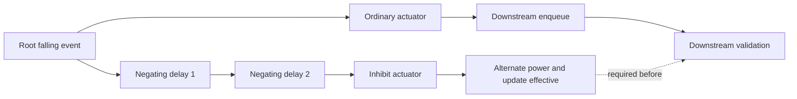

# Instant-piston schematic behavior catalog

This is interpreter evidence and a compiler requirements catalog. No piston parser or Redpiler execution support is implemented. Logical one is a **new nonzero-to-zero transition** from a declared ready state; positive power is a physical condition, not that logical one. Internal reset/clock cycles remain part of the accepted response. New external data or computations during reset are undefined unless a dossier establishes a separate ready protocol.

Evidence categories remain separate: author intent (including clarifications during this assignment), exact imported state, observed MCHPRS behavior, independent Java behavior, mechanism inferred from geometry/source, and proposed compiler guard. A passing boundary projection does not certify an arbitrary non-instant consumer or a generalized circuit family.

The initial checkout was clean at `38bda8c94c0ccaed6e0548e50118d07cce6f1e47`, with no applicable AGENTS.md. Shared-checkout commits and unrelated edits continued during work. Every MCHPRS trace embeds its actual revision, working-tree state and relevant source SHA-256 values; [source-baseline.json](../test_data/instant-pistons/source-baseline.json) is the latest capture baseline, not a replacement for older embedded identities. Test recorder hooks are cfg(test), deterministic and inactive in normal server builds. No interpreter rules were changed.

The shared generated-artifact policy excludes inspection JSON, detailed traces, projections and the trace index from Git. These local artifacts are fully present, indexed and hash-linked in fixture manifests. [tools/README.md](../tools/README.md) documents regeneration; the Java projection regression is an explicit opt-in and was run successfully. This catalog's detailed evidence links refer to the local generated artifacts, while schematic binaries and final fixture protocols remain versioned.

## Reproduction and coordinate contract

All ports use selection-local (x,y,z) coordinates relative to the saved minimum corner. NBT cells are x-fastest, z-next, y-slowest. `Schema::read` negates Sponge displacement (v2 WEOffset metadata takes precedence; v3 Offset); `paste_clipboard` subtracts that loader offset from the supplied anchor. At saved orientation our minimum is (40,30,40), anchor = minimum + loader_offset, and absolute = minimum + local. Four-way clockwise horizontal rotations transform both coordinates and block state directions; vertical mechanisms are distinct constructions. The test helper verifies dimensions and offsets against the actual loader. [worldedit/mod.rs](../crates/core/src/plot/worldedit/mod.rs) contains the actual paste implementation; there is no clipboard.rs.

Paste writes raw states, then entities, without redstone placement notifications. Initial tick is 0/BetweenTicks and queues are empty. Each saved-idle episode runs 24 bounded game ticks to test imported quiescence; it does not prove stability under arbitrary callbacks. Prepared arithmetic writes all data caps before notifying them in declared order, then waits for two unchanged, quiescent completed boundaries, bounded at 32. Raw storage, notified source destruction, ordinary Java setblock and construction diagnostics are explicitly different operations.

The [inspection utility](../tools/inspect_instant_pistons.py) independently decodes gzip NBT v2/v3, palette/varints, exact cell counts, offsets and entities; preserves front/back/legacy original text and normalizes strings, JSON components, text/extra objects and component lists. The per-fixture label table includes candidate nearby electrical/mechanical positions; final maps follow geometry and controlled experiments, not a nearest-block rule. Full saved state and raw sign entities are in inspection JSON. CPU files retain full palette/entity inventories; their nonair cell arrays and behavior are deferred.

MCHPRS [capture](../tools/capture_instant_pistons.py) uses pico operations and nested test-scoped callback instrumentation. Samples include initial state, every action, every operation (including administrative tick completion), completed boundaries, full initial watched cells and indexed cell deltas, raw states/properties/entities, QC predicates, ordered scheduled requests (relative due/priority/type), events, motion progress/previous_progress/identity and consumer observations. Callbacks include action index, operation index, logical tick, phase and nesting depth. The scheduled execution record itself has position/type; its priority/due is retained in the preceding queue snapshot. Callback order is measured in MCHPRS; Java command captures do not expose it. Source-inferred shape notifications use West,East,North,South,Down,Up; power notifications use West,East,Down,Up,North,South. Retractions can enqueue later events synchronously through nested callbacks.

Nano snapshots represent a phase's remaining operation count, not one physical circuit 'nanotick'; pico returns after one operation including its nested callbacks. The behavioral suite compares all watched cells and global scheduled/event/motion work at aligned completed boundaries for game/nano/pico, using SHA-256 to bound test memory. Loops have 200,000-operation/tick and case-specific tick bounds. Period witnesses require three complete repeated cycles of that captured state, including blocks/entities, queued work and normalized motion state; period 1 with no work is quiescence, not oscillation. A repeated output bit alone never establishes a full-state period.

Independent [Java capture](../tools/capture_instant_pistons_java.py) verifies the official 1.21.5 binary SHA-1 `e6ec2f64e6080b9b5d9b471b291c33cc7f509733` and records SHA-256. It uses a new frozen void world and a unique chunk region per fresh case. Strict states/entity merges preserve saved configurations; preparation uses normal setblock plus eight measured setup ticks; source removal uses normal setblock air. Each trace records commands and their responses. It observes all declared ports; detailed Java arithmetic internals cover the first two stages, counter internals the first three cells, while MCHPRS records all watched components. Internal Java queues/callbacks, other Java rotations and Java derived probes are not captured. MCHPRS evidence is not an independent Minecraft oracle.

## Inventory and version boundaries


| Fixture | Dimensions | Result / classification | Evidence |
| --- | --- | --- | --- |
| [ADDER_11BITS.schem](../test_data/instant-pistons/ADDER_11BITS.schem) | 21 × 7 × 46 | Canonical corrected 11-bit adder; sum modulo 2048. | [manifest](../test_data/instant-pistons/fixtures/adder_11bits.json) |
| [ADDER_1BIT.schem](../test_data/instant-pistons/ADDER_1BIT.schem) | 19 × 7 × 6 | One-bit full adder with independent sum and carry encodings. | [manifest](../test_data/instant-pistons/fixtures/adder_1bit.json) |
| [AND_1.schem](../test_data/instant-pistons/AND_1.schem) | 3 × 5 × 10 | Conjunction from two independently moved sources feeding one dust net. | [manifest](../test_data/instant-pistons/fixtures/and_1.json) |
| [AND_2.schem](../test_data/instant-pistons/AND_2.schem) | 3 × 5 × 10 | Conjunction from two power paths controlling one actuator. | [manifest](../test_data/instant-pistons/fixtures/and_2.json) |
| [AND_3.schem](../test_data/instant-pistons/AND_3.schem) | 1 × 7 × 7 | Conjunction with a remote QC power input and BUD-like update dependence. | [manifest](../test_data/instant-pistons/fixtures/and_3.json) |
| [COUNTER_BASIC.schem](../test_data/instant-pistons/COUNTER_BASIC.schem) | 24 × 17 × 34 | Stateful, free-running counter released by one external falling trigger. | [manifest](../test_data/instant-pistons/fixtures/counter_basic.json) |
| [INSTANT_BLOCKED.schem](../test_data/instant-pistons/INSTANT_BLOCKED.schem) | 1 × 5 × 8 | An instant held powered by a constant quasi-connectivity source. | [manifest](../test_data/instant-pistons/fixtures/instant_blocked.json) |
| [INSTANT_CHAIN.schem](../test_data/instant-pistons/INSTANT_CHAIN.schem) | 1 × 4 × 11 | Two instant stages propagate in one game tick through ordered callbacks. | [manifest](../test_data/instant-pistons/fixtures/instant_chain.json) |
| [INSTANT_DOWN.schem](../test_data/instant-pistons/INSTANT_DOWN.schem) | 1 × 6 × 7 | Downward observer-reset construction with the same six-tick response envelope. | [manifest](../test_data/instant-pistons/fixtures/instant_down.json) |
| [INSTANT_DOWN_TORCH_RESET.schem](../test_data/instant-pistons/INSTANT_DOWN_TORCH_RESET.schem) | 1 × 5 × 7 | Downward torch/dust reset with a quiescent endpoint. | [manifest](../test_data/instant-pistons/fixtures/instant_down_torch_reset.json) |
| [INSTANT_OBSERVER.schem](../test_data/instant-pistons/INSTANT_OBSERVER.schem) | 1 × 4 × 8 | Horizontal observer-reset instant; one falling response followed by a recurring reset. | [manifest](../test_data/instant-pistons/fixtures/instant_observer.json) |
| [INSTANT_RESET_REDSTONE.schem](../test_data/instant-pistons/INSTANT_RESET_REDSTONE.schem) | 1 × 3 × 8 | One-shot retraction in this exact saved geometry; automatic reset is not demonstrated. | [manifest](../test_data/instant-pistons/fixtures/instant_reset_redstone.json) |
| [INSTANT_RESET_REDSTONE_2.schem](../test_data/instant-pistons/INSTANT_RESET_REDSTONE_2.schem) | 1 × 4 × 8 | Dust feedback reset activated by the retracted redstone payload. | [manifest](../test_data/instant-pistons/fixtures/instant_reset_redstone_2.json) |
| [INSTANT_TORCH.schem](../test_data/instant-pistons/INSTANT_TORCH.schem) | 1 × 3 × 8 | Horizontal torch reset with a single output pulse and a stable powered reset. | [manifest](../test_data/instant-pistons/fixtures/instant_torch.json) |
| [MCHPRS_REDSTONE_UPDATE_EDGECASE.schem](../test_data/instant-pistons/MCHPRS_REDSTONE_UPDATE_EDGECASE.schem) | 8 × 8 × 7 | Downloaded 8 x 8 x 7 update/drop/recapture example, separate from the older root fixture. | [manifest](../test_data/instant-pistons/fixtures/mchprs_redstone_update_edgecase.json) |
| [NANOTICK_EXAMPLE.schem](../test_data/instant-pistons/NANOTICK_EXAMPLE.schem) | 4 × 5 × 14 | Author-supplied propagation-depth counterexample: inhibition arrives after a downstream instant has accepted a trigger. | [manifest](../test_data/instant-pistons/fixtures/nanotick_example.json) |
| [NOT_1.schem](../test_data/instant-pistons/NOT_1.schem) | 3 × 5 × 7 | Historical NOT label for A activation inhibited by B, with explicit transient order. | [manifest](../test_data/instant-pistons/fixtures/not_1.json) |
| [OR_1.schem](../test_data/instant-pistons/OR_1.schem) | 3 × 5 × 10 | Legal shared-output OR at the first-wave observation window. | [manifest](../test_data/instant-pistons/fixtures/or_1.json) |
| [OR_Interpreter_illigal.schem](../test_data/instant-pistons/OR_Interpreter_illigal.schem) | 3 × 4 × 6 | Intentional counterexample: shared payload makes dust-dependent reset unclosed; forbidden compiler scope. | [manifest](../test_data/instant-pistons/fixtures/or_interpreter_illigal.json) |
| [PM1_SORT.schem](../test_data/instant-pistons/PM1_SORT.schem) | 235 × 202 × 182 | Full behavior deferred; CPU inventory only. | [manifest](../test_data/instant-pistons/fixtures/pm1_sort.json) |
| [Q2CK_LyCore5_for_sorting.schem](../test_data/instant-pistons/Q2CK_LyCore5_for_sorting.schem) | 58 × 29 × 109 | Full behavior deferred; CPU inventory only. | [manifest](../test_data/instant-pistons/fixtures/q2ck_lycore5_for_sorting.json) |
| [XOR_Simple.schem](../test_data/instant-pistons/XOR_Simple.schem) | 3 × 7 × 8 | First-wave XOR, with a reset-phase ordering limitation. | [manifest](../test_data/instant-pistons/fixtures/xor_simple.json) |

The older root [edge case](../test_data/MCHPRS_REDSTONE_UPDATE_EDGECASE.schem) is 7 × 8 × 7, SHA-256 `ab060105a601ae825510f034ad1aa4a3d7342514ae7d4053b46b95ad97a93bfb`; its [Java reference](../test_data/piston-repair/java-redstone-update-edgecase.json) stays under its original provenance. The downloaded file is independently versioned below.

[ADDER_GWIEZDNY_TEST.schem](../test_data/ADDER_GWIEZDNY_TEST.schem), SHA-256 `1ca12fe1214dff068d7eff82a50ade332b805dc48628a1eadb5fd6a33c682245`, remains historical. Its changed-input discrepancy is not an expectation for ADDER_11BITS. No old file or frozen reference was renamed or overwritten. The earlier corrected-but-signless 21 × 7 × 45 binary is recorded in download-manifest.previous_revisions, hash `de850aabc43084b578153ea9aeb900436f2c0852ecdfe9099b0f7613f7f6f9a8`.

ADDER_11BIT is a documented remote alias of the same build with a different compressed-file hash, `b15540895ca8b21f9765e5db2b8a9a58cf635855b8cc3b15696c5ae9dc9a6124`; it is not present locally. Alias equivalence is author/download-manifest evidence, not a binary-hash substitution. All local schematic hashes match the refreshed download manifest.

PM1_SORT and Q2CK_LyCore5_for_sorting are inventoried with hashes, dimensions, complete sign text and palettes. Full behavior coverage is deferred; no CPU compilation claim is made. A standalone BUD acceptance example remains missing. NANOTICK_EXAMPLE was supplied during this assignment and now provides an actual depth-misalignment counterexample.

## Negation partial orders and compiler boundary

The supported NOT first wave permits both roots before event processing. A at (0,2,4) removes the ordinary output source; B at (2,2,4) uncovers the alternate supply. The latest author clarification allows equal-wave firing, and describes failure when the negating path has two actuator delays while the ordinary path has one. It does not impose movement-completion order. The recorded term 'negated piston' has no unambiguous single-base assignment; the concrete inhibit path and evaluation relation replace that ambiguity without claiming an author-selected actor.

| Episode | Measured relation | What fixes it / implication |
| --- | --- | --- |
| NOT AB | enqueue A < enqueue B; execute A < output=0 < execute B < output=13 | external action order, event FIFO, nested wire callbacks; a raw-wire transient occurs |
| NOT BA | execute B/uncover supply < execute A/remove ordinary source | event FIFO; raw output never reaches zero in the first wave |
| NOT repeater probe | B supply effective < due repeater evaluation | scheduled delay and live-input recheck suppress the same-wave AB transient |
| AND_3 BA | remove B/power propagation < A callback at (0,2,4) < Retract enqueue | source order; remote QC power change alone does not update the base |
| NANOTICK_EXAMPLE | execute ordinary (0,2,5) < enqueue downstream (1,2,9) < execute downstream < execute inhibit (2,2,5) | two extra negating actuators and FIFO permit an unwanted accepted trigger |
| Required inhibit contract | inhibit effective at consumer input < downstream event validation / timed consumer evaluation | retain as a cross-region order constraint, separately from the data DAG |

XOR 11 AB executes shared A (2,2,2) < Down inhibit (1,4,1) < shared B (0,2,4); BA executes shared B < shared A < inhibit. Both raw nets briefly reach zero. Arithmetic inhibition has a stronger measured cancellation witness: a wool mover's applied retraction/connection callbacks precede an already queued target's validation. Per-stage concrete coordinates and operation indices are tabulated in the adder dossiers and manifests; 'event_execute' is an attempted validation, while 'event_applied' records successful movement. The canonical LSB sum-inhibit geometry has no active witness under its fixed-zero carry-in protocol and is marked accordingly.



NANOTICK_EXAMPLE violates the dotted relation while every event still occurs in the same game tick. Rotations preserve the tested first-wave failure, but do not prove arbitrary position/direction independence. Immediate callback instrumentation measures dispatcher entry order and actual event enqueue/execution; mutation and shape traversal between entries is source-inferred. Algebraic simplification must retain externally significant reset pulses, update outputs and pending work. Original labeled nets mostly lack non-instant sinks; full consumer contracts remain separate work. Intentional unclosed resets are rejected, even if an abstract first-wave formula appears combinational.

## adder-11bits

**ADDER_11BITS.schem: Canonical corrected 11-bit adder; sum modulo 2048.** Exact SHA-256 `41476594941f234f8759c2b4b12dab72641fbda9fb5f0412a2b0089ba964464e`; dimensions 21 × 7 × 46.

Minimum origin `[40, 30, 40]`, loader offset `[2, 4, 44]`, paste anchor `[42, 34, 84]`. [Exact imported state, palette, entities and original text](../test_data/instant-pistons/inspection/adder_11bits.json); [machine-readable protocol](../test_data/instant-pistons/fixtures/adder_11bits.json).

| Sign position | Readable label/text | Candidate referenced cells | Final map/evidence |
| --- | --- | --- | --- |
| `[3, 6, 37]` | B2 | `[(2, 4, 37), (3, 3, 37), (3, 4, 37), (3, 5, 37)]` | `[3, 5, 37]`: bank bit 0 or 1; geometry and single-bit cases; geometry and current episodes |
| `[3, 6, 39]` | A2 | `[(2, 4, 39), (3, 3, 39), (3, 4, 39), (3, 5, 39)]` | `[3, 5, 39]`: bank bit 0 or 1; geometry and single-bit cases; geometry and current episodes |
| `[3, 6, 41]` | B1 | `[(2, 4, 41), (3, 3, 41), (3, 4, 41), (3, 5, 41)]` | `[3, 5, 41]`: bank bit 0 or 1; geometry and single-bit cases; geometry and current episodes |
| `[3, 6, 43]` | A1 | `[(2, 4, 43), (3, 3, 43), (3, 4, 43), (3, 5, 43)]` | `[3, 5, 43]`: bank bit 0 or 1; geometry and single-bit cases; geometry and current episodes |
| `[20, 3, 37]` | O2 | `[(18, 2, 37), (18, 3, 37), (19, 2, 37), (20, 2, 37)]` | `[20, 2, 37]`: bank bit 0 or 1; geometry and single-bit cases; geometry and current episodes |
| `[20, 3, 41]` | O1 | `[(18, 2, 41), (18, 3, 41), (19, 2, 41), (20, 2, 41)]` | `[20, 2, 41]`: bank bit 0 or 1; geometry and single-bit cases; geometry and current episodes |

| Port/observation | Selection-local cell or bank | Role |
| --- | --- | --- |
| A | `[3, 5, 43] ... [3, 5, 3], 11 cells in listed bit order` | prepared/source/update input |
| B | `[3, 5, 41] ... [3, 5, 1], 11 cells in listed bit order` | prepared/source/update input |
| trigger | `[2, 4, 45]` | prepared/source/update input |
| sum | `[20, 2, 41] ... [20, 2, 1], 11 cells in listed bit order` | physical observation; decoder and window below |

Exact refreshed binary is 21 x 7 x 46, SHA-256 41476594941f234f8759c2b4b12dab72641fbda9fb5f0412a2b0089ba964464e. Six signs A1/A2, B1/B2, O1/O2 identify the first two bit positions of each bank. Caps A_i=(3,5,43-4i), B_i=(3,5,41-4i); payload output O_i=(20,2,41-4i), i=0..10. Signs are one block above these particular caps/payloads, as verified by the geometry and single-bit experiments. Increasing bit index decreases Z. The actual trigger is (2,4,45), with no TICK sign; loader offset is (2,4,44). Each prepared cap is redstone for zero or a conducting non-source block for one.

**Initial state and setup.** Import the exact JSON-linked saved states/entities with no notifications, tick 0 BetweenTicks, empty scheduled/event/motion work. The 24-tick saved-idle episode is quiescent. For arithmetic preparation use the declared cap encoding and bounded readiness predicate; for original gate/single episodes destroy the mapped source(s) in the manifest's exact order through interaction::destroy. Destruction writes air and performs normal shape/power notifications; callback-dependent effects remain part of the action. Java command setup/removal semantics are recorded separately.

**Reset, validity and next use.** Fresh snapshots verify zero, every single bit in both banks, carry chains, 1024+1024 overflow, maximum operands, maximum-plus-one, 0x555+0x2aa in both orders and eight deterministic LCG-seeded pairs (seed 0x1a57; parameters in manifests). The eleven output payloads decode at 1..3; moving outputs at 4..5 are invalid; tick 6 is physical reset, not the arithmetic result. No twelfth observed output exists: overflow is discarded in the declared 11-bit decoder. Existing Java references also match the current hash; new pack captures independently cover the listed representative arithmetic episodes.

Prepared data use all raw writes before notifications, then two unchanged quiescent boundaries (normally two ticks); Java uses normal setblock and eight measured setup ticks. Those setup semantics are explicitly distinct. The input source is held high until trigger, so independent prepared cases do not launch computations. Repeated calculations require a separately proven rearm protocol; none is certified here.

**Classification / compiler requirement.** Do not import the 21 x 7 x 45 signless predecessor's offsets or old changed-input discrepancy. Geometric observer seeds alone miss inhibitory, downward and state/update paths. Keep the whole trigger/reset/order interface until a boundary adapter is validated.

| Inhibit actor / moved payload | Controlled wire / supply | Receiving actor or net | Operation relation / measured witness |
| --- | --- | --- | --- |
| `[8, 3, 41]` / `[10, 3, 41]` | `[10, 2, 41]` / `[10, 4, 40]` | `[13, 2, 41]` | inhibit's dust connection/power update effective before pending target Retract validation; geometry, immediate Wire Turbo callbacks and event FIFO fix tested order; prepared-1023-1-0: applied inhibit op 9 precedes target validation op 12; target canceled |
| `[14, 3, 41]` / `[16, 3, 41]` | `[16, 2, 41]` / `[16, 4, 42]` | `[18, 2, 41]` | inhibit's dust connection/power update effective before pending target Retract validation; geometry, immediate Wire Turbo callbacks and event FIFO fix tested order; geometry only; no active inhibit/target witness under declared fixed-zero carry-in protocol |
| `[8, 3, 37]` / `[10, 3, 37]` | `[10, 2, 37]` / `[10, 4, 36]` | `[13, 2, 37]` | inhibit's dust connection/power update effective before pending target Retract validation; geometry, immediate Wire Turbo callbacks and event FIFO fix tested order; prepared-2047-2047-0: applied inhibit op 18 precedes target validation op 22; target canceled |
| `[14, 3, 37]` / `[16, 3, 37]` | `[16, 2, 37]` / `[16, 4, 38]` | `[18, 2, 37]` | inhibit's dust connection/power update effective before pending target Retract validation; geometry, immediate Wire Turbo callbacks and event FIFO fix tested order; prepared-1023-1-0: applied inhibit op 21 precedes target validation op 28; target canceled |
| `[8, 3, 33]` / `[10, 3, 33]` | `[10, 2, 33]` / `[10, 4, 32]` | `[13, 2, 33]` | inhibit's dust connection/power update effective before pending target Retract validation; geometry, immediate Wire Turbo callbacks and event FIFO fix tested order; prepared-1694-1381-0: applied inhibit op 17 precedes target validation op 21; target canceled |
| `[14, 3, 33]` / `[16, 3, 33]` | `[16, 2, 33]` / `[16, 4, 34]` | `[18, 2, 33]` | inhibit's dust connection/power update effective before pending target Retract validation; geometry, immediate Wire Turbo callbacks and event FIFO fix tested order; prepared-1023-1-0: applied inhibit op 29 precedes target validation op 36; target canceled |
| `[8, 3, 29]` / `[10, 3, 29]` | `[10, 2, 29]` / `[10, 4, 28]` | `[13, 2, 29]` | inhibit's dust connection/power update effective before pending target Retract validation; geometry, immediate Wire Turbo callbacks and event FIFO fix tested order; prepared-2047-2047-0: applied inhibit op 37 precedes target validation op 43; target canceled |
| `[14, 3, 29]` / `[16, 3, 29]` | `[16, 2, 29]` / `[16, 4, 30]` | `[18, 2, 29]` | inhibit's dust connection/power update effective before pending target Retract validation; geometry, immediate Wire Turbo callbacks and event FIFO fix tested order; prepared-1023-1-0: applied inhibit op 37 precedes target validation op 44; target canceled |
| `[8, 3, 25]` / `[10, 3, 25]` | `[10, 2, 25]` / `[10, 4, 24]` | `[13, 2, 25]` | inhibit's dust connection/power update effective before pending target Retract validation; geometry, immediate Wire Turbo callbacks and event FIFO fix tested order; prepared-2047-2047-0: applied inhibit op 48 precedes target validation op 54; target canceled |
| `[14, 3, 25]` / `[16, 3, 25]` | `[16, 2, 25]` / `[16, 4, 26]` | `[18, 2, 25]` | inhibit's dust connection/power update effective before pending target Retract validation; geometry, immediate Wire Turbo callbacks and event FIFO fix tested order; prepared-1023-1-0: applied inhibit op 45 precedes target validation op 52; target canceled |
| `[8, 3, 21]` / `[10, 3, 21]` | `[10, 2, 21]` / `[10, 4, 20]` | `[13, 2, 21]` | inhibit's dust connection/power update effective before pending target Retract validation; geometry, immediate Wire Turbo callbacks and event FIFO fix tested order; prepared-1202-1129-0: applied inhibit op 28 precedes target validation op 32; target canceled |
| `[14, 3, 21]` / `[16, 3, 21]` | `[16, 2, 21]` / `[16, 4, 22]` | `[18, 2, 21]` | inhibit's dust connection/power update effective before pending target Retract validation; geometry, immediate Wire Turbo callbacks and event FIFO fix tested order; prepared-1023-1-0: applied inhibit op 53 precedes target validation op 60; target canceled |
| `[8, 3, 17]` / `[10, 3, 17]` | `[10, 2, 17]` / `[10, 4, 16]` | `[13, 2, 17]` | inhibit's dust connection/power update effective before pending target Retract validation; geometry, immediate Wire Turbo callbacks and event FIFO fix tested order; prepared-2047-2047-0: applied inhibit op 70 precedes target validation op 76; target canceled |
| `[14, 3, 17]` / `[16, 3, 17]` | `[16, 2, 17]` / `[16, 4, 18]` | `[18, 2, 17]` | inhibit's dust connection/power update effective before pending target Retract validation; geometry, immediate Wire Turbo callbacks and event FIFO fix tested order; prepared-1023-1-0: applied inhibit op 61 precedes target validation op 68; target canceled |
| `[8, 3, 13]` / `[10, 3, 13]` | `[10, 2, 13]` / `[10, 4, 12]` | `[13, 2, 13]` | inhibit's dust connection/power update effective before pending target Retract validation; geometry, immediate Wire Turbo callbacks and event FIFO fix tested order; prepared-1920-1247-0: applied inhibit op 39 precedes target validation op 43; target canceled |
| `[14, 3, 13]` / `[16, 3, 13]` | `[16, 2, 13]` / `[16, 4, 14]` | `[18, 2, 13]` | inhibit's dust connection/power update effective before pending target Retract validation; geometry, immediate Wire Turbo callbacks and event FIFO fix tested order; prepared-1023-1-0: applied inhibit op 69 precedes target validation op 74; target canceled |
| `[8, 3, 9]` / `[10, 3, 9]` | `[10, 2, 9]` / `[10, 4, 8]` | `[13, 2, 9]` | inhibit's dust connection/power update effective before pending target Retract validation; geometry, immediate Wire Turbo callbacks and event FIFO fix tested order; prepared-2047-2047-0: applied inhibit op 92 precedes target validation op 98; target canceled |
| `[14, 3, 9]` / `[16, 3, 9]` | `[16, 2, 9]` / `[16, 4, 10]` | `[18, 2, 9]` | inhibit's dust connection/power update effective before pending target Retract validation; geometry, immediate Wire Turbo callbacks and event FIFO fix tested order; prepared-1023-1-0: applied inhibit op 75 precedes target validation op 79; target canceled |
| `[8, 3, 5]` / `[10, 3, 5]` | `[10, 2, 5]` / `[10, 4, 4]` | `[13, 2, 5]` | inhibit's dust connection/power update effective before pending target Retract validation; geometry, immediate Wire Turbo callbacks and event FIFO fix tested order; prepared-2047-2047-0: applied inhibit op 102 precedes target validation op 108; target canceled |
| `[14, 3, 5]` / `[16, 3, 5]` | `[16, 2, 5]` / `[16, 4, 6]` | `[18, 2, 5]` | inhibit's dust connection/power update effective before pending target Retract validation; geometry, immediate Wire Turbo callbacks and event FIFO fix tested order; prepared-1023-1-0: applied inhibit op 80 precedes target validation op 83; target canceled |
| `[8, 3, 1]` / `[10, 3, 1]` | `[10, 2, 1]` / `[10, 4, 0]` | `[13, 2, 1]` | inhibit's dust connection/power update effective before pending target Retract validation; geometry, immediate Wire Turbo callbacks and event FIFO fix tested order; prepared-1024-1024-0: applied inhibit op 16 precedes target validation op 19; target canceled |
| `[14, 3, 1]` / `[16, 3, 1]` | `[16, 2, 1]` / `[16, 4, 2]` | `[18, 2, 1]` | inhibit's dust connection/power update effective before pending target Retract validation; geometry, immediate Wire Turbo callbacks and event FIFO fix tested order; prepared-2047-1-0: applied inhibit op 87 precedes target validation op 90; target canceled |

**Recorded result and physical timeline.** Values below are completed response boundaries 0..12: dust strength, payload type, or decoded air/redstone output bank. Zero-event cases observe unchanged readiness, not a newly generated logical zero input. Moving values remain explicit.

| Case | Ordered operations / inputs | Named observations at response boundaries |
| --- | --- | --- |
| [prepared-0-0-0](../test_data/instant-pistons/traces/mchprs-adder_11bits-prepared-0-0-0-r0.json.gz) | `prepare [0, 0, 0]; all writes, all notifications; bounded ready; destroy actual trigger` | sum: 0, 0, 0, 0, 0, 0, 0, 0, 0, 0, 0, 0, 0 |
| [prepared-1023-1-0](../test_data/instant-pistons/traces/mchprs-adder_11bits-prepared-1023-1-0-r0.json.gz) | `prepare [1023, 1, 0]; all writes, all notifications; bounded ready; destroy actual trigger` | sum: 0, 1024, 1024, 1024, [redstone_block, redstone_block, redstone_block, redstone_block, redstone_block, redstone_block, redstone_block, redstone_block, redstone_block, redstone_block, moving_piston], [redstone_block, redstone_block, redstone_block, redstone_block, redstone_block, redstone_block, redstone_block, redstone_block, redstone_block, redstone_block, moving_piston], 0, 1024, 1024, 1024, [redstone_block, redstone_block, redstone_block, redstone_block, redstone_block, redstone_block, redstone_block, redstone_block, redstone_block, redstone_block, moving_piston], [redstone_block, redstone_block, redstone_block, redstone_block, redstone_block, redstone_block, redstone_block, redstone_block, redstone_block, redstone_block, moving_piston], 0 |
| [prepared-1024-1024-0](../test_data/instant-pistons/traces/mchprs-adder_11bits-prepared-1024-1024-0-r0.json.gz) | `prepare [1024, 1024, 0]; all writes, all notifications; bounded ready; destroy actual trigger` | sum: 0, 0, 0, 0, 0, 0, 0, 0, 0, 0, 0, 0, 0 |
| [prepared-1365-682-0](../test_data/instant-pistons/traces/mchprs-adder_11bits-prepared-1365-682-0-r0.json.gz) | `prepare [1365, 682, 0]; all writes, all notifications; bounded ready; destroy actual trigger` | sum: 0, 2047, 2047, 2047, [moving_piston, moving_piston, moving_piston, moving_piston, moving_piston, moving_piston, moving_piston, moving_piston, moving_piston, moving_piston, moving_piston], [moving_piston, moving_piston, moving_piston, moving_piston, moving_piston, moving_piston, moving_piston, moving_piston, moving_piston, moving_piston, moving_piston], 0, 2047, 2047, 2047, [moving_piston, moving_piston, moving_piston, moving_piston, moving_piston, moving_piston, moving_piston, moving_piston, moving_piston, moving_piston, moving_piston], [moving_piston, moving_piston, moving_piston, moving_piston, moving_piston, moving_piston, moving_piston, moving_piston, moving_piston, moving_piston, moving_piston], 0 |
| [prepared-2047-2047-0](../test_data/instant-pistons/traces/mchprs-adder_11bits-prepared-2047-2047-0-r0.json.gz) | `prepare [2047, 2047, 0]; all writes, all notifications; bounded ready; destroy actual trigger` | sum: 0, 2046, 2046, 2046, [redstone_block, moving_piston, moving_piston, moving_piston, moving_piston, moving_piston, moving_piston, moving_piston, moving_piston, moving_piston, moving_piston], [redstone_block, moving_piston, moving_piston, moving_piston, moving_piston, moving_piston, moving_piston, moving_piston, moving_piston, moving_piston, moving_piston], 0, 2046, 2046, 2046, [redstone_block, moving_piston, moving_piston, moving_piston, moving_piston, moving_piston, moving_piston, moving_piston, moving_piston, moving_piston, moving_piston], [redstone_block, moving_piston, moving_piston, moving_piston, moving_piston, moving_piston, moving_piston, moving_piston, moving_piston, moving_piston, moving_piston], 0 |
| [prepared-682-1365-0](../test_data/instant-pistons/traces/mchprs-adder_11bits-prepared-682-1365-0-r0.json.gz) | `prepare [682, 1365, 0]; all writes, all notifications; bounded ready; destroy actual trigger` | sum: 0, 2047, 2047, 2047, [moving_piston, moving_piston, moving_piston, moving_piston, moving_piston, moving_piston, moving_piston, moving_piston, moving_piston, moving_piston, moving_piston], [moving_piston, moving_piston, moving_piston, moving_piston, moving_piston, moving_piston, moving_piston, moving_piston, moving_piston, moving_piston, moving_piston], 0, 2047, 2047, 2047, [moving_piston, moving_piston, moving_piston, moving_piston, moving_piston, moving_piston, moving_piston, moving_piston, moving_piston, moving_piston, moving_piston], [moving_piston, moving_piston, moving_piston, moving_piston, moving_piston, moving_piston, moving_piston, moving_piston, moving_piston, moving_piston, moving_piston], 0 |
| [saved-idle](../test_data/instant-pistons/traces/mchprs-adder_11bits-saved-idle-r0.json.gz) | `none; observe saved snapshot` | sum: 0, 0, 0, 0, 0, 0, 0, 0, 0, 0, 0, 0, 0 |

**Evidence / limits.** 48 frozen engine/rotation artifacts; 7 independent Java r0 episode projections match. The manifest links every case and artifact; [trace index](../test_data/instant-pistons/trace-index.json) supplies exact artifact hashes and comparison scope. Game/nano/pico complete-state agreement is tested for every declared episode and MCHPRS rotation. Fresh imports and diagnostic variants remain distinct. No arbitrary consumer boundary, external reset-time input, general repeated-use contract or backend handoff is implied.

## adder-1bit

**ADDER_1BIT.schem: One-bit full adder with independent sum and carry encodings.** Exact SHA-256 `efe9f7f1703a2fdd1403735acb8f22f98ded0242bdfd63f096896235da300363`; dimensions 19 × 7 × 6.

Minimum origin `[40, 30, 40]`, loader offset `[0, 5, 5]`, paste anchor `[40, 35, 45]`. [Exact imported state, palette, entities and original text](../test_data/instant-pistons/inspection/adder_1bit.json); [machine-readable protocol](../test_data/instant-pistons/fixtures/adder_1bit.json).

| Sign position | Readable label/text | Candidate referenced cells | Final map/evidence |
| --- | --- | --- | --- |
| `[1, 6, 1]` | B1 | `[(0, 4, 1), (1, 3, 1), (1, 4, 1), (1, 5, 1)]` | `[1, 5, 1]`: prepared data cap; one cell below this sign; geometry and current episodes |
| `[1, 6, 3]` | A1 | `[(0, 4, 3), (1, 3, 3), (1, 4, 3), (1, 5, 3)]` | `[1, 5, 3]`: prepared data cap; one cell below this sign; geometry and current episodes |
| `[9, 6, 5]` | CIn | `[(9, 3, 5), (9, 4, 5), (9, 5, 5)]` | `[9, 5, 5]`: prepared data cap; one cell below this sign; geometry and current episodes |
| `[12, 0, 0]` | Cout | `[(11, 1, 0), (11, 1, 1), (12, 1, 2), (12, 2, 1)]` | `[11, 1, 0]`: wire output beside wall sign; geometry and current episodes |
| `[18, 3, 1]` | OUT | `[(16, 2, 1), (16, 3, 1), (17, 2, 1), (18, 2, 1)]` | `[18, 2, 1]`: labeled physical output; no sink implied; geometry and current episodes |

| Port/observation | Selection-local cell or bank | Role |
| --- | --- | --- |
| A | `[1, 5, 3]` | prepared/source/update input |
| B | `[1, 5, 1]` | prepared/source/update input |
| Cin | `[9, 5, 5]` | prepared/source/update input |
| trigger | `[0, 4, 5]` | prepared/source/update input |
| sum | `[18, 2, 1]` | physical observation; decoder and window below |
| carry | `[11, 1, 0]` | physical observation; decoder and window below |
| carry_driver | `[12, 1, 2]` | physical observation; decoder and window below |

A1/B1 signs mark caps (1,5,3)/(1,5,1); CIn marks (9,5,5). A redstone cap means prepared zero, a conducting non-source cap means one. The real trigger is unlabelled source (0,4,5), feeding the input/update network. OUT marks payload (18,2,1): air means sum one; redstone block means zero; moving is invalid. Cout is a wall sign at (12,0,0), referring to wire (11,1,0), not the block below the sign. Carry one is its 14-to-zero response. The repeater (12,1,2) remains powered: it supplies the conducting wool bridge moved by base (9,1,2), rather than consuming the decoded carry. This observation corrected the capture harness's initial candidate-consumer description.

**Initial state and setup.** Import the exact JSON-linked saved states/entities with no notifications, tick 0 BetweenTicks, empty scheduled/event/motion work. The 24-tick saved-idle episode is quiescent. For arithmetic preparation use the declared cap encoding and bounded readiness predicate; for original gate/single episodes destroy the mapped source(s) in the manifest's exact order through interaction::destroy. Destruction writes air and performs normal shape/power notifications; callback-dependent effects remain part of the action. Java command setup/removal semantics are recorded separately.

**Reset, validity and next use.** All eight prepared vectors are verified with fresh quiet snapshots. Sum is available at 1..3, becomes moving at 4..5 for active sum, and resets at 6. Carry is valid at 1..5. Observer reset and several inhibitory paths explain different sum/carry physical timing. Preparation writes all caps, then notifies all caps, then requires two unchanged quiescent boundaries (observed two ticks); no fixed eight-tick readiness assumption is used in MCHPRS.

Reset cycles are retained in full traces. No arbitrary external reuse or downstream consumer handoff is certified. The internal repeater is an upstream driver, not proof of a carry consumer boundary.

**Classification / compiler requirement.** Validate caps, trigger network, carry wool bridge, width-one arithmetic and both observation windows; retain inhibition and reset order.

| Inhibit actor / moved payload | Controlled wire / supply | Receiving actor or net | Operation relation / measured witness |
| --- | --- | --- | --- |
| `[6, 3, 1]` / `[8, 3, 1]` | `[8, 2, 1]` / `[8, 4, 0]` | `[11, 2, 1]` | inhibit's dust connection/power update effective before pending target Retract validation; geometry, immediate Wire Turbo callbacks and event FIFO fix tested order; prepared-1-1-0: applied inhibit op 6 precedes target validation op 9; target canceled |
| `[12, 3, 1]` / `[14, 3, 1]` | `[14, 2, 1]` / `[14, 4, 2]` | `[16, 2, 1]` | inhibit's dust connection/power update effective before pending target Retract validation; geometry, immediate Wire Turbo callbacks and event FIFO fix tested order; prepared-0-1-1: applied inhibit op 7 precedes target validation op 10; target canceled |

**Recorded result and physical timeline.** Values below are completed response boundaries 0..12: dust strength, payload type, or decoded air/redstone output bank. Zero-event cases observe unchanged readiness, not a newly generated logical zero input. Moving values remain explicit.

| Case | Ordered operations / inputs | Named observations at response boundaries |
| --- | --- | --- |
| [prepared-0-0-0](../test_data/instant-pistons/traces/mchprs-adder_1bit-prepared-0-0-0-r0.json.gz) | `raw [1, 5, 3], raw [1, 5, 1], raw [9, 5, 5], notify [1, 5, 3], notify [1, 5, 1], notify [9, 5, 5], wait_ready 32, destroy [0, 4, 5]` | carry: 14, 14, 14, 14, 14, 14, 14, 14, 14, 14, 14, 14, 14; carry_driver: repeater, repeater, repeater, repeater, repeater, repeater, repeater, repeater, repeater, repeater, repeater, repeater, repeater; sum: redstone_block, redstone_block, redstone_block, redstone_block, redstone_block, redstone_block, redstone_block, redstone_block, redstone_block, redstone_block, redstone_block, redstone_block, redstone_block |
| [prepared-0-0-1](../test_data/instant-pistons/traces/mchprs-adder_1bit-prepared-0-0-1-r0.json.gz) | `raw [1, 5, 3], raw [1, 5, 1], raw [9, 5, 5], notify [1, 5, 3], notify [1, 5, 1], notify [9, 5, 5], wait_ready 32, destroy [0, 4, 5]` | carry: 14, 14, 14, 14, 14, 14, 14, 14, 14, 14, 14, 14, 14; carry_driver: repeater, repeater, repeater, repeater, repeater, repeater, repeater, repeater, repeater, repeater, repeater, repeater, repeater; sum: redstone_block, air, air, air, moving_piston, moving_piston, redstone_block, air, air, air, moving_piston, moving_piston, redstone_block |
| [prepared-0-1-0](../test_data/instant-pistons/traces/mchprs-adder_1bit-prepared-0-1-0-r0.json.gz) | `raw [1, 5, 3], raw [1, 5, 1], raw [9, 5, 5], notify [1, 5, 3], notify [1, 5, 1], notify [9, 5, 5], wait_ready 32, destroy [0, 4, 5]` | carry: 14, 14, 14, 14, 14, 14, 14, 14, 14, 14, 14, 14, 14; carry_driver: repeater, repeater, repeater, repeater, repeater, repeater, repeater, repeater, repeater, repeater, repeater, repeater, repeater; sum: redstone_block, air, air, air, moving_piston, moving_piston, redstone_block, air, air, air, moving_piston, moving_piston, redstone_block |
| [prepared-0-1-1](../test_data/instant-pistons/traces/mchprs-adder_1bit-prepared-0-1-1-r0.json.gz) | `raw [1, 5, 3], raw [1, 5, 1], raw [9, 5, 5], notify [1, 5, 3], notify [1, 5, 1], notify [9, 5, 5], wait_ready 32, destroy [0, 4, 5]` | carry: 14, 0, 0, 0, 0, 0, 14, 0, 0, 0, 0, 0, 14; carry_driver: repeater, repeater, repeater, repeater, repeater, repeater, repeater, repeater, repeater, repeater, repeater, repeater, repeater; sum: redstone_block, redstone_block, redstone_block, redstone_block, redstone_block, redstone_block, redstone_block, redstone_block, redstone_block, redstone_block, redstone_block, redstone_block, redstone_block |
| [prepared-1-0-0](../test_data/instant-pistons/traces/mchprs-adder_1bit-prepared-1-0-0-r0.json.gz) | `raw [1, 5, 3], raw [1, 5, 1], raw [9, 5, 5], notify [1, 5, 3], notify [1, 5, 1], notify [9, 5, 5], wait_ready 32, destroy [0, 4, 5]` | carry: 14, 14, 14, 14, 14, 14, 14, 14, 14, 14, 14, 14, 14; carry_driver: repeater, repeater, repeater, repeater, repeater, repeater, repeater, repeater, repeater, repeater, repeater, repeater, repeater; sum: redstone_block, air, air, air, moving_piston, moving_piston, redstone_block, air, air, air, moving_piston, moving_piston, redstone_block |
| [prepared-1-0-1](../test_data/instant-pistons/traces/mchprs-adder_1bit-prepared-1-0-1-r0.json.gz) | `raw [1, 5, 3], raw [1, 5, 1], raw [9, 5, 5], notify [1, 5, 3], notify [1, 5, 1], notify [9, 5, 5], wait_ready 32, destroy [0, 4, 5]` | carry: 14, 0, 0, 0, 0, 0, 14, 0, 0, 0, 0, 0, 14; carry_driver: repeater, repeater, repeater, repeater, repeater, repeater, repeater, repeater, repeater, repeater, repeater, repeater, repeater; sum: redstone_block, redstone_block, redstone_block, redstone_block, redstone_block, redstone_block, redstone_block, redstone_block, redstone_block, redstone_block, redstone_block, redstone_block, redstone_block |
| [prepared-1-1-0](../test_data/instant-pistons/traces/mchprs-adder_1bit-prepared-1-1-0-r0.json.gz) | `raw [1, 5, 3], raw [1, 5, 1], raw [9, 5, 5], notify [1, 5, 3], notify [1, 5, 1], notify [9, 5, 5], wait_ready 32, destroy [0, 4, 5]` | carry: 14, 0, 0, 0, 0, 0, 14, 0, 0, 0, 0, 0, 14; carry_driver: repeater, repeater, repeater, repeater, repeater, repeater, repeater, repeater, repeater, repeater, repeater, repeater, repeater; sum: redstone_block, redstone_block, redstone_block, redstone_block, redstone_block, redstone_block, redstone_block, redstone_block, redstone_block, redstone_block, redstone_block, redstone_block, redstone_block |
| [prepared-1-1-1](../test_data/instant-pistons/traces/mchprs-adder_1bit-prepared-1-1-1-r0.json.gz) | `raw [1, 5, 3], raw [1, 5, 1], raw [9, 5, 5], notify [1, 5, 3], notify [1, 5, 1], notify [9, 5, 5], wait_ready 32, destroy [0, 4, 5]` | carry: 14, 0, 0, 0, 0, 0, 14, 0, 0, 0, 0, 0, 14; carry_driver: repeater, repeater, repeater, repeater, repeater, repeater, repeater, repeater, repeater, repeater, repeater, repeater, repeater; sum: redstone_block, air, air, air, moving_piston, moving_piston, redstone_block, air, air, air, moving_piston, moving_piston, redstone_block |
| [saved-idle](../test_data/instant-pistons/traces/mchprs-adder_1bit-saved-idle-r0.json.gz) | `none; observe saved snapshot` | carry: 14, 14, 14, 14, 14, 14, 14, 14, 14, 14, 14, 14, 14; carry_driver: repeater, repeater, repeater, repeater, repeater, repeater, repeater, repeater, repeater, repeater, repeater, repeater, repeater; sum: redstone_block, redstone_block, redstone_block, redstone_block, redstone_block, redstone_block, redstone_block, redstone_block, redstone_block, redstone_block, redstone_block, redstone_block, redstone_block |

**Evidence / limits.** 18 frozen engine/rotation artifacts; 9 independent Java r0 episode projections match. The manifest links every case and artifact; [trace index](../test_data/instant-pistons/trace-index.json) supplies exact artifact hashes and comparison scope. Game/nano/pico complete-state agreement is tested for every declared episode and MCHPRS rotation. Fresh imports and diagnostic variants remain distinct. No arbitrary consumer boundary, external reset-time input, general repeated-use contract or backend handoff is implied.

## and-1

**AND_1.schem: Conjunction from two independently moved sources feeding one dust net.** Exact SHA-256 `3affa57440433286e8898e5982b6028300517ec6dee39ebafd9760bda743043c`; dimensions 3 × 5 × 10.

Minimum origin `[40, 30, 40]`, loader offset `[0, 3, 9]`, paste anchor `[40, 33, 49]`. [Exact imported state, palette, entities and original text](../test_data/instant-pistons/inspection/and_1.json); [machine-readable protocol](../test_data/instant-pistons/fixtures/and_1.json).

| Sign position | Readable label/text | Candidate referenced cells | Final map/evidence |
| --- | --- | --- | --- |
| `[0, 3, 9]` | INB | `[(0, 2, 7), (0, 2, 8), (0, 2, 9), (0, 3, 7), (2, 2, 9)]` | `[0, 2, 9]`: input source; falling event supplies logical one; geometry and current episodes |
| `[1, 1, 0]` | OUT | `[(1, 2, 1), (1, 2, 2)]` | `[1, 2, 1]`: labeled physical output; no sink implied; geometry and current episodes |
| `[2, 3, 9]` | IN A | `[(0, 2, 9), (2, 2, 7), (2, 2, 8), (2, 2, 9), (2, 3, 7)]` | `[2, 2, 9]`: input source; falling event supplies logical one; geometry and current episodes |

| Port/observation | Selection-local cell or bank | Role |
| --- | --- | --- |
| A | `[2, 2, 9]` | prepared/source/update input |
| B | `[0, 2, 9]` | prepared/source/update input |
| output | `[1, 2, 1]` | physical observation; decoder and window below |

Sources A/B are (2,2,9)/(0,2,9); North-facing bases (2,2,7)/(0,2,7) move payloads at (2,2,5)/(0,2,5). Both payloads power dust (1,2,5), leading to labeled endpoint (1,2,1), initially 11. One payload remaining keeps the net nonzero; only both falling events remove both sources. Both AB and BA produce zero in tick 1. The conjunction arises from falling-event decoding of an electrical maximum, not from treating a static dust join as a positive AND.

**Initial state and setup.** Import the exact JSON-linked saved states/entities with no notifications, tick 0 BetweenTicks, empty scheduled/event/motion work. The 24-tick saved-idle episode is quiescent. For arithmetic preparation use the declared cap encoding and bounded readiness predicate; for original gate/single episodes destroy the mapped source(s) in the manifest's exact order through interaction::destroy. Destruction writes air and performs normal shape/power notifications; callback-dependent effects remain part of the action. Java command setup/removal semantics are recorded separately.

**Reset, validity and next use.** Independent observer/cap resets restore both payloads at 6; the both-event response repeats every six ticks. Single-event episodes can move internally without a terminal falling edge. No external consumer is attached to the labeled net.

**Classification / compiler requirement.** Keep both sources, common net and attenuation. Do not lower this net to conjunction until falling-event context is declared.

Saved slice y=2: P base, H head, R redstone source/payload, d dust, s inert support, V observer; other states '?'. Full layers are in inspection JSON.

```text
x=012
z=00 ...
z=01 .d.
z=02 .d.
z=03 .d.
z=04 .d.
z=05 RdR
z=06 H.H
z=07 P.P
z=08 d.d
z=09 R.R
```

**Recorded result and physical timeline.** Values below are completed response boundaries 0..12: dust strength, payload type, or decoded air/redstone output bank. Zero-event cases observe unchanged readiness, not a newly generated logical zero input. Moving values remain explicit.

| Case | Ordered operations / inputs | Named observations at response boundaries |
| --- | --- | --- |
| [events-00-ab](../test_data/instant-pistons/traces/mchprs-and_1-events-00-ab-r0.json.gz) | `none; observe saved snapshot` | output: 11, 11, 11, 11, 11, 11, 11, 11, 11, 11, 11, 11, 11 |
| [events-01-ab](../test_data/instant-pistons/traces/mchprs-and_1-events-01-ab-r0.json.gz) | `destroy [0, 2, 9]` | output: 11, 11, 11, 11, 11, 11, 11, 11, 11, 11, 11, 11, 11 |
| [events-10-ab](../test_data/instant-pistons/traces/mchprs-and_1-events-10-ab-r0.json.gz) | `destroy [2, 2, 9]` | output: 11, 11, 11, 11, 11, 11, 11, 11, 11, 11, 11, 11, 11 |
| [events-11-ab](../test_data/instant-pistons/traces/mchprs-and_1-events-11-ab-r0.json.gz) | `destroy [2, 2, 9], destroy [0, 2, 9]` | output: 11, 0, 0, 0, 0, 0, 11, 0, 0, 0, 0, 0, 11 |
| [events-11-ba](../test_data/instant-pistons/traces/mchprs-and_1-events-11-ba-r0.json.gz) | `destroy [0, 2, 9], destroy [2, 2, 9]` | output: 11, 0, 0, 0, 0, 0, 11, 0, 0, 0, 0, 0, 11 |
| [saved-idle](../test_data/instant-pistons/traces/mchprs-and_1-saved-idle-r0.json.gz) | `none; observe saved snapshot` | output: 11, 11, 11, 11, 11, 11, 11, 11, 11, 11, 11, 11, 11 |

Three-cycle full-state witnesses: events-11-ab: period 6 from response tick 1 (identity-renamed); events-11-ba: period 6 from response tick 1 (identity-renamed). Period-one quiescence must be read with the endpoint geometry above.

**Evidence / limits.** 30 frozen engine/rotation artifacts; 6 independent Java r0 episode projections match. The manifest links every case and artifact; [trace index](../test_data/instant-pistons/trace-index.json) supplies exact artifact hashes and comparison scope. Game/nano/pico complete-state agreement is tested for every declared episode and MCHPRS rotation. Fresh imports and diagnostic variants remain distinct. No arbitrary consumer boundary, external reset-time input, general repeated-use contract or backend handoff is implied.

## and-2

**AND_2.schem: Conjunction from two power paths controlling one actuator.** Exact SHA-256 `b2aa11b00b7269c3834810232392856cf6d63f7115c6a8505b3f0079d20e919d`; dimensions 3 × 5 × 10.

Minimum origin `[40, 30, 40]`, loader offset `[2, 3, 9]`, paste anchor `[42, 33, 49]`. [Exact imported state, palette, entities and original text](../test_data/instant-pistons/inspection/and_2.json); [machine-readable protocol](../test_data/instant-pistons/fixtures/and_2.json).

| Sign position | Readable label/text | Candidate referenced cells | Final map/evidence |
| --- | --- | --- | --- |
| `[0, 1, 0]` | OUT | `[(0, 2, 1), (0, 2, 2)]` | `[0, 2, 1]`: labeled physical output; no sink implied; geometry and current episodes |
| `[0, 3, 9]` | INB | `[(0, 2, 7), (0, 2, 8), (0, 2, 9), (0, 3, 7), (2, 2, 9)]` | `[0, 2, 9]`: input source; falling event supplies logical one; geometry and current episodes |
| `[2, 3, 9]` | IN A | `[(0, 2, 9), (2, 2, 7), (2, 2, 8), (2, 2, 9)]` | `[2, 2, 9]`: input source; falling event supplies logical one; geometry and current episodes |

| Port/observation | Selection-local cell or bank | Role |
| --- | --- | --- |
| A | `[2, 2, 9]` | prepared/source/update input |
| B | `[0, 2, 9]` | prepared/source/update input |
| output | `[0, 2, 1]` | physical observation; decoder and window below |

North-facing base (0,2,7) moves one payload at (0,2,5). B (0,2,9) powers its rear wire (0,2,8); A (2,2,9) powers the side branch through (2,2,8), (2,2,7), (1,2,7). Either remaining path keeps the base powered. Both input removal orders allow retraction and the endpoint (0,2,1), initially 12, falls in tick 1. One observer/cap performs reset.

**Initial state and setup.** Import the exact JSON-linked saved states/entities with no notifications, tick 0 BetweenTicks, empty scheduled/event/motion work. The 24-tick saved-idle episode is quiescent. For arithmetic preparation use the declared cap encoding and bounded readiness predicate; for original gate/single episodes destroy the mapped source(s) in the manifest's exact order through interaction::destroy. Destruction writes air and performs normal shape/power notifications; callback-dependent effects remain part of the action. Java command setup/removal semantics are recorded separately.

**Reset, validity and next use.** Both-event output is low 1..5 and restored at 6, with six-tick cycles under held zero. Independent input cases start from the same saved extended snapshot.

**Classification / compiler requirement.** Single-actuator dual-power conjunction is structurally different from AND_1's two-payload conjunction; validate both power paths and callback delivery.

Saved slice y=2: P base, H head, R redstone source/payload, d dust, s inert support, V observer; other states '?'. Full layers are in inspection JSON.

```text
x=012
z=00 ...
z=01 d..
z=02 d..
z=03 d..
z=04 d..
z=05 R..
z=06 H..
z=07 Pdd
z=08 d.d
z=09 R.R
```

**Recorded result and physical timeline.** Values below are completed response boundaries 0..12: dust strength, payload type, or decoded air/redstone output bank. Zero-event cases observe unchanged readiness, not a newly generated logical zero input. Moving values remain explicit.

| Case | Ordered operations / inputs | Named observations at response boundaries |
| --- | --- | --- |
| [events-00-ab](../test_data/instant-pistons/traces/mchprs-and_2-events-00-ab-r0.json.gz) | `none; observe saved snapshot` | output: 12, 12, 12, 12, 12, 12, 12, 12, 12, 12, 12, 12, 12 |
| [events-01-ab](../test_data/instant-pistons/traces/mchprs-and_2-events-01-ab-r0.json.gz) | `destroy [0, 2, 9]` | output: 12, 12, 12, 12, 12, 12, 12, 12, 12, 12, 12, 12, 12 |
| [events-10-ab](../test_data/instant-pistons/traces/mchprs-and_2-events-10-ab-r0.json.gz) | `destroy [2, 2, 9]` | output: 12, 12, 12, 12, 12, 12, 12, 12, 12, 12, 12, 12, 12 |
| [events-11-ab](../test_data/instant-pistons/traces/mchprs-and_2-events-11-ab-r0.json.gz) | `destroy [2, 2, 9], destroy [0, 2, 9]` | output: 12, 0, 0, 0, 0, 0, 12, 0, 0, 0, 0, 0, 12 |
| [events-11-ba](../test_data/instant-pistons/traces/mchprs-and_2-events-11-ba-r0.json.gz) | `destroy [0, 2, 9], destroy [2, 2, 9]` | output: 12, 0, 0, 0, 0, 0, 12, 0, 0, 0, 0, 0, 12 |
| [saved-idle](../test_data/instant-pistons/traces/mchprs-and_2-saved-idle-r0.json.gz) | `none; observe saved snapshot` | output: 12, 12, 12, 12, 12, 12, 12, 12, 12, 12, 12, 12, 12 |

Three-cycle full-state witnesses: events-11-ab: period 6 from response tick 1 (identity-renamed); events-11-ba: period 6 from response tick 1 (identity-renamed). Period-one quiescence must be read with the endpoint geometry above.

**Evidence / limits.** 30 frozen engine/rotation artifacts; 6 independent Java r0 episode projections match. The manifest links every case and artifact; [trace index](../test_data/instant-pistons/trace-index.json) supplies exact artifact hashes and comparison scope. Game/nano/pico complete-state agreement is tested for every declared episode and MCHPRS rotation. Fresh imports and diagnostic variants remain distinct. No arbitrary consumer boundary, external reset-time input, general repeated-use contract or backend handoff is implied.

## and-3

**AND_3.schem: Conjunction with a remote QC power input and BUD-like update dependence.** Exact SHA-256 `307f9b9a9eb6c8f750c0a8b9524fba575bd2ba10fc203cbdec4725ea374cfbf9`; dimensions 1 × 7 × 7.

Minimum origin `[40, 30, 40]`, loader offset `[0, 6, 6]`, paste anchor `[40, 36, 46]`. [Exact imported state, palette, entities and original text](../test_data/instant-pistons/inspection/and_3.json); [machine-readable protocol](../test_data/instant-pistons/fixtures/and_3.json).

| Sign position | Readable label/text | Candidate referenced cells | Final map/evidence |
| --- | --- | --- | --- |
| `[0, 1, 0]` | OUT | `[(0, 1, 3), (0, 2, 1), (0, 2, 2)]` | `[0, 2, 1]`: labeled physical output; no sink implied; geometry and current episodes |
| `[0, 3, 4]` | Note that / this is also / a BUD-switch / but it is reseted | `[(0, 1, 3), (0, 2, 2), (0, 2, 3), (0, 2, 4), (0, 2, 5), (0, 2, 6), (0, 5, 4), (0, 5, 5)]` | `[0, 2, 4]`: embedded BUD base; remote power and local update are separate; geometry and current episodes |
| `[0, 3, 6]` | IN A | `[(0, 2, 4), (0, 2, 5), (0, 2, 6), (0, 5, 5), (0, 5, 6)]` | `[0, 2, 6]`: input source; falling event supplies logical one; geometry and current episodes |
| `[0, 6, 6]` | INB | `[(0, 5, 4), (0, 5, 5), (0, 5, 6)]` | `[0, 5, 6]`: input source; falling event supplies logical one; geometry and current episodes |

| Port/observation | Selection-local cell or bank | Role |
| --- | --- | --- |
| A | `[0, 2, 6]` | prepared/source/update input |
| B | `[0, 5, 6]` | prepared/source/update input |
| output | `[0, 2, 1]` | physical observation; decoder and window below |

North-facing base (0,2,4), payload (0,2,2), output dust (0,2,1). A (0,2,6) delivers power and updates through (0,2,5). B (0,5,6) powers upper dust (0,5,5..4) and sandstone (0,4,4), contributing QC. B's removal changes power without delivering a base callback. A's callback must see B already low. BA retracts in tick 1; AB leaves the base extended and output 15 despite both sources gone. This is a supported synchronization guard and an update-history witness, not a Boolean-table failure under the BA protocol.

**Initial state and setup.** Import the exact JSON-linked saved states/entities with no notifications, tick 0 BetweenTicks, empty scheduled/event/motion work. The 24-tick saved-idle episode is quiescent. For arithmetic preparation use the declared cap encoding and bounded readiness predicate; for original gate/single episodes destroy the mapped source(s) in the manifest's exact order through interaction::destroy. Destruction writes air and performs normal shape/power notifications; callback-dependent effects remain part of the action. Java command setup/removal semantics are recorded separately.

**Reset, validity and next use.** The sign at (0,3,4) explicitly says this is also a BUD switch but reset. Dust (0,1,3) beneath the head closes feedback when the pulled redstone block becomes stationary. Reset does not make a late B callback appear: the AB episode retains its saved history until an independent recheck. The BA response has six-tick cycles; no repeated external calculation is certified.

**Classification / compiler requirement.** Require destroy(B)/power propagation before callback(A to base). Preserve the power/update separation and reset dependency on payload. This embedded memory example does not constitute standalone BUD acceptance.

Saved slice y=2: P base, H head, R redstone source/payload, d dust, s inert support, V observer; other states '?'. Full layers are in inspection JSON.

```text
x=0
z=00 .
z=01 d
z=02 R
z=03 H
z=04 P
z=05 d
z=06 R
```

**Recorded result and physical timeline.** Values below are completed response boundaries 0..12: dust strength, payload type, or decoded air/redstone output bank. Zero-event cases observe unchanged readiness, not a newly generated logical zero input. Moving values remain explicit.

| Case | Ordered operations / inputs | Named observations at response boundaries |
| --- | --- | --- |
| [events-00-ab](../test_data/instant-pistons/traces/mchprs-and_3-events-00-ab-r0.json.gz) | `none; observe saved snapshot` | output: 15, 15, 15, 15, 15, 15, 15, 15, 15, 15, 15, 15, 15 |
| [events-01-ab](../test_data/instant-pistons/traces/mchprs-and_3-events-01-ab-r0.json.gz) | `destroy [0, 5, 6]` | output: 15, 15, 15, 15, 15, 15, 15, 15, 15, 15, 15, 15, 15 |
| [events-10-ab](../test_data/instant-pistons/traces/mchprs-and_3-events-10-ab-r0.json.gz) | `destroy [0, 2, 6]` | output: 15, 15, 15, 15, 15, 15, 15, 15, 15, 15, 15, 15, 15 |
| [events-11-ab](../test_data/instant-pistons/traces/mchprs-and_3-events-11-ab-r0.json.gz) | `destroy [0, 2, 6], destroy [0, 5, 6]` | output: 15, 15, 15, 15, 15, 15, 15, 15, 15, 15, 15, 15, 15 |
| [events-11-ba](../test_data/instant-pistons/traces/mchprs-and_3-events-11-ba-r0.json.gz) | `destroy [0, 5, 6], destroy [0, 2, 6]` | output: 15, 0, 0, 0, 0, 0, 15, 0, 0, 0, 0, 0, 15 |
| [misaligned-ab](../test_data/instant-pistons/traces/mchprs-and_3-misaligned-ab-r0.json.gz) | `destroy [0, 2, 6], wait 1, destroy [0, 5, 6]` | output: 15, 15, 15, 15, 15, 15, 15, 15, 15, 15, 15, 15, 15 |
| [saved-idle](../test_data/instant-pistons/traces/mchprs-and_3-saved-idle-r0.json.gz) | `none; observe saved snapshot` | output: 15, 15, 15, 15, 15, 15, 15, 15, 15, 15, 15, 15, 15 |

Three-cycle full-state witnesses: events-11-ab: period 1 from response tick 1 (identity-renamed); events-11-ba: period 6 from response tick 1 (identity-renamed). Period-one quiescence must be read with the endpoint geometry above.

**Evidence / limits.** 34 frozen engine/rotation artifacts; 6 independent Java r0 episode projections match. The manifest links every case and artifact; [trace index](../test_data/instant-pistons/trace-index.json) supplies exact artifact hashes and comparison scope. Game/nano/pico complete-state agreement is tested for every declared episode and MCHPRS rotation. Fresh imports and diagnostic variants remain distinct. No arbitrary consumer boundary, external reset-time input, general repeated-use contract or backend handoff is implied.

## counter-basic

**COUNTER_BASIC.schem: Stateful, free-running counter released by one external falling trigger.** Exact SHA-256 `d65d424aa0751d855148b0aa097a4a5517d978f38e58dd8a8b269dcd94e25863`; dimensions 24 × 17 × 34.

Minimum origin `[40, 30, 40]`, loader offset `[7, 8, 1]`, paste anchor `[47, 38, 41]`. [Exact imported state, palette, entities and original text](../test_data/instant-pistons/inspection/counter_basic.json); [machine-readable protocol](../test_data/instant-pistons/fixtures/counter_basic.json).

| Sign position | Readable label/text | Candidate referenced cells | Final map/evidence |
| --- | --- | --- | --- |
| `[3, 12, 18]` | Update generator | `[(2, 10, 18), (2, 11, 18), (2, 12, 18), (3, 11, 18), (4, 11, 17), (4, 11, 19)]` | `[[2, 11, 18], [3, 11, 18]]`: ordinary Down piston and West observer, not an output bit; geometry and current episodes |
| `[5, 12, 3]` | BUD / Memory / Cell | `[(4, 11, 3), (4, 11, 4), (5, 9, 3), (5, 10, 3), (5, 11, 3), (5, 11, 5), (6, 12, 3), (6, 12, 5), (7, 12, 3), (8, 12, 3)]` | `[5, 11, 3]`: first BUD storage base, bank LSB; geometry and current episodes |
| `[7, 9, 0]` | Trigger | `[(6, 8, 1), (7, 8, 0), (7, 8, 1), (8, 8, 1), (9, 8, 0), (9, 9, 0)]` | `[7, 8, 0]`: external source/update trigger; geometry and current episodes |

| Port/observation | Selection-local cell or bank | Role |
| --- | --- | --- |
| trigger | `[7, 8, 0]` | prepared/source/update input |
| memory | `[5, 11, 3] ... [5, 11, 33], 16 cells in listed bit order` | physical observation; decoder and window below |
| candidate_output | `[20, 6, 3] ... [20, 6, 33], 16 cells in listed bit order` | physical observation; decoder and window below |
| generator | `[2, 11, 18]` | physical observation; decoder and window below |

Author confirms source (7,8,0), beneath Trigger sign (7,9,0), releases the clock rather than requesting a count per source removal. Update generator sign (3,12,18) marks the ordinary Down-facing piston (2,11,18) and adjacent West-facing observer (3,11,18); it does not label an output bit. BUD/Memory/Cell sign (5,12,3) marks first memory base (5,11,3). Sixteen repeated memory bases are (5,11,3+2i); retracted is stored one, extended is zero. The bank increments Z from least to most significant. Wires (20,6,3+2i) are observed candidate output paths, but carry/reset pulses make them an unsuitable persistent count decoder.

**Initial state and setup.** Import the exact JSON-linked saved states/entities with no notifications, tick 0 BetweenTicks, empty scheduled/event/motion work. The 24-tick saved-idle episode is quiescent. For arithmetic preparation use the declared cap encoding and bounded readiness predicate; for original gate/single episodes destroy the mapped source(s) in the manifest's exact order through interaction::destroy. Destruction writes air and performs normal shape/power notifications; callback-dependent effects remain part of the action. Java command setup/removal semantics are recorded separately.

**Reset, validity and next use.** Saved memory is all extended, decoding zero. Under held-low trigger, completed boundaries 6,12,...,96 decode counts 1..16, carrying through the first five cells. Boundaries 5+6n and 6+6n retain the same stored count; intervening moving states make the full bank temporarily invalid. The update generator emits further internal computation waves; repeated observation of the root's held zero is not their origin. Both engines reproduce this sequence. The full counter state is not periodic over 96 ticks.

The memory/reset/update generator state persists between internal clock waves. External stop/restart, explicit memory clear, high carry and 16-bit wrap are not verified by this bounded run. Do not certify overflow or reset based only on bank length. Fresh imports are the tested release protocol.

**Classification / compiler requirement.** Keep BUD storage and clock state as explicit execution owners; only validated instant subsections may be simplified. This is embedded memory coverage, not a standalone BUD suite.

**Recorded result and physical timeline.** Values below are completed response boundaries 0..12: dust strength, payload type, or decoded air/redstone output bank. Zero-event cases observe unchanged readiness, not a newly generated logical zero input. Moving values remain explicit.

| Case | Ordered operations / inputs | Named observations at response boundaries |
| --- | --- | --- |
| [released-clock](../test_data/instant-pistons/traces/mchprs-counter_basic-released-clock-r0.json.gz) | `destroy [7, 8, 0]` | memory at 6n: 1,2,...,16; moving bank invalid between storage updates; output dust records pulses, not stored count |
| [saved-idle](../test_data/instant-pistons/traces/mchprs-counter_basic-saved-idle-r0.json.gz) | `none; observe saved snapshot` | generator: true, true, true, true, true, true, true, true, true, true, true, true, true |

**Evidence / limits.** 4 frozen engine/rotation artifacts; 2 independent Java r0 episode projections match. The manifest links every case and artifact; [trace index](../test_data/instant-pistons/trace-index.json) supplies exact artifact hashes and comparison scope. Game/nano/pico complete-state agreement is tested for every declared episode and MCHPRS rotation. Fresh imports and diagnostic variants remain distinct. No arbitrary consumer boundary, external reset-time input, general repeated-use contract or backend handoff is implied.

## instant-blocked

**INSTANT_BLOCKED.schem: An instant held powered by a constant quasi-connectivity source.** Exact SHA-256 `c752ed6a8b93e4e6abc365a3c09e0a89fb178ecd2bb2b44014314ba335491b7d`; dimensions 1 × 5 × 8.

Minimum origin `[40, 30, 40]`, loader offset `[0, 1, 1]`, paste anchor `[40, 31, 41]`. [Exact imported state, palette, entities and original text](../test_data/instant-pistons/inspection/instant_blocked.json); [machine-readable protocol](../test_data/instant-pistons/fixtures/instant_blocked.json).

| Sign position | Readable label/text | Candidate referenced cells | Final map/evidence |
| --- | --- | --- | --- |
| `[0, 0, 7]` | OUTPUT | `[(0, 1, 5), (0, 1, 6)]` | `[0, 1, 6]`: labeled physical output; no sink implied; geometry and current episodes |
| `[0, 2, 0]` | INPUT | `[(0, 1, 0), (0, 1, 1), (0, 2, 2), (0, 2, 3)]` | `[0, 1, 0]`: external source/update trigger; geometry and current episodes |
| `[0, 4, 3]` | This makes / pistion / bahave as / const 1 | `[(0, 1, 3), (0, 2, 2), (0, 2, 3), (0, 3, 3)]` | `[0, 3, 3]`: constant QC source; not a falling-event one; geometry and current episodes |

| Port/observation | Selection-local cell or bank | Role |
| --- | --- | --- |
| input | `[0, 1, 0]` | prepared/source/update input |
| blocker | `[0, 3, 3]` | prepared/source/update input |
| output | `[0, 1, 6]` | physical observation; decoder and window below |

Base (0,1,3), observer (0,2,3), head/payload (0,1,4..5), and output dust (0,1,6). The explanatory sign at (0,4,3) refers to redstone block (0,3,3): that cap directly satisfies QC and keeps the base extended when the external input (0,1,0) is removed. The output remains strength 15, with no retraction event. The sign's 'const 1' describes the author's physical convention; it is not a newly generated falling-event one.

**Initial state and setup.** Import the exact JSON-linked saved states/entities with no notifications, tick 0 BetweenTicks, empty scheduled/event/motion work. The 24-tick saved-idle episode is quiescent. For arithmetic preparation use the declared cap encoding and bounded readiness predicate; for original gate/single episodes destroy the mapped source(s) in the manifest's exact order through interaction::destroy. Destruction writes air and performs normal shape/power notifications; callback-dependent effects remain part of the action. Java command setup/removal semantics are recorded separately.

**Reset, validity and next use.** Removing the cap first allows retraction but also removes the observer's conducting reset path: the recorded 'unblocked' case ends retracted. The separate derived conducting-cap case replaces the redstone cap with stone, waits for measured readiness, and restores observer-reset behavior. Original and derived geometry remain separate cases.

**Classification / compiler requirement.** Classify original as ForcedPowered. Do not accept a reset because an observer is present; constant cap power changes its role.

Saved slice y=2: P base, H head, R redstone source/payload, d dust, s inert support, V observer; other states '?'. Full layers are in inspection JSON.

```text
x=0
z=00 ?
z=01 .
z=02 d
z=03 V
z=04 .
z=05 .
z=06 .
z=07 .
```

**Recorded result and physical timeline.** Values below are completed response boundaries 0..12: dust strength, payload type, or decoded air/redstone output bank. Zero-event cases observe unchanged readiness, not a newly generated logical zero input. Moving values remain explicit.

| Case | Ordered operations / inputs | Named observations at response boundaries |
| --- | --- | --- |
| [falling](../test_data/instant-pistons/traces/mchprs-instant_blocked-falling-r0.json.gz) | `destroy [0, 1, 0]` | output: 15, 15, 15, 15, 15, 15, 15, 15, 15, 15, 15, 15, 15 |
| [held-zero](../test_data/instant-pistons/traces/mchprs-instant_blocked-held-zero-r0.json.gz) | `destroy [0, 1, 0], wait 12, notify [0, 1, 0]` | output: 15, 15, 15, 15, 15, 15, 15, 15, 15, 15, 15, 15, 15 |
| [rearm-diagnostic](../test_data/instant-pistons/traces/mchprs-instant_blocked-rearm-diagnostic-r0.json.gz) | `destroy [0, 1, 0], wait 12, set_notified [0, 1, 0], wait 20, destroy [0, 1, 0]` | output: 15, 15, 15, 15, 15, 15, 15, 15, 15, 15, 15, 15, 15 |
| [saved-idle](../test_data/instant-pistons/traces/mchprs-instant_blocked-saved-idle-r0.json.gz) | `none; observe saved snapshot` | output: 15, 15, 15, 15, 15, 15, 15, 15, 15, 15, 15, 15, 15 |
| [unblocked-conducting-cap](../test_data/instant-pistons/traces/mchprs-instant_blocked-unblocked-conducting-cap-r0.json.gz) | `set_notified [0, 3, 3], wait_ready 32, destroy [0, 1, 0]` | output: 15, 0, 0, 0, 0, 0, 15, 0, 0, 0, 0, 0, 15 |
| [unblocked](../test_data/instant-pistons/traces/mchprs-instant_blocked-unblocked-r0.json.gz) | `destroy [0, 3, 3], wait 12, destroy [0, 1, 0]` | output: 15, 0, 0, 0, 0, 0, 0, 0, 0, 0, 0, 0, 0 |

Three-cycle full-state witnesses: falling: period 1 from response tick 1 (identity-renamed). Period-one quiescence must be read with the endpoint geometry above.

**Evidence / limits.** 9 frozen engine/rotation artifacts; 3 independent Java r0 episode projections match. The manifest links every case and artifact; [trace index](../test_data/instant-pistons/trace-index.json) supplies exact artifact hashes and comparison scope. Game/nano/pico complete-state agreement is tested for every declared episode and MCHPRS rotation. Fresh imports and diagnostic variants remain distinct. No arbitrary consumer boundary, external reset-time input, general repeated-use contract or backend handoff is implied.

## instant-chain

**INSTANT_CHAIN.schem: Two instant stages propagate in one game tick through ordered callbacks.** Exact SHA-256 `aebe821de00eadbf3610dba929e64e917750ef6a2092e8668bc764a13f220f6c`; dimensions 1 × 4 × 11.

Minimum origin `[40, 30, 40]`, loader offset `[0, 1, 1]`, paste anchor `[40, 31, 41]`. [Exact imported state, palette, entities and original text](../test_data/instant-pistons/inspection/instant_chain.json); [machine-readable protocol](../test_data/instant-pistons/fixtures/instant_chain.json).

| Sign position | Readable label/text | Candidate referenced cells | Final map/evidence |
| --- | --- | --- | --- |
| `[0, 0, 10]` | OUTPUT | `[(0, 1, 8), (0, 1, 9)]` | `[0, 1, 9]`: labeled physical output; no sink implied; geometry and current episodes |
| `[0, 2, 0]` | INPUT | `[(0, 1, 0), (0, 1, 1), (0, 2, 2), (0, 2, 3)]` | `[0, 1, 0]`: external source/update trigger; geometry and current episodes |

| Port/observation | Selection-local cell or bank | Role |
| --- | --- | --- |
| input | `[0, 1, 0]` | prepared/source/update input |
| output | `[0, 1, 9]` | physical observation; decoder and window below |

Bases (0,1,3) and (0,1,6) face South, with heads one step ahead and redstone payloads two steps ahead. The first payload (0,1,5) directly powers the second base from behind; final output dust is (0,1,9). Removing (0,1,0) queues the first Retract. In tick 1 operation 1, its payload removal notifies base (0,1,6), measuring piston_power=false; nested callback depth 1 enqueues the second Retract. Event FIFO executes the second at operation 2, before movement completion. Both observers then perform their separate resets.

**Initial state and setup.** Import the exact JSON-linked saved states/entities with no notifications, tick 0 BetweenTicks, empty scheduled/event/motion work. The 24-tick saved-idle episode is quiescent. For arithmetic preparation use the declared cap encoding and bounded readiness predicate; for original gate/single episodes destroy the mapped source(s) in the manifest's exact order through interaction::destroy. Destruction writes air and performs normal shape/power notifications; callback-dependent effects remain part of the action. Java command setup/removal semantics are recorded separately.

**Reset, validity and next use.** Depth is two actuator events, not two game ticks or simultaneous motion. Both output paths repeat with a six-tick physical cycle. Initial conformance uses fresh imports; the recorded source-restoration episode is a reset-time diagnostic.

**Classification / compiler requirement.** Keep payload writer -> downstream callback -> event enqueue -> event execution edges, including those crossing a compiler region boundary.

Saved slice y=2: P base, H head, R redstone source/payload, d dust, s inert support, V observer; other states '?'. Full layers are in inspection JSON.

```text
x=0
z=00 ?
z=01 .
z=02 d
z=03 V
z=04 .
z=05 .
z=06 V
z=07 .
z=08 .
z=09 .
z=10 .
```

**Recorded result and physical timeline.** Values below are completed response boundaries 0..12: dust strength, payload type, or decoded air/redstone output bank. Zero-event cases observe unchanged readiness, not a newly generated logical zero input. Moving values remain explicit.

| Case | Ordered operations / inputs | Named observations at response boundaries |
| --- | --- | --- |
| [falling](../test_data/instant-pistons/traces/mchprs-instant_chain-falling-r0.json.gz) | `destroy [0, 1, 0]` | output: 15, 0, 0, 0, 0, 0, 15, 0, 0, 0, 0, 0, 15 |
| [held-zero](../test_data/instant-pistons/traces/mchprs-instant_chain-held-zero-r0.json.gz) | `destroy [0, 1, 0], wait 12, notify [0, 1, 0]` | output: 15, 0, 0, 0, 0, 0, 15, 0, 0, 0, 0, 0, 15 |
| [rearm-diagnostic](../test_data/instant-pistons/traces/mchprs-instant_chain-rearm-diagnostic-r0.json.gz) | `destroy [0, 1, 0], wait 12, set_notified [0, 1, 0], wait 20, destroy [0, 1, 0]` | output: 15, 0, 0, 0, 0, 0, 15, 0, 0, 0, 0, 0, 15 |
| [saved-idle](../test_data/instant-pistons/traces/mchprs-instant_chain-saved-idle-r0.json.gz) | `none; observe saved snapshot` | output: 15, 15, 15, 15, 15, 15, 15, 15, 15, 15, 15, 15, 15 |

Three-cycle full-state witnesses: falling: period 6 from response tick 1 (identity-renamed). Period-one quiescence must be read with the endpoint geometry above.

**Evidence / limits.** 18 frozen engine/rotation artifacts; 2 independent Java r0 episode projections match. The manifest links every case and artifact; [trace index](../test_data/instant-pistons/trace-index.json) supplies exact artifact hashes and comparison scope. Game/nano/pico complete-state agreement is tested for every declared episode and MCHPRS rotation. Fresh imports and diagnostic variants remain distinct. No arbitrary consumer boundary, external reset-time input, general repeated-use contract or backend handoff is implied.

## instant-down

**INSTANT_DOWN.schem: Downward observer-reset construction with the same six-tick response envelope.** Exact SHA-256 `14aa642d19ce24ea0e7cb17f017c807e9450c0e67c1c2781515376a84ca20b0e`; dimensions 1 × 6 × 7.

Minimum origin `[40, 30, 40]`, loader offset `[0, 3, 1]`, paste anchor `[40, 33, 41]`. [Exact imported state, palette, entities and original text](../test_data/instant-pistons/inspection/instant_down.json); [machine-readable protocol](../test_data/instant-pistons/fixtures/instant_down.json).

| Sign position | Readable label/text | Candidate referenced cells | Final map/evidence |
| --- | --- | --- | --- |
| `[0, 0, 6]` | OUTPUT | `[(0, 1, 4), (0, 1, 5)]` | `[0, 1, 5]`: labeled physical output; no sink implied; geometry and current episodes |
| `[0, 4, 0]` | INPUT | `[(0, 3, 0), (0, 3, 1), (0, 4, 2), (0, 4, 3)]` | `[0, 3, 0]`: external source/update trigger; geometry and current episodes |

| Port/observation | Selection-local cell or bank | Role |
| --- | --- | --- |
| input | `[0, 3, 0]` | prepared/source/update input |
| output | `[0, 1, 5]` | physical observation; decoder and window below |

Base (0,3,3) faces Down, head (0,2,3), redstone payload (0,1,3). Output dust reaches (0,1,4) and the labeled endpoint (0,1,5). The source (0,3,0) feeds climbing dust at (0,3,1) and (0,4,2). Observer (0,4,3) faces Down; sandstone cap (0,5,3) supplies QC reset. Output falls in tick 1 and returns in 6, repeatedly. The vertical payload occupies y=1..2; it is not a horizontal rotation.

**Initial state and setup.** Import the exact JSON-linked saved states/entities with no notifications, tick 0 BetweenTicks, empty scheduled/event/motion work. The 24-tick saved-idle episode is quiescent. For arithmetic preparation use the declared cap encoding and bounded readiness predicate; for original gate/single episodes destroy the mapped source(s) in the manifest's exact order through interaction::destroy. Destruction writes air and performs normal shape/power notifications; callback-dependent effects remain part of the action. Java command setup/removal semantics are recorded separately.

**Reset, validity and next use.** Strict import is extended and quiet; held-zero response is periodic. Reuse from an independently verified extended snapshot is supported; input restoration during the recurring episode remains diagnostic.

**Classification / compiler requirement.** Validate the vertical support, motion cells, climb and cap/QC route separately from horizontal matching.

Saved slice y=2: P base, H head, R redstone source/payload, d dust, s inert support, V observer; other states '?'. Full layers are in inspection JSON.

```text
x=0
z=00 s
z=01 s
z=02 .
z=03 H
z=04 .
z=05 .
z=06 .
```

**Recorded result and physical timeline.** Values below are completed response boundaries 0..12: dust strength, payload type, or decoded air/redstone output bank. Zero-event cases observe unchanged readiness, not a newly generated logical zero input. Moving values remain explicit.

| Case | Ordered operations / inputs | Named observations at response boundaries |
| --- | --- | --- |
| [falling](../test_data/instant-pistons/traces/mchprs-instant_down-falling-r0.json.gz) | `destroy [0, 3, 0]` | output: 14, 0, 0, 0, 0, 0, 14, 0, 0, 0, 0, 0, 14 |
| [held-zero](../test_data/instant-pistons/traces/mchprs-instant_down-held-zero-r0.json.gz) | `destroy [0, 3, 0], wait 12, notify [0, 3, 0]` | output: 14, 0, 0, 0, 0, 0, 14, 0, 0, 0, 0, 0, 14 |
| [rearm-diagnostic](../test_data/instant-pistons/traces/mchprs-instant_down-rearm-diagnostic-r0.json.gz) | `destroy [0, 3, 0], wait 12, set_notified [0, 3, 0], wait 20, destroy [0, 3, 0]` | output: 14, 0, 0, 0, 0, 0, 14, 0, 0, 0, 0, 0, 14 |
| [saved-idle](../test_data/instant-pistons/traces/mchprs-instant_down-saved-idle-r0.json.gz) | `none; observe saved snapshot` | output: 14, 14, 14, 14, 14, 14, 14, 14, 14, 14, 14, 14, 14 |

Three-cycle full-state witnesses: falling: period 6 from response tick 1 (identity-renamed). Period-one quiescence must be read with the endpoint geometry above.

**Evidence / limits.** 6 frozen engine/rotation artifacts; 2 independent Java r0 episode projections match. The manifest links every case and artifact; [trace index](../test_data/instant-pistons/trace-index.json) supplies exact artifact hashes and comparison scope. Game/nano/pico complete-state agreement is tested for every declared episode and MCHPRS rotation. Fresh imports and diagnostic variants remain distinct. No arbitrary consumer boundary, external reset-time input, general repeated-use contract or backend handoff is implied.

## instant-down-torch-reset

**INSTANT_DOWN_TORCH_RESET.schem: Downward torch/dust reset with a quiescent endpoint.** Exact SHA-256 `9bc3a4e58caee8eabe35405e1e6e1202374515108a03a016acd29df59992a673`; dimensions 1 × 5 × 7.

Minimum origin `[40, 30, 40]`, loader offset `[0, 3, 1]`, paste anchor `[40, 33, 41]`. [Exact imported state, palette, entities and original text](../test_data/instant-pistons/inspection/instant_down_torch_reset.json); [machine-readable protocol](../test_data/instant-pistons/fixtures/instant_down_torch_reset.json).

| Sign position | Readable label/text | Candidate referenced cells | Final map/evidence |
| --- | --- | --- | --- |
| `[0, 0, 6]` | OUTPUT | `[(0, 1, 4), (0, 1, 5)]` | `[0, 1, 5]`: labeled physical output; no sink implied; geometry and current episodes |
| `[0, 4, 0]` | INPUT | `[(0, 3, 0), (0, 3, 1), (0, 4, 2)]` | `[0, 3, 0]`: external source/update trigger; geometry and current episodes |

| Port/observation | Selection-local cell or bank | Role |
| --- | --- | --- |
| input | `[0, 3, 0]` | prepared/source/update input |
| output | `[0, 1, 5]` | physical observation; decoder and window below |

Base/head/payload and output match INSTANT_DOWN. Reset is a wall torch at (0,4,4), facing South, attached to sandstone (0,4,3), plus dust (0,3,4) on sandstone (0,2,4). Falling input removes power from the attachment path, scheduled torch power provides reset, and output returns at tick 6. It remains powered after reset rather than entering the observer oscillator.

**Initial state and setup.** Import the exact JSON-linked saved states/entities with no notifications, tick 0 BetweenTicks, empty scheduled/event/motion work. The 24-tick saved-idle episode is quiescent. For arithmetic preparation use the declared cap encoding and bounded readiness predicate; for original gate/single episodes destroy the mapped source(s) in the manifest's exact order through interaction::destroy. Destruction writes air and performs normal shape/power notifications; callback-dependent effects remain part of the action. Java command setup/removal semantics are recorded separately.

**Reset, validity and next use.** The endpoint at 6 is quiet and extended. The source-restoration/retrigger diagnostic reproduces the pulse after the torch has switched back off and queues drain. Observe the full geometry and quiet condition before next use.

**Classification / compiler requirement.** This is a distinct wall-torch attachment/reset family. Vertical orientation alone cannot justify applying horizontal guards.

Saved slice y=2: P base, H head, R redstone source/payload, d dust, s inert support, V observer; other states '?'. Full layers are in inspection JSON.

```text
x=0
z=00 s
z=01 s
z=02 .
z=03 H
z=04 s
z=05 .
z=06 .
```

**Recorded result and physical timeline.** Values below are completed response boundaries 0..12: dust strength, payload type, or decoded air/redstone output bank. Zero-event cases observe unchanged readiness, not a newly generated logical zero input. Moving values remain explicit.

| Case | Ordered operations / inputs | Named observations at response boundaries |
| --- | --- | --- |
| [falling](../test_data/instant-pistons/traces/mchprs-instant_down_torch_reset-falling-r0.json.gz) | `destroy [0, 3, 0]` | output: 14, 0, 0, 0, 0, 0, 14, 14, 14, 14, 14, 14, 14 |
| [held-zero](../test_data/instant-pistons/traces/mchprs-instant_down_torch_reset-held-zero-r0.json.gz) | `destroy [0, 3, 0], wait 12, notify [0, 3, 0]` | output: 14, 14, 14, 14, 14, 14, 14, 14, 14, 14, 14, 14, 14 |
| [rearm-diagnostic](../test_data/instant-pistons/traces/mchprs-instant_down_torch_reset-rearm-diagnostic-r0.json.gz) | `destroy [0, 3, 0], wait 12, set_notified [0, 3, 0], wait 20, destroy [0, 3, 0]` | output: 14, 0, 0, 0, 0, 0, 14, 14, 14, 14, 14, 14, 14 |
| [saved-idle](../test_data/instant-pistons/traces/mchprs-instant_down_torch_reset-saved-idle-r0.json.gz) | `none; observe saved snapshot` | output: 14, 14, 14, 14, 14, 14, 14, 14, 14, 14, 14, 14, 14 |

Three-cycle full-state witnesses: falling: period 1 from response tick 6 (identity-renamed). Period-one quiescence must be read with the endpoint geometry above.

**Evidence / limits.** 6 frozen engine/rotation artifacts; 2 independent Java r0 episode projections match. The manifest links every case and artifact; [trace index](../test_data/instant-pistons/trace-index.json) supplies exact artifact hashes and comparison scope. Game/nano/pico complete-state agreement is tested for every declared episode and MCHPRS rotation. Fresh imports and diagnostic variants remain distinct. No arbitrary consumer boundary, external reset-time input, general repeated-use contract or backend handoff is implied.

## instant-observer

**INSTANT_OBSERVER.schem: Horizontal observer-reset instant; one falling response followed by a recurring reset.** Exact SHA-256 `98984d6c07a14798c5e9c0a045823a663c4288dbbfc2af3ea96f975f6dd424a9`; dimensions 1 × 4 × 8.

Minimum origin `[40, 30, 40]`, loader offset `[0, 1, 1]`, paste anchor `[40, 31, 41]`. [Exact imported state, palette, entities and original text](../test_data/instant-pistons/inspection/instant_observer.json); [machine-readable protocol](../test_data/instant-pistons/fixtures/instant_observer.json).

| Sign position | Readable label/text | Candidate referenced cells | Final map/evidence |
| --- | --- | --- | --- |
| `[0, 0, 7]` | OUTPUT | `[(0, 1, 5), (0, 1, 6)]` | `[0, 1, 6]`: labeled physical output; no sink implied; geometry and current episodes |
| `[0, 2, 0]` | INPUT | `[(0, 1, 0), (0, 1, 1), (0, 2, 3)]` | `[0, 1, 0]`: external source/update trigger; geometry and current episodes |

| Port/observation | Selection-local cell or bank | Role |
| --- | --- | --- |
| input | `[0, 1, 0]` | prepared/source/update input |
| output | `[0, 1, 6]` | physical observation; decoder and window below |

Base (0,1,3) faces South, head (0,1,4), payload (0,1,5). Input dust (0,1,1) strongly powers sandstone (0,1,2), which powers the base. Retraction removes the source beside output dust (0,1,6). Observer (0,2,3), facing Down, watches the base and emits upward into sandstone (0,3,3). Its scheduled pulse quasi-powers the base and its output callbacks deliver the recheck. First retraction executes at response tick 1; base/payload restoration completes at 3; reset extension starts at 4; output returns at 6. This repeats every six ticks under held low input.

**Initial state and setup.** Import the exact JSON-linked saved states/entities with no notifications, tick 0 BetweenTicks, empty scheduled/event/motion work. The 24-tick saved-idle episode is quiescent. For arithmetic preparation use the declared cap encoding and bounded readiness predicate; for original gate/single episodes destroy the mapped source(s) in the manifest's exact order through interaction::destroy. Destruction writes air and performs normal shape/power notifications; callback-dependent effects remain part of the action. Java command setup/removal semantics are recorded separately.

**Reset, validity and next use.** Initial strict import is quiet and extended. There is no quiescent next-computation state under held zero. The rearm diagnostic restores the input after 12 ticks and becomes quiet, but that external action occurs in an active episode and is not a certified reuse protocol. Use fresh ready imports for conformance.

**Classification / compiler requirement.** Recognize observer facing, conducting cap, actual QC and callback path, payload conservation and periodic output. A constant Boolean level cannot replace the exposed waveform.

Saved slice y=2: P base, H head, R redstone source/payload, d dust, s inert support, V observer; other states '?'. Full layers are in inspection JSON.

```text
x=0
z=00 ?
z=01 .
z=02 .
z=03 V
z=04 .
z=05 .
z=06 .
z=07 .
```

**Recorded result and physical timeline.** Values below are completed response boundaries 0..12: dust strength, payload type, or decoded air/redstone output bank. Zero-event cases observe unchanged readiness, not a newly generated logical zero input. Moving values remain explicit.

| Case | Ordered operations / inputs | Named observations at response boundaries |
| --- | --- | --- |
| [falling](../test_data/instant-pistons/traces/mchprs-instant_observer-falling-r0.json.gz) | `destroy [0, 1, 0]` | output: 15, 0, 0, 0, 0, 0, 15, 0, 0, 0, 0, 0, 15 |
| [held-zero](../test_data/instant-pistons/traces/mchprs-instant_observer-held-zero-r0.json.gz) | `destroy [0, 1, 0], wait 12, notify [0, 1, 0]` | output: 15, 0, 0, 0, 0, 0, 15, 0, 0, 0, 0, 0, 15 |
| [rearm-diagnostic](../test_data/instant-pistons/traces/mchprs-instant_observer-rearm-diagnostic-r0.json.gz) | `destroy [0, 1, 0], wait 12, set_notified [0, 1, 0], wait 20, destroy [0, 1, 0]` | output: 15, 0, 0, 0, 0, 0, 15, 0, 0, 0, 0, 0, 15 |
| [saved-idle](../test_data/instant-pistons/traces/mchprs-instant_observer-saved-idle-r0.json.gz) | `none; observe saved snapshot` | output: 15, 15, 15, 15, 15, 15, 15, 15, 15, 15, 15, 15, 15 |

Three-cycle full-state witnesses: falling: period 6 from response tick 1 (identity-renamed). Period-one quiescence must be read with the endpoint geometry above.

**Evidence / limits.** 6 frozen engine/rotation artifacts; 2 independent Java r0 episode projections match. The manifest links every case and artifact; [trace index](../test_data/instant-pistons/trace-index.json) supplies exact artifact hashes and comparison scope. Game/nano/pico complete-state agreement is tested for every declared episode and MCHPRS rotation. Fresh imports and diagnostic variants remain distinct. No arbitrary consumer boundary, external reset-time input, general repeated-use contract or backend handoff is implied.

## instant-reset-redstone

**INSTANT_RESET_REDSTONE.schem: One-shot retraction in this exact saved geometry; automatic reset is not demonstrated.** Exact SHA-256 `e2096e7191ac281a699f6f6b89319a802070df70b09439ecba7e2e0103819e08`; dimensions 1 × 3 × 8.

Minimum origin `[40, 30, 40]`, loader offset `[0, 1, 1]`, paste anchor `[40, 31, 41]`. [Exact imported state, palette, entities and original text](../test_data/instant-pistons/inspection/instant_reset_redstone.json); [machine-readable protocol](../test_data/instant-pistons/fixtures/instant_reset_redstone.json).

| Sign position | Readable label/text | Candidate referenced cells | Final map/evidence |
| --- | --- | --- | --- |
| `[0, 0, 7]` | OUTPUT | `[(0, 1, 5), (0, 1, 6)]` | `[0, 1, 6]`: labeled physical output; no sink implied; geometry and current episodes |
| `[0, 2, 0]` | INPUT | `[(0, 1, 0), (0, 1, 1), (0, 1, 2)]` | `[0, 1, 0]`: external source/update trigger; geometry and current episodes |

| Port/observation | Selection-local cell or bank | Role |
| --- | --- | --- |
| input | `[0, 1, 0]` | prepared/source/update input |
| output | `[0, 1, 6]` | physical observation; decoder and window below |

Base (0,1,3) faces South. The input has two dust cells at (0,1,1) and (0,1,2), on sandstone; there is no observer, torch or dust below the head. Payload moves from (0,1,5) to (0,1,4). Output dust (0,1,6) falls in tick 1 and remains zero. By tick 3 the base is retracted and the payload is stationary at the head position. The front payload alone does not power the base: should_piston_extend excludes the facing side, and the saved geometry provides no closed feedback route.

**Initial state and setup.** Import the exact JSON-linked saved states/entities with no notifications, tick 0 BetweenTicks, empty scheduled/event/motion work. The 24-tick saved-idle episode is quiescent. For arithmetic preparation use the declared cap encoding and bounded readiness predicate; for original gate/single episodes destroy the mapped source(s) in the manifest's exact order through interaction::destroy. Destruction writes air and performs normal shape/power notifications; callback-dependent effects remain part of the action. Java command setup/removal semantics are recorded separately.

**Reset, validity and next use.** This is a quiet retracted endpoint, not an extended ready instant. Restoring the external source and allowing extension to finish does establish another extended snapshot; the diagnostic then reproduces retraction. Treat that as an external rearm requirement, not autonomous reset.

**Classification / compiler requirement.** Reject an autonomous-reset match for this binary. Its name supplies no proof of a dust feedback path; compare the added under-head dust in variant 2.

Saved slice y=2: P base, H head, R redstone source/payload, d dust, s inert support, V observer; other states '?'. Full layers are in inspection JSON.

```text
x=0
z=00 ?
z=01 .
z=02 .
z=03 .
z=04 .
z=05 .
z=06 .
z=07 .
```

**Recorded result and physical timeline.** Values below are completed response boundaries 0..12: dust strength, payload type, or decoded air/redstone output bank. Zero-event cases observe unchanged readiness, not a newly generated logical zero input. Moving values remain explicit.

| Case | Ordered operations / inputs | Named observations at response boundaries |
| --- | --- | --- |
| [falling](../test_data/instant-pistons/traces/mchprs-instant_reset_redstone-falling-r0.json.gz) | `destroy [0, 1, 0]` | output: 15, 0, 0, 0, 0, 0, 0, 0, 0, 0, 0, 0, 0 |
| [held-zero](../test_data/instant-pistons/traces/mchprs-instant_reset_redstone-held-zero-r0.json.gz) | `destroy [0, 1, 0], wait 12, notify [0, 1, 0]` | output: 0, 0, 0, 0, 0, 0, 0, 0, 0, 0, 0, 0, 0 |
| [rearm-diagnostic](../test_data/instant-pistons/traces/mchprs-instant_reset_redstone-rearm-diagnostic-r0.json.gz) | `destroy [0, 1, 0], wait 12, set_notified [0, 1, 0], wait 20, destroy [0, 1, 0]` | output: 15, 0, 0, 0, 0, 0, 0, 0, 0, 0, 0, 0, 0 |
| [saved-idle](../test_data/instant-pistons/traces/mchprs-instant_reset_redstone-saved-idle-r0.json.gz) | `none; observe saved snapshot` | output: 15, 15, 15, 15, 15, 15, 15, 15, 15, 15, 15, 15, 15 |

Three-cycle full-state witnesses: falling: period 1 from response tick 3 (identity-renamed). Period-one quiescence must be read with the endpoint geometry above.

**Evidence / limits.** 6 frozen engine/rotation artifacts; 2 independent Java r0 episode projections match. The manifest links every case and artifact; [trace index](../test_data/instant-pistons/trace-index.json) supplies exact artifact hashes and comparison scope. Game/nano/pico complete-state agreement is tested for every declared episode and MCHPRS rotation. Fresh imports and diagnostic variants remain distinct. No arbitrary consumer boundary, external reset-time input, general repeated-use contract or backend handoff is implied.

## instant-reset-redstone-2

**INSTANT_RESET_REDSTONE_2.schem: Dust feedback reset activated by the retracted redstone payload.** Exact SHA-256 `98c41d2162bdcc1b347810ea17ccc6c42b357ec6be1a07bb96d4fe95bec497ff`; dimensions 1 × 4 × 8.

Minimum origin `[40, 30, 40]`, loader offset `[0, 2, 1]`, paste anchor `[40, 32, 41]`. [Exact imported state, palette, entities and original text](../test_data/instant-pistons/inspection/instant_reset_redstone_2.json); [machine-readable protocol](../test_data/instant-pistons/fixtures/instant_reset_redstone_2.json).

| Sign position | Readable label/text | Candidate referenced cells | Final map/evidence |
| --- | --- | --- | --- |
| `[0, 1, 7]` | OUTPUT | `[(0, 1, 4), (0, 2, 5), (0, 2, 6)]` | `[0, 2, 6]`: labeled physical output; no sink implied; geometry and current episodes |
| `[0, 3, 0]` | INPUT | `[(0, 2, 0), (0, 2, 1), (0, 2, 2)]` | `[0, 2, 0]`: external source/update trigger; geometry and current episodes |

| Port/observation | Selection-local cell or bank | Role |
| --- | --- | --- |
| input | `[0, 2, 0]` | prepared/source/update input |
| output | `[0, 2, 6]` | physical observation; decoder and window below |

Base (0,2,3), head (0,2,4), payload (0,2,5), input dust (0,2,1..2). Reset dust (0,1,4), on sandstone (0,0,4), is beneath the head. Retraction pulls the redstone block above that dust; on stationary restoration it powers the dust, whose side power enters sandstone beneath the base (0,1,3). The resulting recheck extends the base. Moving payloads emit no source power; this accounts for the delay between computation and restored output. Output is low 1..5 and restored at 6, then repeats with period six.

**Initial state and setup.** Import the exact JSON-linked saved states/entities with no notifications, tick 0 BetweenTicks, empty scheduled/event/motion work. The 24-tick saved-idle episode is quiescent. For arithmetic preparation use the declared cap encoding and bounded readiness predicate; for original gate/single episodes destroy the mapped source(s) in the manifest's exact order through interaction::destroy. Destruction writes air and performs normal shape/power notifications; callback-dependent effects remain part of the action. Java command setup/removal semantics are recorded separately.

**Reset, validity and next use.** Held-low response is periodic. The source-restoration diagnostic closes the oscillator, but is outside initial reset-time conformance. Fresh imports are the supported independent-case protocol; recurring internal work belongs to the original root event.

**Classification / compiler requirement.** Require the under-head support/dust route and a powered movable payload. Feedback power depends on payload availability; it cannot be assumed for wool or a stolen shared payload.

Saved slice y=2: P base, H head, R redstone source/payload, d dust, s inert support, V observer; other states '?'. Full layers are in inspection JSON.

```text
x=0
z=00 R
z=01 d
z=02 d
z=03 P
z=04 H
z=05 R
z=06 d
z=07 .
```

**Recorded result and physical timeline.** Values below are completed response boundaries 0..12: dust strength, payload type, or decoded air/redstone output bank. Zero-event cases observe unchanged readiness, not a newly generated logical zero input. Moving values remain explicit.

| Case | Ordered operations / inputs | Named observations at response boundaries |
| --- | --- | --- |
| [falling](../test_data/instant-pistons/traces/mchprs-instant_reset_redstone_2-falling-r0.json.gz) | `destroy [0, 2, 0]` | output: 15, 0, 0, 0, 0, 0, 15, 0, 0, 0, 0, 0, 15 |
| [held-zero](../test_data/instant-pistons/traces/mchprs-instant_reset_redstone_2-held-zero-r0.json.gz) | `destroy [0, 2, 0], wait 12, notify [0, 2, 0]` | output: 15, 0, 0, 0, 0, 0, 15, 0, 0, 0, 0, 0, 15 |
| [rearm-diagnostic](../test_data/instant-pistons/traces/mchprs-instant_reset_redstone_2-rearm-diagnostic-r0.json.gz) | `destroy [0, 2, 0], wait 12, set_notified [0, 2, 0], wait 20, destroy [0, 2, 0]` | output: 15, 0, 0, 0, 0, 0, 15, 0, 0, 0, 0, 0, 15 |
| [saved-idle](../test_data/instant-pistons/traces/mchprs-instant_reset_redstone_2-saved-idle-r0.json.gz) | `none; observe saved snapshot` | output: 15, 15, 15, 15, 15, 15, 15, 15, 15, 15, 15, 15, 15 |

Three-cycle full-state witnesses: falling: period 6 from response tick 1 (identity-renamed). Period-one quiescence must be read with the endpoint geometry above.

**Evidence / limits.** 6 frozen engine/rotation artifacts; 2 independent Java r0 episode projections match. The manifest links every case and artifact; [trace index](../test_data/instant-pistons/trace-index.json) supplies exact artifact hashes and comparison scope. Game/nano/pico complete-state agreement is tested for every declared episode and MCHPRS rotation. Fresh imports and diagnostic variants remain distinct. No arbitrary consumer boundary, external reset-time input, general repeated-use contract or backend handoff is implied.

## instant-torch

**INSTANT_TORCH.schem: Horizontal torch reset with a single output pulse and a stable powered reset.** Exact SHA-256 `6d5ed8343ad111f0b976200ac629b7c6030e1b46a5374d548f4e41537babe1ca`; dimensions 1 × 3 × 8.

Minimum origin `[40, 30, 40]`, loader offset `[0, 1, 1]`, paste anchor `[40, 31, 41]`. [Exact imported state, palette, entities and original text](../test_data/instant-pistons/inspection/instant_torch.json); [machine-readable protocol](../test_data/instant-pistons/fixtures/instant_torch.json).

| Sign position | Readable label/text | Candidate referenced cells | Final map/evidence |
| --- | --- | --- | --- |
| `[0, 0, 7]` | OUTPUT | `[(0, 1, 5), (0, 1, 6)]` | `[0, 1, 6]`: labeled physical output; no sink implied; geometry and current episodes |
| `[0, 2, 0]` | INPUT | `[(0, 1, 0), (0, 1, 1), (0, 2, 2)]` | `[0, 1, 0]`: external source/update trigger; geometry and current episodes |

| Port/observation | Selection-local cell or bank | Role |
| --- | --- | --- |
| input | `[0, 1, 0]` | prepared/source/update input |
| output | `[0, 1, 6]` | physical observation; decoder and window below |

Base/head/payload and input/output positions match INSTANT_OBSERVER. The observer/cap are absent; an initially unlit floor torch is at (0,2,2) on the input conduction block. Falling input turns that torch on through a two-game-tick scheduled transition. Its power and notifications reset the base. Output is low at boundaries 1 through 5 and high again at 6; the torch then holds the extended mechanism powered with no continuing oscillator.

**Initial state and setup.** Import the exact JSON-linked saved states/entities with no notifications, tick 0 BetweenTicks, empty scheduled/event/motion work. The 24-tick saved-idle episode is quiescent. For arithmetic preparation use the declared cap encoding and bounded readiness predicate; for original gate/single episodes destroy the mapped source(s) in the manifest's exact order through interaction::destroy. Destruction writes air and performs normal shape/power notifications; callback-dependent effects remain part of the action. Java command setup/removal semantics are recorded separately.

**Reset, validity and next use.** By tick 6 the response is quiescent and extended, with payload restored. The recorded reuse diagnostic waits to tick 12, restores the source, waits 20 ticks (with 18 unchanged quiet boundaries), then destroys it; it reproduces the pulse. Acceptance can use the measured quiescent extended/head/payload/torch condition, not the literal wait lengths.

**Classification / compiler requirement.** Torch timing, attachment support and its own power condition are guards. This reset cannot share the observer family's persistent-low oscillator contract.

Saved slice y=2: P base, H head, R redstone source/payload, d dust, s inert support, V observer; other states '?'. Full layers are in inspection JSON.

```text
x=0
z=00 ?
z=01 .
z=02 ?
z=03 .
z=04 .
z=05 .
z=06 .
z=07 .
```

**Recorded result and physical timeline.** Values below are completed response boundaries 0..12: dust strength, payload type, or decoded air/redstone output bank. Zero-event cases observe unchanged readiness, not a newly generated logical zero input. Moving values remain explicit.

| Case | Ordered operations / inputs | Named observations at response boundaries |
| --- | --- | --- |
| [falling](../test_data/instant-pistons/traces/mchprs-instant_torch-falling-r0.json.gz) | `destroy [0, 1, 0]` | output: 15, 0, 0, 0, 0, 0, 15, 15, 15, 15, 15, 15, 15 |
| [held-zero](../test_data/instant-pistons/traces/mchprs-instant_torch-held-zero-r0.json.gz) | `destroy [0, 1, 0], wait 12, notify [0, 1, 0]` | output: 15, 15, 15, 15, 15, 15, 15, 15, 15, 15, 15, 15, 15 |
| [rearm-diagnostic](../test_data/instant-pistons/traces/mchprs-instant_torch-rearm-diagnostic-r0.json.gz) | `destroy [0, 1, 0], wait 12, set_notified [0, 1, 0], wait 20, destroy [0, 1, 0]` | output: 15, 0, 0, 0, 0, 0, 15, 15, 15, 15, 15, 15, 15 |
| [saved-idle](../test_data/instant-pistons/traces/mchprs-instant_torch-saved-idle-r0.json.gz) | `none; observe saved snapshot` | output: 15, 15, 15, 15, 15, 15, 15, 15, 15, 15, 15, 15, 15 |

Three-cycle full-state witnesses: falling: period 1 from response tick 6 (identity-renamed). Period-one quiescence must be read with the endpoint geometry above.

**Evidence / limits.** 6 frozen engine/rotation artifacts; 2 independent Java r0 episode projections match. The manifest links every case and artifact; [trace index](../test_data/instant-pistons/trace-index.json) supplies exact artifact hashes and comparison scope. Game/nano/pico complete-state agreement is tested for every declared episode and MCHPRS rotation. Fresh imports and diagnostic variants remain distinct. No arbitrary consumer boundary, external reset-time input, general repeated-use contract or backend handoff is implied.

## mchprs-redstone-update-edgecase

**MCHPRS_REDSTONE_UPDATE_EDGECASE.schem: Downloaded 8 x 8 x 7 update/drop/recapture example, separate from the older root fixture.** Exact SHA-256 `355634e77f9c75a07632ab7b72d938a2d42b04ca4366de23d049a058ac777d4c`; dimensions 8 × 8 × 7.

Minimum origin `[40, 30, 40]`, loader offset `[6, 7, 6]`, paste anchor `[46, 37, 46]`. [Exact imported state, palette, entities and original text](../test_data/instant-pistons/inspection/mchprs_redstone_update_edgecase.json); [machine-readable protocol](../test_data/instant-pistons/fixtures/mchprs_redstone_update_edgecase.json).

| Sign position | Readable label/text | Candidate referenced cells | Final map/evidence |
| --- | --- | --- | --- |
| none | no sign entities | source and feedback paths inspected directly | independent trigger/payload episode below |

| Port/observation | Selection-local cell or bank | Role |
| --- | --- | --- |
| source | `[6, 5, 6]` | prepared/source/update input |
| lever | `[7, 5, 6]` | prepared/source/update input |
| payload | `[2, 2, 2]` | physical observation; decoder and window below |
| released | `[2, 1, 2]` | physical observation; decoder and window below |
| comparator | `[1, 3, 2]` | physical observation; decoder and window below |

Trigger source is (6,5,6); its attached powered lever (7,5,6) is also removed by normal support callbacks when the source is destroyed. That source feeds the North-facing instant at (3,5,6), payload (3,5,4), and the Down-facing mechanism at (2,4,2), head (2,3,2), payload (2,2,2). Other bases at (3,3,1), (2,2,3), (0,3,0), four observers, a comparator (1,3,2) and furnace (1,3,3) complete feedback. The saved furnace has 13 redstone items and comparator output strength 1; block entities must be imported, not replaced with arbitrary constants. There are no signs.

**Initial state and setup.** Import the exact JSON-linked saved states/entities with no notifications, tick 0 BetweenTicks, empty scheduled/event/motion work. The 24-tick saved-idle episode is quiescent. For arithmetic preparation use the declared cap encoding and bounded readiness predicate; for original gate/single episodes destroy the mapped source(s) in the manifest's exact order through interaction::destroy. Destruction writes air and performs normal shape/power notifications; callback-dependent effects remain part of the action. Java command setup/removal semantics are recorded separately.

**Reset, validity and next use.** Vertical timeline: 1..2 pull payload into moving (2,3,2); 3 it is stationary there with retracted base; 4 extension begins; 5 early retraction finalizes and drops the in-flight payload at (2,2,2), leaving (2,3,2) air and the base moving; 7 base is retracted; 8 creates an empty extending head; 9 pulls the dropped payload again. The vertical payload projection repeats every eight ticks over multiple cycles. Other feedback phases are retained; no full-state period is proven within 48 ticks. The observation 'released' at (2,1,2) is a below-payload emptiness guard, not the actual drop cell.

Strict import is quiet; ordinary source destruction launches the recorded response. Reset never reaches a certified quiescent next-use state in this capture. Four MCHPRS rotations preserve drop/recapture, and current-binary Java r0 matches the declared port waveform. Old Java rotations are references for a different binary, not this one.

**Classification / compiler requirement.** Require inventory/comparator state, ordinary lever support destruction, in-flight early-retraction guards, payload finalization and actual callback paths. Reject one-payload-always-owned assumptions.

**Recorded result and physical timeline.** Values below are completed response boundaries 0..12: dust strength, payload type, or decoded air/redstone output bank. Zero-event cases observe unchanged readiness, not a newly generated logical zero input. Moving values remain explicit.

| Case | Ordered operations / inputs | Named observations at response boundaries |
| --- | --- | --- |
| [falling](../test_data/instant-pistons/traces/mchprs-mchprs_redstone_update_edgecase-falling-r0.json.gz) | `destroy [6, 5, 6]` | comparator: comparator, comparator, comparator, comparator, comparator, comparator, comparator, comparator, comparator, comparator, comparator, comparator, comparator; payload: redstone_block, air, air, air, moving_piston, redstone_block, redstone_block, redstone_block, redstone_block, air, air, air, moving_piston; released: air, air, air, air, air, air, air, air, air, air, air, air, air |
| [saved-idle](../test_data/instant-pistons/traces/mchprs-mchprs_redstone_update_edgecase-saved-idle-r0.json.gz) | `none; observe saved snapshot` | comparator: comparator, comparator, comparator, comparator, comparator, comparator, comparator, comparator, comparator, comparator, comparator, comparator, comparator; payload: redstone_block, redstone_block, redstone_block, redstone_block, redstone_block, redstone_block, redstone_block, redstone_block, redstone_block, redstone_block, redstone_block, redstone_block, redstone_block; released: air, air, air, air, air, air, air, air, air, air, air, air, air |

**Evidence / limits.** 10 frozen engine/rotation artifacts; 2 independent Java r0 episode projections match. The manifest links every case and artifact; [trace index](../test_data/instant-pistons/trace-index.json) supplies exact artifact hashes and comparison scope. Game/nano/pico complete-state agreement is tested for every declared episode and MCHPRS rotation. Fresh imports and diagnostic variants remain distinct. No arbitrary consumer boundary, external reset-time input, general repeated-use contract or backend handoff is implied.

## nanotick-example

**NANOTICK_EXAMPLE.schem: Author-supplied propagation-depth counterexample: inhibition arrives after a downstream instant has accepted a trigger.** Exact SHA-256 `61196b78d25de653e0a5189b96be85ed8f98be954055cd9b69b23bc392206414`; dimensions 4 × 5 × 14.

Minimum origin `[40, 30, 40]`, loader offset `[0, 3, 0]`, paste anchor `[40, 33, 40]`. [Exact imported state, palette, entities and original text](../test_data/instant-pistons/inspection/nanotick_example.json); [machine-readable protocol](../test_data/instant-pistons/fixtures/nanotick_example.json).

| Sign position | Readable label/text | Candidate referenced cells | Final map/evidence |
| --- | --- | --- | --- |
| `[0, 3, 0]` | Trigger | `[(0, 2, 0), (0, 2, 1), (0, 2, 2), (1, 2, 0), (3, 3, 0)]` | `[0, 2, 0]`: external source/update trigger; geometry and current episodes |
| `[1, 1, 13]` | Output | `[(1, 2, 11), (1, 2, 12)]` | `[1, 2, 12]`: labeled physical output; no sink implied; geometry and current episodes |

| Port/observation | Selection-local cell or bank | Role |
| --- | --- | --- |
| trigger | `[0, 2, 0]` | prepared/source/update input |
| output | `[1, 2, 12]` | physical observation; decoder and window below |
| inhibited_net | `[1, 2, 8]` | physical observation; decoder and window below |

Trigger (0,2,0) splits into ordinary base (0,2,5) and delayed negating path (3,2,0) -> (2,2,2) -> (2,2,5). The ordinary redstone payload (0,2,7) drives inhibited dust (1,2,7..8); the final inhibitor's sandstone payload (2,2,7) covers the powered lower dust (2,1,7), supplied by (2,1,6). The downstream South-facing base (1,2,9), payload (1,2,11), drives labeled output (1,2,12). The output sign (1,1,13) is beside this net, not its coordinate.

**Initial state and setup.** Import the exact JSON-linked saved states/entities with no notifications, tick 0 BetweenTicks, empty scheduled/event/motion work. The 24-tick saved-idle episode is quiescent. For arithmetic preparation use the declared cap encoding and bounded readiness predicate; for original gate/single episodes destroy the mapped source(s) in the manifest's exact order through interaction::destroy. Destruction writes air and performs normal shape/power notifications; callback-dependent effects remain part of the action. Java command setup/removal semantics are recorded separately.

**Reset, validity and next use.** Measured tick-1 event execution order in saved orientation: delay-1 (3,2,0), ordinary (0,2,5), delay-2 (2,2,2), downstream (1,2,9), inhibit (2,2,5). The ordinary event's nested callbacks queue downstream before delay-2 queues inhibit. At downstream validation, its net is zero. Later inhibit restores that net to 13, but the downstream retraction has already happened and final output is zero. This is the author's unwanted activation even though the Boolean guard would predict inhibition. All four MCHPRS rotations and an independent Java capture reproduce the episode.

All bases have observer/cap resets. The output repeats with a six-tick full-state period modulo motion identity renaming. This is an actual supplied nanotick synchronization example; changing stepping APIs does not create it. No new external input is introduced during reset.

**Classification / compiler requirement.** Reject the delayed-inhibit construction under the initial synchronized gate contract. Retain the physical diagnostic and the violated inhibit-before-validation relation; no parser or compiled execution acceptance is assigned. A Boolean topological DAG that erases actuator depth cannot certify this circuit.

| Inhibit actor / moved payload | Controlled wire / supply | Receiving actor or net | Operation relation / measured witness |
| --- | --- | --- | --- |
| `[2, 2, 5]` / `[2, 2, 7]` | `[2, 1, 7]` / `[2, 1, 6]` | `[1, 2, 9]` | inhibit effective before downstream Retract event validation; violated; diagnostic outside accepted scope |

Saved slice y=2: P base, H head, R redstone source/payload, d dust, s inert support, V observer; other states '?'. Full layers are in inspection JSON.

```text
x=0123
z=00 RdsP
z=01 d..H
z=02 d.PR
z=03 d.H.
z=04 s.R.
z=05 P.P.
z=06 H.H.
z=07 Rds.
z=08 .d..
z=09 .P..
z=10 .H..
z=11 .R..
z=12 .d..
z=13 ....
```

**Recorded result and physical timeline.** Values below are completed response boundaries 0..12: dust strength, payload type, or decoded air/redstone output bank. Zero-event cases observe unchanged readiness, not a newly generated logical zero input. Moving values remain explicit.

| Case | Ordered operations / inputs | Named observations at response boundaries |
| --- | --- | --- |
| [falling](../test_data/instant-pistons/traces/mchprs-nanotick_example-falling-r0.json.gz) | `destroy [0, 2, 0]` | inhibited_net: 14, 13, 13, 13, 13, 13, 14, 13, 13, 13, 13, 13, 14; output: 15, 0, 0, 0, 0, 0, 15, 0, 0, 0, 0, 0, 15 |
| [saved-idle](../test_data/instant-pistons/traces/mchprs-nanotick_example-saved-idle-r0.json.gz) | `none; observe saved snapshot` | inhibited_net: 14, 14, 14, 14, 14, 14, 14, 14, 14, 14, 14, 14, 14; output: 15, 15, 15, 15, 15, 15, 15, 15, 15, 15, 15, 15, 15 |

Three-cycle full-state witnesses: falling: period 6 from response tick 1 (identity-renamed). Period-one quiescence must be read with the endpoint geometry above.

**Evidence / limits.** 10 frozen engine/rotation artifacts; 2 independent Java r0 episode projections match. The manifest links every case and artifact; [trace index](../test_data/instant-pistons/trace-index.json) supplies exact artifact hashes and comparison scope. Game/nano/pico complete-state agreement is tested for every declared episode and MCHPRS rotation. Fresh imports and diagnostic variants remain distinct. No arbitrary consumer boundary, external reset-time input, general repeated-use contract or backend handoff is implied.

## not-1

**NOT_1.schem: Historical NOT label for A activation inhibited by B, with explicit transient order.** Exact SHA-256 `0e9ecb58307d8cb3d079c56d69317d77cf8fe480ffd813a80a42aa4ec520d180`; dimensions 3 × 5 × 7.

Minimum origin `[40, 30, 40]`, loader offset `[2, 3, 6]`, paste anchor `[42, 33, 46]`. [Exact imported state, palette, entities and original text](../test_data/instant-pistons/inspection/not_1.json); [machine-readable protocol](../test_data/instant-pistons/fixtures/not_1.json).

| Sign position | Readable label/text | Candidate referenced cells | Final map/evidence |
| --- | --- | --- | --- |
| `[0, 3, 6]` | IN A | `[(0, 2, 4), (0, 2, 5), (0, 2, 6), (0, 3, 4), (2, 2, 6)]` | `[0, 2, 6]`: input source; falling event supplies logical one; geometry and current episodes |
| `[1, 1, 0]` | OUT | `[(1, 2, 1), (1, 2, 2), (2, 1, 2)]` | `[1, 2, 1]`: labeled physical output; no sink implied; geometry and current episodes |
| `[2, 3, 6]` | INB | `[(0, 2, 6), (2, 2, 4), (2, 2, 5), (2, 2, 6), (2, 3, 4)]` | `[2, 2, 6]`: input source; falling event supplies logical one; geometry and current episodes |

| Port/observation | Selection-local cell or bank | Role |
| --- | --- | --- |
| A | `[0, 2, 6]` | prepared/source/update input |
| B | `[2, 2, 6]` | prepared/source/update input |
| output | `[1, 2, 1]` | physical observation; decoder and window below |

A drives North-facing base (0,2,4) and its redstone payload (0,2,2), powering output (1,2,1) at 14. B drives base (2,2,4), whose sandstone payload (2,2,2) covers powered lower dust (2,1,2), supplied by redstone block (2,1,3). B retraction uncovers that dust and supplies an alternate nonzero path to the output. First completed boundary decodes A && !B: 00/01/11 remain positive, 10 falls. AB event execution briefly makes output zero before B restores strength 13; BA prevents that transient. Both occur in the same game tick.

**Initial state and setup.** Import the exact JSON-linked saved states/entities with no notifications, tick 0 BetweenTicks, empty scheduled/event/motion work. The 24-tick saved-idle episode is quiescent. For arithmetic preparation use the declared cap encoding and bounded readiness predicate; for original gate/single episodes destroy the mapped source(s) in the manifest's exact order through interaction::destroy. Destruction writes air and performs normal shape/power notifications; callback-dependent effects remain part of the action. Java command setup/removal semantics are recorded separately.

**Reset, validity and next use.** The author's latest clarification allows simultaneous-wave arrival here; extra actuator depth on the negating input can break inhibition. 'Fire' is measured as event execution plus its immediate electrical/update effects, not movement completion. The original has no consumer on the labeled output, so it does not establish arbitrary consumer equivalence. A separate derived West-input repeater at (2,2,1), on new stone (2,1,1), remains powered for both AB and BA: its due recheck sees the restored positive input. Probe setup uses notified writes and measured quiet readiness. It can load the wire; its result is scoped to that probe.

Each base resets through its own observer/cap and recorded responses cycle every six ticks. First-wave interpretation is valid at boundaries 1..3. New external changes during reset are undefined. Original physical actor nomenclature 'negated piston' is not pinned to a unique base by the author; the concrete actors/paths and required consumer relation are pinned here.

**Classification / compiler requirement.** Retain inhibit-effective-before-downstream-evaluation constraints across regions. A data DAG or an assumption that B physically completes movement first is insufficient.

| Inhibit actor / moved payload | Controlled wire / supply | Receiving actor or net | Operation relation / measured witness |
| --- | --- | --- | --- |
| `[2, 2, 4]` / `[2, 2, 2]` | `[2, 1, 2]` / `[2, 1, 3]` | `[1, 2, 1]` | alternate supply effective before receiving consumer validation; equal-wave roots allowed; raw AB transient preserved; see physical episode and declared consumer-specific limit |

Saved slice y=2: P base, H head, R redstone source/payload, d dust, s inert support, V observer; other states '?'. Full layers are in inspection JSON.

```text
x=012
z=00 ...
z=01 .d.
z=02 Rds
z=03 H.H
z=04 P.P
z=05 d.d
z=06 R.R
```

**Recorded result and physical timeline.** Values below are completed response boundaries 0..12: dust strength, payload type, or decoded air/redstone output bank. Zero-event cases observe unchanged readiness, not a newly generated logical zero input. Moving values remain explicit.

| Case | Ordered operations / inputs | Named observations at response boundaries |
| --- | --- | --- |
| [events-00-ab](../test_data/instant-pistons/traces/mchprs-not_1-events-00-ab-r0.json.gz) | `none; observe saved snapshot` | output: 14, 14, 14, 14, 14, 14, 14, 14, 14, 14, 14, 14, 14 |
| [events-01-ab](../test_data/instant-pistons/traces/mchprs-not_1-events-01-ab-r0.json.gz) | `destroy [2, 2, 6]` | output: 14, 14, 14, 14, 14, 14, 14, 14, 14, 14, 14, 14, 14 |
| [events-10-ab](../test_data/instant-pistons/traces/mchprs-not_1-events-10-ab-r0.json.gz) | `destroy [0, 2, 6]` | output: 14, 0, 0, 0, 0, 0, 14, 0, 0, 0, 0, 0, 14 |
| [events-11-ab](../test_data/instant-pistons/traces/mchprs-not_1-events-11-ab-r0.json.gz) | `destroy [0, 2, 6], destroy [2, 2, 6]` | output: 14, 13, 13, 13, 13, 13, 14, 13, 13, 13, 13, 13, 14 |
| [events-11-ba](../test_data/instant-pistons/traces/mchprs-not_1-events-11-ba-r0.json.gz) | `destroy [2, 2, 6], destroy [0, 2, 6]` | output: 14, 13, 13, 13, 13, 13, 14, 13, 13, 13, 13, 13, 14 |
| [misaligned-ab](../test_data/instant-pistons/traces/mchprs-not_1-misaligned-ab-r0.json.gz) | `destroy [0, 2, 6], wait 1, destroy [2, 2, 6]` | output: 0, 13, 13, 13, 13, 14, 0, 13, 13, 13, 13, 14, 0 |
| [probe-repeater-ab](../test_data/instant-pistons/traces/mchprs-not_1-probe-repeater-ab-r0.json.gz) | `set_notified [2, 1, 1], set_notified [2, 2, 1], wait_ready 32, destroy [0, 2, 6], destroy [2, 2, 6]` | output: 14, 13, 13, 13, 13, 13, 14, 13, 13, 13, 13, 13, 14; probe: repeater, repeater, repeater, repeater, repeater, repeater, repeater, repeater, repeater, repeater, repeater, repeater, repeater |
| [probe-repeater-ba](../test_data/instant-pistons/traces/mchprs-not_1-probe-repeater-ba-r0.json.gz) | `set_notified [2, 1, 1], set_notified [2, 2, 1], wait_ready 32, destroy [2, 2, 6], destroy [0, 2, 6]` | output: 14, 13, 13, 13, 13, 13, 14, 13, 13, 13, 13, 13, 14; probe: repeater, repeater, repeater, repeater, repeater, repeater, repeater, repeater, repeater, repeater, repeater, repeater, repeater |
| [saved-idle](../test_data/instant-pistons/traces/mchprs-not_1-saved-idle-r0.json.gz) | `none; observe saved snapshot` | output: 14, 14, 14, 14, 14, 14, 14, 14, 14, 14, 14, 14, 14 |

Three-cycle full-state witnesses: events-11-ab: period 6 from response tick 1 (identity-renamed); events-11-ba: period 6 from response tick 1 (identity-renamed). Period-one quiescence must be read with the endpoint geometry above.

**Evidence / limits.** 42 frozen engine/rotation artifacts; 6 independent Java r0 episode projections match. The manifest links every case and artifact; [trace index](../test_data/instant-pistons/trace-index.json) supplies exact artifact hashes and comparison scope. Game/nano/pico complete-state agreement is tested for every declared episode and MCHPRS rotation. Fresh imports and diagnostic variants remain distinct. No arbitrary consumer boundary, external reset-time input, general repeated-use contract or backend handoff is implied.

## or-1

**OR_1.schem: Legal shared-output OR at the first-wave observation window.** Exact SHA-256 `81c59e0b94bf90f5998d5b09054899b6447e2c808c1a1710d00022a34a75e52a`; dimensions 3 × 5 × 10.

Minimum origin `[40, 30, 40]`, loader offset `[2, 3, 9]`, paste anchor `[42, 33, 49]`. [Exact imported state, palette, entities and original text](../test_data/instant-pistons/inspection/or_1.json); [machine-readable protocol](../test_data/instant-pistons/fixtures/or_1.json).

| Sign position | Readable label/text | Candidate referenced cells | Final map/evidence |
| --- | --- | --- | --- |
| `[0, 1, 0]` | OUTPUT | `[(0, 2, 1), (0, 2, 2)]` | `[0, 2, 1]`: labeled physical output; no sink implied; geometry and current episodes |
| `[0, 3, 9]` | INB | `[(0, 2, 7), (0, 2, 8), (0, 2, 9), (0, 3, 6), (2, 2, 9)]` | `[0, 2, 9]`: input source; falling event supplies logical one; geometry and current episodes |
| `[2, 3, 9]` | IN A | `[(0, 2, 9), (2, 2, 7), (2, 2, 8), (2, 2, 9)]` | `[2, 2, 9]`: input source; falling event supplies logical one; geometry and current episodes |

| Port/observation | Selection-local cell or bank | Role |
| --- | --- | --- |
| A | `[2, 2, 9]` | prepared/source/update input |
| B | `[0, 2, 9]` | prepared/source/update input |
| output | `[0, 2, 1]` | physical observation; decoder and window below |
| payload | `[0, 2, 4]` | physical observation; decoder and window below |

A source (2,2,9) feeds West-facing base (2,2,4); B source (0,2,9) feeds North-facing base (0,2,6). Heads (1,2,4) and (0,2,5) share payload (0,2,4); output dust (0,2,1) begins at strength 13. No events leaves 13 unchanged. A-only, B-only and both input orders remove the shared source from its extended position, making output zero in tick 1. Motion/entity traces conserve one payload across the shared position and either head position. Ownership is a group property; the first event can capture while another retracts without that block.

**Initial state and setup.** Import the exact JSON-linked saved states/entities with no notifications, tick 0 BetweenTicks, empty scheduled/event/motion work. The 24-tick saved-idle episode is quiescent. For arithmetic preparation use the declared cap encoding and bounded readiness predicate; for original gate/single episodes destroy the mapped source(s) in the manifest's exact order through interaction::destroy. Destruction writes air and performs normal shape/power notifications; callback-dependent effects remain part of the action. Java command setup/removal semantics are recorded separately.

**Reset, validity and next use.** Output is zero at boundaries 1..5 and 13 at 6; nonzero cases repeat every six ticks. Each base has its own observer and solid cap, so reset power does not require possession of the payload. All cases use fresh snapshots; no held-zero observation is counted as another external computation.

**Classification / compiler requirement.** Recognize both actuators, independent resets and all three allowed payload positions/owners. Do not impose permanent single-base ownership or accept the illegal dust-dependent group by analogy.

Saved slice y=2: P base, H head, R redstone source/payload, d dust, s inert support, V observer; other states '?'. Full layers are in inspection JSON.

```text
x=012
z=00 ...
z=01 d..
z=02 d..
z=03 d..
z=04 RHP
z=05 H.d
z=06 P.d
z=07 d.d
z=08 d.d
z=09 R.R
```

**Recorded result and physical timeline.** Values below are completed response boundaries 0..12: dust strength, payload type, or decoded air/redstone output bank. Zero-event cases observe unchanged readiness, not a newly generated logical zero input. Moving values remain explicit.

| Case | Ordered operations / inputs | Named observations at response boundaries |
| --- | --- | --- |
| [events-00-ab](../test_data/instant-pistons/traces/mchprs-or_1-events-00-ab-r0.json.gz) | `none; observe saved snapshot` | output: 13, 13, 13, 13, 13, 13, 13, 13, 13, 13, 13, 13, 13; payload: redstone_block, redstone_block, redstone_block, redstone_block, redstone_block, redstone_block, redstone_block, redstone_block, redstone_block, redstone_block, redstone_block, redstone_block, redstone_block |
| [events-01-ab](../test_data/instant-pistons/traces/mchprs-or_1-events-01-ab-r0.json.gz) | `destroy [0, 2, 9]` | output: 13, 0, 0, 0, 0, 0, 13, 0, 0, 0, 0, 0, 13; payload: redstone_block, air, air, air, moving_piston, moving_piston, redstone_block, air, air, air, moving_piston, moving_piston, redstone_block |
| [events-10-ab](../test_data/instant-pistons/traces/mchprs-or_1-events-10-ab-r0.json.gz) | `destroy [2, 2, 9]` | output: 13, 0, 0, 0, 0, 0, 13, 0, 0, 0, 0, 0, 13; payload: redstone_block, air, air, air, moving_piston, moving_piston, redstone_block, air, air, air, moving_piston, moving_piston, redstone_block |
| [events-11-ab](../test_data/instant-pistons/traces/mchprs-or_1-events-11-ab-r0.json.gz) | `destroy [2, 2, 9], destroy [0, 2, 9]` | output: 13, 0, 0, 0, 0, 0, 13, 0, 0, 0, 0, 0, 13; payload: redstone_block, air, air, air, moving_piston, moving_piston, redstone_block, air, air, air, moving_piston, moving_piston, redstone_block |
| [events-11-ba](../test_data/instant-pistons/traces/mchprs-or_1-events-11-ba-r0.json.gz) | `destroy [0, 2, 9], destroy [2, 2, 9]` | output: 13, 0, 0, 0, 0, 0, 13, 0, 0, 0, 0, 0, 13; payload: redstone_block, air, air, air, moving_piston, moving_piston, redstone_block, air, air, air, moving_piston, moving_piston, redstone_block |
| [saved-idle](../test_data/instant-pistons/traces/mchprs-or_1-saved-idle-r0.json.gz) | `none; observe saved snapshot` | output: 13, 13, 13, 13, 13, 13, 13, 13, 13, 13, 13, 13, 13; payload: redstone_block, redstone_block, redstone_block, redstone_block, redstone_block, redstone_block, redstone_block, redstone_block, redstone_block, redstone_block, redstone_block, redstone_block, redstone_block |

Three-cycle full-state witnesses: events-11-ab: period 6 from response tick 1 (identity-renamed); events-11-ba: period 6 from response tick 1 (identity-renamed). Period-one quiescence must be read with the endpoint geometry above.

**Evidence / limits.** 30 frozen engine/rotation artifacts; 6 independent Java r0 episode projections match. The manifest links every case and artifact; [trace index](../test_data/instant-pistons/trace-index.json) supplies exact artifact hashes and comparison scope. Game/nano/pico complete-state agreement is tested for every declared episode and MCHPRS rotation. Fresh imports and diagnostic variants remain distinct. No arbitrary consumer boundary, external reset-time input, general repeated-use contract or backend handoff is implied.

## or-interpreter-illigal

**OR_Interpreter_illigal.schem: Intentional counterexample: shared payload makes dust-dependent reset unclosed; forbidden compiler scope.** Exact SHA-256 `e67f627905055b158533da5367aedc0ba3744f57070b5f8a69af68c4fac68431`; dimensions 3 × 4 × 6.

Minimum origin `[40, 30, 40]`, loader offset `[2, 3, 5]`, paste anchor `[42, 33, 45]`. [Exact imported state, palette, entities and original text](../test_data/instant-pistons/inspection/or_interpreter_illigal.json); [machine-readable protocol](../test_data/instant-pistons/fixtures/or_interpreter_illigal.json).

| Sign position | Readable label/text | Candidate referenced cells | Final map/evidence |
| --- | --- | --- | --- |
| `[0, 3, 2]` | Note that this / OR is illigal / in interpreter / but we can still | `[(0, 1, 1), (0, 2, 0), (0, 2, 1), (0, 2, 2), (0, 2, 3), (0, 2, 4), (2, 2, 0), (2, 2, 2)]` | `[[0, 2, 2], [2, 2, 0], [0, 2, 0]]`: historical interpretation proposal; latest author clarification forbids this reset-unsafe group; geometry and current episodes |
| `[0, 3, 5]` | IN A | `[(0, 2, 3), (0, 2, 4), (0, 2, 5), (2, 2, 5)]` | `[0, 2, 5]`: input source; falling event supplies logical one; geometry and current episodes |
| `[1, 3, 2]` | Parse it as / normal OR-gate / in Redpiler | `[(0, 2, 0), (0, 2, 1), (0, 2, 2), (0, 2, 3), (1, 2, 0), (2, 2, 0), (2, 2, 1), (2, 2, 2), (2, 2, 3)]` | `[[0, 2, 2], [2, 2, 0], [0, 2, 0]]`: historical interpretation proposal; latest author clarification forbids this reset-unsafe group; geometry and current episodes |
| `[2, 3, 5]` | INB | `[(0, 2, 5), (2, 2, 3), (2, 2, 4), (2, 2, 5)]` | `[2, 2, 5]`: input source; falling event supplies logical one; geometry and current episodes |

| Port/observation | Selection-local cell or bank | Role |
| --- | --- | --- |
| A | `[0, 2, 5]` | prepared/source/update input |
| B | `[2, 2, 5]` | prepared/source/update input |
| shared_payload | `[0, 2, 0]` | physical observation; decoder and window below |
| reset_A | `[0, 1, 1]` | physical observation; decoder and window below |
| reset_B | `[1, 1, 0]` | physical observation; decoder and window below |

North-facing base (0,2,2) and West-facing base (2,2,0) have matching heads (0,2,1)/(1,2,0) and shared redstone payload (0,2,0). Both input sources are at z=5. Under-head reset dust at (0,1,1) and (1,1,0) needs the pulled powered payload to become stationary. Strict import represents the saved state, and a derived self-recheck construction from retracted bases/no heads can reach an extended head arrangement. Thus the name does not prove a malformed NBT or orphan head.

**Initial state and setup.** Import the exact JSON-linked saved states/entities with no notifications, tick 0 BetweenTicks, empty scheduled/event/motion work. The 24-tick saved-idle episode is quiescent. For arithmetic preparation use the declared cap encoding and bounded readiness predicate; for original gate/single episodes destroy the mapped source(s) in the manifest's exact order through interaction::destroy. Destruction writes air and performs normal shape/power notifications; callback-dependent effects remain part of the action. Java command setup/removal semantics are recorded separately.

**Reset, validity and next use.** The author's clarified illegality is operational: the other piston can take the powered payload needed for reset, leaving a member without an instant reset. The author excludes this undefined construction from scope and warns of direction/position dependence. MCHPRS and Java retain the exact imported state and both input orders. First OR-like payload removal occurs, but one base stays retracted after tick 6 while the owner cycles. One conserved payload is insufficient for a reusable group. Initial owners follow event order; the competing member's reset does not close.

No valid reusable truth table or compiler admissibility is assigned. Saved-idle, single/both events, four rotations and derived construction are diagnostics. The abstract shared-payload OR resemblance must not normalize or repair the fixture. Other directions/positions are not promised to be equivalent.

**Classification / compiler requirement.** Classify IntentionalCounterexample/UnclosedReset, reject compiled activation for this construction, and preserve interpreted/undefined behavior without changing interpreter rules.

Saved slice y=2: P base, H head, R redstone source/payload, d dust, s inert support, V observer; other states '?'. Full layers are in inspection JSON.

```text
x=012
z=00 RHP
z=01 H.d
z=02 Psd
z=03 d.d
z=04 d.d
z=05 R.R
```

**Recorded result and physical timeline.** Values below are completed response boundaries 0..12: dust strength, payload type, or decoded air/redstone output bank. Zero-event cases observe unchanged readiness, not a newly generated logical zero input. Moving values remain explicit.

| Case | Ordered operations / inputs | Named observations at response boundaries |
| --- | --- | --- |
| [events-00-ab](../test_data/instant-pistons/traces/mchprs-or_interpreter_illigal-events-00-ab-r0.json.gz) | `none; observe saved snapshot` | reset_A: 0, 0, 0, 0, 0, 0, 0, 0, 0, 0, 0, 0, 0; reset_B: 0, 0, 0, 0, 0, 0, 0, 0, 0, 0, 0, 0, 0; shared_payload: redstone_block, redstone_block, redstone_block, redstone_block, redstone_block, redstone_block, redstone_block, redstone_block, redstone_block, redstone_block, redstone_block, redstone_block, redstone_block |
| [events-01-ab](../test_data/instant-pistons/traces/mchprs-or_interpreter_illigal-events-01-ab-r0.json.gz) | `destroy [2, 2, 5]` | reset_A: 0, 0, 0, 0, 0, 0, 0, 0, 0, 0, 0, 0, 0; reset_B: 0, 0, 0, 15, 0, 0, 0, 0, 0, 15, 0, 0, 0; shared_payload: redstone_block, air, air, air, moving_piston, moving_piston, redstone_block, air, air, air, moving_piston, moving_piston, redstone_block |
| [events-10-ab](../test_data/instant-pistons/traces/mchprs-or_interpreter_illigal-events-10-ab-r0.json.gz) | `destroy [0, 2, 5]` | reset_A: 0, 0, 0, 15, 0, 0, 0, 0, 0, 15, 0, 0, 0; reset_B: 0, 0, 0, 0, 0, 0, 0, 0, 0, 0, 0, 0, 0; shared_payload: redstone_block, air, air, air, moving_piston, moving_piston, redstone_block, air, air, air, moving_piston, moving_piston, redstone_block |
| [events-11-ab](../test_data/instant-pistons/traces/mchprs-or_interpreter_illigal-events-11-ab-r0.json.gz) | `destroy [0, 2, 5], destroy [2, 2, 5]` | reset_A: 0, 0, 0, 15, 0, 0, 0, 0, 0, 15, 0, 0, 0; reset_B: 0, 0, 0, 0, 0, 0, 0, 0, 0, 0, 0, 0, 0; shared_payload: redstone_block, air, air, air, moving_piston, moving_piston, redstone_block, air, air, air, moving_piston, moving_piston, redstone_block |
| [events-11-ba](../test_data/instant-pistons/traces/mchprs-or_interpreter_illigal-events-11-ba-r0.json.gz) | `destroy [2, 2, 5], destroy [0, 2, 5]` | reset_A: 0, 0, 0, 0, 0, 0, 0, 0, 0, 0, 0, 0, 0; reset_B: 0, 0, 0, 15, 0, 0, 0, 0, 0, 15, 0, 0, 0; shared_payload: redstone_block, air, air, air, moving_piston, moving_piston, redstone_block, air, air, air, moving_piston, moving_piston, redstone_block |
| [reconstruct-from-retracted](../test_data/instant-pistons/traces/mchprs-or_interpreter_illigal-reconstruct-from-retracted-r0.json.gz) | `construct_retracted , wait_ready 32` | reset_A: 0, 0, 0, 0, 0, 0, 0, 0, 0, 0, 0, 0, 0; reset_B: 0, 0, 0, 0, 0, 0, 0, 0, 0, 0, 0, 0, 0; shared_payload: redstone_block, redstone_block, redstone_block, redstone_block, redstone_block, redstone_block, redstone_block, redstone_block, redstone_block, redstone_block, redstone_block, redstone_block, redstone_block |
| [saved-idle](../test_data/instant-pistons/traces/mchprs-or_interpreter_illigal-saved-idle-r0.json.gz) | `none; observe saved snapshot` | reset_A: 0, 0, 0, 0, 0, 0, 0, 0, 0, 0, 0, 0, 0; reset_B: 0, 0, 0, 0, 0, 0, 0, 0, 0, 0, 0, 0, 0; shared_payload: redstone_block, redstone_block, redstone_block, redstone_block, redstone_block, redstone_block, redstone_block, redstone_block, redstone_block, redstone_block, redstone_block, redstone_block, redstone_block |

Three-cycle full-state witnesses: events-11-ab: period 6 from response tick 3 (identity-renamed); events-11-ba: period 6 from response tick 3 (identity-renamed). Period-one quiescence must be read with the endpoint geometry above.

**Evidence / limits.** 34 frozen engine/rotation artifacts; 6 independent Java r0 episode projections match. The manifest links every case and artifact; [trace index](../test_data/instant-pistons/trace-index.json) supplies exact artifact hashes and comparison scope. Game/nano/pico complete-state agreement is tested for every declared episode and MCHPRS rotation. Fresh imports and diagnostic variants remain distinct. No arbitrary consumer boundary, external reset-time input, general repeated-use contract or backend handoff is implied.

## xor-simple

**XOR_Simple.schem: First-wave XOR, with a reset-phase ordering limitation.** Exact SHA-256 `84b00be425b4288a896ca51e9df23c3329690e67205b7204d7924fa2ce391266`; dimensions 3 × 7 × 8.

Minimum origin `[40, 30, 40]`, loader offset `[2, 3, 7]`, paste anchor `[42, 33, 47]`. [Exact imported state, palette, entities and original text](../test_data/instant-pistons/inspection/xor_simple.json); [machine-readable protocol](../test_data/instant-pistons/fixtures/xor_simple.json).

| Sign position | Readable label/text | Candidate referenced cells | Final map/evidence |
| --- | --- | --- | --- |
| `[0, 3, 7]` | INB | `[(0, 2, 5), (0, 2, 6), (0, 2, 7), (0, 3, 4), (1, 3, 6), (2, 2, 7)]` | `[0, 2, 7]`: input source; falling event supplies logical one; geometry and current episodes |
| `[2, 3, 7]` | IN A | `[(0, 2, 7), (1, 3, 6), (2, 2, 5), (2, 2, 6), (2, 2, 7)]` | `[2, 2, 7]`: input source; falling event supplies logical one; geometry and current episodes |

| Port/observation | Selection-local cell or bank | Role |
| --- | --- | --- |
| A | `[2, 2, 7]` | prepared/source/update input |
| B | `[0, 2, 7]` | prepared/source/update input |
| output | `[0, 2, 0]` | physical observation; decoder and window below |
| inhibit_payload | `[1, 2, 1]` | physical observation; decoder and window below |

A/B (2,2,7)/(0,2,7) drive the shared OR payload (0,2,2), via bases (2,2,2) West and (0,2,4) North. A third Down-facing base (1,4,1) pulls sandstone (1,2,1), uncovering dust (1,1,1) powered by (2,1,1). Its control net joins both input routes; only both removal events enable this inhibit path. The unlabeled terminal wire at (0,2,0) is reached from shared-output dust (0,2,1). First completed boundary: 00 positive 14; 10/01 zero; 11 positive 13. This establishes XOR only in the stated window.

**Initial state and setup.** Import the exact JSON-linked saved states/entities with no notifications, tick 0 BetweenTicks, empty scheduled/event/motion work. The 24-tick saved-idle episode is quiescent. For arithmetic preparation use the declared cap encoding and bounded readiness predicate; for original gate/single episodes destroy the mapped source(s) in the manifest's exact order through interaction::destroy. Destruction writes air and performs normal shape/power notifications; callback-dependent effects remain part of the action. Java command setup/removal semantics are recorded separately.

**Reset, validity and next use.** For 11 AB, first-wave execution is A/shared OR (2,2,2), inhibit (1,4,1), then B/shared OR (0,2,4): raw output is zero after operation 1 and restored to 13 after operation 2. BA executes B, A, then inhibit: zero persists through operation 2 and restores after operation 3. Both completed first boundaries match XOR, but both expose a transient before inhibition. No attached consumer establishes filtering. For 11 BA reset reaches a six-tick recurring waveform. AB is deliberately retained: output falls again at response tick 5 and later internal reset times despite both-event first-wave inhibition. No three-cycle full-state period is demonstrated in the 24-tick AB capture. Those internal effects are valid execution, not a new external trigger. No consumer adapter or repeated-use protocol is certified.

The net has no output sign or attached non-instant sink. Its mapping is derived from the shared payload-to-dust path and the uncovered lower dust; all supported combinations and rotations confirm the first-wave decoder.

**Classification / compiler requirement.** Preserve the AND-controlled inhibit path, callback depth and reset pulses. First-wave XOR does not justify suppressing later externally visible callbacks.

| Inhibit actor / moved payload | Controlled wire / supply | Receiving actor or net | Operation relation / measured witness |
| --- | --- | --- | --- |
| `[1, 4, 1]` / `[1, 2, 1]` | `[1, 1, 1]` / `[2, 1, 1]` | `[0, 2, 0]` | AND-controlled alternate supply before consumer evaluation; original has no sink; reset AB pulses retained; see physical episode and declared consumer-specific limit |

Saved slice y=2: P base, H head, R redstone source/payload, d dust, s inert support, V observer; other states '?'. Full layers are in inspection JSON.

```text
x=012
z=00 d..
z=01 ds.
z=02 RHP
z=03 H.d
z=04 P.d
z=05 d.d
z=06 d?d
z=07 R.R
```

**Recorded result and physical timeline.** Values below are completed response boundaries 0..12: dust strength, payload type, or decoded air/redstone output bank. Zero-event cases observe unchanged readiness, not a newly generated logical zero input. Moving values remain explicit.

| Case | Ordered operations / inputs | Named observations at response boundaries |
| --- | --- | --- |
| [events-00-ab](../test_data/instant-pistons/traces/mchprs-xor_simple-events-00-ab-r0.json.gz) | `none; observe saved snapshot` | inhibit_payload: sandstone, sandstone, sandstone, sandstone, sandstone, sandstone, sandstone, sandstone, sandstone, sandstone, sandstone, sandstone, sandstone; output: 14, 14, 14, 14, 14, 14, 14, 14, 14, 14, 14, 14, 14 |
| [events-01-ab](../test_data/instant-pistons/traces/mchprs-xor_simple-events-01-ab-r0.json.gz) | `destroy [0, 2, 7]` | inhibit_payload: sandstone, sandstone, sandstone, sandstone, sandstone, sandstone, sandstone, sandstone, sandstone, sandstone, sandstone, sandstone, sandstone; output: 14, 0, 0, 0, 0, 0, 14, 0, 0, 0, 0, 0, 14 |
| [events-10-ab](../test_data/instant-pistons/traces/mchprs-xor_simple-events-10-ab-r0.json.gz) | `destroy [2, 2, 7]` | inhibit_payload: sandstone, sandstone, sandstone, sandstone, sandstone, sandstone, sandstone, sandstone, sandstone, sandstone, sandstone, sandstone, sandstone; output: 14, 0, 0, 0, 0, 0, 14, 0, 0, 0, 0, 0, 14 |
| [events-11-ab](../test_data/instant-pistons/traces/mchprs-xor_simple-events-11-ab-r0.json.gz) | `destroy [2, 2, 7], destroy [0, 2, 7]` | inhibit_payload: sandstone, air, air, air, moving_piston, sandstone, sandstone, sandstone, sandstone, sandstone, sandstone, air, air; output: 14, 13, 13, 13, 13, 0, 14, 0, 0, 0, 0, 13, 14 |
| [events-11-ba](../test_data/instant-pistons/traces/mchprs-xor_simple-events-11-ba-r0.json.gz) | `destroy [0, 2, 7], destroy [2, 2, 7]` | inhibit_payload: sandstone, air, air, air, moving_piston, moving_piston, sandstone, air, air, air, moving_piston, moving_piston, sandstone; output: 14, 13, 13, 13, 13, 13, 14, 13, 13, 13, 13, 13, 14 |
| [misaligned-ab](../test_data/instant-pistons/traces/mchprs-xor_simple-misaligned-ab-r0.json.gz) | `destroy [2, 2, 7], wait 1, destroy [0, 2, 7]` | inhibit_payload: sandstone, air, air, air, moving_piston, sandstone, sandstone, sandstone, sandstone, sandstone, sandstone, air, air; output: 0, 13, 13, 13, 13, 14, 0, 0, 0, 0, 0, 14, 13 |
| [saved-idle](../test_data/instant-pistons/traces/mchprs-xor_simple-saved-idle-r0.json.gz) | `none; observe saved snapshot` | inhibit_payload: sandstone, sandstone, sandstone, sandstone, sandstone, sandstone, sandstone, sandstone, sandstone, sandstone, sandstone, sandstone, sandstone; output: 14, 14, 14, 14, 14, 14, 14, 14, 14, 14, 14, 14, 14 |

Three-cycle full-state witnesses: events-11-ba: period 6 from response tick 1 (identity-renamed). Period-one quiescence must be read with the endpoint geometry above.

**Evidence / limits.** 34 frozen engine/rotation artifacts; 6 independent Java r0 episode projections match. The manifest links every case and artifact; [trace index](../test_data/instant-pistons/trace-index.json) supplies exact artifact hashes and comparison scope. Game/nano/pico complete-state agreement is tested for every declared episode and MCHPRS rotation. Fresh imports and diagnostic variants remain distinct. No arbitrary consumer boundary, external reset-time input, general repeated-use contract or backend handoff is implied.

## Validation and remaining evidence

The focused module tests physical causal order, shared payload conservation and reset starvation, the downloaded drop/recapture, all eight full-adder vectors, corrected-adder single bits/carries/overflow/seeded vectors, persistent counter sequence, consumer-specific inhibition filtering, analog 15-to-1 then 1-to-0 behavior, and the supplied nanotick failure. Independent Java port projections include 81 episodes; all match at aligned response boundaries. Rotational Java captures and Java derived probes remain missing, as do independent command-level scheduled/callback traces.

The analog test is a derived source adapter for INSTANT_OBSERVER: comparator at (0,1,0), North input, initially supplied by redstone at (0,1,-1), then the downloaded furnace's 13-redstone inventory (strength one). After scheduled preparation settles, replacing that rear source with air creates the strength-one falling response. This is not a claim that strength one traverses arbitrary attenuating fixtures. Positive-to-positive preparation produces no root computation; held-zero rechecks leave existing internal work intact.

Standalone BUD examples are still needed for an independently declared power/update interface and reset/reuse contract. Counter high-bit carry/wrap and external stop/clear, generic sink adapters, parser recognition and interpreter handoff remain later work. The author resolved counter free-running intent and illegal shared-reset scope; the exact noun 'negated piston' remains unassigned to a single base, but the operational inhibit/consumer ordering is concrete. The newly supplied nanotick example removes the earlier missing-example limitation for this depth-misalignment episode.

Exact executed commands and pass/fail counts are in [INSTANT_PISTON_VALIDATION.md](INSTANT_PISTON_VALIDATION.md). Failed exploratory capture attempts and early harness assumptions were corrected without interpreter changes or passing-oracle substitutions. All old references remain separate.
