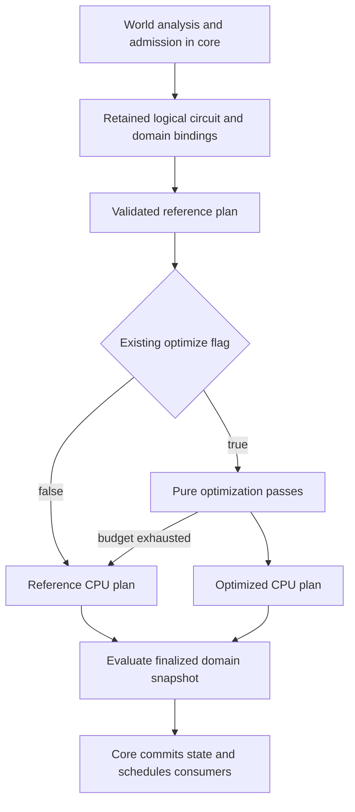

# Instant redstone optimizer scope and implementation plan

Create a separate `mchprs_redpiler_opt` crate for preparing and minimizing pure Boolean logic extracted from instant redstone circuits. Its plans execute on the host CPU. When integrated later, the existing `/rp compile --optimize` flag will enable its optimization passes for admitted regions, including regions inside a redstone CPU. Passes run during compilation; ticks execute the resulting plan.

The first implementation is an isolated library with synthetic circuit tests. Server wiring, new physical-family admission and CPU instruction emulation are outside that implementation. This scope follows [the optimization research](INSTANT_PISTON_OPTIMIZATION_RESEARCH.md) and [the instant semantic contract](INSTANT_PISTON_REDPILER_MODEL.md).

## Current implementation and the missing boundary

| Existing code | Consequence |
| --- | --- |
| [CompilerOptions and Compiler](../crates/core/src/redpiler/mod.rs) already parse `--optimize` and `-o`, analyze the selection, prepare instant regions and stage a fresh backend before publishing it. | Reuse the flag and atomic activation path. |
| [Ordinary graph passes](../crates/core/src/redpiler/passes/mod.rs) conditionally fold constants, merge nodes and prune electrical graph work. | Keep this pipeline. Instant Boolean passes need their own input representation. |
| [BooleanArena](../crates/core/src/redpiler/instant/boolean.rs) reduces equal decision branches, interns decisions, applies Boolean identities and substitutes actuator functions. | Canonical Boolean preparation already happens in both flag settings. Adding another constant-folding pass here would duplicate work. |
| [Wave extraction](../crates/core/src/redpiler/instant/logic.rs) resolves actuator dependencies, rejects remaining cycles, derives consumer guards and compacts the arena over response and output-guard roots. | The current artifact contains canonical functions, rather than every original logical primitive and net. |
| [PreparedInstant](../crates/core/src/redpiler/instant/program.rs) owns admission, groups, aliases, clocked storage, physical context and handoff templates. | Keep these responsibilities in core. |
| [Direct instant Runtime](../crates/core/src/redpiler/backend/direct/instant.rs) binds decisions to sources, memory and geometry, then walks a decision path separately for each requested root. | A new plan can change pure evaluation without taking ownership of phases, state commits or electrical publication. |
| [redpiler_graph](../crates/redpiler_graph/src/lib.rs) represents serialized backend graph data. | Do not expand this export format into the optimizer. Instant export currently rejects compilation. |

**A genuine full-net reference mode needs an extraction change.** Converting the compact Boolean arena back into a DAG cannot recover the primitives and aliases it already merged or removed. Keep `BooleanArena` as an admission/function oracle, and make extraction retain a logical netlist alongside it before those identities disappear. That netlist represents finalized logical waves; physical wire traversal and provisional geometry-enumeration artifacts are not all executable logical nets.

Converting current decision nodes into mux operations is useful as a temporary comparison adapter. It must be described as a decision-program reference, not as the research's full-net reference plan. Neither adapter exists yet.

## Crate boundary

Use `crates/redpiler_opt`, package name `mchprs_redpiler_opt`, edition 2021. Start with `Cargo.toml` and `src/lib.rs`, with inline unit tests. Split source files only when there is enough implementation to warrant it. Use standard collections and no initial dependencies.

The crate owns a pure circuit representation, reference-plan construction, optimization, plan evaluation and original-net mappings. It accepts integer input and net IDs; it does not import `mchprs_core`, `World`, `BlockPos`, backend `NodeId` or a scheduler. Core retains the map from those IDs to physical sources, threshold decoders, memory cells, geometry observations and transaction ownership.

The eventual dependency is one-way:

```text
mchprs_core -> mchprs_redpiler_opt
```

An isolated Cargo package can have its own `[workspace]` while it is being developed, so `cargo test --manifest-path crates/redpiler_opt/Cargo.toml` works without altering the root workspace. At integration, remove that temporary table, add the package to the root workspace and add the core path dependency. Do not create an empty package or change either manifest during the scoping step.

## Pure circuit and execution plans

Build one circuit per evaluation domain: a set of functions reading the same finalized input/state snapshot. Treat every boundary read as an opaque Boolean input. For example, `source_strength > threshold` is decoded by core before evaluation; electrical attenuation remains part of the decoder or output adapter.

Keep three objects:

| Object | Minimum contents |
| --- | --- |
| `Circuit` | Dense net IDs, ordered input IDs, pure operations, an ordered list of semantic roots. Immutable after validation. |
| `Plan` | Dense executable operations, root slots, scratch size and an original-net-to-plan-slot map. An eliminated net can have no stored slot. |
| Evaluation scratch | Caller-owned Boolean values allocated once per plan instance. Contains no persistent redstone state. |

Initial operations are input, constant, buffer, NOT, AND, OR, XOR and select/mux. Use fixed operands for these operations. Add a bounded LUT operation only in the LUT milestone. Preserve native XOR and mux rather than expanding every function into ANDs.

Keep operation/net IDs separate from ordered root positions: two roots may share one computed value while remaining two distinct consumers or state-write destinations. Input identities also remain distinct unless core explicitly assigns the same input ID. Matching current values is insufficient to merge memory cells or threshold decoders.

Validation checks operand and root ranges, input IDs and acyclic dependencies before constructing a topological order. Do not require the caller to supply sorted nodes, and do not impose a fixed-point interpretation on a pure cycle. State feedback is represented as separate current-state inputs and proposed-next-state roots, so a valid stateful circuit can produce an acyclic pure domain.

The proposed API is deliberately small:

```text
reference(circuit) -> Result<Plan, ValidationError>
optimize(circuit, limits, cancelled) -> Result<Plan, OptimizeError>
plan.evaluate(inputs, scratch, root_values)
```

`limits` bounds compile work and plan/table growth. `cancelled` is a caller-supplied function, so the crate need not depend on `TaskMonitor`. Invalid circuits fail validation; optional optimization budget exhaustion leaves the validated reference available. Cancellation aborts compilation. There is no configurable pass registry or trait hierarchy.

Reference-plan construction validates and lays out the circuit but retains every logical operation, including unused nets, for inspection. Optimization operates on a separate copy; it never mutates the original circuit or its state identities. Evaluation writes into supplied buffers and performs no allocation per transaction.

## Initial optimization passes

Use a fixed pass order and a single forward rewrite with an old-to-new ID map wherever possible.

| Order | Pass | Rules |
| --- | --- | --- |
| 1 | Constants and local identities | Fold pure constants; remove buffers and double negation; apply identities such as `x & true = x`, `x ^ x = false` and `select(c, x, x) = x`. Never specialize a memory input to its entry value. |
| 2 | Structural sharing | Sort operands of commutative operators and intern identical pure operations with a standard `HashMap`. Keep mux operand order. Work only inside one domain. |
| 3 | Dead-cone pruning | Walk backward from every semantic root supplied by core, then discard unreachable operations. The original circuit and its provenance remain available. |
| 4 | Dense layout | Remap remaining operands and root slots into a topological operation array. Preserve the mapping back to original net IDs. |

Run folding and sharing together in topological order: operands have already been rewritten when their consumer is processed. Start with one sweep followed by pruning, rather than an unbounded repeat-until-stable pipeline. This gives local minimization; global minimum gate count is not promised.

Core must provide all observable roots, not just displayed result bits:

| Root | Why it survives |
| --- | --- |
| Actuator responses and shared-group occupancy/ownership predicates | They determine output geometry, reset behavior and interpreter handoff. Do not prune physical actors because their displayed result looks unused. |
| Electrical consumer guards for main and side channels | They enable strength contributions with different attenuation and consumer timing. |
| Proposed next-state bits and sampling enables | They determine storage transactions. Each write destination retains its identity even if its function is shared. |
| Protocol acceptance, readiness, validity and generator guards | They affect whether and when evaluation or publication is allowed. |
| Handoff and requested inspection dependencies | They preserve restoration and the observations the selected mode promises. |

Some of these roots belong to future protocols. The optimizer must not invent those protocols or authorize currently rejected circuits. For current instant programs, retain every response and every output-term guard, as extraction does today.

## Bounded LUT mapping

After the primitive optimizer is correct and measured, add single-output LUTs with at most six Boolean leaves. Store each truth table in a `u64`; input zero contributes the least significant index bit. A six-input table has 64 output bits, and evaluating its result uses `(table >> index) & 1`.

Start with cones whose entire support fits that limit. Bound graph visits and candidate count. Enumerating general priority cuts, jointly mapping multiple outputs and reducing parallel critical paths can wait until simple candidates show useful speedups.

For every candidate, evaluate the original cone for all `2^k` leaf assignments and compare the resulting table with the replacement. This checks at most 64 cases. Distinct threshold reads from the same strength source may be correlated, but treating them as independent leaves is conservative and avoids unproved don't-cares. Preserve leaf order and output polarity explicitly.

Replace a cone only when it removes enough operations to justify input gathering, index packing and dispatch. Keep interior nets that feed other live consumers, and include those surviving operations in the cost. Do not count a shared subcone as deleted when another root still uses it. Verify output tables again after any support reduction.

Never map the entire CPU or a wide adder into one table. The first table size is bounded regardless of circuit size. Multi-output adder tables can be a later measured improvement, with sum/carry publication still controlled by separate adapters.

## Evaluation domains and state safety

Execute the first plans with a serial topological sweep. This is a predictable baseline for comparing the current per-root decision walks with shared DAG computation. A DAG sweep can evaluate more work than a short decision path, so reduced graph size alone does not establish faster execution.

Core freezes domain inputs, evaluates roots, then commits or publishes through its existing owner. The optimizer does not collapse all changes in a game tick into one transaction. Two ordered samples can read different state; an admitted atomic bank transaction reads one old-bank snapshot before committing every cell.

Response evaluation and consumer-guard evaluation are separate domains when geometry or memory changes between them. In today's runtime, responses produce `fired`, group occupancy and sometimes a memory commit; subsequent output guards read those updated observations. Reusing a response-domain cache after that transition would publish stale outputs. Output guards can also be reevaluated after ordinary source changes. Supply a fresh input snapshot at each such evaluation; scratch values are recomputed rather than treated as persistent state.

Keep these operations in core:

- Acceptance of qualifying updates, same-value samples, cancellations and readiness checks.
- Clock/reset phases, ordinary delays, queued work and commit order.
- Electrical maximum, attenuation and main/side channel adapters.
- Mutable memory and retained-read ownership, physical aliases and handoff materialization.

`--assume-instant` remains an independent semantic option. Both optimization settings receive the same contract selected by core; optimization must not toggle ideal timing, skip an admission guard or expose sum/carry earlier. Internal nanotick synchronization follows the logical model in both plans.

## Future flag integration



The integration seam is after instant recognition and pure-domain validation, before final runtime binding. [program::prepare](../crates/core/src/redpiler/instant/program.rs) already receives `CompilerOptions` and the monitor; [Runtime::bind](../crates/core/src/redpiler/backend/direct/instant.rs) already translates sources into backend IDs. Use these existing paths rather than adding a second command, backend or CPU-specific compiler.

Build and validate the reference first. With `options.optimize == false`, select it without running minimization. With the flag enabled, build a bounded optimized plan and retain the reference on optional budget exhaustion. Malformed IR, admission failure and cancellation remain compilation errors. Publish no partial backend; retain the existing staged activation in `Compiler::compile`.

Ordinary graph optimization continues to obey the same flag. `--io-only` continues to control presentation and its existing electrical pruning; it cannot remove instant state/protocol roots. Update compile progress for the added work and report plan operation counts, scratch/table bytes and whether optimization fell back. Instant export stays unsupported until its state and plan format has a separate design.

## Implementation milestones and acceptance

| Milestone | Deliverable | Acceptance |
| --- | --- | --- |
| 1 | Isolated crate with pure circuit validation, reference plan and serial evaluator | Runnable unit tests cover malformed IDs, pure cycles, fanout and all original nets remaining inspectable. No core dependency or server call site. |
| 2 | Local folding, sharing, pruning and original-net mappings | Exhaustive small-circuit comparisons preserve ordered roots for every input assignment; reference data is unchanged and optimized work decreases on redundant examples. |
| 3 | Bounded LUT mapping | Every accepted table matches its cone on every leaf assignment; shared fanout, six-leaf limit and budget exhaustion are checked. Compare primitive and LUT evaluation cost. |
| 4 | Retained logical extraction and comparison adapter in core | Every promised logical net has an ID and provenance before minimization. Compare extracted functions with the existing Boolean arena; full-net reference and optimized plans agree on roots. No activation change until this is established. |
| 5 | Existing flag selects plans in admitted instant runtimes | Optimize on/off, I/O options and ideal timing use equivalent state and boundary behavior; failure/cancellation preserve the world and queued work. |
| 6 | Broader CPU admission and active workload measurements | Add each missing storage, sampling, retained-read or generator protocol independently, then measure admitted CPU execution. Optimization alone cannot satisfy this milestone. |

Start with ordinary Rust unit tests and deterministic small circuits. Include constant roots, duplicate roots, XOR/mux, a live state-write root with no display output, and shared interior fanout. Exhaustively compare every root against the reference for bounded input sets. Local rewrite identities and complete LUT checks justify transformations; randomized large-circuit replay is additional regression evidence, not a proof over all inputs.

At integration, extend the existing [adder and Counter tests](../crates/core/src/redpiler/analysis/tests.rs), [independent-region tests](../crates/core/src/redpiler/analysis/tests/regions.rs) and [conditional-output tests](../crates/core/src/redpiler/analysis/tests/outputs.rs). Compare full exposed episodes, state commits and interpreter continuation, including outputs recomputed after memory/geometry changes. Reuse frozen physical references; a known logical normalization case needs an explicit logical expectation instead of an unexplained physical mismatch.

The [CPU benchmark](../crates/core/benches/cpus.rs) currently measures interpreter replay. Its existing results cannot establish optimized-plan speedups. First benchmark synthetic domains and admitted adders/counters, measuring compile time, plan/scratch/table bytes and warmed repeated evaluation without allocations. Then measure active integrated episodes with identical inputs, flags and tracing, keeping initialization outside the timed section. [ANPU admission](ANPU_REDPILER.md) still needs additional execution owners before it can benchmark compiled optimization.

Use these commands when their corresponding milestones exist:

```powershell
# Isolated crate milestones
cargo test --manifest-path crates/redpiler_opt/Cargo.toml

# After core integration
cargo test -p mchprs_core redpiler
```

## Deferred work

Keep the first implementation serial, with explicit Boolean operators and bounded local rewrites. Defer SAT/ABC integration, global gate minimization, BDD variable reordering, JIT/SIMD, dirty propagation, worker pools, cross-instance caches, dynamic plan switching and instruction-level CPU emulation until a measured limitation requires them. General BUD and retained-read protocols remain core implementation work rather than optimizer features.

The first concrete development task is milestones 1 and 2 in the isolated crate. That produces a useful, testable optimizer without connecting it to the server or claiming support for additional CPU schematics.
