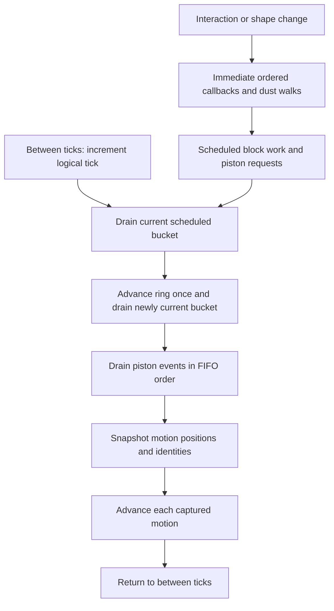

# Interpreter architecture

The interpreter executes redstone directly against a live block world. It reads
spatial neighbors, delivers ordered callbacks, schedules component transitions,
and transports piston payloads through moving-block entities. The world, pending
work, and movement phase together determine the next result.

This document describes the current Rust implementation, its execution domain,
performance optimizations, and their measured benefits. The source is the
authority. Detailed transition rules are in the
[redstone model](REDSTONE_MODEL.md) and [piston model](PISTON_MODEL.md);
[Redpiler architecture](REDPILER_ARCHITECTURE.md) describes compiled execution.
Benchmark numbers below describe measured workloads; gains depend on circuit
activity and do not prove general Minecraft compatibility.

## 1. Implementation map

| Responsibility | Implementation | Result |
| --- | --- | --- |
| Simulation ownership and stepping | [plot/mod.rs](../crates/core/src/plot/mod.rs) | `PlotWorld`, game ticks, nano/pico advancement, world hooks |
| World interface | [world/mod.rs](../crates/core/src/world/mod.rs) | Block/entity access, scheduling, actions, optional cache hooks |
| Block storage | [world/storage.rs](../crates/core/src/world/storage.rs) | Chunks, paletted sections, pending writes, client records |
| State decoding and material properties | [blocks/mod.rs](../crates/blocks/src/blocks/mod.rs) | `Block` values, cached decoding, solidity and support metadata |
| Power and component dispatch | [redstone/mod.rs](../crates/core/src/redstone/mod.rs), [power.rs](../crates/core/src/redstone/power.rs) | Directional weak/strong input, immediate updates, delayed ticks |
| Dust geometry and propagation | [wire/mod.rs](../crates/core/src/redstone/wire/mod.rs), [turbo.rs](../crates/core/src/redstone/wire/turbo.rs) | Dust sides, attenuation, ordered Wire Turbo walks |
| Dust addresses and facts | [world/wire_cache.rs](../crates/core/src/world/wire_cache.rs), [turbo_cache.rs](../crates/core/src/redstone/wire/turbo_cache.rs) | Canonical neighborhoods, immutable state facts, per-walk node lookup |
| Shared scheduled work | [backend/queue.rs](../crates/core/src/redpiler/backend/queue.rs) | `TickScheduler`, priority/FIFO queues, saved tick entries |
| Tick and piston lookup indexes | [plot/interpreter_cache.rs](../crates/core/src/plot/interpreter_cache.rs) | Counted membership and derived motion/event indexes |
| Physical piston execution | [piston.rs](../crates/core/src/redstone/piston.rs), [world state](../crates/world/src/lib.rs) | Requests, event acceptance, payload transport, exact progress and identities |
| Native piston route qualification | [piston/instant.rs](../crates/core/src/redstone/piston/instant.rs), [world/instant_piston.rs](../crates/core/src/world/instant_piston.rs) | Observed-cycle certificates and cached power-query addresses |
| Attachment and shape callbacks | [interaction.rs](../crates/core/src/interaction.rs) | Support checks and geometry changes |
| Performance and frozen replay | [cpus.rs](../crates/core/benches/cpus.rs), [support/cpus.rs](../crates/core/benches/support/cpus.rs), [piston.rs](../crates/core/benches/piston.rs), [instant.rs](../crates/core/benches/instant.rs) | Timed workloads with state and output assertions |

`Plot::tick` chooses `redpiler.tick_with_world` while a compiler is active and
`world.tick_interpreted` otherwise. Interpreter cache hits do not activate a
compiler or transfer simulation ownership.

## 2. Execution domain and representations

### Spatial and electrical domain

The [Redstone model](REDSTONE_MODEL.md#1-mathematical-conventions-and-spatial-domain)
defines plot boundaries, registry state/type IDs, signal algebra, conduction and
component transitions. The interpreter applies those rules to live spatial storage
and ordered work; it has no extracted graph or precomputed Boolean response.
BUD storage follows the [piston transaction model](PISTON_MODEL.md#4-bud-switches-as-sampled-state).

### Authoritative state and derived data

| Representation | Contents | Lifetime and authority |
| --- | --- | --- |
| `ChunkSection` | Paletted raw state IDs and a pending-write overlay | Authoritative blocks; reads see unflushed writes |
| Block entities | Comparator output, containers, moving payloads, command state | Authoritative metadata at each position |
| `TickScheduler<ScheduledBlockTick>` | 32 buckets, four ordered priority queues, cursor | Authoritative delayed block work |
| `PistonState` | Logical tick, phase, event deque, motion deque, identity counter, movement snapshot/cursor | Authoritative physical work, including partial ticks |
| `TickIndex` / `PistonIndex` | Membership counts and lookup positions | Derived; rebuilt after invalidation |
| Wire topology and registry facts | Canonical addresses and immutable block properties | Derived; never stored electrical results |
| Wire Turbo nodes | Block snapshots, traversal bias, layers, oriented neighbors | Operational state of one synchronous walk |
| `InstantPistonCache` | Qualification stages, motion identities, reusable addresses | Derived; live physical execution continues on every hit |

Two worlds with identical visible blocks can evolve differently if their queues,
motion identities, or phases differ. Frozen replay checks therefore cover more
than final lamps or output bits.

## 3. Game ticks, callbacks, and scheduling

All interpreter advancement uses `prepare_operation` and `advance_operation`.
Starting between ticks increments `logical_tick`; starting inside a partially
stepped tick completes its remaining work.



The diagram summarizes the authoritative
[phase dispatcher](REDSTONE_MODEL.md#55-phase-state-machine).
Units, priority/FIFO order, ring bounds, type binding and stale requests follow
Redstone section 5. `TickIndex` maintains membership counts without changing
queue order or deduplication. Membership is removed before dispatch so callbacks
can immediately reschedule; counts preserve repeated imported entries.

Immediate callbacks finish synchronously. Notification order, duplicate recipients
and observer/piston exclusions follow
[Redstone section 4](REDSTONE_MODEL.md#4-immediate-callbacks-and-ordered-notification-procedures).

Public stepping uses the same dispatcher. Count semantics, partial-tick completion
and the history guard are defined in
[Redstone section 15.2](REDSTONE_MODEL.md#152-pico-and-nano-stepping).

## 4. Electrical execution and Wire Turbo

### Power and component transitions

General power queries read primitive weak power for a nonsolid source, or the
maximum adjacent primitive strong power for a solid source. Solid conduction is
computed on demand and has no stored charge. Directional emission, attachment,
diode facing, and dust sides determine which receivers can see an output.

The dispatchers in `redstone/mod.rs` route live states to component-specific
handlers. Torches, repeaters, comparators, observers, buttons, and other modeled
components retain their own update and delayed-transition rules. Lamps, note
blocks, hoppers, trapdoors, copper bulbs, and command blocks use their supported
consumer behavior. Registry retention alone does not implement every Minecraft
component.

Boolean power queries use `any` to stop at the first positive strong input.
Analog queries still compute the full maximum. Zero-strength sources return
before expensive directional work, and dust queries reuse already read
neighbors and lazy above-block solidity where possible.

### Ordered dust propagation

Wire Turbo builds dense `UpdateNode` records for a propagation walk, identifies
24 canonical neighborhood positions, orients them by traversal heading, and
uses three rotating update queues to process walk layers. Dust recalculation
combines external power with attenuated neighboring dust and writes changed
strengths back into the world. Other affected components receive callbacks in
the walk's defined order.

A node captures a block snapshot when first created. Its wire strength is
updated during the walk; other cached states retain the algorithm's snapshot
semantics. Strong-input neighborhoods and comparator entities can still require
live reads. Replacing every snapshot with a live query would change behavior,
even if it appears to simplify caching.

Thread-local scratch reuses vector and map capacities between walks. The scratch
is taken out of its `RefCell` before callbacks, so a recursive wire walk gets
independent data. At completion, nodes, orientation, queues, and live snapshots
are cleared. The persistent topology cache holds canonical addresses only.

## 5. Physical pistons and native route certificates

### Requests, movement, and BUD state

The interpreter executes [physical piston transitions](PISTON_MODEL.md#2-piston-power-requests-and-event-validation)
using the event and exact-motion deques in `PistonState`. Requests, live validation,
payload mutation, identity snapshots and restoration retain the model's order.
Address certificates accelerate these operations while leaving physical state
and callback delivery authoritative.

### Qualification accelerates addresses

Despite its name, `InstantPistonCache` caches physical power-query addresses.
It observes a qualifying sticky piston with a single redstone-block payload,
a downward-facing observer directly above the base, and a solid cap above that
observer. Upward-facing actors, drop retractions, shared stationary payload
ownership, unsupported entities, and conflicting reset writers fail the checks.
The payload and cap must be entity-free; reset must restore the single-block
footprint without an alternate cap writer.

The certificate is derived lookup state only. It authorizes no cached power
values or logical replacement of later waves.

Qualification follows the real cycle:

```text
Retracting -> AwaitingReset -> Resetting -> Proven
```

Both source and payload motions must complete with their exact identities and
valid footprints. Reset must be observer driven. Only after successful reset
completion can the entry serve power routes. Later cycles reuse those routes
while still performing native events, movement, and callbacks.

Each actor retains eleven original power-query positions, with query sides and
six strong-source addresses per position. Queries read current raw states;
solidity, emission, and comparator entities remain live. Addresses bypass repeated
chunk/section/local-coordinate calculations, not electrical evaluation.

Block/entity edits, interrupted motion, mismatched identities, or invalid
footprints revoke affected entries. Mutable chunk/piston-state access and bulk
cache invalidation clear qualification. Certificates are ephemeral and unsaved.
The cache admits at most 65,536 actors; exceeding the cap leaves execution on the
ordinary path. A miss or unsupported `World` cache hook uses ordinary spatial
power queries.

## 6. Optimization inventory and costs

| Optimization | Benefit | Conditions and remaining costs |
| --- | --- | --- |
| Global decoded-state table | One indexed lookup instead of decoding each block read | Indexed by registry state; unknown IDs remain `Unknown { id }` |
| Generated dry-state IDs | One table lookup to clear waterlogging on opaque payload states | Used where moving payload restoration requires dry state |
| Immutable registry facts | Reuse solidity, transparency, update, and connection classification | Facts depend on state ID; electrical values are queried separately |
| Boolean existence queries | Stop at the first positive input instead of computing every input's maximum | Analog consumers retain complete maxima and entity bytes |
| Reused dust reads | Fewer world reads for neighbor power and above-block solidity | Preserve lazy reads, dot/cross rules, and callback ordering |
| Compact Turbo IDs and neighborhood storage | Smaller traversal data: 4-byte node IDs and 120-byte neighbor lists on the measured 64-bit target | Dense `u32` IDs; oriented lists remain per walk |
| Generation-stamped spatial nodes | Direct in-plot node lookup and a new epoch instead of clearing every stamp per walk | Sparse 4,096-cell stamp pages; epoch wrap clears stamps; outside addresses use a map |
| Persistent canonical topology | Reuse 24 neighbor coordinates and their cell addresses across walks | At most 1,048,576 retained neighborhoods; saturation stops admission |
| Counted scheduled membership | Expected O(1) membership lookup instead of scanning pending ticks | O(pending work) lazy rebuild; priority and FIFO remain in the scheduler |
| Piston event/motion indexes | Fast event membership and motion lookup for large banks | Banks of at most eight scan directly; duplicates preserve original lookup behavior |
| Ordered motion deque | O(1) front removal without shifting surviving motion records | Middle removal and stale-index repair can remain linear |
| Native piston routes | Direct cell reads instead of repeated coordinate resolution for qualified actors | Qualification/storage overhead; all power values remain live |
| Pending section writes | Coalesce repeated writes before updating the palette and client records | Reads check the overlay; flush merges state and prepares change records |

The scheduler and piston deques retain their order and serialization authority.
Indexes and route caches are not serialized replacements. Cache clearing or
invalidation accompanies load/history restoration and compiler handoff. Motion
deque serialization has a regression check for save-byte compatibility.

Memory follows visited sections, walk capacity, pending membership, and qualified
actors. Capacity reuse trades retained allocations for fewer allocations on the
next operation; entry caps are not byte-budget limits. Cache misses still execute
the same physical algorithm, so cold worlds and unsupported circuits may gain
little from a particular optimization.

### Measurement scope

Time reduction is `100 * (1 - optimized / baseline)`. Percentages from different
optimization groups must not be added: they use separate comparisons and can
interact.

CPU replays validate 50,000 game ticks, with active windows of 12,051 ticks for
PM1 SORT, 5,000 for ANPU Pong, and 10,035 for CPU BubbleSort. Only interpreter
execution is timed by default; import, checkpoint hashing, output verification,
and stop-control checks are outside timing. Active-window results exclude idle
tails after a CPU halts. Native FPU timing also includes input actions.

Piston measurements cover eight-tick extension/retraction cycles including
manual power changes, with world construction excluded. They use Criterion with
20 samples, one-second warmup, and a three-second target measurement. The CPU
hot-path results use three fresh processes per version.

Measurements use a Ryzen 9 5950X, Windows/MSVC, release/bench with fat LTO,
logical CPU 2 affinity, and Normal process priority. They exclude networking and
connected-client rendering and describe simulation cost, not arithmetic
operations per second or a guaranteed server TPS.

## 8. Verification and reproduction

Regression coverage lives in the
[redstone tests](../crates/core/src/redstone/master_tests.rs),
[Wire Turbo tests](../crates/core/src/redstone/wire/turbo_tests.rs),
[piston tests](../crates/core/src/redstone/piston/tests.rs),
[instant IO tests](../crates/core/src/redstone/instant_piston_tests/io.rs),
[plot piston tests](../crates/core/src/plot/piston_tests.rs), and
[frozen CPU replays](../crates/core/tests/cpu_references.rs).
Cache modules also contain tests for registry facts, epoch wrap, ring membership,
duplicates, invalidation, motion identities, and save-byte compatibility.

Frozen CPU checks compare whole-world block/entity/queue/piston checkpoints,
ordered chat, each Pong screen frame, BubbleSort RAM observations, and halt/stop
boundaries. The shared harness also verifies entity, scheduling, piston, chat,
and screen expectations. Native FPU and counter references additionally
compare per-tick output words and final whole-world checkpoints.

From the repository root, run targeted checks and capture fresh performance
reports into the ignored `target/` directory:

```sh
cargo test -p mchprs_core --release --locked redstone:: -- --test-threads=1
cargo test -p mchprs_core --release --locked plot::interpreter_cache -- --test-threads=1
cargo test -p mchprs_core --release --locked world:: -- --test-threads=1
cargo test -p mchprs_core --test cpu_references --release --locked frozen_reference -- --ignored --test-threads=1
cargo bench -p mchprs_core --bench cpus -- --iterations 3 --output target/interpreter-cpus.json
cargo bench -p mchprs_core --bench piston
cargo bench -p mchprs_core --bench instant -- --help
```

Use `MCHPRS_CONFIG` to select the root `Config.toml` when a local core-crate
configuration has a WorldEdit size limit below the replay fixtures. Do not
overwrite frozen references to make an optimization pass. Store new capture
files separately, and compare identical fixtures, input protocols, active
windows, timer boundaries, and build/host conditions.

## 9. Boundaries and engineering constraints

The interpreter accepts physical geometry without Redpiler region admission,
but implements the repository's modeled mechanics. Unknown-state preservation,
unrestricted straight-line piston scans, and absent adhesion rules are concrete
limits on vanilla compatibility.

World mutations must preserve live read-after-write behavior, entity ownership,
ordered notifications, and cache invalidation. A changed final value is not the
only possible regression: a missed no-change BUD sample, an early observer
pulse, or a consumed stale motion identity can change the next transaction.

Fine stepping, save/load, history restoration, and compiler reset must preserve
pending work and partial phase state. Rendering choices can project piston
animation or screen updates differently while physical motion continues.
The compiler handoff contract is described in
[Redpiler architecture](REDPILER_ARCHITECTURE.md#8-world-output-and-interpreter-handoff).

Before changing a hot path, identify whether its data is an immutable address,
an immutable registry fact, a per-walk snapshot, or live electrical state.
Retain the original order and validation, then verify both full-state replay and
the affected transient notification/movement cases. Benchmark evidence is
fixture-specific; it does not establish equivalence for every circuit.
