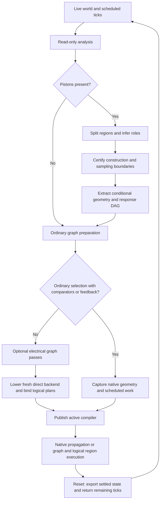

# Redpiler architecture

Redpiler compiles a live redstone world into an electrical graph and, when
pistons are present, logical region programs. The direct backend executes those
representations without repeating spatial power searches or interpreting piston
movement on each step. Ordinary components keep their scheduled timing; admitted
piston regions evaluate conditional geometry and explicitly sampled state.
Ordinary selections with comparators or feedback instead retain physical
geometry and execute native redstone propagation over a private snapshot.

This document describes the current Rust implementation. The source is the
authority; structural recognition, logical execution, and compatibility with a
physical Minecraft waveform are different claims. Detailed companion references
are the [parser](REDPILER_PARSER.md),
[optimizer](REDPILER_OPTIMIZER.md),
[compiled model](REDPILER_MODEL.md), and
[physical piston model](PISTON_MODEL.md).

## 1. Implementation map

| Responsibility | Implementation | Result |
| --- | --- | --- |
| Compilation lifecycle | [redpiler/mod.rs](../crates/core/src/redpiler/mod.rs) | Options, activation, diagnostics, statistics, reset |
| Structural inference | [analysis/](../crates/core/src/redpiler/analysis/mod.rs) | Piston geometry, payload ownership, reset candidates, power and update dependencies |
| Region admission | [instant/program.rs](../crates/core/src/redpiler/instant/program.rs), [regions.rs](../crates/core/src/redpiler/instant/regions.rs) | Validated region programs and ordinary graph boundaries |
| Conditional geometry solver | [instant/logic.rs](../crates/core/src/redpiler/instant/logic.rs), [boolean.rs](../crates/core/src/redpiler/instant/boolean.rs) | Boolean response DAG, guarded electrical outputs, handoff expressions |
| Observer reset proof | [instant/observer.rs](../crates/core/src/redpiler/instant/observer.rs), [logic/sequential.rs](../crates/core/src/redpiler/instant/logic/sequential.rs) | Owned reset circuitry and certified response actors |
| Clock and storage inference | [instant/clocked.rs](../crates/core/src/redpiler/instant/clocked.rs), [sampling.rs](../crates/core/src/redpiler/instant/sampling.rs) | Memory cells and their explicit write events |
| Electrical graph optimization | [passes/](../crates/core/src/redpiler/passes/mod.rs) | Prepared and optionally reduced `CompileGraph` |
| Runtime lowering | [backend/direct/compile.rs](../crates/core/src/redpiler/backend/direct/compile.rs) | Dense nodes, packed links, region bindings, transferred ticks |
| Electrical execution | [backend/direct/mod.rs](../crates/core/src/redpiler/backend/direct/mod.rs), [update.rs](../crates/core/src/redpiler/backend/direct/update.rs), [tick.rs](../crates/core/src/redpiler/backend/direct/tick.rs) | Input propagation, scheduled component transitions, world output events |
| Native ordinary execution | [backend/native.rs](../crates/core/src/redpiler/backend/native.rs) | Private geometry/state snapshot, interpreter callbacks and dust walk, one native scheduler |
| Logical piston execution | [backend/direct/instant.rs](../crates/core/src/redpiler/backend/direct/instant.rs), [instant/logical.rs](../crates/core/src/redpiler/backend/direct/instant/logical.rs) | Cached decisions, frozen snapshots, memory commits, settled geometry |
| Independent Boolean optimizer | [redpiler_opt/src/lib.rs](../crates/redpiler_opt/src/lib.rs) | Pure Boolean plans; currently separate from the server compiler |

## 2. Compilation lifecycle and representations

[`Compiler::compile`](../crates/core/src/redpiler/mod.rs) accepts a world view,
inclusive bounds, saved `TickEntry` work, `CompilerOptions`, and a shared
`TaskMonitor`. The server command supplies the current plot's corners.



Analysis inventories geometry without mutating the world. With no pistons, an
issue-free report goes directly to graph preparation. With pistons, region
preparation must resolve the report's runtime ownership requirements and reject
other entry issues. Scheduled ticks whose saved block type differs from the
current block are filtered out before graph construction.

| Representation | Contents | Can execute? |
| --- | --- | --- |
| `AnalysisReport` | Geometry, ownership groups, recognition results, ports, admission issues | No |
| `CandidateGraph` | Diagnostic graph and fresh analysis report | No |
| `CompileGraph` | `StableGraph<CompileNode, CompileLink>` with component state and electrical edges | Only after lowering |
| `PreparedInstant` | Pistons, payload groups, aliases, owned positions, `WaveLogic`, clocks, memory, sampling, handoff context | Only after binding |
| `WaveLogic` | Decision arena, response roots/order, sources, output terms and settled dust expressions | Compiler representation |
| `DirectBackend` | Fixed nodes, packed forward links, tick scheduler, event queues and bound region runtimes | Yes |
| `NativeBackend` | Physical block/entity snapshot, native dust and component callbacks, priority/FIFO scheduler | Yes |

The compiler stages a fresh backend and publishes it only after all preparation,
binding, and cancellation checks succeed. `backend.is_some()` defines active
state. Calling `compile` while active returns `AlreadyActive`; the `/rp compile`
command resets an existing compiler first. A failed attempt never publishes
partial statistics or consumes interpreter scheduling ownership. Requested
export files are separate side effects and are not rolled back on later failure.

[`Plot::start_redpiler`](../crates/core/src/plot/mod.rs) compiles in a scoped worker
while servicing player connections. Success transfers simulation ownership by
clearing the world's scheduler and invalidating its tick index. The plot also
closes containers, disables plot history when enabled, and updates its scoreboard.
The command currently uses a default monitor without interactive cancellation.

## 3. Inference engine: deriving behavior from blocks

Inference is implemented as bounded spatial queries and explicit recognition
rules. It derives roles from connectivity and material properties, rather than
schematic names, signs, known arithmetic functions, or bit coordinates.

### Geometry and ownership

[`analysis::analyze`](../crates/core/src/redpiler/analysis/mod.rs) normalizes bounds,
requires loaded chunks, skips empty sections, and inventories live pistons,
heads, observers, consumers, and pending work. Each `PistonDescriptor` records
the base, facing, saved pose, present power, head, payload, reset seeds, and
diagnostics. Entry power can differ from the saved pose: that can be a stored BUD
state, so a power query alone cannot determine execution behavior.

Union-find groups pistons whose possible near/far payload positions overlap.
This preserves one payload identity across physical aliases. An empty ordinary
generator has a base/head footprint rather than an assumed pulled far payload.

[`Topology`](../crates/core/src/redpiler/analysis/topology.rs) follows directional
weak/strong power, conductors, and dust attenuation. It labels direct versus
quasi-connectivity routes and ordinary, constant, observer, or mobile sources.
Mobile redstone blocks remain dynamic even when their saved strength is 15.

### Reset recognition and notification channels

[`families.rs`](../crates/core/src/redpiler/analysis/families.rs) recognizes observer
above, torch, dust below head, and lateral dust reset paths. It records support,
return routes, supply ownership, and failures such as active reset work or an
additional writer. A matched path is a structural candidate, not authorization
to execute it.

[`ports.rs`](../crates/core/src/redpiler/analysis/ports.rs) separately discovers
electrical inputs, wire/head/base notifications, ordinary consumer interfaces, and
exposed reset signals. Quasi-connectivity may supply power without delivering a
base recheck. Conversely, a qualifying update may sample unchanged low data.
Electrical strength and delivered sampling events therefore use separate
channels; an ordinary graph `Side` edge means diode side input, never BUD sampling.
Base-to-head routes carry a head-presence condition. Discovery of such a route
does not certify its movement/reset timing or make it executable by the instant
sampler; an unsupported route reports its source and receiver explicitly.

Feedback admission uses the conditional physical-power extractor to remove QC
contributions proved unable to add power beyond direct inputs across all poses.
Receiving dust strengths remain independent during this implication proof.
Unresolved contributions retain upstream provenance through movable conductors,
including paths hidden by the imported occupancy. This proof does not equate
different dust wires merely because they share an emitter.

[`regions::split`](../crates/core/src/redpiler/instant/regions.rs) joins actors by
shared payload/reset ownership, electrical influence, observer connectivity, and
sampling dependencies. It conservatively joins moving geometry within two cells
of a dependency, which can merge otherwise independent nearby circuits. Sharing
an ordinary control alone does not establish shared moving ownership.

### Storage and clock inference

[`clocked::recognize`](../crates/core/src/redpiler/instant/clocked.rs) recognizes a
specific empty downward observer-clock generator and its independently sampled
BUD bank. It requires one owned generator per such region, a sampling observer,
and supported memory geometry. Validation requires a single ordinary torch
control for the response network and proves that clock control is independent
of stored data and releases when torch power disappears.

[`sampling::recognize`](../crates/core/src/redpiler/instant/sampling.rs) identifies
independent memory cells, empty notification generators, and delivered write
events. A source can be a generator pose change or a strength change on static
dust driven by one fixed writer. Head-delivered targets retain a
`requires_extended` condition. Sampling dust depending on moving geometry or
another writer is rejected rather than treated as an implicit clock.

## 4. Solver: conditional geometry and Boolean responses

The solver combines a reduced ordered Boolean decision arena with an acyclic
actuator dependency graph. It does not invoke an external SAT/SMT engine or solve
arbitrary feedback by searching for a fixed point.

### Extracting conditional electrical paths

[`Extractor`](../crates/core/src/redpiler/instant/logic.rs) maps bases, near cells,
and far cells to actors and payload groups. A spatial position can have several
possible blocks, each guarded by a Boolean expression. It enumerates local owner
assignments, merges identical block variants, derives conditional dust shapes,
and walks electrical paths through those variants.

Dust searches carry `(position, attenuation, guard)`. False guards and paths
attenuated by 15 are discarded. A per-position Boolean coverage expression avoids
walking already covered conditions again. Power queries include direct input
and quasi-connectivity above the piston.

For a source strength `s`, path attenuation `w`, and geometry guard `g`, a
Boolean powered contribution is:

```text
g AND (s > w)
```

The extracted response of actor `i` is the negation of its combined powered
input. `true` denotes a retracted/fired logical pose; it is not a universal
inversion of ordinary electrical output polarity. Memory reads use held state,
while response actors can depend on other response actors.

### Decision arena and dependency solving

[`BooleanArena`](../crates/core/src/redpiler/instant/boolean.rs) represents false
and true as expression IDs 0 and 1. Every other expression references
`Decision { variable, low, high }`. Variables include signal thresholds,
provisional actuator responses, memory, and geometry; the certification oracle
also uses observer and wire-dot variables.

The arena reduces equal branches, interns identical decisions, memoizes AND/NOT,
and builds OR/select from these operations. Thus complementary geometry paths
can cancel a provisional dependency before cycle detection. Signal thresholds
are separate Boolean tests evaluated against the same actual strength; the arena
does not impose a global theory of their threshold relationships.

Extraction collects actuator dependencies from the reduced roots and orders
them with a deterministic topological traversal. In executable preparation it
retains local response DAG edges to avoid expanding a whole circuit into a large
BDD. The standalone first-response extraction path can instead substitute
already resolved responses into pure port functions. Unresolved actors cause a
position-bearing cycle error asking for a sampled memory or clock boundary.

Final compaction retains decisions reachable from response roots, electrical
output guards, sampling guards, and handoff dust expressions. Restoration-only
decisions remain in the arena but need not enter the active runtime plans.

The decision equation is $D(v,L,H)=(\neg v\land L)\lor(v\land H)$.
Threshold implications such as $[s>7]\Rightarrow[s>3]$ are not a separate
constraint theory in the arena; independent decisions can miss simplifications
while remaining correct for valid strengths.

### Observer certification as conservative inference

[`observer::certify`](../crates/core/src/redpiler/instant/observer.rs) uses
[`logic::sequential::extract`](../crates/core/src/redpiler/instant/logic/sequential.rs)
as a compile-time oracle for local wire sensors, observer inputs, geometry, and
notifications. It finds the reset influence cone, checks exposure to ordinary
outputs and independent samplers, and identifies electrical and notification-only
recipients.

In default admission, guaranteed pulse strength lower bounds increase until
stable. `fixed_value` follows known conditions and explores both branches for
unknown data or geometry; a definite answer must agree on those branches. Each
electrically affected response must be guaranteed to extend under the reset
pulse. Notification-only recipients must have coupled independent data rather
than hidden storage. Final response extraction still has to prove acyclicity.

The sequential extractor is a certification oracle, **not a physical runtime
fallback**. The adjacent `instant/sequential.rs` module collects expression
dependencies. Their names do not indicate an active movement executor.

## 5. Instant piston admission and execution

[`program::prepare`](../crates/core/src/redpiler/instant/program.rs) prepares all
regions before running the shared electrical graph pipeline. It requires entry
between ticks, no active piston events/motions/movement work, and a selection
within one plot. Region preparation validates payload identity and destination,
saved heads or retained near payloads, block entities, attachments using moving
support, selection context, reset ownership, and sampling representability.

Supported payloads are redstone blocks or fixed opaque solid cubes with no block
entity, neighbor-update behavior, analog override, or unknown state. Shared
payload groups need exactly one supported block and a common destination;
recognized empty generators are an exception. Moving comparator inventory reads
are rejected because ordinary electrical power cannot represent that analog read.

The two admission policies select the same logical executor:

| Policy | Additional admission behavior | Runtime |
| --- | --- | --- |
| Default | Requires construction/reset evidence; checks reset pulse guarantees, exposed reset signals, and additional direction/response guards | Cached logical regions |
| `--assume-instant` | Trusts instant/BUD construction and skips selected reset/direction proofs; still validates geometry, ownership, sampling, data dependencies, and acyclicity | The same cached logical regions |

Default admission does not enable movement delays or replay physical reset
waveforms. [`Runtime::bind`](../crates/core/src/redpiler/backend/direct/instant.rs)
unconditionally creates `logical::State`, and preparation always uses
`extract_ideal_with_state`. Older first-response extraction helpers and physical
interpreter tests exist, but do not define the active backend's piston timing.

### Connecting logical regions to the ordinary graph

[`Boundaries`](../crates/core/src/redpiler/instant/boundary.rs) removes owned
internals from ordinary node identification, retains ordinary sources needed for
binding, and supplies dynamic mobile aliases and projected consumer outputs.
`MobileSource` and `InstantOutput` lower to `InstantSource` runtime nodes.
`InstantInput` is diagnostic and is not an executable node.

Each output stores `PowerTerm { guard, source, attenuation }`; an absent source
means a strength-fifteen redstone block. It implements the
[guarded channel projection](REDSTONE_MODEL.md#36-guarded-electrical-channel-projection).
Internal responses use settled geometry; electrical outputs, observers and
activation routes use scheduled phases. Main and comparator-side channels remain
separate. Shared groups choose the first fired actor as deterministic near owner.
See [compiled model sections 4 and 6](REDPILER_MODEL.md#4-conditional-geometry-and-electrical-boundaries)
for the observation and timing contract.

### Cached runtime plans

[`logical::Plan`](../crates/core/src/redpiler/backend/direct/instant/logical.rs)
binds separate plans for responses, outputs, and sampling guards. Binding checks
expression references, response order, allowed input kinds, and dependency
cycles, then keeps only reachable decisions and deduplicates input/threshold
bindings. Runtime source bindings cannot be ordinary display wire nodes.

Each plan holds a frozen Boolean snapshot, cached decisions, input users and
reverse parent dependencies. Mutation marking records dirty binding IDs;
`capture_dirty` reads that set against one coherent state before invalidating
affected decisions. Initialization captures all bindings. Unaffected selected
branches remain cached; `evaluate` uses an explicit stack and required branches.
Repeated roots share results. Source, memory, committed-response and geometry
mutations mark dependent bindings in relevant plans. Unchanged inputs and absent
due work permit evaluation to be skipped.

### Notification-gated activation

[`activation::recognize`](../crates/core/src/redpiler/instant/activation.rs)
prepares isolated mobile-fed wire and base/head delivery tables for reset-observed
actors whose data route does not notify. Conditional extraction rejects additional
wire positions. `Input::Committed` cuts gated references at committed pose.

The runtime owns `activation_wires` and a `VecDeque<Delivery>`. Strength changes
and represented boundary notifications enqueue ordered recipients, including
repeated deliveries. Each advance processes one recipient and publishes its pose
and electrical effects; head-only delivery checks current geometry. Data-only
changes hold gated responses. The contract and limits are in
[compiled model section 13](REDPILER_MODEL.md#13-notification-gated-instant-responses).

### Memory and event ordering

A power return during retraction updates the requested pose without reversing
the in-flight movement. Retraction finishes first; a pending extension starts
one tick later and finishes two ticks after that. Extension cancellation keeps
its separate transition semantics.

Compilation seeds stored bits from saved piston geometry and establishes event
baselines. Activation itself is not a write event. Changing prepared data alone
does not overwrite an independent memory cell.

Clocked and independent-memory transaction boundaries are specified in
[compiled model sections 7–8](REDPILER_MODEL.md#7-shared-clock-memory).
Their bank state remains independent of gated actuator commitment.

## 6. Optimizer

Three distinct kinds of reduction exist: electrical graph passes, Boolean arena
reduction during extraction, and runtime decision caching. `--optimize` controls
the electrical passes and ordinary wire display elision; it does not disable
Boolean simplification or cached logical execution.

### Electrical graph passes

[`passes::run_passes`](../crates/core/src/redpiler/passes/mod.rs) uses this fixed order:

| Order | Pass | Enabled | Purpose |
| --- | --- | --- | --- |
| 1 | Identify nodes | Always | Read components and saved state; with optimization, omit ordinary wire display nodes |
| 2 | Input search | Always | Convert spatial electrical paths to main/side links with attenuation |
| 3 | Clamp weights | Always | Remove edges with attenuation at least 15 |
| 4 | Deduplicate links | `--optimize` | Keep strongest parallel source/target/channel paths |
| 5 | Constant fold | `--optimize` | Fold settled constant-fed diodes/torches while preserving saved output and pending-work constraints |
| 6 | Unreachable comparator output | `--optimize` | Prune links beyond the computed subtract-comparator output bound |
| 7 | Coalesce constants | `--optimize` | Share removable equal-strength constants within consumer components |
| 8 | Coalesce logic | `--optimize` | Merge eligible sibling nodes with equal type and saved state |
| 9 | Prune orphans | `--optimize --io-only` | Retain the dependency closure of protected interfaces and pending work |
| 10 | Export graph | `--export` | Serialize the supported ordinary electrical graph |

Only constant folding repeats until stable; the entire pipeline is not rerun to
a fixed point. Region boundary types, required source/consumer interfaces, user
inputs, outputs, and pending work protect nodes from ordinary removal. With
optimization, removed dust display nodes no longer maintain their world powers,
although physical dust still determines link attenuation during compilation.

Ordinary selections containing comparators or directed feedback cycles use the
native propagation backend. It captures physical geometry, dust powers and block
entities in a private snapshot, and reuses the interpreter's dust walker and
component callbacks with one priority/FIFO tick queue. Torch oscillators and
shared-input comparator paths are legal. Compilation does not deliver updates
or restart pending deadlines. Display flushing is separate from simulation;
reset materializes all hidden state and transfers pending ticks in queue order.
Command entities are published after callbacks even when display flushes are
deferred. Snapshot reads include a two-block halo for fixed outside dependencies;
only positions inside the selection can change or schedule new work.

Initially the whole affected selection stays together and optional graph
rewrites are skipped, even with `-O`. Acyclic selections without comparators use
the direct graph backend. Statistics identify native execution. Native selections
cannot be exported as collapsed electrical graphs (`--export`/`--export-dot`).
Instant piston programs still use the direct backend and retain the comparator
ordering guards; native propagation is currently limited to ordinary selections.

Comparator-output pruning applies side-edge attenuation and includes the saved
comparator output in its bound. Logic coalescing requires equal incoming
channels, equivalent attenuation, and equal type and state. Boolean consumers
of 0/15 sources can share inputs with different attenuations below 15. The
coalesced node retains every physical block alias for display flushing and reset,
including pending native deadlines at each alias position. The
[optimizer reference](REDPILER_OPTIMIZER.md) records each pass's guards;
backend validation does not repair an incorrect rewrite.

### Independent pure Boolean optimizer

[`mchprs_redpiler_opt`](../crates/redpiler_opt/src/lib.rs) defines `Circuit`, `Op`,
and a dense `Plan` for input, constant, buffer, NOT, AND, OR, XOR, and select
operations. It validates declared inputs, operands, roots, and cycles, builds a
topological reference, then applies one rewrite sweep, structural sharing,
root-based pruning, and dense layout. All declared roots are observable,
including state-write roots without a display output.

Budget exhaustion returns the validated reference with `used_fallback = true`;
cancellation returns an error. Evaluation uses caller-provided scratch and root
buffers without allocation. This crate has its own workspace and currently has
no production import in `mchprs_core`; it is not the implementation of the live
server's graph passes or cached decision plans.

## 7. Direct backend and execution order

[`direct::compile`](../crates/core/src/redpiler/backend/direct/compile.rs) maps
stable graph indices to dense `NodeId`s, initializes nodes from saved state,
binds world positions and region outputs, builds observer/dependency tables, and
transfers retained scheduled ticks with remaining half-tick deadlines and
priorities. Backend node IDs are local to that backend instance.

Each node channel has sixteen byte counters for strengths `0..=15`, updated by
the histogram rule below. Boolean input tests for an occupied nonzero-strength
bucket. Execution follows compiled links instead of walking neighbor blocks.

Lowering enforces the counter and packed-link limits below. `ForwardLink` stores
a target ID, channel bit and attenuation; validated backend-local IDs support
unchecked runtime indexing.

[`update.rs`](../crates/core/src/redpiler/backend/direct/update.rs) reevaluates
inputs and requests work; [`tick.rs`](../crates/core/src/redpiler/backend/direct/tick.rs)
applies scheduled transitions and propagates new outputs. This separation
preserves repeater locking/delay, comparator timing, observer pulses, and delayed
lamp turn-off. [`TickScheduler`](../crates/core/src/redpiler/backend/queue.rs) is a
32-slot half-tick ring with FIFO queues per priority; redstone-tick delays are
converted to twice as many slots. It is not an arbitrary-duration scheduler.

Using strengths $s_v$, channel inputs $I_{v,c}$ and edges $(u,v,c,a)$ from the
[ordinary graph model](REDPILER_MODEL.md#2-ordinary-electrical-graph), channel
counters implement its maximum equation incrementally:

$$
C_{v,c}[j]=\sum_{e=(u,v,c,a)}[s_u\mathbin{\dotminus}a=j],\qquad
I_{v,c}=\max\bigl(\{j:C_{v,c}[j]>0\}\cup\{0\}\bigr).
$$

When $s_u$ changes from $x$ to $y$, each outgoing edge decrements
$C_{v,c}[x\dotminus a]$ and increments $C_{v,c}[y\dotminus a]$.
If the attenuated values agree, that edge delivers no update. Otherwise the
backend reevaluates the receiving component. This is an incremental
implementation of the maximum equation, not an approximation.

[Direct lowering](../crates/core/src/redpiler/backend/direct/compile.rs)
requires strengths in $\mathcal S$ and at most 255 incoming edges per channel.
The packed forward-link representation requires attenuation below fifteen and
target indices below $2^{27}$. Node IDs belong to one fixed backend array;
unchecked runtime access relies on those construction invariants.

One compiled advance proceeds as follows:

1. Increment each region's elapsed half-tick, deliver already-due ordinary work,
   then advance the scheduler slot.
2. Execute the new slot's ordinary callbacks in priority/FIFO order. Process
   command outputs when a world is available, then evaluate affected regions
   after each callback, including already-due work.
3. After ordinary callbacks, evaluate due owned periodic clocks.
4. Publish changed aliases/output strengths through `set_node`, mark dependent
   regions dirty, and notify ordinary observers of committed geometry changes.
   Repeat region evaluation while dirty regions, delivered samples or queued
   activations remain.

The dependency refresh loop coordinates prepared programs; it is not a general
solver for arbitrary cyclic physical circuits. Region preparation rejects
unrepresented combinational feedback. Ordinary observer watches use separate
notification tables rather than electrical input edges.

## 8. World output and interpreter handoff

Compiled state is authoritative while active. `tick_with_world` processes
command output events around callbacks and advances the world's logical tick.
Commands execute during simulation advances, including `/adv`; note/button
effects and visible dirty block states are emitted by `flush`. Notes beneath
owned BUD geometry capture canonical obstruction at their power rise, so
deferred rendering cannot change sound eligibility. Other notes retain the
existing live-world obstruction check.

`--io-only` restricts display writes to input/output nodes. It retains the
electrical dependencies they need. Supported BUD memory publishes its committed
base/head/payload pose at display flush, including after nonzero manual `/adv`.
A separate last-published bit avoids rewriting unchanged cells and does not
consume observer bookkeeping. `--optimize` permits this display; screen-only
suppresses its deltas while retaining current storage for re-enable and chunk
snapshots. Other logical region geometry remains virtual until reset; observer
notification reads committed settled state independently of presentation.

`Compiler::reset` removes the active backend, flushes surviving hidden node
state, exports comparator entities, materializes region geometry and stored bits,
and returns remaining ordinary scheduled ticks to the interpreter. Region
materialization writes stationary bases, heads, payloads, and settled dust.
Afterward it rearms native observer pulses and base rechecks for active reset
owners, so their loops can resume. Stored BUD cells retain the committed bank.
Handoff may shift the physical reset phase; matching the uninterrupted native
waveform across this boundary is not required. The same rule applies in
assumption mode.
`--update` explicitly runs interpreter updates over the bounds afterwards.

Edits that change compiler input geometry must end compiler ownership first.
Lever/button use and pressure-plate changes have compiled input paths; other
interaction rules live in the plot/player callers. Mixed native/compiled ownership
remains proposed; rejected piston regions have no native execution fallback.

## 9. Commands, limits, and verification

`/rp` and `/redpiler` are aliases, implemented in
[plot/commands.rs](../crates/core/src/plot/commands.rs).

| Command or flag | Behavior |
| --- | --- |
| `/rp compile [flags]`, `/rp c` | Reset an existing compiler, then compile the plot |
| `/rp analyze [flags]` | Analyze and stage the compiler without transferring world ownership |
| `/rp analyze --graph [flags]` | Prepare a diagnostic candidate graph; never activate it |
| `/rp inspect`, `/rp i` | Log the compiled node under the player's ray trace |
| `/rp reset`, `/rp r` | Export compiled state and resume interpretation |
| `--assume-instant` | Relax construction admission while preserving logical/data/sampling validation |
| `--optimize`, `-o` | Enable optional electrical rewrites and omit ordinary wire displays |
| `--io-only`, `-i` | Limit display writes; combined with optimization, prune removable orphans |
| `--update`, `-u` | Run interpreter updates after reset |
| `--export`, `-e` | Write `redpiler_graph.bc` for supported ordinary graphs |
| `--export-dot` | Write `backend_graph.dot` for inspection |

Unknown flags fail. Short flags combine and are case-insensitive. Analysis
rejects export flags. Candidate preparation uses fresh analysis and the same
region preparation path, but does not lower or bind a backend; its success is
not a substitute for staged executable compilation.
Binary export rejects instant, command-block, and observer-notification graphs
that its format cannot represent. DOT is not a saved executable region program.

Automatic compilation runs only when enabled, the compiler is stopped, the plot
is unlimited or falling behind, no Git checkout is locked, and live chunks have
no pistons, piston heads, moving pistons, or observers. Admitted piston regions
therefore require explicit compilation.

Analysis defaults allow 16,777,216 inspected cells, 65,536 pistons, and 4,194,304
dependency steps. The Boolean arena defaults to 1,048,576 decisions; extraction
also bounds traversal, source count, and local owner variants. Executable
extraction permits at most eight conditional owners at one variant position.
Rank-provided resource multipliers are clamped to `1..=8`, never selected by
command flags. Cancellation and exhaustion return diagnostics instead of
activating a truncated program. Successful statistics include graph counts and
timings, wire elision, region counts, arena/plan decisions, outputs, and bindings.

For documentation changes, check local targets and heading anchors, including
fixture reports. The former `tools/validate_docs.py` is absent from this checkout.

For implementation changes, select relevant checks from the
[test guide](REDPILER_ARCHITECTURE.md#9-commands-limits-and-verification). The main compiler suite is:

```sh
cargo test -p mchprs_core --lib --locked redpiler::
```

Decision-arena and cached-plan tests exercise truth tables, dependency
cancellation, shared roots, invalidation, threshold handling, and frozen memory
snapshots. Analysis tests cover geometry admission, rejected input without world
mutation, electrical output strengths, observer ownership, independent write
ordering, clock banks, and reset/recompile continuity. Physical interpreter
protocols have [physical piston verification](INTERPRETER_ARCHITECTURE.md#8-verification-and-reproduction); a matching logical
output is not evidence that intermediate physical motion or reset pulses match.
The isolated Boolean optimizer can be checked separately with:

```sh
cargo test --manifest-path crates/redpiler_opt/Cargo.toml --locked
```
