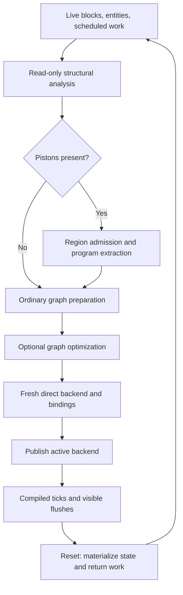

# Redpiler architecture

Redpiler compiles the live block world into an electrical graph and optional
piston-region programs, then runs them with the direct backend. Ordinary
electrical propagation uses strengths and weighted links; moving geometry and
sampling require additional state and notification channels. This document
describes the implementation in this repository, not a promise to compile every
Minecraft contraption.

Read the [spatial parser](REDPILER_PARSER.md),
[optimizer](REDPILER_OPTIMIZER.md), and
[compiled mathematical model](REDPILER_MODEL.md) for the detailed contracts.
The [redstone model](REDSTONE_MODEL.md) describes the interpreter, and the
[test guide](tests/README.md) maps checks to these contracts.

## Compilation and ownership

The entry point is [`Compiler::compile`](../crates/core/src/redpiler/mod.rs).
Its input is an immutable world view, inclusive bounds, current scheduled ticks,
options, and a task monitor. The command path currently supplies the whole plot's
corners; the compiler API also accepts smaller bounds.

Compilation first analyzes the current world. An ordinary compilation requires
an issue-free analysis. A piston compilation instead asks executable region
preparation to resolve the report's piston and observer ownership requirements.
Recognition alone does not authorize execution.

Scheduled ticks with a saved block type that no longer matches the live block
are removed before graph preparation. The parser records retained ticks so that
optimization preserves their nodes. The backend restores their remaining
half-tick deadlines, priority, and input order.

The compiler builds a fresh backend and assigns it to `Compiler.backend` only
after preparation, lowering, binding, and cancellation checks succeed. Its
active state is exactly `backend.is_some()`. Recompiling an active `Compiler`
directly returns `AlreadyActive`; `/rp compile` first resets the old compiler.
Failure leaves a stopped compiler and retains interpreter ownership of scheduled
work. Export files are separate compilation side effects and are not rolled
back if a later stage fails.

[`Plot::start_redpiler`](../crates/core/src/plot/mod.rs) runs compilation in a
scoped worker while servicing player connections. Only success clears the
world's scheduler, invalidates its tick index, closes containers, disables plot
history when enabled, and publishes the running scoreboard state. The command
path currently creates a default monitor rather than exposing interactive
cancellation or progress controls.

## Representations

| Representation | Contents | Execution authority |
| --- | --- | --- |
| Live world | Blocks, entities, tick queue, piston phases and movement | Interpreter |
| `AnalysisReport` | Geometry, payload groups, reset recognition, dependencies, notifications, outputs, issues | None |
| `CandidateGraph` | Prepared diagnostic graph and fresh analysis report | None |
| `CompileGraph` | Stable directed graph of components, states and attenuated main/side links | Input to lowering |
| `PreparedInstant` | Region logic, geometry aliases, ownership, outputs and optional clocked/sequential state | Input to region binding |
| `DirectBackend` | Fixed node array, counters, packed links, scheduler, events and bound regions | Active compiled execution |

[`CompileGraph`](../crates/core/src/redpiler/compile_graph.rs) keeps physical
position and block-state identity where needed. Constants synthesized by an
optimization and instant boundary nodes may have no physical block. A mobile
redstone-block alias is a `MobileSource`, never an immutable `Constant`.

Main and side links represent electrical input channels. `Side` means repeater
locking or comparator side power; it does not encode piston sampling. Qualifying
updates belong in region notification tables. Similarly, a comparator inventory
override is an analog read and cannot be replaced by ordinary powered-support
logic.

## Ordinary graph and backend

[`passes::run_passes`](../crates/core/src/redpiler/passes/mod.rs) identifies
components, searches their inputs through dust and conductors, removes
powerless links, and conditionally optimizes the resulting graph. Dust paths
become attenuation weights, so ordinary execution never searches block
neighbors. With optimization disabled, wire nodes expose display strengths;
consumers still link to the electrical sources found through those wires.

[`direct::compile`](../crates/core/src/redpiler/backend/direct/compile.rs)
maps stable graph indices to dense node IDs. Each input channel contains sixteen
strength counters: counter `s` counts links currently supplying strength `s`.
Changing a source subtracts each edge's attenuation, adjusts the old and new
counters, and reevaluates the affected consumer. Strongest-input and Boolean
queries read these fixed-size counters instead of rescanning incoming edges.

Lowering validates node and comparator-override strengths in `0..=15` and at
most 255 incoming links per channel before initializing packed counters. Fixed
[`Nodes`](../crates/core/src/redpiler/backend/direct/node.rs) storage permits
unchecked runtime indexing. `ForwardLink` packs a 27-bit target index, one
channel bit, and four attenuation bits; its constructor asserts the target
fits and attenuation is below 15. Node IDs must never cross backend instances.

[`update.rs`](../crates/core/src/redpiler/backend/direct/update.rs) reevaluates
inputs and requests component work. [`tick.rs`](../crates/core/src/redpiler/backend/direct/tick.rs)
applies scheduled transitions and propagates changed strengths. Keeping these
operations separate preserves repeater locking and pulse extension, comparator
delays, and lamp delayed turn-off. Lamps, trapdoors, note blocks and display
wires also have immediate update behavior.

[`TickScheduler`](../crates/core/src/redpiler/backend/queue.rs) has 32
half-tick slots with a FIFO queue per priority. One backend advance moves one
slot. `schedule_tick(d)` means `2d` slots; transferred `TickEntry` deadlines are
already half ticks. The ring requires delays below 32; a zero-delay request is
reserved for `NanoTick` priority. This is a storage and scheduling constraint,
not an arbitrary-duration event queue.

## Piston programs

[`instant::program::prepare`](../crates/core/src/redpiler/instant/program.rs)
requires entry between ticks, no active movement/events/work, and a selection
inside one plot. It splits pistons into regions connected by possible payload
ownership, reset circuitry, electrical dependencies, and sampling influence.
The split conservatively joins moving geometry within two cells of dependency
positions; it can merge circuits that a more exact influence analysis would
separate. Shared ordinary controls alone do not imply shared moving ownership.

Each region takes one of two extraction paths, yielding an acyclic response
runtime, a recognized clock/memory runtime, or a sampled sequential runtime:

- The acyclic response path extracts conditional electrical geometry, resolves
  actuator dependencies into Boolean functions, and optionally recognizes a
  clock with explicit memory cells. Physical mode uses a bounded response and
  reset waveform; `--assume-instant` uses stationary logical geometry without
  movement delays or reset pulses.
- The sampled sequential path retains local power functions, wire strengths
  and shapes, observers, piston samples, payload ownership, motion completion,
  and delivered notifications. It is selected for multiple ordinary generators,
  an ordinary generator facing other than down, retracted entry, missing saved
  heads, or additional reset writers. It can represent state and feedback
  without expanding an entire circuit into one acyclic function.

`--assume-instant` changes the acyclic response and clock/memory adapters. The
sequential adapter is selected first and retains notification ordering and
availability deadlines with either flag setting.

The physical response-wave adapter assumes prepared inputs and a declared
launch/reset protocol, including stable inputs during its reset episode.
Compilation checks entry geometry and representability; it does not enforce
every future input history. Its result-validity window and physical electrical
waveform are separate observations. The sequential adapter instead retains
delivered samples and local transition state.

These are admission and execution algorithms, not fixture-name recognizers.
Both restrict payloads and moving attachments to what their representation can
preserve. An unsupported arrangement returns a diagnostic rather than silently
running physical piston code inside the compiled tick loop. The branch is
selected before extraction; rejection of an acyclic dependency cycle does not
automatically retry the sequential path.

[`Boundaries`](../crates/core/src/redpiler/instant/boundary.rs) removes region
internals from ordinary identification, retains graph sources required for
binding, and creates projected output nodes for each ordinary receiving
component and channel. Electrical output terms retain actual strengths and
attenuation. The graph's mobile and projected output nodes lower to dynamic
`InstantSource` nodes. Diagnostic `InstantInput` nodes are not executable nodes.

At runtime, ordinary scheduled node work runs first, then each region advances
and publishes changed supplies and output strengths. Ordinary source changes
can also refresh projected outputs through `set_node`. The detailed phase,
sampling and memory equations are in the [compiled model](REDPILER_MODEL.md).

## World effects and handoff

`tick_with_world` processes command output events before and after a compiled
advance and increments the world's logical half-tick counter. Plot tick batches
then call `flush`. `flush` emits queued note/button effects, processes command
outputs, and writes dirty visible blocks. Note-block playback checks whether
the position is currently unblocked before emitting sound. `--io-only` writes
only nodes marked as inputs or outputs during display flushing; it does not erase their upstream
electrical dependencies. With `--optimize`, removed wire displays cannot be
updated because they have no runtime node.

`reset` takes the backend out of the compiler, flushes hidden surviving nodes,
materializes region state, returns the backend scheduler's remaining work to
the world, and restores comparator entities. This has path-specific behavior:

- Physical acyclic regions reconstruct their owned geometry and work in a
  private interpreter world from saved context, launch inputs, memory and
  bounded launch actions. Replay is confined to handoff, and ordinary live
  graph values remain owned by the backend.
- Logical acyclic regions write current stationary geometry and stored bits
  directly, with dormant reset observers.
- Sampled sequential regions write their actual wire, observer, actor and
  payload state and reconstruct incomplete motions, deferred piston events
  and scheduled observer callbacks.

`--update` additionally runs an interpreter update over the input bounds after
reset. Player block edits generally reset compilation before mutating geometry;
lever/button interactions and pressure-plate input changes have compiled input
paths. During `--io-only`, interaction paths reject certain edits instead of
implicitly resetting. Check the particular command or interaction caller when
adding a mutation; compiler ownership must end before changing its world input.

## Command-block outputs

Command blocks are distinct output nodes and retain their live block entities.
Impulse activation follows a rising power input; powered or automatic repeating
blocks schedule execution every game tick, which is one scheduler half tick.
Chains use the interpreter command executor's direction, conditional checks and
chain bound. The graph also exposes the command success-count override to
comparators, including tracked far reads through a solid block.

Commands execute during simulation advances, including `/adv`; execution does
not wait for a display flush. The supported command language, selectors and
limits remain those of
[`redstone::command_block`](../crates/core/src/redstone/command_block.rs).
Reset transfers future callbacks and does not reexecute past output. Command
blocks by themselves do not exclude automatic Redpiler activation.

## Commands and exports

`/rp` and `/redpiler` are aliases. Command implementation is in
[`plot/commands.rs`](../crates/core/src/plot/commands.rs).

| Command | Effect |
| --- | --- |
| `/rp compile [flags]` or `/rp c` | Reset an existing compiler and compile the current plot |
| `/rp analyze [flags]` | Analyze live geometry, stage the same compiler, report success/error, and discard it without taking world ownership |
| `/rp analyze --graph [flags]` | Prepare a diagnostic candidate graph and report counts; no backend is activated |
| `/rp inspect` or `/rp i` | Log the runtime node under the player's ray trace |
| `/rp reset` or `/rp r` | Materialize compiled state and resume interpretation |

Analysis requires a stopped compiler and rejects export flags. Candidate graph
preparation uses fresh analysis; for logical, ordinary-generator or supported
conductor cases it invokes executable preparation, while its legacy ready
redstone-payload path has stricter structural recognition gates. A candidate
success is therefore not a substitute for `/rp analyze`'s staged compilation.

| Flag | Meaning |
| --- | --- |
| `--assume-instant` | Remove movement/reset timing in acyclic response and clock/memory adapters; sequential and ordinary timing remain |
| `--optimize`, `-o` | Enable optional graph rewrites and omit ordinary wire displays |
| `--io-only`, `-i` | Restrict display writes; with optimization, prune removable nodes unrelated to retained interfaces |
| `--update`, `-u` | Update the world region after reset |
| `--export`, `-e` | Write the supported ordinary graph to `redpiler_graph.bc` |
| `--export-dot` | Write the lowered backend graph to `backend_graph.dot` |

Short flags can be combined and are case-insensitive. Unknown flags are errors.
Resource multipliers come from the player's rank, are capped at eight, and are
not selectable by command flags. The binary export rejects command-block and
instant graphs because its format has neither execution contract. DOT export
is a backend inspection artifact; it is not a saved executable region program.

Automatic compilation is attempted when enabled, the plot is falling behind or
running unlimited, no Git checkout is locked, and live chunks contain no
pistons, piston heads, moving pistons or observers. Supported piston programs
currently require explicit compilation.

## Source map

| Responsibility | Source |
| --- | --- |
| Compiler options, activation and reset | [`redpiler/mod.rs`](../crates/core/src/redpiler/mod.rs) |
| Structural analysis and limits | [`analysis/mod.rs`](../crates/core/src/redpiler/analysis/mod.rs) |
| Power dependencies, reset recognition, ports | [`analysis/topology.rs`](../crates/core/src/redpiler/analysis/topology.rs), [`families.rs`](../crates/core/src/redpiler/analysis/families.rs), [`ports.rs`](../crates/core/src/redpiler/analysis/ports.rs) |
| Candidate preparation | [`analysis/graph.rs`](../crates/core/src/redpiler/analysis/graph.rs) |
| Ordinary graph construction and optimization | [`passes/mod.rs`](../crates/core/src/redpiler/passes/mod.rs) |
| Region partition and executable admission | [`instant/regions.rs`](../crates/core/src/redpiler/instant/regions.rs), [`program.rs`](../crates/core/src/redpiler/instant/program.rs) |
| Conditional geometry and decision representation | [`instant/logic.rs`](../crates/core/src/redpiler/instant/logic.rs), [`boolean.rs`](../crates/core/src/redpiler/instant/boolean.rs) |
| Sequential extraction and notification tables | [`instant/logic/sequential.rs`](../crates/core/src/redpiler/instant/logic/sequential.rs), [`instant/sequential.rs`](../crates/core/src/redpiler/instant/sequential.rs) |
| Clock and memory admission | [`instant/clocked.rs`](../crates/core/src/redpiler/instant/clocked.rs) |
| Fixed graph execution and world effects | [`backend/direct/mod.rs`](../crates/core/src/redpiler/backend/direct/mod.rs) |
| Region execution and materialization | [`backend/direct/instant.rs`](../crates/core/src/redpiler/backend/direct/instant.rs), [`instant/sequential.rs`](../crates/core/src/redpiler/backend/direct/instant/sequential.rs) |
| Plot transfer, tick batching and automatic activation | [`plot/mod.rs`](../crates/core/src/plot/mod.rs) |

When changing these contracts, update the corresponding parser, optimizer or
model document and the relevant existing checks in the [test guide](tests/README.md).
