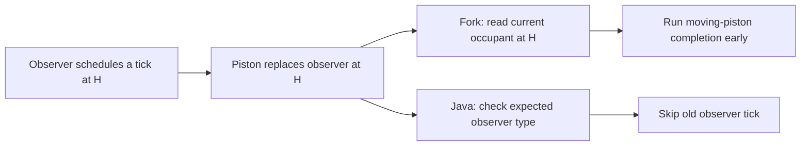

Current status, **2026-10-04**: the reported repairs are implemented and covered by normal regressions. See [implementation](../PISTON_TIMING_IMPLEMENTATION.md) and [review](../PISTON_REVIEW.md). The findings below preserve the original audit snapshot; statements that no fix is applied refer to that snapshot.

# Scheduled ticks: an old component tick runs on a replacement piston

Documented **2026-10-04**. **Primary repair priority**, as selected by the user. Status: reproduced in Rust; compared with exact Java 1.21.5 scheduled-tick dispatch; no fix applied.

The interpreted scheduler stores a position without the block type that requested the tick. At dispatch it reads the current occupant. An outstanding observer pulse-off tick can therefore run `moving_piston_tick` after a piston replaces that observer. This prematurely completes movement and couples unrelated component work to piston timing.

Related issues: [lifecycle ownership](LIFECYCLE.md) and [completion callbacks](COMPLETION_UPDATES.md). Snapshot provenance and results are in [the deep audit](../PISTON_DEEP_AUDIT.md) and [deep-evidence.json](deep-evidence.json).

## Minimal reproduction

Use an empty plot with an East-facing sticky base at **B = (40,30,40)** and head position **H = (41,30,40)**.

1. Put a powered Down-facing observer at H. It represents a pulse already underway.
2. Schedule its pulse-off work at H with **one game tick remaining**, using `schedule_half_tick(H, 1, Normal)`.
3. Power B from below and execute its extension request using one pico operation. The observer is now the carried payload; H contains a moving piston.
4. The fork independently schedules the head completion for **two game ticks later**, using `schedule_tick(H, 1, Normal)`.
5. Advance one interpreted game tick.

The one-game-tick entry runs first. Because it contains only H, dispatch sees `MovingPiston` and completes the new head. The measured state is:

```text
OLD_TICK head_after_one_game_tick = PistonHead { facing: East, sticky: true, short: false }
```

Without that old tick, the fork's own head-completion callback is still due one game tick later. Java's old observer tick must be rejected when H no longer contains an observer. The exact Java movement progress at this observation point depends on the creation/tick phase; the old component tick must never be the operation that completes it.



## Root cause and affected paths

| Source | Current responsibility and omission |
| --- | --- |
| [plot/mod.rs](../../crates/core/src/plot/mod.rs) | `PlotWorld` owns `TickScheduler<BlockPos>`; game/nano/pico advancement pops a position and calls `redstone::tick(self.get_block(pos), ...)` |
| [redpiler/backend/queue.rs](../../crates/core/src/redpiler/backend/queue.rs) | Generic queues retain values, delay and priority. The interpreted value is only `BlockPos`; scheduler export/import loses any original component identity |
| [redstone/mod.rs](../../crates/core/src/redstone/mod.rs) | `tick` dispatches entirely on the supplied current block, including observer and moving-piston branches |
| [world/mod.rs](../../crates/core/src/world/mod.rs) | `World::schedule_tick` and `schedule_half_tick` accept position, delay and priority, with no expected block kind |
| [world/src/lib.rs](../../crates/world/src/lib.rs) | Saved `TickEntry` contains position, remaining ticks and priority |
| [save_data/plot_data.rs](../../crates/save_data/src/plot_data.rs) | `pending_ticks` persists these position-only entries |

The queue is not intrinsically incapable of holding a typed value: `TickScheduler<T>` is generic. The missing identity lies in the interpreted value, scheduling API, saved entry and dispatch contract. Adding a check only inside the observer callback cannot help: dispatch has already selected the moving-piston callback.

`pending_tick_at(pos)` also reports any queued work at that position, irrespective of type or purpose. This participates in the artificial piston cooldown and can suppress component-specific scheduling. A future moving callback must not serve as proof that an observer tick or piston event is pending.

This reproducer establishes cross-type dispatch. Other components, direct replacements and load/reset paths are additional surfaces to verify; the recorded result does not prove every such combination already fails.

## Java 1.21.5 comparison

The [reference manifest](reference-manifest.json) pins the official inputs. `ServerLevel.tickBlock(BlockPos, Block)` in mapped class `asb` receives the expected block type. It obtains the current state and executes the block tick only if the current state belongs to that block type.

That check uses **block type**, not equality of every state property. A still-present observer may change powered state or facing without becoming a different block type. Conversely, an observer replaced by a moving piston must reject the old observer tick. Normal and sticky piston base types also remain distinct reference blocks.

Piston block events retain block type, event ID and direction as a separate mechanism. Moving entities have their own ticking lifecycle. These mechanisms must not be collapsed into one position callback or one `pending_tick_at` veto.

## Repair contract

Use an interpreted tick value with explicit expected component kind, for example:

```rust
struct InterpretedTick {
    position: BlockPos,
    expected_block_kind: BlockKind,
}
```

This is a proposed contract, not an existing type or an instruction to compare raw block-state IDs.

1. Capture expected block kind when the tick is scheduled. Do not infer it from the occupant when the entry is popped.
2. At dispatch, compare the current occupant's kind with the captured kind. Reject a different kind; use current state properties for a matching kind.
3. Make pending-work queries specific to their purpose: ordinary tick for a component kind, piston event identity, or active moving entity.
4. Retain ordinary priority/delay semantics. Apply any duplicate policy consistently with the reference, rather than suppressing every request at one position.
5. Route game, nano and pico advancement through the same checked dispatch. One command path must not retain the old untyped behavior.
6. Keep piston events distinct from ordinary ticks. Give moving-entity work the ownership checks described in [LIFECYCLE.md](LIFECYCLE.md).
7. Preserve expected kind through scheduler export/import, saving, reload and compiler reset/flush. Converting a compiled node back to world work must retain the component identity available to the compiler.

Do not attach a universal placement-generation check to ordinary component ticks without a Java comparison. Replacing a block with another block of the **same reference type** is not rejected by Java's type check alone. Entity incarnation checks are a separate requirement for deferred movement work.

## Persistence and migration

Adding expected kind changes the interpreted tick/save contract. Freeze readers for existing serialized layouts and allocate the next available save format before changing bincode fields or enums.

An old position-only entry does not say what block originally requested it. Reading the current occupant and declaring it the original kind can reproduce the audited error after migration: the old observer tick may already point at a moving piston. Treat that ambiguity explicitly through a documented conversion policy or a controlled refusal for unsupported pending states; do not call reconstruction lossless.

Keep backups and atomic replacement. If metadata cannot be recovered safely, leave the source save intact and report the unsupported case. The repair must define what happens to pending work, rather than silently dropping all ticks or redirecting them to the current occupant.

## Acceptance cases

The existing `old_observer_tick_cannot_complete_new_moving_head` diagnostic in [deep-regressions.rs](deep-regressions.rs) fails on the recorded snapshot. It must pass after the repair, and the head's legitimate motion must still complete through its own advancement.

Additional required checks:

- Observer replaced by moving piston: old observer tick is rejected.
- Observer still present with changed powered/facing properties: dispatch uses current properties, consistent with Java.
- Replacement by the same component kind: behavior is verified against the reference, without invented universal cancellation.
- Different component kinds scheduled at one position: pending queries and deduplication do not confuse them.
- A replacement moving entity at the same position: old entity work cannot complete the replacement motion.
- Game/nano/pico execution: all perform the same type checks and preserve equivalent order.
- Save/load and compiler reset/flush: expected kind and remaining delay survive exactly once.

Except for the first reproduced observer/moving-piston case, these are repair acceptance requirements, not additional measured results.

## Reproduction and evidence limits

Register the diagnostic module in an isolated checkout as described in [the deep audit](../PISTON_DEEP_AUDIT.md#reproduction-and-limits), then run:

```powershell
cargo test -p mchprs_core --lib --locked --offline piston_deep_audit::old_observer_tick_cannot_complete_new_moving_head -- --nocapture
```

The measured Rust failure and the Java dispatch predicate establish the defect. A live Java timing trace, migration behavior and compiler handoff coverage remain to be collected during implementation. This documentation changes no scheduler code and adds no new test runs.
