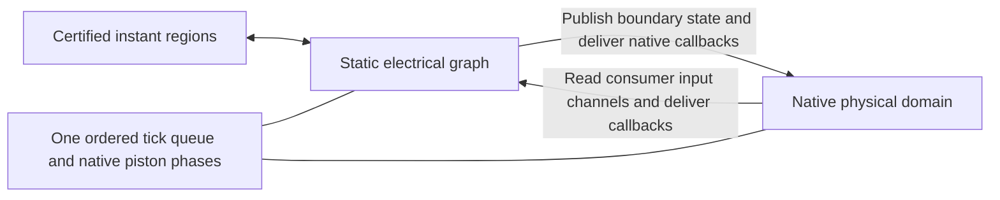

# Smallest physical domain model for ANPU

Design investigation, 2026-10-08. This proposes a runtime model; it does not
claim hybrid admission, replay equivalence, or a performance improvement.
The [earlier inventory and replay results](ANPU_PISTON_DOMAINS.md) remain the
behavioral reference. No schematic, frozen expectation, or production compiler
code was changed for this investigation.

The [partial compilation project scope](../notes/REDPILER_PARTIAL_COMPILATION.md)
defines the general feature, implementation gates, and release acceptance. In
particular, its first actuator slice precedes concrete/BUD admission, and
native-read consumer inputs must also be refreshed at scheduled execution.

## Recommendation

Add **one physical ownership mask and an ordered bridge to the existing
electrical backend**. Keep pistons and motion-sensitive dust in the native
executor; compile geometry-stable electrical components around them. Existing
certified instant regions retain their current executor when their ownership
and boundary contract remain valid.

The physical domain reuses the world's `PistonState`, moving block entities,
wire executor, and piston movement functions. It introduces no second piston
state machine, logical BUD bank, guessed periodic clock, or movement replay.
Several disconnected physical mechanisms can share that one owner and queue;
per-island runtime objects are unnecessary.

This is smaller than compiling every electrical path through moving geometry:
the geometry changes stay inside physical ownership, so the surrounding graph
keeps its existing fixed node storage and links. Compiler optimization remains
available where native callback ordering is not part of the physical boundary.



Direct physical/instant interactions need a separately validated notification
contract. For the first implementation, absorb a coupled uncertified mechanism
into the physical owner, or reject the coupling. Do not convert physical
movement into an instant pose change.

## Why ANPU needs more than a physical piston node

The observed payloads are black concrete conductors and redstone supplies.
Their moving states change input power, dust shape/support, and notifications.
The native memory reference also observes samples during movement completion,
including unchanged values. Merely ticking piston bodies while keeping all
dust in the graph would still need conditional topology and native callback
ordering inside that graph.

Two additional problems appear in the current backend:

* [`set_node`](../../crates/core/src/redpiler/backend/direct/mod.rs) skips
  electrical link updates when old and new strength match. Native compare-mode
  [`comparator::tick`](../../crates/core/src/redstone/comparator.rs) can notify
  its output even with unchanged strength. A strength-change bridge loses that
  notification.
* [`compile_node`](../../crates/core/src/redpiler/backend/direct/compile.rs)
  groups outgoing updates by node-type discriminant in a hash map. That order
  is not the interpreter's geometric callback sequence. Giving two existing
  schedulers the same tick number, or replacing the hash map with a sorted map,
  would not establish native ordering across a sampled boundary.

The new model must carry **power values and delivered callbacks separately**.
The current logical `SamplingEvent` is not a replacement for physical delivery.

## Concrete scope probe

Added [a read-only scope inspector](../../tools/inspect_physical_piston_scope.py),
reusing the existing Sponge schematic parser, plus
[one runnable check](../../tools/test_physical_piston_scope.py).
It uses initial base/Near/Far geometry and closes dust under the native wire
executor's 24 possible notification offsets. Those are exactly the offsets
with Manhattan distance one or two, found in
[`wire_cache::positions`](../../crates/core/src/world/wire_cache.rs).
This deliberately includes possible callbacks across gaps, not just currently
conducting dust connections.

| Initial ANPU measurement | Count |
| --- | ---: |
| Piston bases | 2,898 |
| Candidate base/head/payload cells | 7,909 |
| All dust cells | 34,781 |
| Dust near candidate motion cells | 4,400 |
| Dust after conservative notification closure | 19,809 (57.0%) |
| Dust outside that closure | 14,972 |
| Repeaters potentially notified by motion/closed dust | 2,011 of 10,218 |
| Comparators potentially notified | 27 of 815 |
| Torches potentially notified | 1,743 of 5,168 |
| Observers potentially notified | All 64 |
| Note blocks potentially notified | All 896 |

This gives a plausible amount of geometry-stable electrical work to compile.
It does not establish that all remaining nodes have safe boundaries, or predict
speed: the probe does not analyze scheduler dependency cones, full input read
footprints, attachment destruction, or possible future payload lines. It also
does not establish independent connected island counts.

All initial piston bases are included regardless of whether they moved in the
frozen episode. An empty non-sticky actuator owns Base and Near; a foreign
piston at Far is not automatically treated as its payload. The scope rule is
geometric and independent of signs, program identity, or ANPU coordinates.

## Ownership and admission

Derive a physical mask before logical preparation:

1. Seed ordinary/uncertified actuators and their possible native movement
   cells. Initially support empty heads and bounded movement of inert full
   conductors or redstone blocks; preflight the actual payload line on each
   event. Do not infer that every sticky piston is instant.
2. Include dust whose power reads, shape/support reads, or qualifying
   notification footprint touches that geometry. Close over potential native
   wire propagation and notification paths, including paths that can appear
   in a different allowed pose.
3. Include affected observers, note blocks, attachment behavior, and any
   component whose geometry/identity could change. A fixed repeater receiving
   physical dust can remain compiled only if its entire affected input channel
   and callback delivery are represented by a boundary port. Otherwise retain
   that repeater physically as well.
4. Prove that every remaining compiled input path and watched/support cell is
   stable, or replace its affected consumer channel with a native-read port.
   Include compiled sources used by native power reads in the publication set.
5. Compile certified instant regions only where this physical ownership does
   not invalidate their geometry, sampling, or reset contracts. Unsafe overlaps
   merge into physical ownership or are explicitly rejected.

Use the existing analysis descriptors/dependency discovery as inputs, but do
not use structural reset recognition as the admission gate for a physical
mechanism. Nor should an arbitrary logical preparation error silently grant
physical admission: unloaded context, unsupported entities, selection escape,
or unbounded closure still need concrete physical admission checks.

If a notification/read dependency cannot be represented faithfully at a cut,
grow the physical mask. If it grows to encompass the circuit, execute that
circuit solely with its native owner. This preserves behavior but makes no
claim of acceleration; unrelated safe graph regions can still compile.

## Minimal boundary contract

| Direction | Representation and execution |
| --- | --- |
| Graph to physical | Immediately materialize only boundary-source block state and analog entity strength before native reads can occur. Retain those sources through optimization. Deliver the source's native notification semantics in the original order, including same-strength emissions where applicable. This is simulation synchronization, independent of optional client/display flushing. |
| Physical to graph | Replace the whole affected consumer input channel with a native-read aggregate strength. Reuse the existing consumer/channel port pattern; preserve comparator main, side and rear override rules, and repeater locking. Refresh cached input without scheduling a second update, then deliver the original callback once. A callback must still be delivered when the aggregate strength is unchanged. |
| Shape observations | Keep motion-sensitive observers physical initially. Changes to a mirrored graph source must produce the native watched-state delivery; comparator entity strength alone is not a block-state change. Stable graph observers keep the existing compiled observation path. |

Whole-channel replacement avoids tracking every conditional conduction edge.
The native input read already knows what an in-flight conductor, stepped dust,
or absent redstone block means. It can include both physical dust and published
compiled sources. It must not accidentally add the same source twice through
ordinary graph links and a replacement channel.

The smallest dispatcher hook belongs at `redstone::update`: a physical world
view handles native-owned positions normally and routes graph-owned positions
to the backend. A world adapter can hold the ownership/bridge context while
delegating storage and native caches to `PlotWorld`. This is an ownership hook,
not a new generic simulator framework. `interaction::change` must also respect
ownership; keep dust shape/support changes native and invalidate before a
compiled block could be destroyed or changed.

Keeping all potentially reached dust native is important: the wire turbo
executor updates dust internally, bypassing `redstone::update` for its wire
nodes. A dispatcher hook alone would not prevent duplicate graph-owned wire
execution. A hook on `schedule_tick` alone is even less sufficient.

On graph boundary emissions, maintain the native ordering of graph and
physical consumers together. Do not propagate a boundary source through the
existing unordered graph fanout first and replay its physical notifications
afterward. Either add an ordered emission path for that source or grow physical
ownership through the affected causal path. Internal graph fanout without a
physical causal dependency can retain its current fast path.

## One scheduler, existing movement phases

Reuse `TickScheduler<T>` with a small tagged item:

```rust
enum ScheduledWork {
    Graph(NodeId),
    Physical(ScheduledBlockTick),
}
```

Only one queue owns due work, priorities, and insertion order. Preserve the
expected block registry ID on physical entries; schedule export must not rebind
a stale piston tick to a temporarily present MovingPiston. Adapt the existing
pending-tick lookup accordingly. Do not concatenate independently drained
graph/native queues, even when their priorities match.

Extract/reuse the native phase driver rather than call `tick_interpreted`
alongside `Compiler::tick`:

1. Advance the logical clock once and process due graph/native scheduled work
   in one priority/FIFO stream, including the native treatment of current-slot
   work. Finish each operation's callbacks before taking the next operation.
2. Drain native piston events in order; revalidate power and geometry through
   `execute_event`. Retain its deduplication and newly enqueued event behavior.
3. Snapshot native motion identities and run `tick_motion` in order. Preserve
   source/payload identity, progress, completion, and restored-component
   callbacks. Completion-generated events wait for the next event phase.
4. End in `BetweenTicks`; existing certified logical deadlines remain owned
   by their executor and run at their declared points.

There is no new periodic BUD sampling step. A BUD remains the physical base,
head, and payload; `update_piston_state` reads power when the original callback
arrives. Data changes without that callback leave the physical stored pose
alone. No separate Boolean memory state needs synchronization on reset.

## Invalidation, reset, and user input

Before the first write of a piston operation, guard the complete operation
footprint, including interrupted movement and affected supports. Initially
reject or fall back before moving another base, a graph-bound component,
instant-owned geometry, or an unadmitted payload. The foreign Far aliases in
ANPU are not sufficient grounds for rejection when an empty Near means that
Far is never pushed.

On fallback, transfer graph state and the remaining mixed scheduler once,
preserving relative delays and registry IDs. Keep `PistonState` and entities
as-is, including pending events, motion identities/progress/carried entities,
phase, and cursor. If an event was dequeued for preflight, retain it as the
unexecuted current operation. Do not lose or execute it twice. Continue the
native phase after graph ownership has ended.

Normal reset follows the same transfer. Graph flush and instant materialization
must only touch their own cells, and must issue no synthetic native samples.
An active physical motion needs no reconstruction because it was always real.

Start, paddle controls, pressure plates, and scheduled releases also dispatch
by owner. The current `on_use_block(pos)` API has no world argument; physical
interaction needs a world-aware entry point. A hybrid must use `tick_with_world`;
a graph-only `tick()` call cannot advance real movement. Plot activation must
transfer scheduled entries rather than discard the physical subset when it
clears the old scheduler.

## Implementation order and acceptance

| Step | Smallest deliverable |
| --- | --- |
| 1 | Physical ownership mask; one compiled delayed source driving one empty ordinary actuator and a physical BUD with separate QC data. Keep its notification dust native. |
| 2 | Ordered source publication/notifications, native-read input ports, and one mixed scheduler; compare both boundary directions against native operation traces. |
| 3 | Physical concrete/redstone-block movement with a static compiled consumer beyond the port; verify movement completion changes conduction/supply at the same phase. |
| 4 | Reset at pending event, progress 0.5, progress 1.0, and completion-generated pending work; compare uninterrupted interpreter continuation. |
| 5 | Geometry-derived ANPU scope; unchanged 50,000-tick checkpoints/chat, all 14 screen frames, and all 1,552 physical BUD sample-tick records. Only after those pass measure three release samples. |

Include two independently driven sources due at the same priority/tick,
same-value BUD samples, unchanged-strength comparator notifications, and held
QC data without a qualifying callback. These catch the boundary failures a
single piston extension or successful admission would miss.

The initial scope inspector and its check pass:

```powershell
py tools/test_physical_piston_scope.py
py tools/inspect_physical_piston_scope.py 'test_data/Q2CK@Q2CK_Anpu1_Pong_KBTV.schem'
```

Raw scope output was written to `target/anpu-physical-scope.json`. Runtime
implementation, refined native read/notification closure, and ANPU hybrid
validation remain to be done. The model is a concrete recommended path, not
evidence that those checks already pass.
